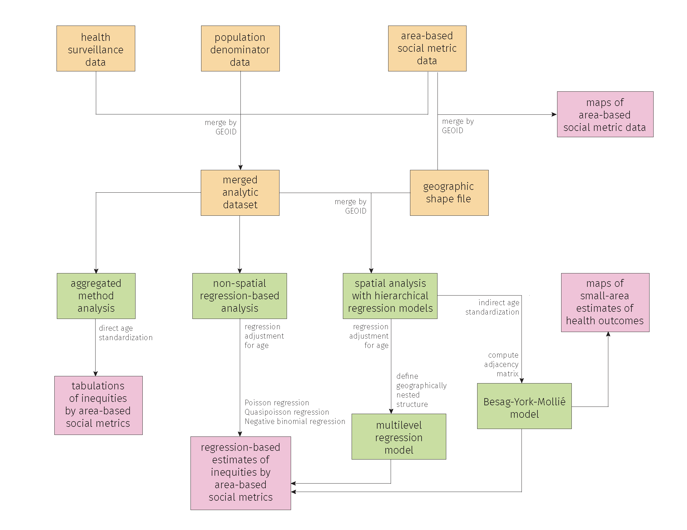
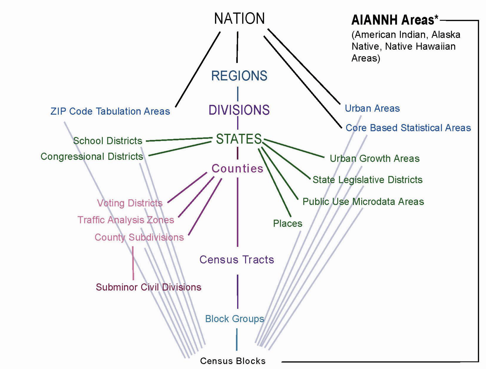
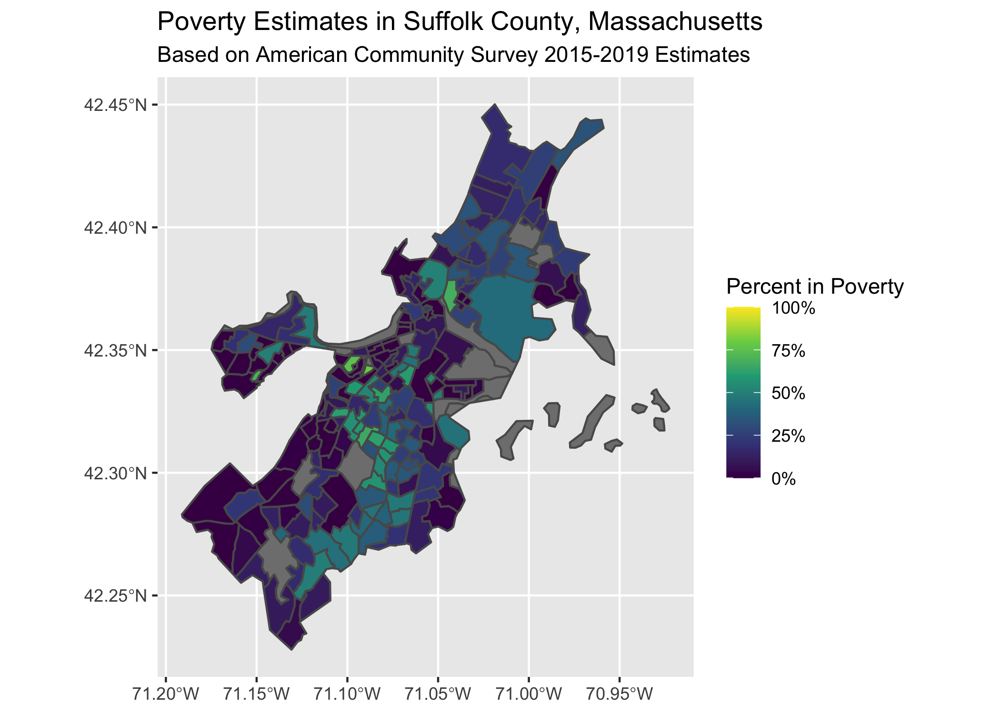

# Getting your data {#getting-your-data}

<!-- Outline for Chapter --> 
<!-- 
  - Downloading data 
    - Health data
    - Population data
        - Numerator and Denominator Issues
    - Social Metric Data 
    - Data governance (whose lives are affected by the data, who owns the data) 
    - tidycensus, shape files
        - simple example (percent poverty)
        - constructing the ICE measures
      - Health data, social metric data
          - Issues of representativeness (Full enumerationn data vs. Survey estimates)
  - Geocoding  (different ways to geocode, Google, openstreetmaps, ArcGIS)
--> 

## High Level Overview

For the application of mapping area health outcome rates, georeferenced data are
made up of three components: health outcome counts, population estimates, and
the geographic boundaries of the areal units of interest. Each of these data may
each come from different data sources, but they are linked together in practice
by merging the data together by geographic area identifiers.

```{r}
#| echo = FALSE,
#| include = TRUE,
#| fig.align = 'center',
#| fig.cap = "In this workflow schematic, the components for creating georeferenced data are shown in the first two rows."


```

Some examples of area identifiers common in the United States context include
things like ZIP codes, county FIPS codes, census block or census tract IDs, etc.

If you are studying area level health outcome rates, you may find that you must
source these different necessary pieces from different places. Population
estimates can often come from the Census or its related data products, health
outcomes may come from healthcare providers, public health departments,
electronic health records (EHR), or other sources, and geography shapefiles are
similarly available from numerous sources including the Census.

## Data Sources 

Health data can be found in numerous formats, such as for download from a
webpage as .csv or .xlsx files, accessible through querying an application
programming interface (API), or available only through direct request to a
health department or agency.

The sources for the data we've used in our case examples are as follows: 

  - US Census and American Community Survey data is retrieved through their API https://www.census.gov/data/developers/data-sets.html via the `tidycensus`
  package
  - CDC Places data were downloaded directly as .csv files from https://www.cdc.gov/places/
  - Cook County Medical Case Examiner Archive data on COVID-19 deaths were 
  downloaded directly from https://datacatalog.cookcountyil.gov/Public-Safety/Medical-Examiner-Case-Archive-COVID-19-Related-Dea/3trz-enys 
  - Massachusetts mortality data were requested directly from the Massachusetts 
  Department of Public Health
  - The Social Vulnerability Index (SVI) is available online to download with csv and 
  shapefiles available from https://www.atsdr.cdc.gov/placeandhealth/svi/index.html

## Loading Spreadsheet Data into R

If you have a .csv file that you have downloaded, you can use the `readr` package
(which is part of the `tidyverse`) to load it into R.

```{r}
#| echo = TRUE,
#| eval = FALSE
library(readr)
example_df <- read_csv("filename.csv")

# learn more about the options read_csv has by running:
?read_csv
```

Health data often come in other kinds of delimited formats such as 
tab-delimited or fixed-width spaced, in which case you can use the 
`read_tsv` or `read_fwf` functions from the `readr` package similarly 
to how you would use `read_csv`. Learn more about `readr` here: https://readr.tidyverse.org/

To read Excel data, we recommend using the `readxl` package, also part of 
the `tidyverse`. Learn more here: https://readxl.tidyverse.org/

```{r}
#| echo = TRUE,
#| eval = FALSE
library(readxl)
example_df <- read_excel("filename.xlsx", sheet = 1)
# to learn more about the options in the read_excel function, run:
?read_excel

# one particularly helpful feature to know about is the range argument which
# allows the user to specify they want to read a dataframe from a specific 
# range of cells using Excel-style range syntax:
example_df <- read_excel("filename.xlsx", sheet = 1, range = "A3:C17")
```

Even if your data isn't a delimited text document or an Excel file, if it is a
common file format, it is still quite likely you can read your data into R using
other packages. For example the `haven` package allows users to read SAS, SPSS,
    and Stata files. Read more here <https://haven.tidyverse.org/>

## Connecting to Databases

Many online health datasets are accessible via query to a remote database
server.  References on how to interact with databases in R are available here:
https://db.rstudio.com/, and the following reference shows how to interact with
a remote database in the `tidyverse` style: https://dbplyr.tidyverse.org/

## tidycensus

For some databases, R programmers have already written packages to help users
submit their queries and get back their data of interest.  One such example
is the U.S. Census, for which the `tidycensus` package exists to automate
fetching Census data in R.

The `tidycensus` package in R allows you to download data from the US Census
Bureau products, including from the decennial Census and the 1-year, 3-year, and
5-year American Community Survey (ACS). Find detailed reference materials and 
an introduction to `tidycensus` here: https://walker-data.com/tidycensus/ 

In this section, we will walk you through example code that downloads the
percent of residents under the poverty line and computing the Index of
Concentration at the Extremes (ICE) for racialized economic segregation from the
2015-2019 ACS. As an example, we will demonstrate how to download these measures
at the census tract level in Suffolk County, Massachusetts.

You can find more of the variables available in the 5-year ACS at the following
link, changing 2019 to your desired year starting with 2009
when the ACS began: https://api.census.gov/data/2019/acs/acs5/variables.html 

```{r}
#| echo = FALSE,
#| center = TRUE,
#| fig.cap = 'The structure of Census tract GEOIDs'
knitr::include_graphics("images/04-getting-your-data/geoid_structure.png")
```


```{r}
#| echo = FALSE,
#| center = TRUE,
#| fig.cap = "Hierarchy of geographic units as assignged by the US Census Bureau. Reproduced from https://www.census.gov/content/dam/Census/data/developers/geoareaconcepts.pdf"

```


```{r}
#| class.output = "scroll-500",
#| eval = FALSE
# example code for downloading poverty measures from the American Community
# Survey through tidycensus and visualizing them through maps

# load the packages we'll use for this section
library(tidycensus)
library(tidyverse)
library(sf)
library(RColorBrewer)

# download the data from the ACS using the get_acs method from tidycensus
# 
# the B05010_002E variable refers to the count of residents who live in
# households with household income below the poverty line; the B05010_001E
# variable refers to the count of residents for whom household income was
# ascertained by the ACS, e.g. the relevant denominator.
# 
poverty <- get_acs(
  state = 'MA',
  county = '025', # this is the FIPS code for Suffolk County, MA
  geography = 'tract',
  year = 2019,
  geometry = TRUE,
  variables = c(
    in_poverty = 'B05010_002E', 
    total_pop_for_poverty_estimates = 'B05010_001E') 
)


# we're going to recode the variable names to more human-readable names to 
# make it easier to work with the data in subsequent steps
poverty <- poverty %>% 
  mutate(
    variable = recode(variable,
                     # you may notice that tidycensus drops the 'E' from the 
                     # end of the variable code names
                     B05010_002 = 'in_poverty',
                     B05010_001 = 'total_pop_for_poverty_estimates'))

# pivot the data wider so that the in_poverty and
# total_pop_for_poverty_estimates; this follows the "tidy" format and approach
# where each row corresponds to an observation.
# 
# because the pivot_wider method can mess up your data when your data contains
# geometry/shapefile information, we will remove the geomemtry information
# and add it back in later
poverty_geometry <- poverty %>% select(GEOID) %>% unique() # save the geometry data
poverty <- poverty %>% 
  sf::st_drop_geometry() %>% # remove geometry data
  tidyr::pivot_wider(
    id_cols = GEOID,
    names_from = variable,
    values_from = c(estimate, moe))

# calculate the proportion in poverty
poverty <- poverty %>% 
  mutate(
    proportion_in_poverty = estimate_in_poverty / estimate_total_pop_for_poverty_estimates,
    percent_in_poverty = proportion_in_poverty * 100)

# add the geometry back in -- 
# make sure to merge the data into the sf object with the sf object on the 
# left hand side so the output has the sf type including your geometry data
poverty <- poverty_geometry %>% 
  left_join(poverty)

# visualize our point estimates 
ggplot(poverty, aes(fill = proportion_in_poverty)) + 
  geom_sf() + 
  scale_fill_viridis_c(label = scales::percent_format(),
                       limits = c(0,1)) + 
  labs(fill = "Percent in Poverty") + 
  ggtitle("Poverty Estimates in Suffolk County, MA")

# visualize the denominator counts -- 
# of significance, note that there are several census tracts where the
# denominator is 0 resulting in NaN estimates for the percent in poverty.
ggplot(poverty, aes(fill = estimate_total_pop_for_poverty_estimates)) + 
  geom_sf() + 
  scale_fill_viridis_c(label = scales::comma_format(), direction = -1, 
                       breaks = c(0, 10, 100, 1000), trans = "log1p") + 
  labs(fill = "Number of People") + 
  ggtitle("Number of People in Denominator for Poverty Estimates", 
          "Suffolk County, MA")
```

```{r}
#| echo = FALSE

knitr::include_graphics("images/04-getting-your-data/poverty_denominators_suffolk_county.png")
```

We can also use the `mapview` package to render interactive maps of the
estimates and data we have computed/downloaded.  This is particularly helpful in
understanding how the geography relate to the estimates — especially to see
things like where airports, green-space, schools, and other municipal zones may
be located that may not have residents (hence the NaN or "not a number"
estimates shown on the maps).

```{r}
#| echo = FALSE
# read cached data
absms <- readRDS('data/04-getting-your-data/poverty_suffolk_county.rds')
```

```{r}
library(mapview)
mapview::mapview(absms, zcol = 'percent_in_poverty')
```

Now that we've created static and interactive maps of the poverty estimates for
Suffolk County, we can move on to downloading and computing the Index of
Concentration at the Extremes for Racialized Economic Segregation (High Income
White non-Hispanic High Income vs. Low Income People of Color).

```{r}
#| class.output = "scroll-500",
#| eval = FALSE

# example code for creating the index of concentration at the extremes for the 
# measure of racialized economic segregation (high income white non-hispanic 
# vs. low income people of color) using tidycensus

# create a data dictionary detailing the variables we're going to use - 
# 
# associating each of the variables a more readable/friendly `shortname` and a
# description can help make the subsequent code more readable and thus easier
# to debug in case you run into any errors.
# 
variables_dict <-
  tibble::tribble(
  ~var,          ~shortname,      ~desc,
  "B19001_001",  'hhinc_total',   "total population for household income estimates",
  "B19001A_002", 'hhinc_w_1',     "white n.h. pop with household income <$10k",
  "B19001A_003", 'hhinc_w_2',     "white n.h. pop with household income $10k-14 999k",
  "B19001A_004", 'hhinc_w_3',     "white n.h. pop with household income $15k-19 999k",
  "B19001A_005", 'hhinc_w_4',     "white n.h. pop with household income $20k-24 999k",
  "B19001A_014", 'hhinc_w_5',     "white n.h. pop with household income $100 000 to $124 999",
  "B19001A_015", 'hhinc_w_6',     "white n.h. pop with household income $125k-149 999k",
  "B19001A_016", 'hhinc_w_7',     "white n.h. pop with household income $150k-199 999k",
  "B19001A_017", 'hhinc_w_8',     "white n.h. pop with household income $196k+",
  "B19001_002",  'hhinc_total_1', "total pop with household income <$10k",
  "B19001_003",  'hhinc_total_2', "total pop with household income $10k-14 999k",
  "B19001_004",  'hhinc_total_3', "total pop with household income $15k-19 999k",
  "B19001_005",  'hhinc_total_4', "total pop with household income $20k-24 999k"
 )


ICEraceinc <- get_acs(
  geography = 'tract',
  state = 'MA',
  county = '025',
  geometry = TRUE,
  year = 2019,
  variables = variables_dict$var)

# save the geommetry data separately
ICEraceinc_geometry <- ICEraceinc %>% select(GEOID) %>% unique()

# remove geometry data so we can use pivot_wider
ICEraceinc <- ICEraceinc %>% sf::st_drop_geometry()

# pivot to a wide format for renaming, dropping the margin of error data
ICEraceinc <- ICEraceinc %>% select(-moe) %>% 
  pivot_wider(names_from = variable, values_from = estimate)

# rename the columns using our rename_vars
# 
# first we create a named vector, rename_vars, which has elements that are the
# acs variables we request and convenient, human readable names.
# 
# then we use rename_vars with the rename function from dplyr. 
# typically the rename function takes a syntax as follows: 
#   data %>% rename(oldname1 = newname1, oldname2 = newname2, ...)
# but in our case, we already have a named vector (rename_vars) that we 
# want to use, and so to use the rename_vars named vector inside rename
# we use the injection-operator `!!`.  you can learn more about the injection
# operator by running ?`!!` in your R console. 
rename_vars <- setNames(variables_dict$var, variables_dict$shortname)
ICEraceinc <- ICEraceinc %>% rename(!!rename_vars)

# calculate the ICE for racialized economic segregation
ICEraceinc <- ICEraceinc %>% 
  mutate(
    # we calculate the people of color low income counts as the overall 
    # low income counts minus the white non-hispanic low income counts
    people_of_color_low_income = 
      (hhinc_total_1 + hhinc_total_2 + hhinc_total_3 + hhinc_total_4) - 
      (hhinc_w_1 + hhinc_w_2 + hhinc_w_3 + hhinc_w_4),
    # sum up the white non-hispanic high income counts
    white_non_hispanic_high_income = 
      (hhinc_w_5 + hhinc_w_6 + hhinc_w_7 + hhinc_w_8),
    # calculate the index of concentration at the extremes for racialized 
    # economic segregation (high income white non-hispanic vs. low income 
    # people of color)
    ICEraceinc = 
      (white_non_hispanic_high_income - people_of_color_low_income) / 
      hhinc_total
  )

# now we can merge our spatial geometry data back in
ICEraceinc <- ICEraceinc_geometry %>% 
  left_join(ICEraceinc %>% select(GEOID, ICEraceinc))

# visualize our data - 
# here we use a divergent color palette since the ICEraceinc measure 
# is divergent in nature
ggplot(ICEraceinc, aes(fill = ICEraceinc)) + 
  geom_sf() + 
  scale_fill_distiller(palette = 'BrBG') + 
  labs(fill = "ICE for Racialized Economic Segregation:\nWhite non-Hispanic (High Income) vs.\nPeople of Color (Low Income)") + 
  ggtitle("Index of Concentration at the Extremes, Racialized Economic Segregation",
          "Suffolk County, MA") 
```

```{r}
#| echo = FALSE
library(RColorBrewer)
knitr::include_graphics("images/04-getting-your-data/ICEraceinc_suffolk_county.png")
ICEraceinc <- readRDS('data/04-getting-your-data/ICEraceinc_suffolk_county.rds')
```

```{r}
library(mapview)
mapviewOptions(fgb = FALSE)

mapview(ICEraceinc, zcol = 'ICEraceinc', 
        col.regions=rev(brewer.pal(11, "BrBG")))
```

## Cleaning Area Identifiers

One of the most important aspects to pay attention to when cleaning
georeferenced data is that area identifiers are stored as
character or factor data types and not numeric types because if they are stored
as numeric types leading 0s will be dropped and this may cause issues when 
merging multiple datasets together if the area-keys are not coded in the same 
way (e.g. in one dataset area-keys might be coded numeric and in another dataset 
area-keys might be coded as a character or factor. 

This can happen often with FIPS codes, like the 2-character state FIPS
codes and 3-digit county FIPS code. For states like Alabama and Alaska with FIPS
codes `01` and `02`, if these are mistakenly stored as numeric values, they will
be truncated to as `1` and `2` which can introduce errors when trying to merge
multiple datasets using FIPS codes.

:::: {.infobox .note}
For county FIPS codes, the `tigris` package has a handy built-in reference. 

Once you've installed `tigris` (e.g. run `install.packages('tigris')`) and
load the package (`library(tigris)`) you can access the built-in `fips_codes`
data.frame.

```{r}
#| echo = FALSE,
#| eval = TRUE
library(knitr)
library(kableExtra)
knitr::kable(tigris::fips_codes) %>% 
  kableExtra::kable_styling() %>% 
  kableExtra::scroll_box(height = '500px')
```
::::

Suppose, as can happen, that you download your data and find that due to a
coding error the 5-digit combined state and county FIPS codes have been stored
as numeric, causing leading zeroes to be truncated off.  If you check the FIPS
codes and are reasonably confident that the only error is that leading
left-hand-side zeroes have been omitted, you could do the following to correct
the mistake:

```{r}
#| echo = FALSE,
#| eval = TRUE
example_df <- tibble::tribble(
    ~FIPS,      ~Name, ~State,
  "01001",  "Autauga",   "AL",
  "01003",  "Baldwin",   "AL",
  "01005",  "Barbour",   "AL",
  "01007",     "Bibb",   "AL",
  "01009",   "Blount",   "AL",
  "01011",  "Bullock",   "AL",
  "01013",   "Butler",   "AL",
  "01015",  "Calhoun",   "AL",
  "01017", "Chambers",   "AL",
  "01019", "Cherokee",   "AL",
  "01021",  "Chilton",   "AL"
  )
example_df$FIPS <- as.integer(example_df$FIPS)
library(dplyr)
library(stringr)
```

```{r}
#| echo = TRUE,
#| eval = TRUE
head(example_df)

library(stringr)
library(dplyr)
example_df <- example_df %>% mutate(FIPS = ifelse(
  nchar(FIPS) == 4,
  str_pad(
    FIPS,
    width = 5,
    pad = '0',
    side = 'left'
  ),
  FIPS
))

head(example_df)
```

The above code uses the `dplyr` and `stringr` packages, both part of the `tidyverse`
and which have introductions here: https://dplyr.tidyverse.org/ and here: https://stringr.tidyverse.org/. 

## Numerators and Denominators

### Epi Primer

When presenting data on disease distribution and measures of health disparities, the following types of measures are most often used:

- Prevalence 
- Cumulative incidence
- Incidence rate

These measures serve to answer different types of research questions:

- Descriptive: describes the distribution of the outcome of interest 
- Predictive: predicts who may experience the outcome of interest
- Causal: seeks to determine modifiable causes of the outcome of interest

\textbf{Prevalence} is defined as $Pr[Y=1]$= # existing cases/ # individuals in study population at a point in time. Prevalence is dimensionless, ranges from 0 to 1, and requires a time reference (i.e. prevalence at a certain year, age, etc.). Prevalence measures are useful for descriptive and not causal questions. 

\textbf{Cumulative incidence}, also known as incidence proportion, risk, or attack rate (although not a rate), is defined as $Pr[Y=1]$= # incident cases in a time period/ #individuals at risk at a baseline. Cumulative incidence is also dimensionless and ranges from 0 to 1, but it must state a time period and anyone included in the denominator must be eligible to move into the numerator by meeting the case definition. Cumulative incidence is limited by a lack of information on the exact timing of the outcome of interest, time-varying exposures, competing risks, and loss to follow-up. 

\textbf{Incidence rate}, also known as incidence density or hazard rate, is defined as # incident cases during $t_0$ to $t_1$/ $\sum$ person-time at risk accumulated during $t_0$ to $t_1$. Person-time can be expressed in years, months, weeks, or days. Incidence rate is not a proportion and ranges from 0 to $\infty$.

*Measures of disparity*

- Ratio measures
- Difference measures
- Attributable fractions


\textbf{Ratio measures} include cumulative incidence ratios (CIR), incidence rate ratios (IRR), and odds ratios (OR). The range for these is 0 to $\infty$ and no association is indicated by a ratio of 1.

Odds ratios are defined by $$\frac{(Pr[Y=1|A=1]/ Pr[Y=0|A=1])}{(Pr[Y=1|A=0]/ Pr[Y=0|A=0])}$$

\textbf{Differences measures} include cumulative incidence difference (CID), also known as attributable risk, and incidence rate difference (IRD), also known as attributable rate. The range for CID is -1 to 1 while the range for IRD is $-\infty$ to $\infty$. No association is indicated by a difference of 0.


\textbf{Attributable Risk Percent} (AR) or excess fraction is the proportion of disease burden among the exposed that is associated with the exposure and is defined by:
$$AR\%=\frac{CI_{Exposed} – CI_{unexposed}}{CI_{Exposed}}*100 $$

\textbf{Population Attributable Risk Percent} (PAR) is the proportion of disease burden among the total population that is associated with the exposure and is defined by:
$$AR\%*Pr[A=1|Y=1]=\frac{CI_{Total} – CI_{unexposed}}{CI_{Total}} $$

The [analytic methods section](https://www.hsph.harvard.edu/thegeocodingproject/analytic-methods/) of the Public Health Disparities Geocoding Project monograph demonstrates how the measures described above are identified and aggregated over areas and strata of area-based socioeconomic measures (ABSM). 

### Numerator/Denominator Mismatch

In health databases - where data are not yet aggregated - each record represents one person. To ensure that there is no numerator/denominator mismatch and that all cases in the aggregated numerator are coming from the population pool in the aggregated denominator and that all those in the denominator have the potential to become cases, one should exclude all records that are not geocoded, do not meet the case definition, or are missing data on important covariates (e.g. age, gender, race/ethnicity, etc. depending on the question being asked). This is particularly important where the sources of data for the numerator and denominator are different, resulting in a higher risk of numerator/denominator mismatch. It is therefore critical to explore the data dictionaries for the various sources of data to better understand the eligibility criteria for what gets included in the denominator and what is in the numerators to be used in aggregating data for analysis. Further, incompatible numerator and denominator data tends to result in greater bias for race-stratified models with important implications for studying disparities (Nethery et al, 2021).

Numerator/denominator mismatch is therefore an important consideration in aggregating data over strata of ABSMs. For example, when conducting area-based analyses, there are always a small number of strata/areas where there are observed outcomes of interest but no population person-time at risk. When fitting non-spatial models, we typically delete these observations (where denominator=0). Unfortunately, what appears to happen is that non-white racial/ethnic groups are more likely to have this happen (there is a census tract somewhere where in some age stratum, there is one case but no population at risk). When we delete them, we end up MORE likely to delete non-white deaths, and this has an impact on the total number of non-white deaths we have to analyze.

If instead of deleting those strata where deaths>0 and denominator=0, we replace the denominator with the number of deaths, we end up with very slightly larger population counts overall, but the effect on the rates is to bring them more in line with the aggregated analysis (where, when aggregated, small differences in numerator/denominator mismatch get glossed over).


## Geocoding 


## Data Governance

There is only so much we can do to account for poor data or the absence of data. Therefore, improvements in the availability and quality of health data and, in particular, improvements to the use of social metrics in conceptualizing and analyzing this data, are necessary. \textbf{Data governance} is therefore a critical feature of addressing health disparities. Data governance is about "who has input into making the decisions about which data are required, informed by the tandem expertise of health equity researchers and other members of the communities whose data are at stake, affording the expertise of lived experience" (Krieger, 2021). See [*Structural Racism, Health Inequities, and the Two-Edged Sword of Data: Structural Problems Require Structural Solutions*](https://www.frontiersin.org/articles/10.3389/fpubh.2021.655447/full) for a proposed "two-part institutional mandate regarding the reporting and analysis of publicly-funded work involving racialized groups and health data and documentation as to why the proposed mandates are feasible" (Krieger, 2021).

Part of demanding improved data governance is interrogating the sources of data currently available, including their sampling strategies, underlying theories that inform their design, and who is involved in their generation - in line with ecosocial theory's construct of accountability and agency. By exploring the origins of one's data and the processes through which it's been created, investigators can better articulate the potential for bias in the data, identify means of improving data collection to mitigate this bias, and actively call for structural change in data collection and governance. 

Another key component of equity-oriented data governance is to make data openly accessible, ensuring that communities can ask their own data-driven questions, and not just rely on what analyses get published. This also requires more robust infrastructure for community science, transparent review of methods and findings, and strengthened capacity for community-oriented knowledge translation to enhance agency.


REFERENCES

Nethery, Rachel C., Tamara Rushovich, Emily Peterson, Jarvis T. Chen, Pamela D. Waterman, Nancy Krieger, Lance Waller, and Brent A. Coull. "Comparing denominator sources for real-time disease incidence modeling: American Community Survey and WorldPop." SSM-population health 14 (2021): 100786.

Rothman, Kenneth J., Sander Greenland, and Timothy L. Lash. Modern epidemiology. Vol. 3. Philadelphia: Wolters Kluwer Health/Lippincott Williams & Wilkins, 2008.