# Analyzing your data {#analyzing-your-data}

*By: Jarvis Chen, ScD*

```{r, include=FALSE}
knitr::opts_chunk$set(echo = TRUE)
library(knitr)
library(readr)
library(tidyverse)
library(kableExtra)
```


## Overview of Methods

In the years since we initially presented the **Public Health Disparities Geocoding Training** in 2004, there has been a huge increase in conceptual and methodological work regarding use of ABSMs to document and analyze health inequities, and the computing tools and statistical methods to conduct these analyses. In particular, the availability of software that facilitates data access, mapping, visualization, and fitting of multilevel and spatial models has greatly enhanced the accessibility of these analytic methods for public health scientists and advocates interested in advancing health equity. Our goal in presenting these updated methods is to illustrate their applicability to monitoring, reporting, and investigating health inequities. In doing so, we highlight many of the assumptions underlying the use of these methods and show how they can be applied to real-life data that arise in public health surveillance and health equity monitoring. We comment on some of the pitfalls that may arise when working with imperfect data in real time and discuss analytic and interpretive strategies keeping in mind the overarching goal of accurately documenting health inequities for accountability. Where appropriate, we also comment on ongoing methodologic work to improve analytic approaches.

## Motivating Questions

As the choice of methods for any data analysis depends fundamentally on the goals of the analysis, we will focus our presentation on the following motivating questions:

1. "What is the **geographic distribution** of area-based social metrics across the study area?" This is of particular interest for exploratory analyses in order to understand who in what areas are most affected by social advantage and disadvantage as captured by area-based social metrics. Mapping and visualization tools can be used to communicate geographic patterns and to elicit local knowledge in order to spur hypothesis generation and prioritization of research questions.

2. "What are the **social inequities** in health associated with area-based social metrics across the study area?" We highlight the importance of **descriptive epidemiology** as a first step in understanding inequities in the health of populations living in areas characterized by area-based social metrics. That is, accurate description of where the burden of social inequities falls is a necessary pre-requisite to more causally-oriented investigations or evaluations of interventions. We discuss **aggregated analyses**, which have the advantages of being straightforward to implement and report using tabulation methods and avoiding the problems of small area estimation, as well as **non-spatial regression models**. We focus on health equity settings in which understanding the joint patterning of inequities by racialized group and area-based social metric are of interest, and comment on how analyses may need to consider heterogeneity across age strata.

3. "How can geographic variation in health outcomes be modeled in order to facilitate mapping of **small-area disease estimates** and **estimation of social inequities**?" We review concepts from the extensive statistical literature on small-area estimation and disease mapping with the goal of visualizing geographic patterns in health outcomes for studies of health equity. While these methods entail more complex modeling frameworks and computational details, we focus on their application to health equity and the interpretation and use of model outputs in the context of monitoring and reporting of health disparities. We consider settings in which **multilevel modeling** approaches and **spatial modeling** approaches may be preferred and discuss considerations contributing to the choice of modeling framework.


## Choice of geographic level

<!--
    TODO:
  We need to flesh out this text.
  I think the main point is that we try to analyze at the geographic level that makes sense. The breast cancer mortality example will show that while we can append CT level ABSMs to the data and use the aggregation method or non-spatial regression here, doing spatial analyses doesn't yield much spatial variation at the CT level because the counts are too small. We should bring this point out in this section.
  
  Similarly, rationale for the ZIP Code level analysis of Chicago COVID data.
--> 

- A pragmatic question and approach: at what level(s) are data available?
- For small area level analyses, do the number of events support small area-level analyses?
- census tract (CT) vs. city/town, e.g. breast cancer mortality analysis
- ZIP Codes and US Census defined ZIP Code Tabulation Areas (ZCTAs)
- Modifiable Areal Unit Problem (discussed in Christian's section?)

- note that the smallest level of Census geography with intercensal population estimates is the county. The US Census Population Estimates Program (PEP) estimates rely on demographic modeling. 
- CT level population estimates are in the US Census American Community Survey (ACS), but ACS specifically cautions against using these as population denominator estimates in small area estimation. However, we generally do not have any other sources of population denominators on which to rely. Five year average estimates may help, but there is still year to year variability. Margin of error estimates are available, but how to incorporate denominator uncertainty into analyses is still an area of active research.


## Numerator/denominator mismatch

For epidemiologic analyses of health disparities, we generally rely on routinely collected data from health surveillance systems to define the numerators of rates. Such data are available on an ongoing basis with a lag of two or more years to allow for data compilation and cleaning. In contrast, data on population at risk may be obtained from a variety of sources depending on the need for stratification by demographic variables, time frame, and the desired level of geography. For example, the US Decennial Census provides detailed population estimates by age, sex-gender, and selected racialized groups in decennial years. For intercensal years, the US Census uses demographic modeling that takes into consideration births, deaths, and migrations to provide estimates for these demographic groups at the national, state, and county levels via its Population Estimates Program (PEP) [US Census PEP]. For smaller levels of geography, the US Census Bureau's American Community Survey includes estimates of population for all census geographies larger than census blocks based on five year rolling averages. These are also typically made available after a two year delay.

Formally, the US Census Bureau recommends the use of PEP or decennial census counts as population size estimates in intercensal years, while recommending that ACS data be used for information about changing socioeconomic and demographic features. However, for estimation of small area disease rates or analyses of health disparities by ABSM in intercensal years, decennial counts are usually outdated and PEP estimates are not available at the desired geographic level. Thus, in practice, many epidemiologic studies will continue to rely on ACS small-area estimates for population denominators. While private companies are increasingly producing high-resolution gridded population estimates that are based on machine-learning models combining census, remote sensing, land use, and other information, with the promise of providing population sizes (primarily for the total population, not by population sub-groups) at very small geographies in near real time, to date we have not found these data products to provide substantial improvement over using ACS small area estimates and in some cases they can induce bias (Nethery et al. 2021).

Because numerators (case data) and denominators (population estimates) come from different sources, and moreover, because intercensal population estimates in particular may be subject to uncertainty, it is possible to obtain sociodemographic strata in particular areas and years where the observed cases exceed the reported population at risk. This is particularly problematic when the the number of cases is greater than zero but the reported population at risk is exactly zero. We term this phenomenon "numerator/denominator mismatch." Some of the analytic methods we describe will be able yield valid estimates of social inequities in spite of these data anomalies. For example, the aggregation method avoids this problem by aggregating over small areas, whereby small discrepancies in numerators and population at risk are averaged out over areas within ABSM strata. In other modeling approaches, we may need to take steps to address these issues in the data. When doing so, we need to be mindful about potential distortions to the data and their impact on estimates of social inequities. In particular, we must consider that when such data anomalies are more likely for some demographic groups than others (for example, in many areas of the US, historically marginalized racialized groups designated as Black, Indigenous, and people of color, will be of smaller population size than the white non-hispanic population), this may result greater bias for demographically stratified analyses (e.g. models stratified by racialized group) (Nethery et al. 2021).

### Example: Age-specific all-cause mortality by racialized group in Massachusetts, 2013-2017

We compared the use of the aggregation method to a non-spatial Poisson model for analyzing deaths from all causes by age and racialized group. Using the aggregation method, deaths and population person-time at risk are aggregated into strata by age (0-4, 5-9, 10-14, 15-19, 20-24, 25-29, 30-34, 35-44, 45-54, 55-64, 65-74, 75-84, 85+) and racialized group (white non-Hispanic and Black), and mortality rates per 100,000 person-years are computed using the formulas listed in Section xxx. For the non-spatial Poisson model, the inputs are age- and racialized-group specific deaths for each census tract in the study area, the log(population person-time at risk) as an offset, and a set of indicators for each stratum of age category by racialized group. 

When the log(population person-time at risk) variable is zero, however, this presents a problem for the Poisson model-fitting algorithm as the rate is undefined. Census tracts where there are zero deaths and zero person-time at risk in a particular strata can be deleted from the dataset as these observations contribute no information. But situations where the count of deaths in a stratum is greater than zero but the population person-time at risk is zero continue to be an issue (numerator/denominator mismatch). It may be tempting to delete these observations from the dataset as well, reasoning that as these usually involve just one death occurring in a stratum where the population estimate is zero, deleting these observations will not unduly affect the analysis. 

Unfortunately, it turns out that numerator/denominator mismatch occurs more frequently for Black observations in the dataset, due to patterns of racialized residential segregation and that fact that the Black population accounts for a much smaller proportion of the population  compared with the white non-Hispanic population (10.1% vs. 72.9% in Massachusetts according to the ACS population estimates we used for our population denominators). That is, at the census tract level, there are more likely to be age strata where there are deaths reported by zero population person-time at risk for the Black population compared with the white non-Hispanic population.  As a result, when we delete these observations, we end up deleting a larger proportion of the Black deaths across the whole state, which has an impact on our estimates of rates and rate ratios.

To see this, consider the following table where we show the number of deaths and population by age and racialized group aggregated across census tracts. In columns 2-8, we show the deaths, population, and estimated rates per 100,000 person-years for white Non-Hispanics and Blacks in the full dataset, while in columns 9-15 we show the deaths and population after deleting observations where the numerator is greater than zero but the denominator is zero. In columns 16-22 we show the percent bias by strata comparing the dataset with deleted observations to the full dataset. As is evident in column 19, the effect of deleting these observations is to reduce the Black death count in age strata (between 4-30% across strata) to a much greater degree than among the white non-Hispanic age strata (between 0-2%). As a result, the age-specific incidence rate ratios can be depressed by as much as 30% relative to the IRRs calculated using the full aggregated data.

```{r, echo=FALSE, warning=FALSE, message=FALSE}
table_removezeroes <- read_csv("data/06-analyzing-your-data/numden_mismatch_remove_zeroes.csv")

knitr::kable(table_removezeroes, 
             col.names = c("Age", "NHW deaths", "NHW pop", "NHW Rate", 
                           "Black deaths", "Black pop", "Black Rate", "IRR",
                           "NHW deaths", "NHW pop", "NHW Rate", 
                           "Black deaths", "Black pop", "Black Rate", "IRR",
                           "% bias NHW deaths", "% bias NHW pop", "% bias NHW Rate", 
                           "% bias Black deaths", "% bias Black pop", "% bias Black Rate",
                           "% bias IRR"),
             digits=c(0,0,0,1,0,0,1,2,0,0,1,0,0,1,2,3,3,3,3,3,3,3),
             html=TRUE) %>%
            add_header_above(c(" "=1, "Full dataset" = 7, "Adjusted dataset" = 7, "% Bias" = 7))%>%
  kable_styling(bootstrap_options = c("striped", "hover", "condensed", "responsive"))

```

If instead of deleting those strata where deaths>0 and denominator=0, we replace the denominator with the number of deaths, we end up with very slightly larger population counts overall, but the effect on the rates is to bring them more in line with the aggregated analysis. Here is the comparable table comparing the full aggregated dataset (columns 2-8) with a dataset in which the denominators are adjusted to increase the person time at risk to equal the number of deaths the affected strata. 

```{r, echo=FALSE, warning=FALSE, message=FALSE}
table_adjustdenom <- read_csv("data/06-analyzing-your-data/numden_mismatch_adjust_denom.csv")

knitr::kable(table_adjustdenom, 
             col.names = c("Age", "NHW deaths", "NHW pop", "NHW Rate", 
                           "Black deaths", "Black pop", "Black Rate", "IRR",
                           "NHW deaths", "NHW pop", "NHW Rate", 
                           "Black deaths", "Black pop", "Black Rate", "IRR",
                           "% bias NHW deaths", "% bias NHW pop", "% bias NHW Rate", 
                           "% bias Black deaths", "% bias Black pop", "% bias Black Rate",
                           "% bias IRR"),
             digits=c(0,0,0,1,0,0,1,2,0,0,1,0,0,1,2,3,3,3,3,3,3,3),
             html=TRUE) %>%
            add_header_above(c(" "=1, "Full dataset" = 7, "Adjusted dataset" = 7, "% Bias" = 7)) %>%
  kable_styling(bootstrap_options = c("striped", "hover", "condensed", "responsive"))

```

An even better solution, and the one we ultimately recommend, is to add a small number (e.g. 0.001) to all of the population person-time denominators to allow the Poisson model fitting algorithm to incorporate these observations into the analysis. The resulting effect on the overall population denominators is negligible, but this allows for estimation of rates and rate ratios of interest. Note that this is only needed when fitting non-spatial regression models to the data. The aggregation method does not incur this problem as small discrepancies are averaged out over areas, and the spatial models we discuss in Section xx address the problem of zero or infinite rates by smoothing.

To visualize the effect of these adjustments on estimates of the age-specific disparity by racialized group, we plot estimates from aggregated analyses and Poisson models with deletion and denominator adjustment in Figure 1.1. The plot confirms that either (a) adjusting denominators to match the number of observed deaths in problematic strata in census tracts or (b) adding a small number to all population person time estimates (preferred) yields comparable estimates to the aggregation method, whereas removing problematic observations results in bias.

```{r, echo=FALSE, fig.cap="Comparison of estimated age-specific Black/White mortality rate ratios using different methods to address numerator/denominator mismatch"}
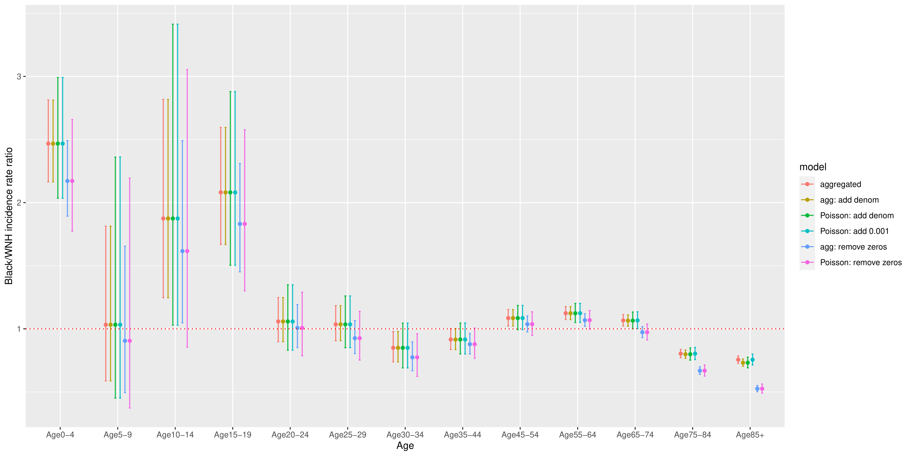
```


## Aggregation Method

As we presented in the original *Public Health Disparities Geocoding Project Monograph* (Krieger et al, 2004), one of the most straightforward ways to incorporate area-based social metrics into analyses of health inequities is to use what we term the Aggregation Method. This method entails using geocodes to append area-based social metrics to health surveillance cords, to stratify these records into discrete categories based on ABSM, and to aggregate numerators and denominators over areas, within levels defined by ABSM. Rates, including age-standardized rates, and measures of association (e.g. rate differences or rate ratios) can be easily computed using tabulation methods and formulae that are taught in all basic epidemiologic textbooks. The analyses are straightforward and do not require specialized software: they can even be done in Excel or other spreadsheet programs. One of the key advantages is that aggregation avoids problems with numerator/denominator mismatch since small discrepancies in case counts and population at risk tend to get averaged out in aggregating numerators and denominators over small areas within ABSM strata. 


We can describe inequities by categories of ABSMs by aggregating deaths and population at risk from census tracts that share the same values of those ABSMs. This is analogous to what health departments typically do when reporting, for example, statewide cancer mortality rates by age or gender.

This method avoids the problem of unstable rates arising from small areas by assuming that cases and population denominators from areas with similar socioeconomic characteristics can be validly combined into the same strata.

The following steps are used to generate age-standardized disease rates stratified by area-based social metrics once the case data have been geocoded and appropriate ABSMs have been generated from census data.


1. Aggregate the case data into numerators (age cells within areas/geocodes).
2. Aggregate population denominator data into age cells within areas/geocodes.
3. Merge the numerators and denominators with ABSMs, by area/geocode.
4. Aggregate over areas into strata defined by categorical ABSM and age category.
5. Generate age-standardized rates and other summary measures.


:::: {.infobox .dataWrangling}

Advantages:

- easy to implement using tabulation methods; can even be done in MS Excel

- formulae are taught in basic epidemiologic textbooks

- presentation and interpretation of social inequities is straightforward

- aggregation avoids problems with numerator-denominator mismatch

- age-standardization using the direct method has coherent interpretation even in the presence of effect heterogeneity by age

- Confidence intervals may be wider particularly when age strata with relatively less information get upweighted

Disadvantages:

- precludes identification of small areas with unusually high or low disease rates

- may preclude further adjustment for compositional differences or area-level covariates that vary within ABSM strata

::::

Throughout this section, we will be using data from the Greater Boston Area for the years 2013-2017, drawing on Massachusetts Mortality data and the American Community Survey (ACS) population data.

### Direct Age Standardization 

- rate estimation
- confidence intervals on the rates
- measures of disparity: incidence rate difference and incidence rate ratio
- population attributable fraction
- a comment on life expectancy

```{r, echo=FALSE, warning=FALSE, message=FALSE}
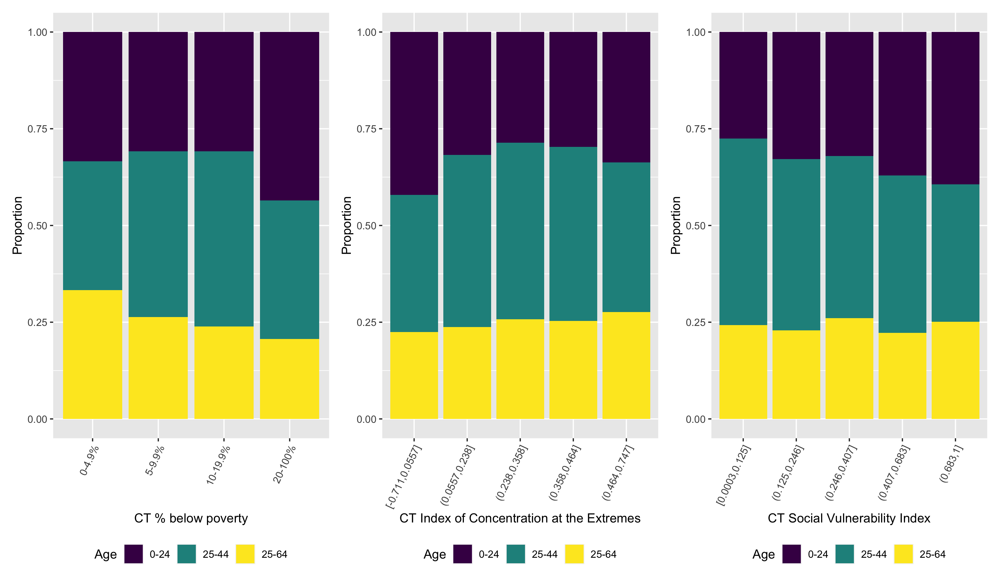
```

```{r, echo=FALSE, warning=FALSE, message=FALSE}
table_direct_age_std <- read_csv("data/06-analyzing-your-data/direct_age_standardization_example.csv")

knitr::kable(table_direct_age_std, 
             col.names = c("CT % below poverty", "Age category", "Deaths", "Person-years", 
                           "Weight", "Rate per 100,000 p-y"),
             digits=c(0, 0, 0, 0, 3, 2),
             html=TRUE) %>%
  kable_styling(bootstrap_options = c("striped", "hover", "condensed", "responsive"))

```

```{r, echo=FALSE, warning=FALSE, message=FALSE}
table_direct_std_rates <- read_csv("data/06-analyzing-your-data/age_standardization_example_summed.csv")

knitr::kable(table_direct_std_rates, 
             col.names = c("CT % below poverty", "Deaths", "Person-years", 
                           "Standardized Rate per 100,000 p-y", "Var(Rate)", "Sum of weights", "Sum of weights^2", "std_rate_lo95", "std_rate_up95"),
             digits=c(0, 0, 0, 0, 1, 10, 3, 4, 1, 1),
             html=TRUE) %>%
  kable_styling(bootstrap_options = c("striped", "hover", "condensed", "responsive"))

```


## Non-Spatial Regression Methods

### Poisson regression

While the aggregation method is attractive for its conceptual simplicity and ease of implementation, some may prefer to take a regression approach to analysis of health inequities by ABSM. As we will describe below, this makes it possible to relax the strong assumption of a homogenous Poisson process within category of ABSM. We might therefore choose to model the data (deaths and population at risk by age stratum within census tracts) using a Poisson loglinear model -- that is, a generalized linear model with a Poisson error distribution and a log link.

Let $Y_{ij}$ be the count of deaths in age-stratum $j$ in census tract $i$ and $n_{ij}$ be the corresponding person-time at risk. We fit a Poisson log linear model to the data and include dummy variables for ABSM categories, e.g. with $x_1$, $x_2$, $x_3$, and $x_4$ coded 1 if the census tract is in the corresponding category of CT % below poverty and 0 otherwise. We model age categories as a set of dummy variables. We also include $\log(n_{ij})$ as an offset in the model for $\log(\mu_{ij})$.
\[
\begin{aligned}
Y_{ij} & \sim \mbox{Poisson}(\mu_i) \\
\log(\mu_{ij}) & = \beta_0 + \beta_1 I(pov=5-9.9\%) + \beta_2 I(pov=10-19.9\%) + \beta_3 I(pov=20-100\%) \\&+\sum_{j=2}^{J} \alpha_j I(age=age_j) + \log(n_{ij})
\end{aligned}
\]

### Quasi-poisson regression

A key assumption of the Poisson distribution is that the variance of the expected count equals the mean,
\[ \mbox{Var}(Y_{ij}) = \mathbb{E}(Y_{ij}) = \mu_{ij} \]
In real life, however, we often find data where the empirical variance is larger than the mean. This is known as **overdispersion**.

To diagnose potential overdispersion, we can look at the standardized residuals, defined as
\[
\begin{align*}
z_{i}  & = \frac{y_{i} - \hat{y}_{i}}{sd(\hat{y}_{i})}  
\end{align*}
\]
If the Poisson model is true, then the $\{z_{i}\}$s should be approximately independent, each with mean 0 and standard deviation 1. If there is overdispersion, we would expect the $\{z_{i}\}$s to be larger in absolute value, reflecting the extra variation beyond what is predicted under the Poisson model.

We can test for overdispersion by computing the sum of squares of the standardized
residuals and comparing this to the
$\chi^{2}_{n-k}$ distribution where $n$ is the sample size and $k$ is the number of parameters in the Poisson log linear model.

````{verbatim}
> df_overdispersion <- df_forModel 
> df_overdispersion$yhat <-  predict(poisson_apINDPOV,
+                                          newdata=df_forModel %>%
+                                          dplyr::select(denominator, 
+                                                        apINDPOV_2, 
+                                                        apINDPOV_3, 
+                                                        apINDPOV_4,
+                                                        apINDPOV_NA,
+                                                        agecat), type="response")
> 
> df_overdispersion$z <- (df_overdispersion$numerator - df_overdispersion$yhat)/sqrt(df_overdispersion$yhat)
> n.obs <- length(df_overdispersion$numerator)
> k <- 4
> cat("overdispersion ratio is ",sum(df_overdispersion$z^2, na.rm=T)/(n.obs-k),"\n")
overdispersion ratio is  2.144269 
> cat("p-value of overdispersion test is ", pchisq(sum(df_overdispersion$z^2, na.rm=T), n.obs-k, lower.tail=FALSE), "\n")
p-value of overdispersion test is  0 

````

We can also visualize the predicted counts vs. the standardized residuals.

```{r, echo=FALSE, fig.cap="Predicted counts vs. standardized residuals. The standardized residuals should have mean 0 and standard deviation 1 (hence the dashed lines at $\\pm2$ indicating approximate 95% error bounds). The variance of the standardized residuals is larger than 1, indicating in this case a moderate amount of overdispersion."}

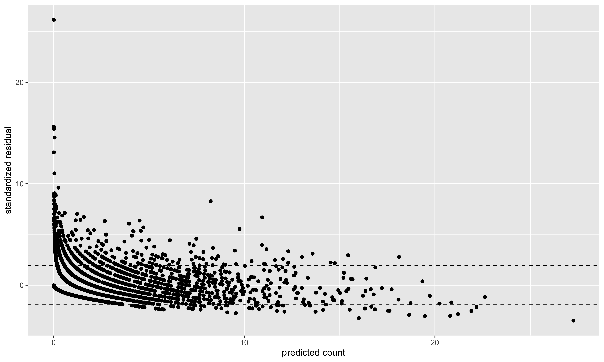

```


### Negative binomial regression


- aggregation method and Poisson regression coincide in the analysis of crude rates
- Poisson regression assumes that the variance is equal to the mean, but real-life data often exhibit overdispersion (actually more complicated with age-specific data, where some age strata may be underdispersed and others may be overdispersed)
- Quasi-poisson regression estimates an extra scale parameter: results in wider confidence limits when there is overdispersion. ABSM estimates are identical to the Poisson model fit.
- Negative binomial model assumes a different distribution to allow for overdispersion. Can be conceived of as a mixture of Poisson distributions where the latent variable is gamma distributed
- Negative binomial model yields ABSM estimates that can vary from the Poisson and Quasi-Poisson fits

How do these models handle numerator/denominator mismatch? Zero numerator/zero denominator observations need to be deleted. Non-zero numerator/zero denominator areas present a problem. If we delete these areas, the undercount of cases can be differential by racialized group; a better approach is to add to the denominator (the effect on the total denominators is negligible, but this yields rates and ABSM estimates more similar to the aggregation method). 

### Comparison of non-spatial regression estimates

```{r, echo=FALSE, out.width="100%", fig.cap="Comparison of estimates of social inequities by ABSM from the aggregated method and from non-spatial regression models"}

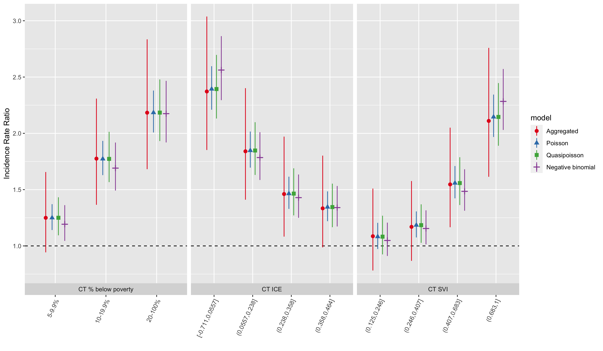

```


## Small Area Estimation


### Indirect Age Standardization

We observe $y_{ij}$, the count of deaths in area $i$ in age stratum $j$. We define $O_{i}$ as the observed number of deaths in area $i$, summed up over the age strata: $O_{i} = \sum_{j} y_{ij}$. The expected number of deaths, $E_{i}$, is computed by applying age-specific mortality rates from a reference population to the age-specific population counts in each area:
\[ E_{i} = \sum_{j} N_{ij} \times R_{j} \]
where $N_{ij}$ is the person-time at risk in age group $j$ in area $i$ (computed by taking the population in age-group $j$ in area $i \times$ number of years) and $R_{j}$ is the mortality rate age group $j$ of a suitable reference population. The ratio $O_{i}/E_{i}$ is known as the Standardized Incidence Ratio (SIR), or, in the case of mortality outcomes, the Standardized Mortality Ratio (SMR). This ratio is an estimate of the \textit{relative risk} within each area, $\theta_{i}$. For rare, non-communicable diseases, the standard statistical model for $O_{i}$ is that of the Poisson distribution:
\[ O_{i} \sim \mathrm{Poisson} (\theta_{i}E_{i}). \]
The maximum likelihood estimator of $\theta_{i}$ is
\begin{align*}
\hat{\theta}_{i} = \mathrm{SMR}_{i} & = \frac{O_{i}}{E_{i}} 
\end{align*}
with $\mathrm{Var}(\mathrm{SMR}_{i}) = \theta_{i}/E_{i}$, estimated by $O_{i}/E_{i}^2$. Note that $\mathrm{Var}(\mathrm{SMR}_{i})$ is inversely proportional to $E_{i}$. To translate the SMR into an age-standardized rate, we can multiply the SMR by the overall mortality rate from the reference population. In these examples, however, we will present the small area estimates on the SMR scale, since we are interested in the pattern of increased or decreased relative risk across small areas.

Indirect age standardization and SMRs are particularly useful when the age-specific counts of deaths are not available for each area, since all that is required are age-specific population estimates for each area, a set of age-specific reference rates, and the **total cases** in each area. Interestingly, this method also produces rate estimates with smaller asymptotic variance than the corresponding direct standardization method (Pickle and White, 1995). 

As summary measures, SMRs also have certain drawbacks. They are based on ratio estimators, and are thus sensitive to small changes in $E_{i}$. In particular, when $E_{i}$ is close to zero, the SMR will be very large for any positive count. As the estimate of $\mathrm{Var}(\mathrm{SMR}_{i})$ is proportional to $1/E_{i}$, SMRs of zero do not distinguish variation in expected counts. Most importantly, interpretability and comparability of SMRs based on indirectly age standardized data across areas depends on the assumption of independent area and age effects with respect to the standard population. This is known as the proportionality assumption, and assumes that $r_{ij} = \theta_{i} \times \alpha_{j}$ where $\alpha_{j}$ is an age effect that does not vary over areas.

To determine whether an $SMR>1$ is inconsistent with a chance occurrence, we can carry out a statistical hypothesis test:
\[
\begin{align*}
\mbox{Null hypothesis} & : \theta_{i}=1 \\
\mbox{Alternative hypothesis} & :  \theta_{i}>1
\end{align*}
\]
We test this hypothesis as follows: Under the null hypothesis, the mean of the Poisson distribution is $E_{i}$
\[ O_{i} \sim \mathrm{Poisson}(E_{i}) \]

Calculate the probability of obtaining at least $O_{i}$ cases by chance from a Poisson distribution with mean $E_{i}$:
\[
\begin{align*}
\Pr(X \geq O_{i} | \mathrm{Exp}=E_{i}) & = 1 - \Pr(X < O_{i} | \mathrm{Exp}=E_{i}) \\
& = 1 - \sum^{O_{i}-1}_{X=0} \frac{E_{i}^{X} e^{-E_{i}}}{X!} \\
& = p
\end{align*}
\]
This probability $p$ is the (1-sided) p-value. If $p \leq 0.05$, we usually reject the null hypothesis and accept the alternative. We say that the excess risk of disease in area $i$ is **statistically significant** at the 5% level. Such a finding might warrant further epidemiological investigation.

Consider, however, that we have 306 census tracts in the Greater Boston mortality example. The statistical test described above was just for the comparison of one census tract's SMR relative to the null hypothesis. If we want to identify all of the census tracts in our study area with significantly elevated rates, we would have to repeat this tests many times, which would create a multiple hypothesis testing situation. Moreover, we could imagine that there would be dependence of tests for nearby areas if neighboring areas shared some risk factor which increased the SMR for these clusters of census tracts.


To overcome this variability, hierarchical models can be used to "smooth" the raw rates. When faced with the problem of making inferences on many parameters $\{\theta_{i}\}=\theta_{1}, \ldots, \theta_{n}$, measured on $n$ areas, one can imagine two possible extreme assumptions:

* We could assume that all of the $\{\theta_{i}\}$ are **identical**, in which case all the data can be pooled, and the individual units ignored. This is what we typically do when presenting summary rates and rate ratios over the whole study area. 

* At the other extreme, we could assume that all the $\{\theta_{i}\}$ are **independent** and entirely unrelated. In this case, the SMR from each area would have to be estimated independent of the data for other areas. As we have saw in the SMR example above, this leads to statistical instability if the numbers are small.

A third possible assumption lies somewhere between these two extremes. One could assume that the $\{\theta_{i}\}$ are "similar" in the sense that the area labels convey no additional information. This is known as **exchangeability**, and is equivalent to assuming that $\{\theta_{i}\}$ are drawn from a common prior distribution with unknown parameters.

### Poisson gamma model

A classic example of this approach is presented by Clayton and Kaldor (1987), who developed a Bayesian analysis of a Poisson likelihood model. Their model is a useful introduction to the idea of hierarchical modelling of disease rates, as the second stage distribution for the area variability is analytically tractable and helps to build intuition about how smoothing works to stabilize the SMR estimates.

In the first stage of the hierarchy, we assume that the observed death counts for each area are Poisson distributed:
\[ O_{i} \sim \mathrm{Poisson}(\theta_{i} E_{i}). \]
In the second stage, a hierarchical prior is placed on $\theta_{i}$:                          
\[ \theta_{i} \sim \mathrm{Gamma}(\nu, \alpha) .  \]
Recalling that the gamma distribution with parameters $\nu$ and $\alpha$ has mean $\nu/\alpha$, this simply states that we expect the distribution of $\{ \theta_{i}\}$ to follow a gamma distribution with mean $\nu/\alpha$ and variance $\nu/\alpha^{2}$. Since the gamma distribution is the conjugate prior of the Poisson, the posterior distribution of $p(\theta_{i} | O_{i},E_{i})$ also follows a gamma distribution:
\[
\mathrm{Gamma}(\nu + O_{i}, \alpha + E_{i})
\]
with mean given by
\[
\mathbb{E}(\theta_{i}|O_{i},\nu, \alpha) = \frac{\nu+O_{i}}{\alpha + E_{i}} = w_{i}\mbox{SMR}_{i} + (1-w_{i}) \frac{\nu}{\alpha}
\]
where
\[w_{i} = \frac{E_{i}}{\alpha+E_{i}}. \]
The expression for $\mathbb{E}(\theta_{i}|O_{i},\nu,\alpha)$ shows that the posterior mean of the relative risk for the $i$th area is a *weighted average* of the observed SMR for the $i$th area and the average relative risk ($\nu/\alpha$) over all areas. The weight is inversely proportional to the variance of the SMR. Accordingly, when $E_{i}$ is small (for rare diseases or small population counts), the variance is large, so the weight $w_{i}$ is small and the posterior mean is dominated by the prior mean, $\nu/\alpha$. In areas with abundant data, the posterior mean is close to the observed $SMR_i = O_{i}/E_{i}$. This feature, whereby the amount of smoothing is proportional to the amount of information available for a particular area, is known as **precision weighting**. It has an intuitive appeal in that, when one does not observe a lot of information about an area (because the sample size is small and the risk estimate is unstable), one's "best guess" concerning that area's mortality risk should be weighted towards what little is known from prior knowledge, i.e. that the risk is, on average, $\nu/\alpha$. In contrast, if one observes a lot of information for an area (e.g. because the sample size is large), one is more likely to believe what the data say about mortality risk in that particular area, and thus the "best guess" would reasonably be weighted towards the observed SMR for that specific area.

In the Empirical Bayes approach developed by Clayton and Kaldor (1987), $\nu$ and $\alpha$ are replaced by their estimates, $\hat{\nu}$ and $\hat{\alpha}$, which can be calculated by means of an iterative procedure using the following two equations:

\[ 
\begin{align*}
\frac{\hat{\nu}}{\hat{\alpha}} & = \frac{1}{n} \sum_{i}^{n} \frac{O_i + \hat{\nu}}{E_i + \hat{\alpha}} = \frac{1}{n} \sum_i \hat{\theta}_i \\
\frac{\hat{\nu}}{\hat{\alpha}^2} & = \frac{1}{n-1} \sum_{i}^{n} \left(1 + \frac{\hat{\alpha}}{E_i} \right) \left(\hat{\theta}_i - \frac{\hat{\nu}}{\hat{\alpha}}\right)^2 
\end{align*}
\]
where $\{\hat{\theta}_i\}$ are the empirical Bayes estimates. Together, these two equations can be used recursively to compute $\hat{\nu}$ and $\hat{\alpha}$. At each stage of the iteration, the $\{\hat{\theta}_i\}$ are calculated from the current estimates of $\nu$ and $\alpha$, and then the right hand sides of the two equations are used to provide new estimates of $\nu$ and $\alpha$ (Clayton and Kaldor, 1987).

There is an interesting connection here to negative binomial regression in that the marginal posterior distribution of $O_i$ (unconditional on $\theta_i$) is negative binomial with size $\nu$ and probability $\alpha/(E_i + \alpha)$.

We can apply this algorithm to the observed and expected death counts in the census tracts of our study area to obtain empirical Bayes estimates of the census tract level SMRs, which we compare to the raw $SMR_i = O_i/E_i$:

````{verbatim}

# Use DCluster::empbaysmooth to fit the Poisson Gamma model as proposed by Clayton and Kaldor (1987)
poisson_gamma <- DCluster::empbaysmooth(df_indirect_ordered$O, df_indirect_ordered$E)

# Append these estimates to the dataset and also calculate naive empirical Bayes credible intervals
# using the gamma distribution.
df_eb <- df_indirect_ordered %>%
         mutate(nu1 = O + poisson_gamma$nu,
                alpha1 = E + poisson_gamma$alpha,
                empbayes_SMR = poisson_gamma$smthrr,
                empbayes_CI95low = qgamma(0.025, nu1, alpha1),
                empbayes_CI95up = qgamma(0.975, nu1, alpha1),
                eb_sig = factor(case_when(
                  empbayes_CI95low>1 & empbayes_CI95up>1 ~ 1,
                  empbayes_CI95low<1 & empbayes_CI95up<1 ~ -1,
                  TRUE ~ 0)),
                raw_SMR = O/E, # recenter rawSMRs by adding intercept from intercept only model
                raw_SMR_CI95low = pois.exact(x=O, pt=E, conf.level=0.95)[,4],
                raw_SMR_CI95up = pois.exact(x=O, pt=E, conf.level=0.94)[,5],
                raw_sig = factor(case_when(
                  raw_SMR_CI95low>1 & raw_SMR_CI95up>1 ~ 1,
                  raw_SMR_CI95low<1 & raw_SMR_CI95up<1 ~ -1,
                  TRUE ~ 0))) %>%
          mutate(empbayes_SMR = ifelse(empbayes_SMR==0, nu1/alpha1, empbayes_SMR))

# caterpillar plot of the raw SMRs
rawSMR_caterpillar_eb <- ggplot(df_eb %>% arrange(raw_SMR) %>% mutate(id_order = row_number()),
       aes(x=id_order, y=raw_SMR, ymin=raw_SMR_CI95low, ymax=raw_SMR_CI95up, col=raw_sig)) +
  geom_point() +
  geom_errorbar() +
  geom_hline(yintercept = 1, col="red", linetype="dotted") +
  ylim(c(0,6)) +
  labs(x="", y="raw SMR") +
  scale_color_manual(name="",
                       values=c("#018571", "grey50", "#A6611A"),
                       labels=c("CI below 1",
                                "CI crosses 1",
                                "CI above 1")) +
  theme(legend.position="bottom")

# caterpillar plot of the empirical Bayes SMRs
ebSMR_caterpillar_eb <- ggplot(df_eb %>% arrange(empbayes_SMR) %>% mutate(id_order = row_number()),
       aes(x=id_order, y=empbayes_SMR, ymin=empbayes_CI95low, ymax=empbayes_CI95up, col=eb_sig)) +
  geom_point() +
  geom_errorbar() +
  geom_hline(yintercept = 1, col="red", linetype="dotted") +
  ylim(c(0,6)) +
  labs(x="", y="empirical Bayes SMR") +
  scale_color_manual(name="",
                       values=c("#018571", "grey50", "#A6611A"),
                       labels=c("CI below 1",
                                "CI crosses 1",
                                "CI above 1")) +
  theme(legend.position="bottom")

rawSMR_caterpillar_eb + ebSMR_caterpillar_eb
````

From the caterpillar plots, we observe that the empirial Bayes estimates are substantially smoothed relative to the raw SMRs. The observations at the extremes of the distribution with huge confidence intervals are smoothed towards the mean, and the spread of smoothed SMRs is generally narrower than the raw SMRs.

```{r, echo=FALSE, fig.cap="Caterpillar plots of raw SMRs with 95% CIs and smoothed SMRs from a Poisson gamma model with 95% credible intervals"}
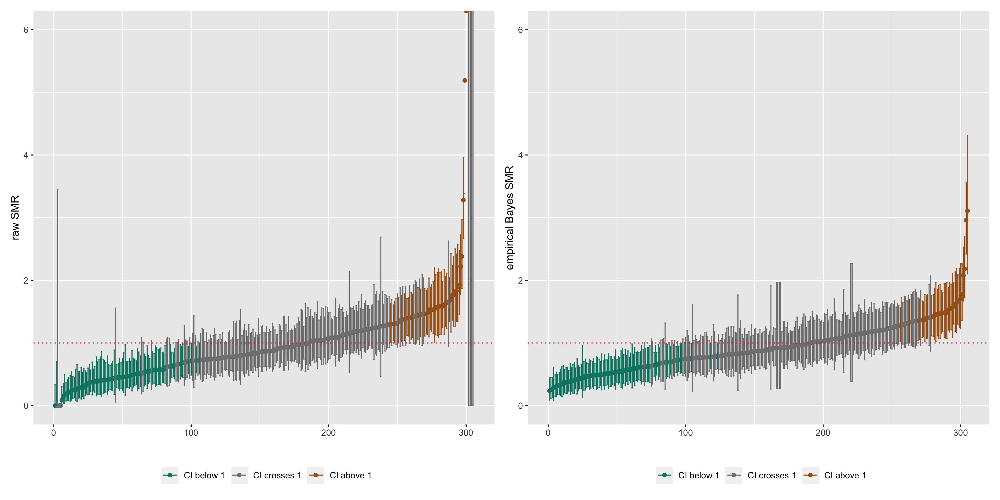
```

This is also evident if we compare maps of the raw SMRs to the empirical Bayes SMRs, where the more extreme low or high SMRs are smoothed towards the middle values.


```{r, echo=FALSE, fig.cap="Maps of raw SMRs (left) and smoothed SMRs from a Poisson gamma model"}
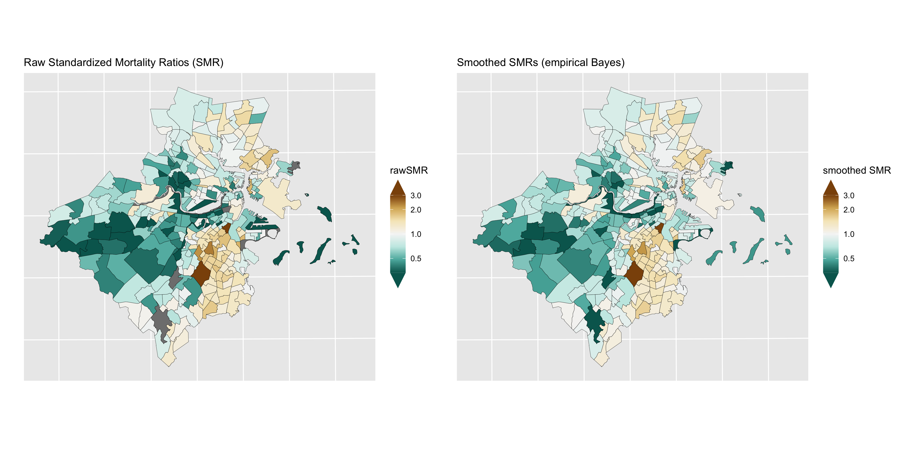
```


### Poisson log normal model

While a gamma prior for $\{\theta_{i}\}$ is mathematically convenient, it can be restrictive in that it is difficult to incorporate observed covariates into the model. A more flexible model makes use of a normal prior for $\log(\theta_{i})$ (Wakefield et al., 2000; Lawson et al., 2003):
\[
\begin{align*}
O_{i} & \sim \mathrm{Poisson}(\theta_{i} E_{i}) \\
\log(\theta_{i}) & = \alpha + v_{i} \\
v_{i} & \sim \mathrm{Normal}(0, \sigma^{2}_{v})
\end{align*}
\]
where $\alpha$ is an intercept term representing the overall log relative risk of disease in the whole study region compared to the reference rate and $v_{i}$ is the residual log relative risk in area $i$ compared with the average over the study region. Here, the $\{v_{i}\}$ are assumed to arise from a normal distribution with mean 0 and variance $\sigma^{2}_{v}$. You may recognize this model as a generalized linear mixed model, where "mixed" refers to the fact that the model contains both "random effects" (the $\{v_{i}\}$), as well as accommodating "fixed" covariate effects, e.g.
\[
\log(\theta_{i}) = \alpha + \beta_{1} x_{1} + \ldots + \beta_{p} x_{p} + v_{i} . \]
In this case the $\{v_{i}\}$ are interpretable as ***residual** area-specific effects conditional on the fixed covariates. Similarly, the $\beta$s are interpretable as covariate effects **conditional** on the area random effects.

:::: {.infobox}
**Fixed vs Random Effects:** in standard regression models, fixed and random effects refer to the type of statistical model being used. When using fixed effects analysis of variance (ANOVA), the assumptions being made are about the independent variable and the error distributions for the variable. Fixed effects are estimated with maximum likelihood (the traditional beta estimates we see in regression models). They are most appropriate when trying to generalize results to values for the fixed variables used in the study (fixed variables are "assumed to be measured without error ... and assumed that the values of a fixed variable in one study are the same as values of the fixed variable in another study") (Newsom, 2019). If however, the researcher is seeking to make inferences beyond particular values of the independent variable, a random effects model is used. Random effects are estimated with shrinkage (partial pooling or linear unbiased predictions). Random effects models are accounting for "additional expected random variation on the independent variable" and instead of the value of the variable itself being of interest, the random variables "are assumed to be values that are drawn from a larger population of values and thus will represent them" (Newsom, 2019; Gelman, 2005)

<!-- possible alternate text: 
Here we outline five definitions that we have seen:

Fixed effects are constant across individuals, and random effects vary. For example, in a growth study, a model with random intercepts 𝑎𝑖 and fixed slope 𝑏 corresponds to parallel lines for different individuals 𝑖, or the model 𝑦𝑖𝑡=𝑎𝑖+𝑏𝑡. Kreft and De Leeuw (1998) thus distinguish between fixed and random coefficients.

Effects are fixed if they are interesting in themselves or random if there is interest in the underlying population. Searle, Casella, and McCulloch (1992, Section 1.4) explore this distinction in depth.

“When a sample exhausts the population, the corresponding variable is fixed; when the sample is a small (i.e., negligible) part of the population the corresponding variable is random.” (Green and Tukey, 1960)

“If an effect is assumed to be a realized value of a random variable, it is called a random effect.” (LaMotte, 1983)

Fixed effects are estimated using least squares (or, more generally, maximum likelihood) and random effects are estimated with shrinkage (“linear unbiased prediction” in the terminology of Robinson, 1991). This definition is standard in the multilevel modeling literature (see, for example, Snijders and Bosker, 1999, Section 4.2) and in econometrics.

[Gelman, 2004, Analysis of variance—why it is more important than ever. The Annals of Statistics.]
--> 
::::

It should be noted here that, as pointed out by Wolpert and Ickstadt (1998), the Poisson log normal model does not aggregate consistently. That is, if one specifies a log normal distribution for each of the relative risks and then combines two areas and specifies a log normal distribution for the relative risk of the combined area, then these distributions are inconsistent (because the sum of log normal distributions is not log normal). This can be understood as a form of ecologic bias whereby risk relationships do not remain constant across levels of aggregation (Wakefield et al., 2000). Nevertheless, a normal second-stage distribution has been observed empirically to provide a good model for log relative risks over a range of aggregations, and does present advantages with respect to model flexibility and ease of computation. 

Unlike the Poisson gamma model, there is no analytically tractable closed-form solution for the posterior distributions. Instead, we will use INLA to fit this model.

````{verbatim}
# Use INLA to fit Poisson gamma model
model_form <- O ~ 1 + f(id_order, model="iid")
model_iid <- inla(model_form, family="poisson", 
                data=df_indirect_ordered, E=E, # E points to the expected count field
                control.predictor=list(compute=TRUE), # computes transformed posterior marginals
                control.compute=list(dic=TRUE, waic=TRUE)) # computes DIC for model fit
summary(model_iid)

````

We can see from the caterpillar plots of the raw SMRs vs. the smoothed SMRs from the Poisson lognormal model that, similar to the Poisson gamma model, the Poisson lognormal model smooths extreme SMRs towards the overall mean. 

```{r, echo=FALSE, fig.cap="Caterpillar plots of raw SMRs with 95% CIs and smoothed SMRs from a Poisson lognormal model with 95% credible intervals"}
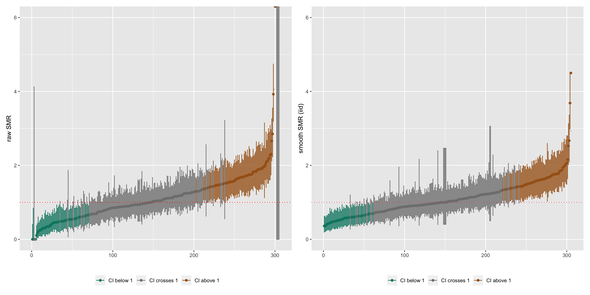
```

```{r, echo=FALSE, fig.cap="Maps of raw SMRs (left) and smoothed SMRs from a Poisson lognormal model"}
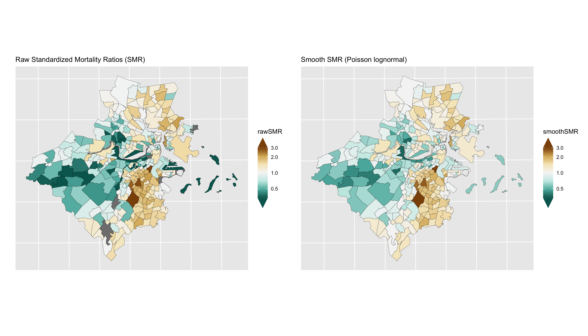
```

The estimate of the SMR for area $i$ relative to the reference mortality rate (from the indirect age standardization) is $\exp(\alpha + v_{i})$, while $\exp(v_{i})$ is the residual relative risk for area $i$ relative to the mean over the study area. Note that if an internal set of reference rates for indirect age standardization has been used, i.e. based on the observed rates over the whole study area itself, then $\alpha$ will generally be close to zero. 

### Poisson multilevel model


In both the Poisson gamma and Poisson log normal models, the smoothing is global: the random effects are treated as exchangeable and come from the same common distribution. As a result, all of the area specific relative risks are shrunk to the same overall mean. This kind of global smoothing does not allow for spatial correlation between risks in nearby areas, as might be expected if there is local clustering in the spatial pattern of risks. Local clustering of risks may be due to risk factors that are shared within and across census tracts: individuals who share these spatially varying risk factors would be expected to have similar outcomes. If such local clustering exists, this is a violation of the assumption of exchangeability. If these risk factors are known and observed, the most straightforward solution would be to include them as covariates in the model. However, in most observational settings, one can rarely measure, or even know about, all the relevant risk factors. If one suspects that these risk factors vary by area, it will be necessary to consider ways to allow for local clustering in models for $\{\theta_{i}\}$.

In order to accommodate local smoothing, we can specify a Poisson multilevel model with random effects at the census tract and neighborhood levels. In the Greater Boston example, we will treat the neighborhoods of Boston as roughly equivalent as a level to the city/town designation in the communities outside of Boston that make up the greater Boston study area. 

\[
\begin{align*}
O_{ij} & \sim \mathrm{Poisson}(\theta_{ij} E_{ij}) \\
\log(\theta_{ij}) & = \alpha + v_{ij} + \eta_j \\
v_{ij} & \sim \mathrm{Normal}(0, \sigma^{2}_{v})\\
\eta_{j} & \sim \mathrm{Normal}(0, \sigma^{2}_{\eta})
\end{align*}
\]

This can be in INLA using the following code:

````{verbatim}

model_form <- O ~ 1 + f(id_order, model="iid") + f(cityid, model="iid")
model_multi <- inla(model_form, family="poisson", 
                data=df_indirect_ordered, E=E, # E points to the expected count field
                control.predictor=list(compute=TRUE), # computes transformed posterior marginals
                control.compute=list(dic=TRUE, waic=TRUE)) # computes DIC for model fit
summary(model_multi)

````

```{r, echo=FALSE, fig.cap="Maps of CT raw SMRs (left) and smoothed SMRs from a Poisson multilevel model"}
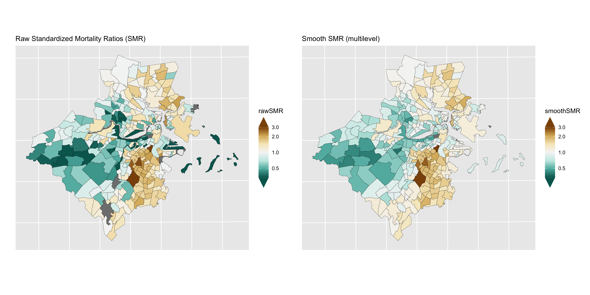
```

```{r, echo=FALSE, fig.cap="Map of the neighborhood level variation in relative risk (Level 2 of the Poisson multilevel model)"}
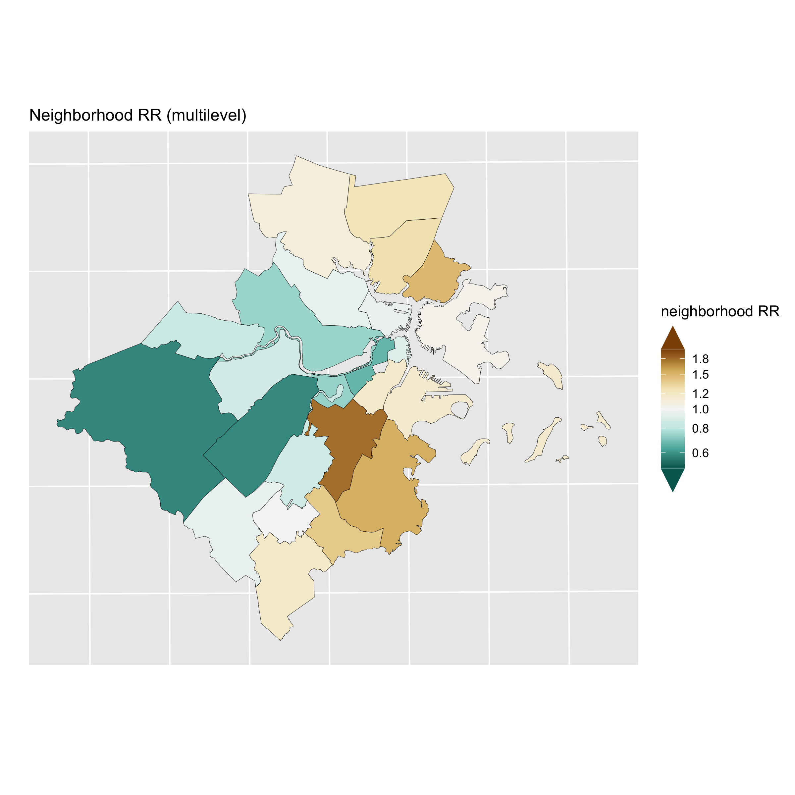
```


### Poisson BYM model


In the multilevel Poisson log normal model with independent census tracts and neighborhoods, the 
neighborhood units were specified **a priori**. In a sense, the neighborhood boundaries are fixed, and crossing a boundary means that one's relative risk may jump by quite a lot. What if one wants to account for spatial correlation in a **smoother** manner? One way to do this is to specify a multivariate normal prior distribution for all the area parameters with a spatially-structured covariance matrix. Many different ways have been proposed to specify spatially structured multivariate normal distributions for $\log (\theta_{i})$ (Wakefield et al., 2000; Banerjee et al., 2004). 

One particular form of the multivariate normal distribution that is commonly used is the **intrinsic Gaussian conditional autoregressive** (CAR) prior suggested by Clayton and Kaldor (1987) and developed by Besag et al. (1991). This is one of the most popular ways of dealing with spatial autocorrelation. The spatial structure is formulated through a set of conditional autoregressions, which uses the fact that if a vector of random variables has a multivariate normal distribution, then the distribution of each element of that vector conditional on all the other elements in the vector is also normal, with mean and variance that depend on the original multivariate mean and covariance matrix. 

As with the other models, the first stage model assumes that the observed counts are Poisson distributed, and that an additive model for $\log(\theta_{i})$ can be specified for accommodating covariate effects:
\begin{align*}
O_{i} & \sim \mathrm{Poisson}(\theta_{i} E_{i}) \\
\log (\theta_{i}) & = \alpha + u_{i} 
\end{align*}
Instead of the independent normal prior for the distribution of the census tract effects, one models
\[
u_{i}|u_{j, j \neq i} \sim \mathrm{Normal}(\mu_{i},\tau^{2}_{u}/m_{i})
\]
where
\[ \mu_{i} = \frac{\sum_{j} w_{ij} u_{j}}{\sum_{j} w_{ij}}, 
\qquad \sigma^{2}_{i} = \frac{\tau^{2}_{u}}{\sum_{j} w_{ij}} \]
and
\[
w_{ij} = 
\begin{cases}
1& \text{if $i, j$ are adjacent},\\
0 & \text{if they are not}
\end{cases}
\]

and $m_{i}$ is the number of adjacent areas. To understand this, consider the red highlighted census tract $i$ in Figure \@ref(fig:caridea). If $\partial_{i}$ is the set of areas adjacent to $i$ (shaded in yellow in the figure), and one sets $w_{ij}$ to 1 for areas $j \in \partial_{i}$ and zero otherwise, then the prior 
distribution for $u_{i}$ has conditional mean equal to the average of the neighbouring $u_{j}$'s and variance inversely proportional to the number of adjacent neighbours. The effect is to smooth $u_{i}$ toward the mean risk in the set of neighbouring areas. Note that $\tau^{2}_{u}$ is the \textit{conditional} variance (scaled by $\sum_{j \in \partial_{i}} {w_{ij}} = m_{i}$, i.e. the number of neighbours); to emphasize that it is only interpretable conditionally, we have labeled it $\tau^{2}_{u}$ instead of $\sigma^{2}_{u}$.


```{r caridea, echo=FALSE, out.width="60%", fig.cap="Illustration of the CAR idea"}
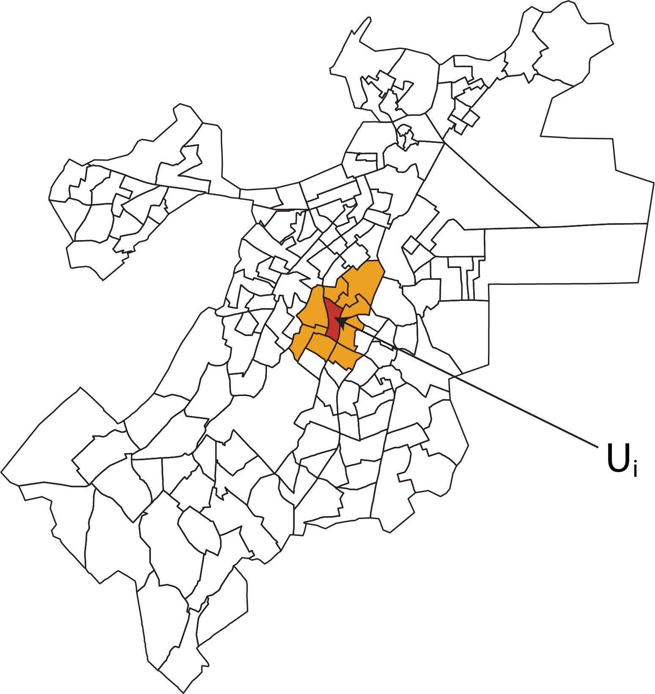
```


Besag, Yorke and Mollié (1991) recommend combining the CAR prior and the standard normal prior to allow for both
**spatially unstructured** latent covariates
**spatially correlated** latent covariates. Their model, called the BYM model or the convolution model in the literature, is thus

\[
\begin{align*}
O_{i} & \sim \mbox{Poisson}(\theta_{i} E_{i}) \\
\mbox{log}(\theta_{i}) & = \beta_0 + u_{i} + v_{i} \\
v_{i} & \sim \mbox{Normal}(0,\sigma^{2}_{v}) \\
u_{i}|u_{j, j \neq i} &  \sim \mbox{Normal}(\mu_{i},\sigma^{2}_{u}/m_{i})
\end{align*}
\]

Here, the unstructured $v_{i}$ can be thought of as capturing correlation **within** areas and the 
spatially structured $u_{i}$ capture spatial correlation **across** areas.


Note, however, that $\sigma^{2}_{v}$ (unstructured heterogeneity variance) and $\tau^{2}_{u}$ (spatial variance) are not directly comparable: $\sigma^{2}_{v}$ reflects the \textbf{marginal} variability of the unstructured random effects between areas, while $\tau^{2}_{u}$ is the \textbf{conditional} variance of the spatial effect in area $i$, conditional on values of neighboring spatial effects. No closed-form expression is available for the \textbf{marginal} between-area variance of the spatial effects. However, in the Bayesian approach, the marginal spatial variance $s^{2}_{u}$ can be estimated empirically from the posterior samples of $\{u_{i}\}$:
\[ s^{2}_{u} = \sum_{i} (u_{i}-\bar{u})^2 / (n-1) \]
where $\bar{u}$ is the average of the $\{u_{i}\}$.


With an estimate of the marginal between-area variance, one can also characterize the relative contribution of spatial vs. unstructured heterogeneity:
\[
\mathrm{frac_{spatial}} = s^{2}_{u} / (s^{2}_{u} + \sigma^{2}_{v}) \]
When $\mathrm{frac_{spatial}}$ is close to 1, spatial heterogeneity dominates. When $\mathrm{frac_{spatial}}$ is close to 0, unstructured heterogeneity dominates (Best et al. 2005).

To aid with interpretation of the variability in the posterior estimates of $SMR_i = \exp(u_i + v_i)$, we define a quantity which we will call QR90 (Best et al. 2005)
\[ QR_{90} = \mbox{exp}(q_{95\%} - q_{5\%}) = \mbox{ relative risk between top and bottom 5\% of areas}
\]
where
\[
\begin{align*}
q_{5\%} & = \mbox{ log relative risk for the area ranked at the 5th percentile} \\
q_{95\%} & = \mbox{ log relative risk for the area ranked at the 95th percentile}
\end{align*}
\]
The advantage of QR90 is that it expresses the variability in the SMRs on the relative risk scale, which facilitates comparison of the disparities between areas to the estimated inequities (also on the relative risk scale) attributable to categories of ABSMs.

```{r qr90idea, echo=FALSE, out.width="60%", fig.cap="Depiction of QR90: the relative risk comparing the 95th and 5th quantiles of the random effects distribution", fig.align="center"}
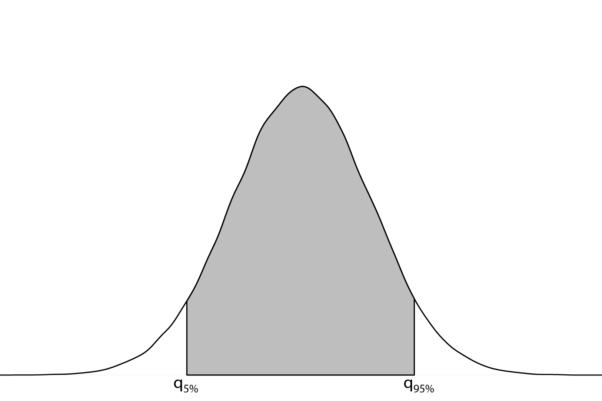
```
\includegraphics[width=3.5in]{../qr90_idea.pdf}


```{r, echo=FALSE, fig.cap="Caterpillar plots of raw SMRs with 95% CIs and smoothed SMRs from a Poisson BYM model with 95% credible intervals"}
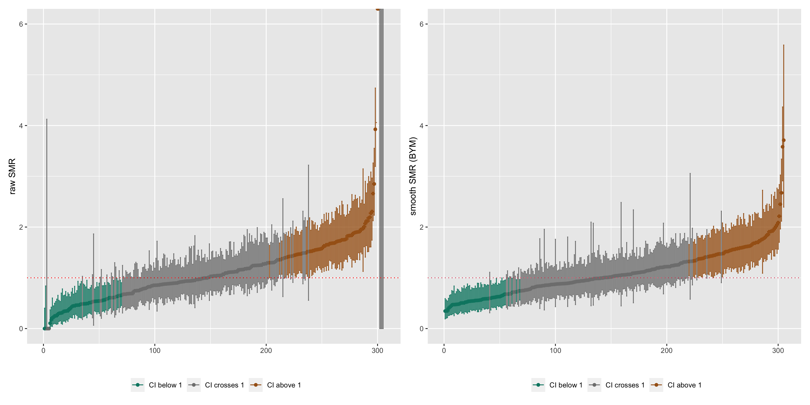
```


```{r, echo=FALSE, fig.cap="Comparison of premature mortality raw SMRs and smoothed (BYM) SMRs"}
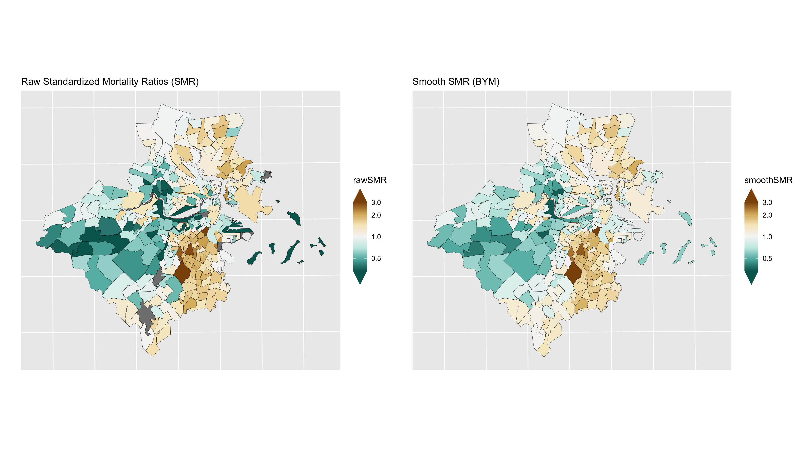
```


## Estimating ABSM effects

### Premature mortality 

```{r, echo=FALSE, fig.cap="ABSMs vs. smoothed SMRs (BYM)"}
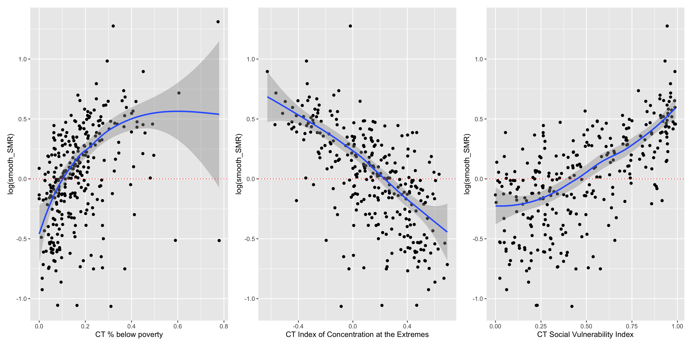
```

```{r, echo=FALSE, fig.cap="Comparison of premature mortality inequities by ABSM categories across all analytic methods and models"}
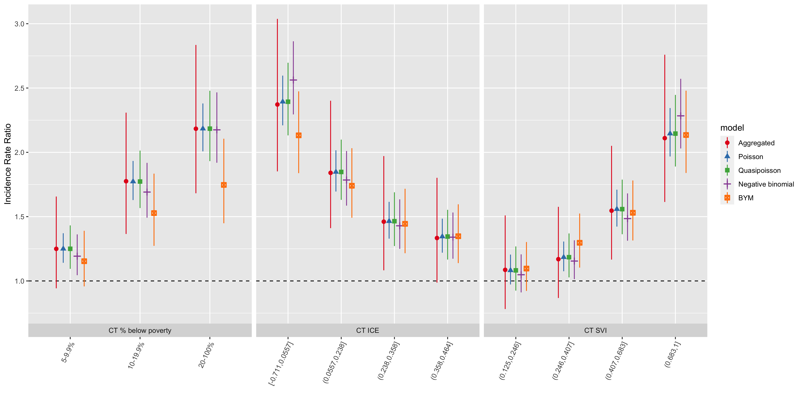
```

```{r, echo=FALSE, message=FALSE}
table_absm_inla <- read_csv("data/06-analyzing-your-data/coefficient_tab_inla.csv") %>%
  dplyr::select(term, qval, estimate, conf.low, conf.high, method) %>%
  filter(method %in% c("Aggregated", "Quasipoisson", "Negative binomial", "BYM")) %>%
  pivot_wider(id_cols = c(term, qval),
              names_from=method,
              values_from=c(estimate, conf.low, conf.high)) %>%
  janitor::clean_names() %>%
  dplyr::select(term, qval, estimate_aggregated, conf_low_aggregated, conf_high_aggregated,
                estimate_quasipoisson, conf_low_quasipoisson, conf_high_quasipoisson,
                estimate_negative_binomial, conf_low_negative_binomial, conf_high_negative_binomial,
                estimate_bym, conf_low_bym, conf_high_bym)

knitr::kable(table_absm_inla, 
             col.names = c("ABSM", "Category", "IRR", "conf.low", "conf.high",
                            "IRR", "conf.low", "conf.high",
                            "IRR", "conf.low", "conf.high",
                            "IRR", "conf.low", "conf.high"),
             digits=c(0, 0, 2, 2, 2,
                      2, 2, 2, 
                      2, 2, 2, 
                      2, 2, 2),
             html=TRUE,
             caption = "Comparison of estimated inequities in premature mortality by category of CT ABSMs from aggregated analysis and Quasipoisson, Negative Binomial, and BYM models") %>%
  add_header_above(c(" "=2, "Aggregated" = 3, "Quasipoisson" = 3, "Negative binomial" = 3, 
                     "BYM" = 3))%>%
  kable_styling(bootstrap_options = c("striped", "hover", "condensed", "responsive")) %>%
  pack_rows("CT % below poverty", 1, 3) %>%
  pack_rows("CT Index of Concentration at the Extremes", 4, 7) %>%
  pack_rows("CT Social Vulnerability Index", 8, 11)

```

```{r, echo=FALSE, fig.cap="Premature mortality: comparison of smoothed SMRs (BYM) before and after adjustment for CT % below poverty"}
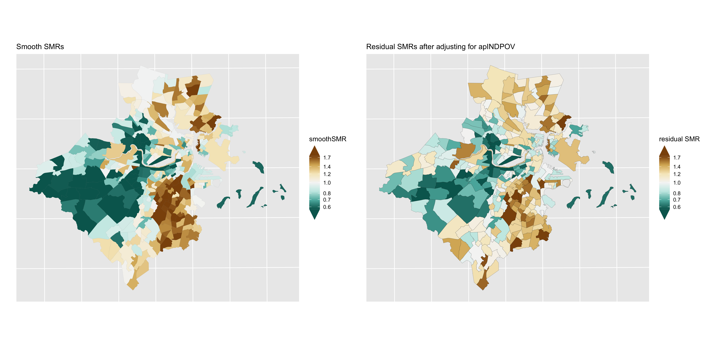
```

```{r, echo=FALSE, fig.cap="Premature mortality: comparison of smoothed SMRs (BYM) before and after adjustment for CT Index of Concentration at the Extremes (racialized economic segregation)"}
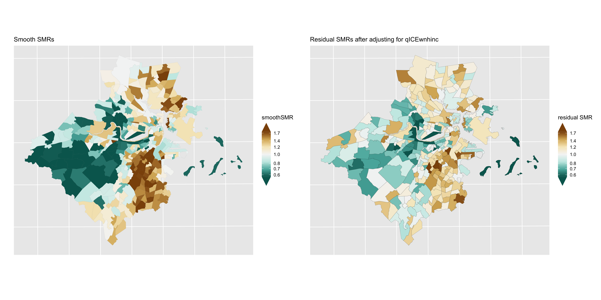
```

```{r, echo=FALSE, fig.cap="Premature mortality: comparison of smoothed SMRs (BYM) before and after adjustment for CT Social Vulnerability Index"}
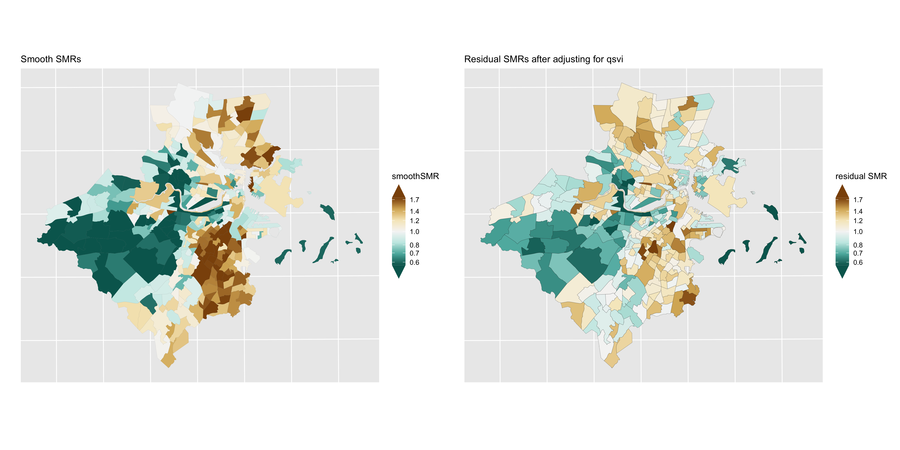
```


### Lung cancer mortality

```{r, echo=FALSE, fig.cap="Lung cancer mortality: CT ABSMs vs. smoothed SMRs (BYM)"}
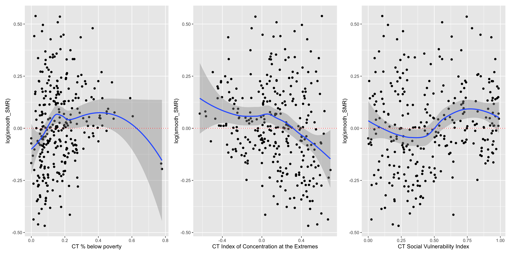
```

```{r, echo=FALSE, fig.cap="Comparison of lung cancer mortality inequities by CT ABSM categories across all analytic methods and models"}
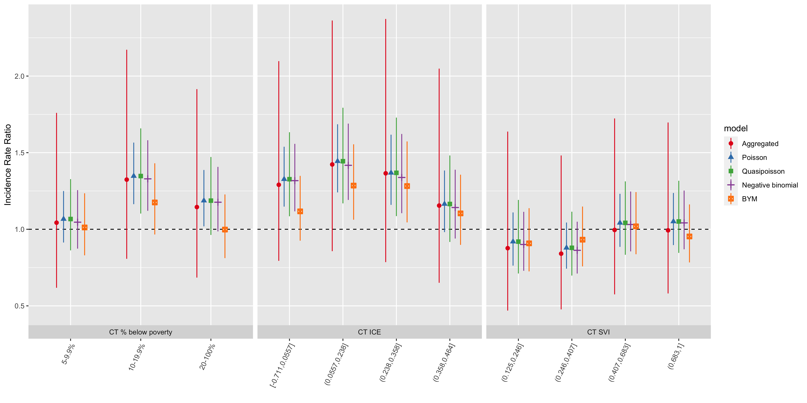
```


```{r, echo=FALSE, message=FALSE}
lung_table_absm_inla <- read_csv("data/06-analyzing-your-data/lung_coefficient_tab_inla.csv") %>%
  dplyr::select(term, qval, estimate, conf.low, conf.high, method) %>%
  filter(method %in% c("Aggregated", "Quasipoisson", "Negative binomial", "BYM")) %>%
  pivot_wider(id_cols = c(term, qval),
              names_from=method,
              values_from=c(estimate, conf.low, conf.high)) %>%
  janitor::clean_names() %>%
  dplyr::select(term, qval, estimate_aggregated, conf_low_aggregated, conf_high_aggregated,
                estimate_quasipoisson, conf_low_quasipoisson, conf_high_quasipoisson,
                estimate_negative_binomial, conf_low_negative_binomial, conf_high_negative_binomial,
                estimate_bym, conf_low_bym, conf_high_bym)


knitr::kable(lung_table_absm_inla, 
             col.names = c("ABSM", "Category", "IRR", "conf.low", "conf.high",
                            "IRR", "conf.low", "conf.high",
                            "IRR", "conf.low", "conf.high",
                            "IRR", "conf.low", "conf.high"),
             digits=c(0, 0, 2, 2, 2,
                      2, 2, 2, 
                      2, 2, 2, 
                      2, 2, 2),
             html=TRUE,
             caption = "Comparison of estimated inequities in lung cancer mortality by category of CT ABSMs from aggregated analysis and Quasipoisson, Negative Binomial, and BYM models") %>%
  add_header_above(c(" "=2, "Aggregated" = 3, "Quasipoisson" = 3, "Negative binomial" = 3, 
                     "BYM" = 3))%>%
  kable_styling(bootstrap_options = c("striped", "hover", "condensed", "responsive")) %>%
  pack_rows("CT % below poverty", 1, 3) %>%
  pack_rows("CT Index of Concentration at the Extremes", 4, 7) %>%
  pack_rows("CT Social Vulnerability Index", 8, 11)

```

```{r, echo=FALSE, fig.cap="Lung cancer: comparison of smoothed SMRs (BYM) before and after adjustment for CT % below poverty"}
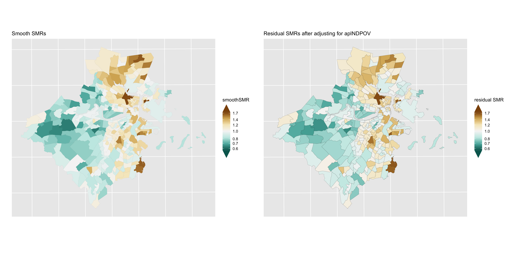
```

```{r, echo=FALSE, fig.cap="Lung cancer: comparison of smoothed SMRs (BYM) before and after adjustment for CT Index of Concentration at the Extremes (racialized economic segregation)"}
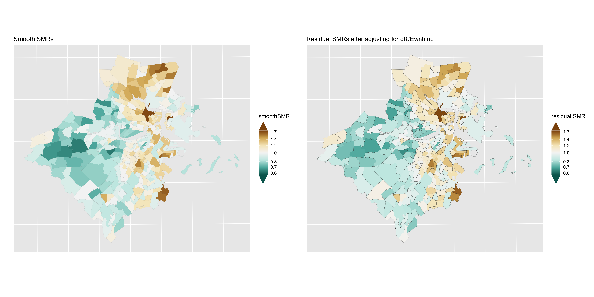
```

```{r, echo=FALSE, fig.cap="Lung cancer: comparison of smoothed SMRs (BYM) before and after adjustment for CT Social Vulnerability Index"}
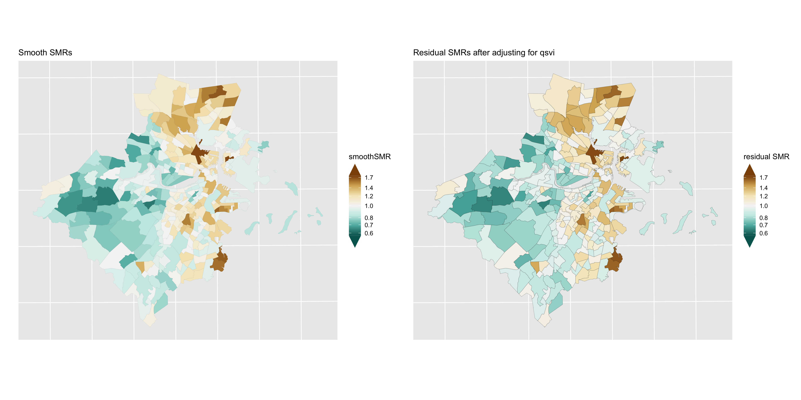
```


## Intersectional analysis of inequities by racialized group and CT ABSMs

In this section, we explore intersectional patterns of inequities in premature mortality by racialized group and CT ABSMs in the census tracts comprising the Greater Boston study area. That is, we focus on the joint patterning of inequities by membership in racialized groups (as captured by individual-level membership in racialized groups) and residence in census tracts characterized by area-based social metrics as indicative of **racialized societal inequities**. To accomplish this, we operationalize intersectional effects using methods for analyzing statistical interactions (Knol and VanderWeele 2012; Jackson et al. 2016; VanderWeele 2015). In contrast to analyses that focus on racial/ethnic disparities "controlling" for area-based social metrics or, conversely, disparities by ABSM "controlling" for racialized group membership, this framework emphasizes the importance of describing the joint patterning of racialized social inequities.

Drawing on recommendations on reporting interactions (Knol and VanderWeele 2012), we propose that health disparities researchers should be interested in reporting these interactions in three different ways:

* highlighting inequities by racialized group **within** categories of CT ABSMs

* highlighting inequities by CT ABSM **within** racialized groups

* highlighting the joint inequities by racialized group and CT ABSM relative to a *common reference group*

Moreover, a thorough reporting of interaction analyses should present measures of effect measure modification on both the additive and multiplicative scales. 

### Aggregated analysis

We begin by computing age-standardized premature mortality rates by racialized group and CT ABSMs. Similar to how we computed these age-standardized rates by CT ABSMs alone, we aggregate age-specific death counts and population person-time by racialized group across census tracts within categories of CT ABSM and apply direct age-standardization. We present theses estimated age-standardized premature mortality rates and 95% confidence intervals in Figure \@ref(fig:age-std-intersectional).

Several patterns are apparent from the visualization of the age-standardized rates. Firstly, gradients in inequities by CT ABSM are apparent for all three ABSMs, with premature mortality rates higher in more disadvantaged census tracts. This gradient is more pronounced among the non-Hispanic white population, with steeper gradients and tighter confidence limits. Among the Black population, inequities across CT ABSM categories are more shallow, with wider confidence limits in the more advantaged categories reflecting the smaller population sizes of Black individuals living in these census tracts.

Focusing on the Black/white inequities across CT ABSM categories, there is some suggestion of qualitative interaction. That is, Black/white inequities are largest in the most advantaged census tracts, but in more disadvantaged census tracts, non-Hispanic whites have higher rates of premature mortality than Black populations living in the same areas, particular by quintile of CT ICE and SVI. 

```{r age-std-intersectional, echo=FALSE, fig.cap="Age-standardized premature mortality rates by racialized group and CT ABSM, Greater Boston, 2013-2017, as computed by the aggregated method"}

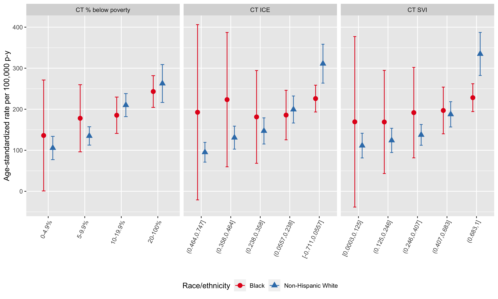

```

To evaluate the magnitude of the CT ABSM inequities **within** racialized group, we present (a) age-standardized rate differences per 100,000 person-years and (b) age-standardized incidence rate ratios in Figure \@ref(fig:agg-absm-byRace). On both the additive (incidence rate difference) and multiplicative scales (incidence rate ratio), ABSM gradients are much steeper among the non-Hispanic white population compared with the Black population. ABSM gradients among the Black population are attenuated towards the null and have much wider confidence limits. 

```{r agg-absm-byRace, echo=FALSE, fig.cap="ABSM gradients in premature mortality by racialized group (Blacks vs. Non-Hispanic whites): age-standardized rate differences per 100,000 person-years (top row) and rate ratios (bottom row) computed using the aggregation method, Greater Boston, 2013-2017. In each plot, the reference group is the most advantaged racialized group-specific ABSM category."}

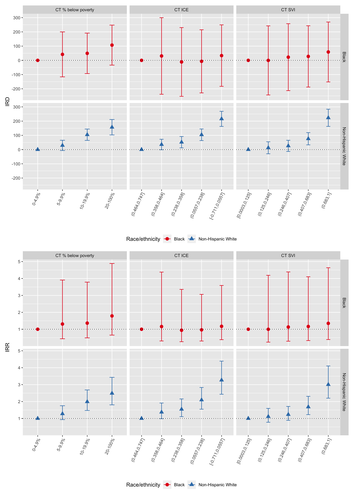

```

Meanwhile, Black/white inequities as depicted in Figure \@ref(fig:agg-race-by-absm) confirm the pattern of Black/white crossover suggested in Figure \@ref(fig:age-std-intersectional), with non-Hispanic white premature mortality rates significantly elevated in the most disadvantaged census tracts by CT Index of Concentration at the Extremes and CT Social Vulnerability Index. 

```{r agg-race-by-absm, echo=FALSE, fig.cap="Black/white inequities in premature mortality by category of CT ABSM: age-standardized rate differences per 100,000 person-years (top row) and rate ratios (bottom row) computed using the aggregation method, Greater Boston, 2013-2017."}

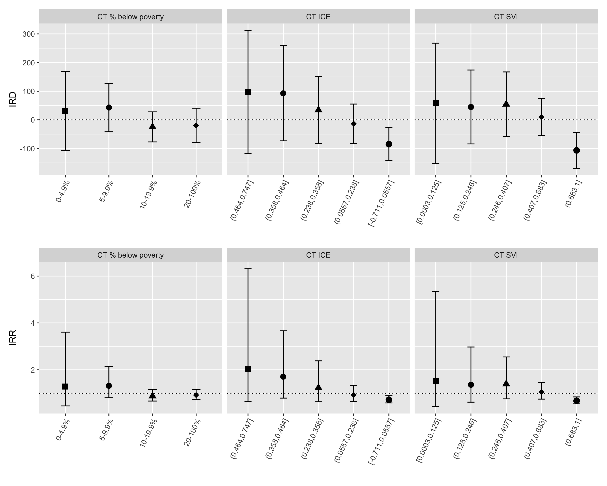

```

We visualize the joint pattern of inequities on the additive (incidence rate difference) and multiplicative (incidence rate ratio) scales relative to a common reference group in Figure \@ref(fig:agg-twoway-irdirr). In general, it gives insights similar to visualization of age-standardized incidence rates by racialized group and CT ABSM in Figure \@ref(fig:age-std-intersectional) above.

```{r agg-twoway-irdirr, echo=FALSE, fig.cap="Intersectional age-standardized incidence rate differences per 100,000 person-years (top row) and age-standardized rate ratios (bottom row) by racialized group and category of CT ABSM computed using the aggregation method, Greater Boston, 2013-2017. Presented with a common reference group (non-Hispanic whites in the most advantaged categories of CT ABSMs"}

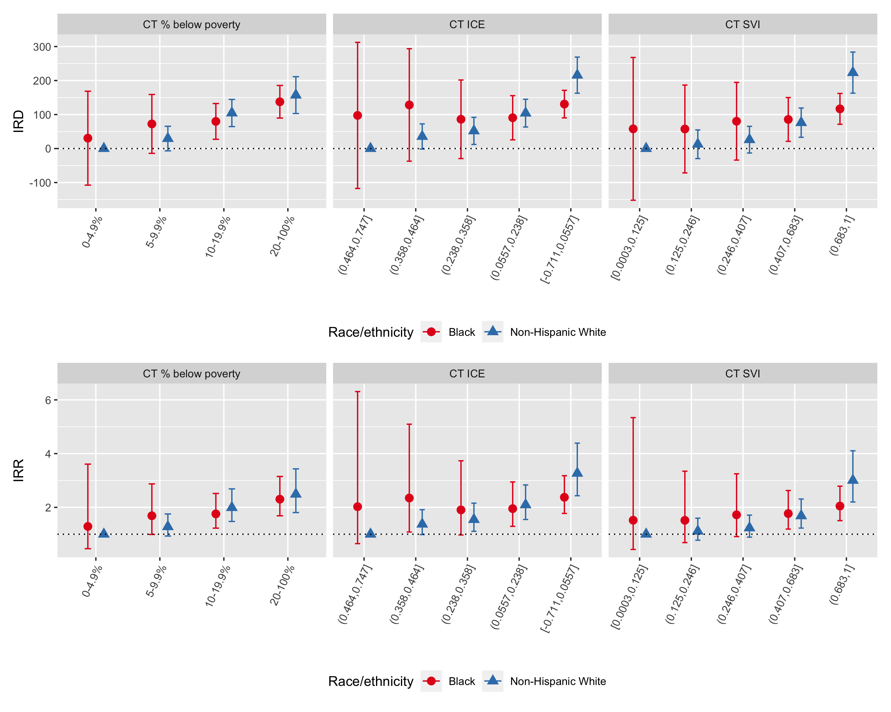

```


### Intersectional inequities as estimated by non-spatial, multilevel, and spatial regression models

Intersectional inequities by racialized group and CT ABSM can also be estimated using regression models. 

```{r, echo=FALSE, fig.cap="Comparison of inequities in premature mortality by racialized group and CT ABSM as estimated by the aggregated method, Poisson regression with robust variance estimator, multilevel Poisson regression (census tracts in city/town/neighborhoods), and spatial Poisson regression with BYM prior, Greater Boston, 2013-2017. Here, we focus on estimated incidence rate ratios with a common reference group (non-Hispanic whites in the most advantaged census tracts)"}

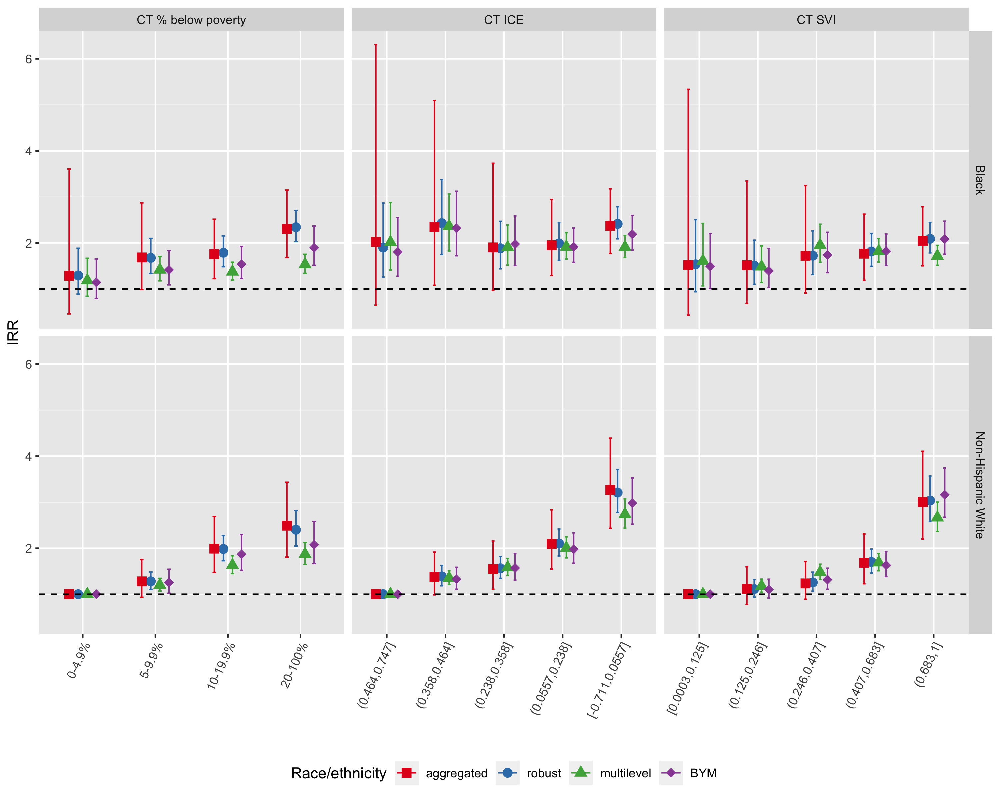

```

```{r tab-interaction-twoway, echo=FALSE, message=FALSE}
interaction_twoway_irr <- read_csv("data/06-analyzing-your-data/interaction_twoway_irr_estimates.csv") %>%
  dplyr::select(-absm) %>%
  mutate(racegroup=ifelse(racegroup=="Non-Hispanic White", "NHW", racegroup))

options(knitr.kable.NA='')
knitr::kable(interaction_twoway_irr, 
             col.names = c("Racialized group", "ABSM", "IRR", "conf.low", "conf.high",
                            "IRR", "conf.low", "conf.high",
                            "IRR", "conf.low", "conf.high",
                            "IRR", "conf.low", "conf.high"),
             digits=c(0, 0, 2, 2, 2,
                      2, 2, 2, 
                      2, 2, 2, 
                      2, 2, 2),
             html=TRUE,
caption = "Comparison of intersectional inequities in premature mortality by 
racialized group and category of CT ABSMs from aggregated analysis, Poisson with robust variance estimator, multilevel, and BYM models. Note the common reference group (non-Hispanic whites in the most advantaged CTs)") %>%
  add_header_above(c(" "=2, "Aggregated" = 3, "Poisson robust" = 3, "Multilevel" = 3, 
                     "BYM" = 3))%>%
  kable_styling(bootstrap_options = c("striped", "hover", "condensed", "responsive")) %>%
  pack_rows("CT % below poverty", 1, 8) %>%
  pack_rows("CT Index of Concentration at the Extremes", 9, 18) %>%
  pack_rows("CT Social Vulnerability Index", 19, 28)

```


```{r absm-byRace, echo=FALSE, fig.cap="Comparison of CT ABSM inequities in premature mortality within racialized group (Black and Non-Hispanic White) as estimated by the aggregated method, Poisson regression with robust variance estimator, multilevel Poisson regression (census tracts in city/town/neighborhoods), and spatial Poisson regression with BYM prior, Greater Boston, 2013-2017. In each plot, the reference group is the most advantaged ABSM category **within** racialized group."}

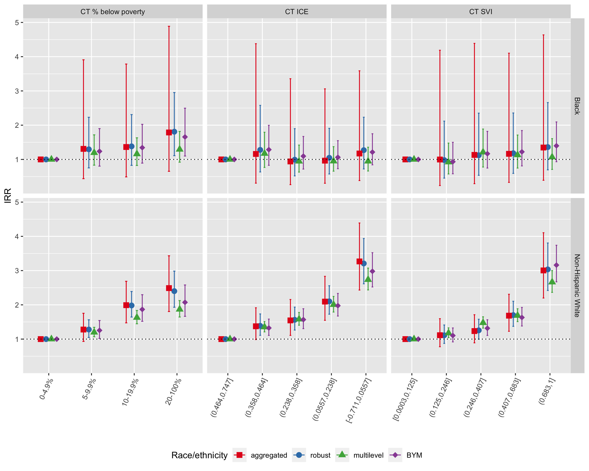

```

As seen in Figure \@ref(fig:absm-byRace), inequities in premature mortality across CT ABSM categories are much more pronounced for the non-Hispanic white population, whereas the gradient in age-adjusted incidence rate ratios for CT ABSM categories within the Black population is much shallower.


```{r bw-byabsm, echo=FALSE, fig.cap="Comparison of Black vs. non-Hispanic white inequities in premature mortality within category of CT ABSM as estimated by the aggregated method, Poisson regression with robust variance estimator, multilevel Poisson regression (census tracts in city/town/neighborhoods), and spatial Poisson regression with BYM prior, Greater Boston, 2013-2017"}

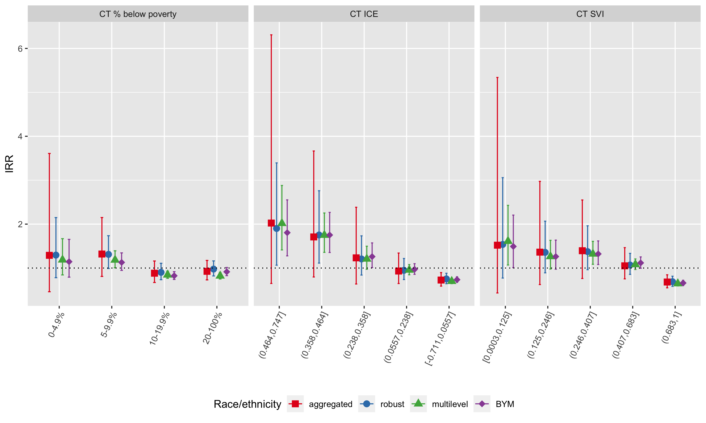

```

As seen in Figure \@ref(fig:bw-byabsm), Black-white inequities as measured by incidence rate ratios are largest in the most advantaged census tracts, whereas inequities by racialized group are smaller or even reversed in the most disadvantaged census tracts. That is, Non-Hispanic Whites living in the most disadvantaged census tracts have higher observed age-adjusted premature mortality rates than Black populations living in the same areas.

Across methods, we note that the confidence limits on age-standardized rates, incidence rate differences, and incidence rate ratios are much wider for the aggregated method compared with model-based estimates. This reflects the impact of age-standardization, whereby age strata with relatively less information may nevertheless contribute strongly to the age-standardized estimates if those age strata are highly weighted in the standard population. The result is that standard errors and confidence limits from the aggregated method will usually be larger than their corresponding model-based estimates. Thus, the aggregated method has less power to detect statistically significant inequities.


## REFERENCES

Banerjee A, Dhillon I, Ghosh J, Merugu S. An information theoretic analysis of maximum likelihood mixture estimation for exponential families. InProceedings of the twenty-first international conference on Machine learning 2004 Jul 4 (p. 8).

Besag J, York J, Mollié A. Bayesian image restoration, with two applications in spatial statistics. Annals of the institute of statistical mathematics. 1991 Mar;43(1):1-20.

Best N, Richardson S, Thomson A. A comparison of Bayesian spatial models for disease mapping. Statistical methods in medical research. 2005 Feb;14(1):35-59.

Clayton D, Kaldor J. Empirical Bayes estimates of age-standardized relative risks for use in disease mapping. Biometrics. 1987 Sep 1:671-81.

Gelman, A. Why I don’t use the term “fixed and random effects.” Post in Statistical Modeling, Causal Inference, and Social Science. 01,25,2005. Available at: https://statmodeling.stat.columbia.edu/2005/01/25/why_i_dont_use/

Jackson JW, Williams DR, VanderWeele TJ. Disparities at the intersection of marginalized groups. Soc Psychiatry Psychiatr Epidemiol. 2016 Oct;51(10):1349-1359. doi: 10.1007/s00127-016-1276-6. Epub 2016 Aug 16. PMID: 27531592; PMCID: PMC5350011.

Knol MJ, VanderWeele TJ. Recommendations for presenting analyses of effect modification and interaction. Int J Epidemiol. 2012 Apr;41(2):514-20. doi: 10.1093/ije/dyr218. Epub 2012 Jan 9. PMID: 22253321; PMCID: PMC3324457.

Krieger N, Waterman PD, Chen JT, Rehkopf DH, Subramanian SV. The Public Health Disparities Geocoding Project Monograph. Available as of June 30, 2004 at: http://www.hsph.harvard.edu/thegeocodingproject

Lawson AB, Browne WJ, Rodeiro CL. Disease mapping with WinBUGS and MLwiN. John Wiley & Sons; 2003 Sep 12.

Nethery RC, Rushovich T, Peterson E, Chen JT, Waterman PD, Krieger N, Waller L, Coull BA. Comparing denominator sources for real-time disease incidence modeling: American Community Survey and WorldPop. SSM-population health. 2021 Jun 1;14:100786.

Newsom, J. Distinguishing Between Random and Fixed: Variables, Effects, and Coefficients. Psy 526 Lecture Material: Multilevel Regression. Spring 2019. Available at: http://www.web.pdx.edu/~newsomj/mlrclass/ho_randfixd.pdf

Pickle LW, White AA. Effects of the choice of age‐adjustment method on maps of death rates. Statistics in medicine. 1995 Mar 15;14(5‐7):615-27.

United States Census Bureau. Population and Housing Estimate Program (PEP). Updated 2022. Available at: https://www.census.gov/programs-surveys/popest.html

VanderWeele TJ. Explanation in Causal Inference: Methods for Mediation and Interaction. New York, NY: Oxford University Press, 2015.

Wakefield JC, Best NG, and Waller L. Bayesian approaches to diseasemapping,  In:  Elliott,  P.,  Wakefield,  J.C.,  Best,  N.G.  and  Briggs,  D.J. SpatialEpidemiology: Methods and Applications, Oxford University Press, London, UK.pp 104–127, 2000.

Wolpert RL, Ickstadt K. Poisson/gamma random field models for spatial statistics. Biometrika. 1998 Jun 1;85(2):251-67.

