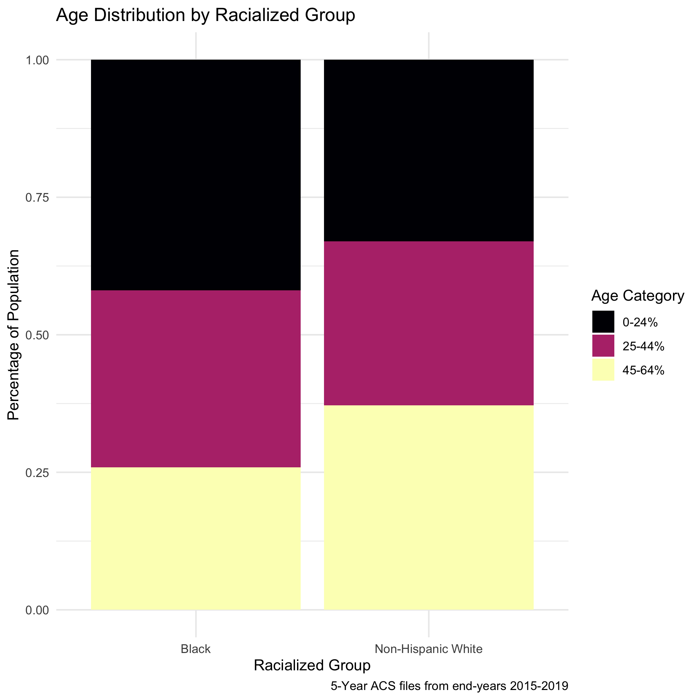

---
  output:
  pdf_document: default
  html_document: default
---
```{r setup, include = FALSE}
library(knitr)
```

# Case Study 1: Premature Mortality in Massachusetts (2013 - 2017) {#premature-mortality}

*By: Justin W. Morgan*

## Introduction

In this case study, the outcome of interest is premature mortality (here defined as death occuring before age 65). This data, which was requested from the [Massachusetts Registry of Vital Records and Statistics](https://www.mass.gov/lists/death-data) is for the years 2013-2017 and is merged with area-based social metrics (ABSMs) created from American Community Survey (ACS) 5-Year Estimates. For more information on how the ACA estimates these metrics from their survey, please visit [thier website]((https://www.census.gov/programs-surveys/acs/methodology/design-and-methodology.html). Vital Statistics registries require data on residential address at time of death, so they can be useful tools for monitoring health and health equity. These data were geocoded using the [Google Maps API](https://developers.google.com/maps).

## Motivation, Research Questions, and Learning Objectives

The goal of this case study is to develop familiarity with methods of exploring and visualizing racial disparities in health data. Our specific goals will be to:

  - Download and merge health outcome and ABSM data
  - Visualize and map estimates of ABSMs and premature mortality
  - Identify the relationships between racialized group, ABSMs, and premature mortality
  - Model the interaction effects between racialized group and ABSM.
 
The research questions we will seek to answer throughout this case study include:
 
1. What is the overall socioeconomic gradient in premature mortality? 
2) What is the racialized disparity in premature mortality?
3) How does ABSM interact with individual level membership in racialized groups? (i.e., interactions between socioeconomic position and racialized groups, not just socioeconomic inequities within racialized groups)

## Downloading and Wrangling Your Data
 
 :::: {.infobox .dataWrangling}
In this section, we will show you how to download ACS data by querying the census API and how to manipulate the data into the format we need for the rest of the analysis. This case study investigates a constructed variable: the Index of Concentration at the Extremes (for high-income Non-Hispanic White people vs low-income people of Color). See if you can replicate the analysis with a different ACS variable!

Note: Our outcome data cannot be shared due to privacy restrictions - for this case study, you will receive a pre-wrangled mortality dataset. Example code for how the wrangling could be done is included in this chapter's appendix.
::::

### Dependencies

You will need these packages throughout our case study:

```{r dependencies, eval = FALSE}

# "mission critical" packages
library(tidyverse)      # A collection of packages used for tidy data wrangling
library(readxl)         # A package for easy loading of Excel files
library(ggplot2)        # The most popular and flexible visualization package in R
library(tidycensus)     # A package to download data from the U.S. Census Bureau API
library(tigris)         # A package to download shapefiles from the U.S. Census Bureau
library(sf)             # A package with tools for simple (spatial) features
library(INLA)           # A package that allows for bayesian inference
inla.setOption(inla.mode = "experimental") # An option to use the experimental (beta version)
library(spdep)          # A package to allow for spatial weighting in analyses

# "nice-to-have" packages
library(cowplot)        # A ggplot2 add-on that will allow us to add sub plots
options(tigris_use_cache = TRUE) # An option within `tigris` to save what you download
library(viridis)        # A package including color-blind friendly color pallettes
library(Hmisc)          # A package containing useful functions for data analyses
library(fastDummies)    # A package that includes functions to create indicator variables
library(mapview)        # For interactive mapping, including topographical mapping
library(purrr)          # A programming toolkit for R
library(scales)         # An add-on package to help with scaling our maps appropriately
library(broom)          # A package that allows for extraction and wrangling of model output

# If this code does not run for you, you may need to run install.package("package_name")
```

### Your Health Outcome Data - Premature Mortality

This data have been aggregated from individual observations into death counts by year, age, sex, racialized group, census tract, and town. When you receive unrestricted mortality files from government agencies for research, you will likely encounter files with one observation per death. After you have geocoded these individual-level observations, you will need to aggregate them up to the geographic level of interest for your analysis. The data we use is also aggregated into groups that correspond to common variables on the ACS, so that they can be aligned to population counts that will be used as denominators as rates are calculated. Aggregation to specific age groups and racial categorizations allows us to perform key aspects of our analysis, such as age-standardization of the data, and stratification of analysis by racialized group.

:::: {.infobox}
NOTE: the variable for town refers to a constructed variable. Ideally when performing an analysis that might include two or more levels, the smaller level (here, census tracts) would be nested entirely within the larger level (towns). In Massachusetts though, there are several towns that have such small populations that they are smaller than census tracts. For these towns, we have created a crosswalk wherein neighboring small towns have been combined to create larger "super towns". These super towns each make up one census tract, so that each super town in the analysis will now have at least one census tract "nested within it" in a multilevel analysis. If you are interested in attempting a multilevel analysis, this data may make good practice!
::::

```{r load mortality, eval = FALSE}
ma_mort_ct <- readRDS("your_file_path/ma_mort_ct.RDS")
```

### Your Denominator Data and ABSM

We download population data (to use as denominators to calculate mortality rates) and ABSMs from the U.S. Census Bureau API using the `tidycensus` package. This requires registering with the Bureau for an API key. The key is redacted here, but you can get your own [from the Bureau](https://api.census.gov/data/key_signup.html). The ABSM we will use for this analysis is the Index of Concentration at the Extremes for Racialized Economic Segregation (ICE), which quantifies how persons in a specified area are concentrated into the top vs bottom of a specified societal distribution. The distribution we will construct is comparing high-income Non-Hispanic White people to low-income people of Color.

```{r wrangling denominators, eval = FALSE}
# Population Denominators
ma_denominator <- vector(mode = "list", length = 5)     # Create an empty list to store our data in
names(ma_denominator) <- c(2013,2014,2015,2016,2017)    # Name the indices of the list for the data years

# The following code creates a loop, and then runs the tidycensus package get_acs() function to draw down population counts for a list of variables (using their Census Bureau designations). You can see the full list of variables at https://api.census.gov/data/2019/acs/acs5/variables.html.

for (nm in names(ma_denominator)) {                   
  ma_denominator[[nm]] <- get_acs(geography = "tract",
                            variables = c("B01001_003","B01001_004","B01001_005","B01001_006",
                                          "B01001_007","B01001_008","B01001_009","B01001_010",
                                          "B01001_011","B01001_012","B01001_013","B01001_014",
                                          "B01001_015","B01001_016","B01001_017","B01001_018",
                                          "B01001_019","B01001_027","B01001_028","B01001_029",
                                          "B01001_030","B01001_031","B01001_032","B01001_033",
                                          "B01001_034","B01001_035","B01001_036","B01001_037",
                                          "B01001_038","B01001_039","B01001_040","B01001_041",
                                          "B01001_042","B01001_043",
                                          "B01001B_003","B01001B_004","B01001B_005",
                                          "B01001B_006","B01001B_007","B01001B_008",
                                          "B01001B_009","B01001B_010","B01001B_011",
                                          "B01001B_012","B01001B_013","B01001B_018",
                                          "B01001B_019","B01001B_020","B01001B_021",
                                          "B01001B_022","B01001B_023","B01001B_024",
                                          "B01001B_025","B01001B_026","B01001B_027",
                                          "B01001B_028",
                                          "B01001H_003","B01001H_004","B01001H_005",
                                          "B01001H_006","B01001H_007","B01001H_008",
                                          "B01001H_009","B01001H_010","B01001H_011",
                                          "B01001H_012","B01001H_013","B01001H_018",
                                          "B01001H_019","B01001H_020","B01001H_021",
                                          "B01001H_022","B01001H_023","B01001H_024",
                                          "B01001H_025","B01001H_026","B01001H_027",
                                          "B01001H_028"), 
                               year = as.numeric(nm) + 2,
                               output = "wide",
                               state = "MA",
                               geometry = FALSE, # you can opt to download spatial information here
                               key = "your_key_here",
                               moe_level = 95,
                               survey = "acs5") %>%
    rowwise() %>%

    # Here, we will transform those variables into variables that align better with our outcome data
    mutate(year = as.numeric(nm),
           GEOID10 = GEOID,
           # Total Male Age Groups
           `total_male_00-04` = B01001_003E,
           `total_male_05-09` = B01001_004E,
           `total_male_10-14` = B01001_005E,
           `total_male_15-19` = B01001_006E + B01001_007E,
           `total_male_20-24` = B01001_008E + B01001_009E + B01001_010E,
           `total_male_25-29` = B01001_011E,
           `total_male_30-34` = B01001_012E,
           `total_male_35-39` = B01001_013E,
           `total_male_40-44` = B01001_014E,
           `total_male_45-49` = B01001_015E,
           `total_male_50-54` = B01001_016E,
           `total_male_55-59` = B01001_017E,
           `total_male_60-64` = B01001_018E + B01001_019E,
           total_male_total  = sum(c_across(starts_with("total_male"))),
           # Total Female Age Groups
           `total_female_00-04` = B01001_027E,
           `total_female_05-09` = B01001_028E,
           `total_female_10-14` = B01001_029E,
           `total_female_15-19` = B01001_030E + B01001_031E,
           `total_female_20-24` = B01001_032E + B01001_033E + B01001_034E,
           `total_female_25-29` = B01001_035E,
           `total_female_30-34` = B01001_036E,
           `total_female_35-39` = B01001_037E,
           `total_female_40-44` = B01001_038E,
           `total_female_45-49` = B01001_039E,
           `total_female_50-54` = B01001_040E,
           `total_female_55-59` = B01001_041E,
           `total_female_60-64` = B01001_042E + B01001_043E,
           total_female_total  = sum(c_across(starts_with("total_female"))),
           total_total_total   = total_male_total + total_female_total,
           # Black Male Age Groups
           `black_male_00-04` = B01001B_003E,
           `black_male_05-09` = B01001B_004E,
           `black_male_10-14` = B01001B_005E,
           `black_male_15-19` = B01001B_006E + B01001B_007E,
           `black_male_20-24` = B01001B_008E,
           `black_male_25-29` = B01001B_009E,
           `black_male_30-34` = B01001B_010E,
           `black_male_35-44` = B01001B_011E,
           `black_male_45-54` = B01001B_012E,
           `black_male_55-64` = B01001B_013E,
           black_male_total  = sum(c_across(starts_with("black_male"))),
           # Black Female Age Groups
           `black_female_00-04` = B01001B_018E,
           `black_female_05-09` = B01001B_019E,
           `black_female_10-14` = B01001B_020E,
           `black_female_15-19` = B01001B_021E + B01001B_022E,
           `black_female_20-24` = B01001B_023E,
           `black_female_25-29` = B01001B_024E,
           `black_female_30-34` = B01001B_025E,
           `black_female_35-44` = B01001B_026E,
           `black_female_45-54` = B01001B_027E,
           `black_female_55-64` = B01001B_028E,
           black_female_total = sum(c_across(starts_with("black_female"))),
           black_total_total = black_male_total + black_female_total,
           # Non-Hispanic White Male Age Groups
           `white_male_00-04` = B01001H_003E,
           `white_male_05-09` = B01001H_004E,
           `white_male_10-14` = B01001H_005E,
           `white_male_15-19` = B01001H_006E + B01001H_007E,
           `white_male_20-24` = B01001H_008E,
           `white_male_25-29` = B01001H_009E,
           `white_male_30-34` = B01001H_010E,
           `white_male_35-44` = B01001H_011E,
           `white_male_45-54` = B01001H_012E,
           `white_male_55-64` = B01001H_013E,
           white_male_total  = sum(c_across(starts_with("white_male"))),
           # Non-Hispanic White Female Age Groups
           `white_female_00-04` = B01001H_018E,
           `white_female_05-09` = B01001H_019E,
           `white_female_10-14` = B01001H_020E,
           `white_female_15-19` = B01001H_021E + B01001H_022E,
           `white_female_20-24` = B01001H_023E,
           `white_female_25-29` = B01001H_024E,
           `white_female_30-34` = B01001H_025E,
           `white_female_35-44` = B01001H_026E,
           `white_female_45-54` = B01001H_027E,
           `white_female_55-64` = B01001H_028E,
           white_female_total = sum(c_across(starts_with("white_female"))),
           white_total_total = white_male_total + white_female_total) %>%
    ungroup() %>%
    select(-starts_with("B0")) %>%
    pivot_longer(cols = c(starts_with("total"),
                          starts_with("black"),
                          starts_with("white")),
                 names_to  = c("race_group", "sex", "age_cat"),
                 names_sep = "_",
                 values_to = "population") %>%
    mutate(age_cat   = case_when(age_cat == "00-04" ~ "0-4",
                                 age_cat == "05-09" ~ "5-9",
                                 age_cat == "total" ~ "Total",
                                 TRUE               ~ age_cat),
           sex       = str_to_title(sex),
           race_group = case_when(race_group == "white"  ~ "Non-Hispanic White",
                                  race_group == "black"  ~ "Black",
                                  race_group == "total"  ~ "Total"))
}           

# Combining all 5 years into one dataset
ma_denominator <- rbind(ma_denominator[[1]],
                     ma_denominator[[2]],
                     ma_denominator[[3]],
                     ma_denominator[[4]],
                     ma_denominator[[5]]) %>%
  select(year, GEOID10, GEO_NAME = NAME, everything(), -GEOID)

# saveRDS(ma_denominator, file = "ma_denominator.RDS")
```

```{r wrangling absm, eval = FALSE}
# Area Based Social Metric
ma_absm <- vector(mode = "list", length = 5)
names(ma_absm) <- c(2013,2014,2015,2016,2017)

for (nm in names(ma_absm)) {
  ma_absm[[nm]] <- get_acs(geography = "tract",
                           variables = c("B01003_001E",
                                         "B19001_001E",
                                         "B19001_002E","B19001_003E","B19001_004E","B19001_005E",
                                         "B19001_014E","B19001_015E","B19001_016E","B19001_017E",
                                         "B19001H_002E","B19001H_003E","B19001H_004E","B19001H_005E",
                                         "B19001H_014E","B19001H_015E","B19001H_016E","B19001H_017E"), 
                           year = as.numeric(nm) + 2,
                           output = "wide",
                           state = "MA",
                           geometry = FALSE,
                           key = "4407a63721e192545e1e2a2fc7f6920477b10108",
                           moe_level = 95,
                           survey = "acs5",
                           cache_table = TRUE) %>%
    # Transforming ACS variables into the ABSM's we want to use for our dataset
    mutate(GEOID10 = GEOID,
           pop_total = B01003_001E,
           ICEwnhinc = ((B19001H_014E + B19001H_015E + B19001H_016E + B19001H_017E) - 
                        (B19001_002E + B19001_003E + B19001_004E + B19001_005E - 
                         B19001H_002E - B19001H_003E - B19001H_004E - B19001H_005E))/B19001_001E,           year = as.numeric(nm)) %>%
    select(GEOID10, pop_total, ICEwnhinc, year)
}

ma_absm <- rbind(ma_absm[[1]],
                 ma_absm[[2]],
                 ma_absm[[3]],
                 ma_absm[[4]],
                 ma_absm[[5]]) %>%
  select(year, GEOID10, everything())

# Weighting the ICE measure across all 5 years for visualization and analysis 
ma_absm_sum <- ma_absm %>% 
  group_by(GEOID10) %>% 
  mutate(wt = pop_total / sum(pop_total, na.rm = TRUE)) %>% 
  summarise(ICEwnhinc        = mean(ICEwnhinc, wt = wt, na.rm = TRUE),
            pop_total        = sum(pop_total, na.rm = TRUE)) %>% 
  mutate(ICE_qt=cut(ICEwnhinc, wtd.quantile(ICEwnhinc, weights=pop_total,
                                                probs=c(0,0.2,0.4,0.6,0.8,1)),
                        na.rm=TRUE))

# saveRDS(ma_absm_sum, file = "ma_absm_sum.RDS")
```

## Approach 

Now that we have our data, let’s revisit our questions of interest:

1. What is the overall socioeconomic gradient in premature mortality? 
2) What is the racialized disparity in premature mortality?
3) How does ABSM interact with individual level membership in racialized groups? (i.e., interactions between socioeconomic position and racialized groups, not just socioeconomic inequities within racialized groups)

Let’s first visualize the overall socioeconomic gradient in premature mortality.

### What is the overall socioeconomic gradient in premature mortality?

Before we try to see how our ABSM might impact premature mortality, let us first assess how the ICE measure is distributed across space in Massachusetts. We can visualize this using a map. In order to map our data, we will need to add geometries to our dataset. We will import a census tract shapefile produced by the government of [Massachusetts](https://www.mass.gov/info-details/massgis-data-municipalities).

```{r importing tract data, eval = FALSE}
tract_geometry <- st_read("CENSUS2010_BLK_BG_TRCT_SHP",
                       layer = "CENSUS2010TRACTS_POLY") %>% 
  mutate(id_order = row_number()) %>% 
  select(GEOID10, id_order)
```

This code adds the census tract geometries to our ICE data, and then creates a map. There are several lines, each referring to a different customization of the map. `ggplot2` has many such options, you can learn more about these [here](https://ggplot2.tidyverse.org/)

```{r map.ice, eval = FALSE}
map.ice <- ma_absm_sum %>% 
  left_join(tract_geometry, by = "GEOID10") %>% 
  ggplot(aes(geometry = geometry, fill=ICE_qt)) +
    geom_sf(col="black", size=0.1) +
    labs(fill="Census Tract ICE", 
         x="", y="", 
         title=expression(atop("Census Tract Level Index of Concentration at the Extremes",
                             "Massachusetts, 5-Year ACS files from end-years 2015-2019"))) +
    scale_fill_brewer(palette="Oranges", direction=-1, na.value="grey50") +
    theme_void() +
    theme(axis.text.x=element_blank(), #remove x axis labels
          axis.ticks.x=element_blank(), #remove x axis ticks
          axis.text.y=element_blank(),  #remove y axis labels
          axis.ticks.y=element_blank(),
          legend.position = c(0.25, 0.25),
          legend.key.size = unit(0.4, "cm"))

# ggsave("your_file_path/map.ice.png")
```

```{r map.ice.png}
#| echo=FALSE
knitr::include_graphics("images/07-premature-mortality/map.ice.png")
```

:::: {.infobox .interpretation}

This map is showing us how the ICE measure is distributed across the state of Massachusetts. This particular iteration of ICE compares high-income Non-Hispanic White people with low-income people of Color. When ICE is low, those neighborhoods are concentrated with low-income people of Color. At 0, there is no extreme concentration (or, alternatively, the polarization is balanced). And when ICE is higher, there is a high concentration of high-income Non-Hispanic White people.

::::

Next, we will visualize our premature mortality data, using spatial models. In order to do this, we will first utilize the indirect method to age-standardize the data. Once we have the data age-standardized we can calculate raw standardized mortality ratios (SMRs). 

```{r age_standardization, eval = FALSE}
# Calculate reference rates by age for MA overall

# This will give us overall totals, and remove the race specific information we arent interested in right now
ma_total_pop <- ma_denominator %>%
                filter(race_group == "Total") 

# This will align the mortality counts with those denominators so we can create total population expected death rates for each age group
reference_rates <- ma_mort_ct %>%
  filter(race_group == "Total",
         sex != "Total",
         age_cat != "Total") %>% 
  group_by(GEOID10, year, sex, age_cat) %>%
  summarise(deaths=n()) %>%
  left_join(ma_total_pop,
             by=c("GEOID10", "year", "sex", "age_cat")) %>%
  mutate(age_cat = case_when(age_cat %in% c("35-39","40-44") ~ "35-44",
                             age_cat %in% c("45-49","50-54") ~ "45-54",
                             age_cat %in% c("55-59","60-64") ~ "55-64",
                             TRUE ~ age_cat),
         deaths = ifelse(is.na(deaths), 0, deaths)) %>%
  group_by(age_cat) %>%
  summarise(num = sum(deaths),
            den = sum(population)) %>%
  mutate(ref_rate = num/den) %>%
  select(age_cat, ref_rate)

ma_mort_istd <- ma_mort_ct %>%
  filter(race_group != "Total",
         sex != "Total",
         age_cat != "Total") %>% 
  mutate(race_group = ifelse(race_group == "Non-Hispanic Black", "Black", race_group)) %>% 
  left_join(ma_denominator, by = c("GEOID10","year","age_cat","race_group","sex")) %>% 
  mutate(age_cat = case_when(age_cat %in% c("35-39","40-44") ~ "35-44",
                             age_cat %in% c("45-49","50-54") ~ "45-54",
                             age_cat %in% c("55-59","60-64") ~ "55-64",
                             TRUE ~ age_cat)) %>%
  group_by(GEOID10, super_town, age_cat) %>% 
  summarise(deaths = sum(deaths, na.rm = TRUE),
            population = sum(population, na.rm = TRUE))%>% 
  right_join(reference_rates, by="age_cat") %>%
  mutate(expected = ref_rate*population) %>%
  group_by(GEOID10, super_town) %>%
  summarise(O = sum(deaths),
            E = sum(expected),
            raw_smr = O/E,
            var_raw_smr = O/E^2,
            raw_smr_lo95 = raw_smr - 1.96*sqrt(var_raw_smr),
            raw_smr_up95 = raw_smr + 1.96*sqrt(var_raw_smr)) %>%
  left_join(ma_absm_sum, by = "GEOID10") %>% 
  mutate(id = row_number()) %>%
  dummy_cols(select_columns = "ICE_qt") %>%
  rename(ICE_qt_1  = "ICE_qt_(-0.689,0.0607]",
         ICE_qt_2  = "ICE_qt_(0.0607,0.245]", 
         ICE_qt_3  = "ICE_qt_(0.245,0.362]",  
         ICE_qt_4  = "ICE_qt_(0.362,0.465]",  
         ICE_qt_5  = "ICE_qt_(0.465,0.727]") 
```

These ratios are susceptible to much of what is discussed in previous chapters with regards to infinity-magnitude rates, and smaller sample sizes inducing extreme results. But as we are going to eventually smooth this data with our model, we are not as concerned here about the state of the raw data. Here we can see our raw standardized mortality ratios extend from zero to infinity.

```{r SMR caterpillar plot, eval = FALSE}
plot.raw_smr <-  ma_mort_istd %>%
  arrange(raw_smr) %>%
  mutate(orderID = row_number()) %>% 
  ggplot(aes(x=orderID, y=raw_smr)) + 
    geom_errorbar(aes(ymin = raw_smr_lo95, ymax=raw_smr_up95), size = 0.1) +
    geom_point(color = "limegreen", alpha = 0.8, size = 0.5) +
    geom_hline(yintercept = 1, col="red", linetype="dotted") +
    ylim(0,4) +
    labs(title = "Raw Standardized Mortality Ratio by Census Tract, with error",
         caption = expression(atop("Source: Massachusetts Mortality Data 2013-2017", 
                                 "5-Year ACS files from end-years 2015-2019"))) +
    xlab("Census Tract") +
    ylab("SMR") +
    theme_minimal()

# ggsave("your_file_path/plot.raw_smr.png")
```

```{r plot.raw_smr.png}
#| echo=FALSE
include_graphics("images/07-premature-mortality/plot.raw_smr.png")
```

:::: {.infobox .interpretation}

The SMR shows us the ratio of mortality in a given census tract compared to what would be expected had that census tract had the same age_specific rates as the standard population. So an SMR greater than 1 means the area premature mortality is higher than expected. An SMR less than one means the opposite.

::::

We can also map out this relationship:

```{r raw_smr_map, eval = FALSE}
# Here you will see code for two maps. This block of code creates one state level map, and then a smaller, Boston area map to accompany it. This optional subsetting provides detail in an area of interest. The cowplot package combines the maps to display both in one space

map.raw_smr_state <- ma_mort_istd %>% 
  left_join(tract_geometry, by= "GEOID10") %>% 
  ggplot() +
  geom_sf(mapping = aes(geometry=geometry, 
                        fill=raw_smr),
          lwd = 0.1) +
    scale_fill_distiller(palette = "BrBG",
                         trans = scales::pseudo_log_trans(sigma=0.01),
                         limits = exp(c(-1,1)*log(4)),
                         breaks = c(0.25,0.5,1,2,4), oob=squish) +
    labs(title = "Raw Standardized Mortality Ratios (SMR)",
         caption = expression(atop("Source: Massachusetts Mortality Data 2013-2017", 
                                   "5-Year ACS files from end-years 2015-2019")),
         fill = "SMR", x="", y="") +
    theme_void() +
    theme(axis.text.x=element_blank(), #remove x axis labels
          axis.ticks.x=element_blank(), #remove x axis ticks
          axis.text.y=element_blank(),  #remove y axis labels
          axis.ticks.y=element_blank(),
          legend.position = c(0.25, 0.25),
          legend.key.size = unit(0.4, "cm"))

map.raw_smr_boston <- ma_mort_istd %>% 
  left_join(tract_geometry, by= "GEOID10") %>% 
  filter(super_town %in% c("boston","brookline","chelsea","cambridge",
                           "everett","hull","malden","medford","newton",
                           "somerville","winthrop","watertown")) %>% 
  ggplot() +
    geom_sf(mapping = aes(geometry = geometry,
                          fill = raw_smr),
            lwd = 0.01) +
    scale_fill_distiller(palette = "BrBG",
                         trans = scales::pseudo_log_trans(sigma=0.01),
                         limits = exp(c(-1,1)*log(4)),
                         breaks = c(0.25,0.5,1,2,4), oob=squish) +
    labs(title = "Boston") +
    theme_void() +
    theme(strip.text.x = element_blank(),
          legend.position = "None",
          plot.title      = element_text(hjust = 0.5)) 

map.raw_smr <- ggdraw() +
  draw_plot(map.raw_smr_state , x = 0.00, y = 0.00, width = 0.80, height = 1.00) +
  draw_plot(map.raw_smr_boston, x = 0.65, y = 0.50, width = 0.30, height = 0.30)

# ggsave("your_file_path/map.raw_smr.png")
```

```{r map.raw_smr.png}
#| echo=FALSE
include_graphics("images/07-premature-mortality/map.raw_smr.png")
```

We can fit a spatial model using the `INLA` package which will “smooth” our results by fitting our data to a Besag York Mollié (BYM) model. As mentioned in previous chapters, a BYM model will adjust estimates based on the surrounding areas - instead of assuming neighboring geographies are independent, the model will assume they are similar. In order to implement this model in R, we first need to create an adjacency matrix, so that the package knows which census tracts are neighbors

```{r inla model, eval = FALSE}
# We first want to make sure that our data file has our geometries in the same order as our shapefile - in other words, ensure that they are aligned. 
ma_mort_istd_ordered <- ma_mort_istd %>% 
  mutate(intercept = 1) %>%
  right_join(tract_geometry, by="GEOID10")%>% 
  arrange(id_order) %>%
  select(-geometry)

n.tracts <- ma_mort_istd_ordered %>% 
  select(GEOID10) %>% 
  unique() %>% 
  nrow()

# THis code will calculate the adjacency matrix 
W.nb <- poly2nb(tract_geometry , snap=0.001)
W.list <- nb2listw(W.nb, style="B", zero.policy = TRUE)

# And this code will convert that matrix into a format INLA can understand
nb2INLA("INLA_adj_mat", W.nb) # this saves a file in the working directory
INLA_adj_mat <- "INLA_adj_mat"

# Intercept only ("null") BYM model 
model_form_0 <- O ~ 1 + f(id_order, model="bym2", graph=INLA_adj_mat, scale.model=TRUE, constr=TRUE)

model_0 <- inla(model_form_0, family="poisson", 
                data=ma_mort_istd_ordered, E=E, # E points to the expected count field
                control.predictor=list(compute=TRUE), # computes transformed posterior marginals
                control.compute=list(dic=TRUE)) # computes DIC for model fit

# Extract posterior (meaning, after the model is accounted for) means of the area effects
null_random <- model_0$summary.random$id_order$mean[1:n.tracts]

# If we are interested in calculating the percentage of the variation that is spatially correlated, we have to do so empirically - if not, you can skip the next few lines. 
mat.marg <- matrix(NA, nrow=n.tracts, ncol=100000) #create empty matrix
m <- model_0$marginals.random$id_order

for (i in 1:n.tracts){
  #the first block of the random effects matrix contains area-specific effects (u + v), 
  #and the second block contains spatially structured residuals (u). 
  #So this is extracting from the second block of rows
  u <- m[[n.tracts+i]] 
  mat.marg[i,] <- inla.rmarginal(100000, u) #randomly pick 100000 values from posterior distributions of area-specific spatially structures residuals
}
#Get empirical variance from 100000 obs
var.u <- apply(mat.marg, 2, var) 

#Get unstructured variance
var.v <- inla.rmarginal(100000,
                        inla.tmarginal(function(x) 1/x, model_0$marginals.hyperpar$`Precision for id_order`))

# Calculate spatially structured variance percentage
perc.var.u <- mean(var.u/(var.u+var.v))

# In addition to computing the spatially structured variance, you can also compute a QR90, comparing the 95th to the 5th quantile of the random effects distribution
qr90 <- exp(diff(quantile(null_random, probs=c(0.05, 0.95))))

# We will append the estimated effects back onto our dataset so that we can plot and map them.
ma_mort_istd_smoothed <- data.frame(data.frame(smooth_smr = null_random,
                                               smooth_smr_lo95 = model_0$summary.random$id_order$`0.025quant`[1:n.tracts],
                                               smooth_smr_up95 = model_0$summary.random$id_order$`0.975quan`[1:n.tracts])) %>%
  mutate(id_order = row_number()) %>%
  right_join(ma_mort_istd_ordered, by="id_order") %>% 
  mutate(raw_smr = log(O/E)+0.046)

```

Note the code above provides code to calculate the percentage of the variance in the data that is spatially correlated - in this case,  about 45%.

We can now visualize our smoothed SMR. First, let's look at a similar caterpillar plot to what we did with the raw SMR. The plot looks slightly flatter, and notably, the infinity and zero values have been pulled more towards the middle of the plot. 

```{r smoothed plot, eval = FALSE}
plot.smr_smooth <- ma_mort_istd_smoothed %>%
  ungroup() %>% 
  arrange(smooth_smr) %>% 
  mutate(orderID = row_number()) %>% 
  ggplot(aes(x=orderID, y=exp(smooth_smr))) + 
    geom_errorbar(aes(ymin = exp(smooth_smr_lo95), ymax=exp(smooth_smr_up95)), size = 0.1) +
    geom_point(color = "limegreen", alpha = 0.8, size = 0.5) +
    geom_hline(yintercept = 1, col="red", linetype="dotted") +
    ylim(0,4) +
    labs(title = "Smoothed Standardized Mortality Ratio by Census Tract",
         caption = "Source: Massachusetts Mortality Data 2013-2017, 5-Year ACS files from end-years 2015-2019") +
    xlab("Census Tract") +
    ylab("Smoothed SMR") +
    theme_minimal()

plot.comp_smr <- plot_grid(plot.raw_smr, plot.smr_smooth,
                           ncol = 2)
# ggsave("your_file_path/plot.comp_smr.png"
```

```{r plot.comp_smr.png}
#| echo=FALSE

```

And in the map, we can see some of the color of extreme values lighten.

```{r smoothed map, eval = FALSE}
map.smooth_smr_state <- ma_mort_istd_smoothed %>% 
  left_join(tract_geometry, by= "GEOID10") %>% 
  ggplot() +
  geom_sf(mapping = aes(geometry=geometry, 
                        fill= exp(smooth_smr)),
          lwd = 0.1) +
    scale_fill_distiller(palette = "BrBG",
                         trans = scales::pseudo_log_trans(sigma=0.01),
                         limits = exp(c(-1.01,1)*log(4)),
                         breaks=c(0.25,0.5,1,2,4), oob=squish) +
    labs(title = "Smoothed Standardized Mortality Ratios (SMR)",
         caption = expression(atop("Source: Massachusetts Mortality Data 2013-2017", 
                                   "5-Year ACS files from end-years 2015-2019")),
         fill = "Smoothed SMR", x="", y="") +
    theme_void() +
    theme(axis.text.x=element_blank(), #remove x axis labels
          axis.ticks.x=element_blank(), #remove x axis ticks
          axis.text.y=element_blank(),  #remove y axis labels
          axis.ticks.y=element_blank(),
          legend.position = c(0.25, 0.25),
          legend.key.size = unit(0.4, "cm"))

map.smooth_smr_boston <- ma_mort_istd_smoothed %>% 
  left_join(tract_geometry, by= "GEOID10") %>% 
  filter(super_town %in% c("boston","brookline","chelsea","cambridge",
                           "everett","hull","malden","medford","newton",
                           "somerville","winthrop","watertown")) %>% 
  ggplot() +
    geom_sf(mapping = aes(geometry = geometry,
                          fill = exp(smooth_smr)),
            lwd = 0.1) +
    scale_fill_distiller(palette = "BrBG",
                         trans = scales::pseudo_log_trans(sigma=0.01),
                         limits = exp(c(-1.01,1)*log(4)),
                         breaks=c(0.25,0.5,1,2,4), oob=squish) +
    labs(title = "Boston") +
    theme_void() +
    theme(strip.text.x = element_blank(),
          legend.position = "None",
          plot.title      = element_text(hjust = 0.5)) 

map.smooth_smr <- ggdraw() +
  draw_plot(map.smooth_smr_state , x = 0.00, y = 0.00, width = 0.80, height = 1.00) +
  draw_plot(map.smooth_smr_boston, x = 0.65, y = 0.50, width = 0.30, height = 0.30)

map.comp_smr <- plot_grid(map.raw_smr, map.smooth_smr,
                           ncol = 2)

# ggsave("your_file_path/map.comp_smr.png")
```

```{r map.comp_smr.png}
#| echo=FALSE
include_graphics("images/07-premature-mortality/map.comp_smr.png")
```

We can see from the plot and the map that while there is still variation in the spatially smoothed SMR - it is a bit less extreme in some areas than the raw SMR. To get a sense of how premature mortality varies with respect to ICE, we should look at a model that adjusts for our ICE data and see if there are any changes in variation. 

```{r adjusted smr model, eval = FALSE}
#Code to include our ABSM
model_form_1 <- O ~ 1 + f(id_order, model='bym2', graph=INLA_adj_mat, scale.model=TRUE, constr=TRUE) + ICE_qt_2 + ICE_qt_3 + ICE_qt_4 + ICE_qt_5 + ICE_qt_NA

model_1 <- inla(model_form_1, family="poisson",
                data = ma_mort_istd_ordered,
                E=E, # E points to the expected count field
                control.predictor = list(compute=TRUE), # computes transformed posterior marginals
                control.compute   = list(dic=TRUE)) # computes DIC for model fit

# We can use this code to extract results of the model
fixed_results <- model_1$summary.fixed 
dic_results <- summary(model_1$dic$dic)

# the first block of the summary.random output are the area effects (u + v)
random_results <- model_1$summary.random$id_order$mean[1:n.tracts]

# and this code pulls out the residual results after adjusting for ICE
risk_residuals <- data.frame(ice_residuals = random_results) %>%
  mutate(id_order = row_number())

# append to dataset of other model effects
ma_mort_istd_adj <- ma_mort_istd_smoothed %>% 
  left_join(risk_residuals, by="id_order")

# Visualize map after adjusting for ICE
map.adj_smr_state <- ma_mort_istd_adj %>% 
  left_join(tract_geometry, by= c("GEOID10","id_order")) %>% 
  ggplot() +
  geom_sf(mapping = aes(geometry = geometry, 
                        fill     = exp(ice_residuals)),
          lwd = 0.1) +
    scale_fill_distiller(palette = "BrBG",
                         trans = scales::pseudo_log_trans(sigma=0.01),
                         limits = exp(c(-1.01,1)*log(4)),
                         breaks=c(0.25,0.5,1,2,4), oob=squish) +
  labs(title = "Residual Standardized Mortality Ratios after adjusting for ICE",
       caption = expression(atop("Source: Massachusetts Mortality Data 2013-2017", 
                                 "5-Year ACS files from end-years 2015-2019",
                                 "National Air Toxin Assessment, 2017")),
       fill = "Adjusted SMR", x="", y="") +
  theme_void() +
  theme(axis.text.x=element_blank(), #remove x axis labels
        axis.ticks.x=element_blank(), #remove x axis ticks
        axis.text.y=element_blank(),  #remove y axis labels
        axis.ticks.y=element_blank(),
        legend.position = c(0.25, 0.25),
        legend.key.size = unit(0.4, "cm"))

map.adj_smr_boston <- ma_mort_istd_adj %>% 
  left_join(tract_geometry, by= c("GEOID10","id_order")) %>% 
  filter(super_town %in% c("boston","brookline","chelsea","cambridge",
                           "everett","hull","malden","medford","newton",
                           "somerville","winthrop","watertown")) %>% 
  ggplot() +
    geom_sf(mapping = aes(geometry = geometry,
                          fill = exp(ice_residuals)),
            lwd = 0.1) +
    scale_fill_distiller(palette = "BrBG",
                         trans = scales::pseudo_log_trans(sigma=0.01),
                         limits = exp(c(-1.01,1)*log(4)),
                         breaks=c(0.25,0.5,1,2,4), oob=squish) +
    labs(title = "Boston") +
    theme_void() +
    theme(strip.text.x = element_blank(),
          legend.position = "None",
          plot.title      = element_text(hjust = 0.5)) 

map.adj_smr <- ggdraw() +
  draw_plot(map.adj_smr_state , x = 0.00, y = 0.00, width = 0.80, height = 1.00) +
  draw_plot(map.adj_smr_boston, x = 0.65, y = 0.50, width = 0.30, height = 0.30)

# ggsave("your_file_path/map.adj_smr.png")

map.comp_smr2 <- plot_grid(map.smooth_smr, map.adj_smr,
                           ncol = 2)

# ggsave("your_file_path/map.comp_smr2.png")

```

```{r map.comp_smr2.png}
#| echo=FALSE
include_graphics("images/07-premature-mortality/map.comp_smr2.png")
```

:::: {.infobox .interpretation}

Comparing the map adjusted for the ICE measure to the smoothed map reveals that concentration of polarized racial-economic populations did contribute to some of the impact. This is most clearly seen in the less pronounced SMRs (in both directions) after adjusting for ICE in areas of southern Boston.

::::

### What is the racialized disparity in premature mortality overall?

We can describe inequities by racialized groups much the same way we describe inequities in ABSM - by aggregating death and population data. We already have these aggregated - now we can stratify our analysis to compare the White Non-Hispanic and Black populations. Throughout the example we may refer to these groups as White and Black as a shorthand. 

:::: {.infobox}

NOTE: You may have noticed that the description of the White population includes a "Non-Hispanic" designation, while the description of the Black population does not. This is a quirk of the ACS data - population counts are not readily available for the Black Non-Hispanic population. There is thus a slight mismatch in in the numerator from the mortality data (Non-Hispanic Black deaths) and denominator (Black population).

::::

We will need to age-adjust our data here, as differences in premature mortality may be due to differential distribution of ages by racialized group seen here:

```{r age tabulation by race, eval = FALSE}
tab_age_race <- ma_denominator %>%
      filter(race_group %in% c("Non-Hispanic White","Black"),
         sex != "Total",
         age_cat != "Total") %>% 
  group_by(GEOID10, race_group, sex, age_cat) %>% 
  summarise(pop = sum(population, na.rm=T)) %>%
  inner_join(ma_absm_sum, by = c("GEOID10")) %>% 
  mutate(age_cat_broad = case_when(age_cat %in% c("0-4","5-9","10-14","15-19","20-24") ~ "0-24%",
                                   age_cat %in% c("25-29","30-34","35-39","35-44","40-44") ~ "25-44%",
                                   age_cat %in% c("45-49","45-54","50-54","55-59","55-64","60-64") ~ "45-64%")) %>%
  group_by(race_group, age_cat_broad) %>%
  summarise(pop = sum(pop, na.rm=T)) %>%
  group_by(race_group) %>%
  mutate(percentage = pop/sum(pop)) %>% 
  ggplot(aes(x=race_group, y=percentage, fill= age_cat_broad)) +
    geom_bar(position="stack", stat="identity") +
    scale_fill_viridis_d(option = "A") +
    labs(title ="Age Distribution by Racialized Group",
         fill = "Age Category",
         caption = "5-Year ACS files from end-years 2015-2019") +
    ylab("Percentage of Population") +
    xlab("Racialized Group") +
    theme(legend.position="bottom") +
    theme_minimal()
    
# ggsave("your_file_path/tab_age_race.png")
```

```{r tab_age_race.png}
#| echo=FALSE

```

We will, in this case, do a direct age adjustment to get standardized mortality ratios. This will require a reference population, which we have downloaded (and wrangled) from the National Cancer Institute (https://seer.cancer.gov/stdpopulations/). This is preferential to indirect age standardization, as the Non-Hispanic White population would drive the expected rates using that method.

```{r SEER data, eval = FALSE}
seer_std <- readRDS("data/07-premature-mortality/seer_std.RDS")
```

Let’s now age adjust our aggregated data by racialized group so we can compare standardized mortality rates.

```{r direct age standardization, eval = FALSE}
ma_mort_dstd <- ma_mort_ct %>%
  mutate(race_group = case_when(race_group == "Non-Hispanic Black" ~ "Black",
                                TRUE ~ race_group)) %>% 
  inner_join(ma_denominator, by = c("year","GEOID10","race_group","sex","age_cat")) %>%
  filter(race_group %in% c("Non-Hispanic White","Black"),
         age_cat != "Total") %>% 
  group_by(GEOID10,super_town, race_group, age_cat) %>% 
  summarise(num = sum(deaths, na.rm=T),
            den = sum(population, na.rm=T))%>%
  mutate(den = ifelse(den == 0, num, den)) %>% # this line takes areas with population counts as zero, and provides the count as the number of deaths. This is an approach to resolve when population data does not align with the outcome data
  left_join(seer_std, by="age_cat") %>%
  mutate(rate_i = wt*num/den,
         var_rate_i = (num*wt^2)/den^2) %>%
  group_by(GEOID10, super_town, race_group) %>%
  summarise(num = sum(num, na.rm=T),
            den = sum(den, na.rm=T),
            std_rate = sum(rate_i, na.rm=T),
            var_std_rate = sum(var_rate_i, na.rm=T),
            sumwt = sum(wt),
            sumwt2 = sum(wt^2)) %>%
  mutate(std_rate = std_rate / sumwt *1000,
         var_std_rate = var_std_rate / sumwt2 *1000,
         std_rate_lo95 = std_rate - 1.96*sqrt(var_std_rate),
         std_rate_up95 = std_rate + 1.96*sqrt(var_std_rate)) %>%
  ungroup()

 plot.agg_rates <- ma_mort_dstd %>% 
  filter(!is.na(std_rate)) %>% 
  select(GEOID10,race_group, contains("std_rate")) %>% 
  arrange(std_rate) %>% 
  group_by(race_group) %>% 
  mutate(orderID = row_number()) %>%
  ungroup() %>% 
  ggplot(aes(x=orderID, y=std_rate)) + 
    geom_errorbar(aes(ymin = std_rate_lo95, ymax=std_rate_up95), size = 0.1) +
    geom_point(color = "limegreen", alpha = 0.8, size = 1) +
    labs(title = "Age-Standardized Premature Mortality Rate",
         caption = expression(atop("Source: Massachusetts Mortality Data 2013-2017", 
                                   "5-Year ACS files from end-years 2015-2019"))) +
    xlab("Census Tracts") +
    ylab("Mortality Rates per 1000") +
    facet_wrap(vars(race_group), ncol = 2, scales = "free_x") +
    theme_minimal() +
    theme(axis.ticks.x = element_blank(), 
          axis.text.x = element_blank())

# ggsave("your_file_path/plot.agg_rates.png")
```

```{r plot.agg_rates.png}
#| echo=FALSE
include_graphics("images/07-premature-mortality/plot.agg_rates.png")
```

As mortality rates increase, there also seems to be an increase in the variance of the estimates. This is because the more extreme rates we are seeing are really a product of having very small sample sizes in some districts. We can see that demonstrated by ordering the results by the population size of the census tract.

```{r rates by size, eval = FALSE}
ordered.agg_rates <- ma_mort_dstd %>% 
  filter(!is.na(std_rate)) %>% 
  select(GEOID10, race_group, contains("std_rate"), den) %>% 
  ggplot(aes(x=den, y=std_rate)) + 
    geom_point(color = "limegreen", alpha = 0.8, size = 1) +
    geom_errorbar(aes(ymin = std_rate_lo95, ymax=std_rate_up95), size = 0.1) +
    labs(title = "Age-Standardized Premature Mortality Rate",
         caption = expression(atop("Source: Massachusetts Mortality Data 2013-2017", 
                                   "5-Year ACS files from end-years 2015-2019"))) +
         xlab("Size of Census Tract") +
         ylab("Mortality Rates") +
    facet_wrap(vars(race_group), ncol = 2, scales = "free_x") +
    theme_minimal() 

# ggsave("your_file_path/ordered.agg_rates.png")
```

```{r ordered.agg_rates.png}
#| echo=FALSE
include_graphics("images/07-premature-mortality/ordered.agg_rates.png")
```

As we might expect, these extremely variable mortality rates are occurring in smaller populations. What do these maps look like?

```{r maps by race, eval = FALSE}
plotlist <- vector(mode = "list", length = 2)
names(plotlist) <- c("Non-Hispanic White","Black")
for (plt in names(plotlist)) { # This loop allows us to make the same map twice, one for Non-Hispanic White, and one for Black

  map.state <- ma_mort_dstd %>% 
    filter(race_group == plt) %>%
    mutate(std_rate = ifelse(std_rate > 10, 10, std_rate)) %>% 
    left_join(tract_geometry, by= "GEOID10") %>% 
    ggplot() +
      geom_sf(mapping = aes(geometry = geometry,
                            fill = std_rate),
              lwd = 0) +
      scale_fill_distiller(palette = 'Blues', direction = 1, limits = c(0, 10)) + 
      labs(title = plt,
           fill = "Age Standardized Mortality Rate", x="", y="") +
      theme_void() +
      theme(axis.text.x=element_blank(), #remove x axis labels
            axis.ticks.x=element_blank(), #remove x axis ticks
            axis.text.y=element_blank(),  #remove y axis labels
            axis.ticks.y=element_blank(),
            legend.position = c(0.25, 0.25),
            legend.key.size = unit(0.2, "cm"))
  
  map.boston <- ma_mort_dstd %>% 
    filter(race_group == plt,
           super_town %in% c("boston","brookline","chelsea","cambridge",
                           "everett","hull","malden","medford","newton",
                           "somerville","winthrop","watertown")) %>% 
    mutate(std_rate = ifelse(std_rate > 10, 10, std_rate)) %>% 
    left_join(tract_geometry, by= "GEOID10") %>% 
    ggplot() +
      geom_sf(mapping = aes(geometry = geometry,
                            fill = std_rate),
              lwd = 0) +
      scale_fill_distiller(palette = 'Blues', direction = 1, limits = c(0, 10)) + 
      labs(title = "Boston") +
      theme_void() + 
      theme(strip.text.x = element_blank(),
            legend.position = "None",
            plot.title      = element_text(hjust = 0.5)) 
  
  plotlist[[plt]] <- ggdraw() +
    draw_plot(map.state , x = 0.00, y = 0.00, width = 0.80, height = 1.00) +
    draw_plot(map.boston, x = 0.65, y = 0.50, width = 0.30, height = 0.30)
  
}

title <- ggdraw() +
  draw_label("Age Standardized Mortality Rates", size = 12, fontface='bold', hjust = 0.2)
caption1 <- ggdraw() +
  draw_label("Source: Massachusetts Mortality Data 2013-2017", size = 8, hjust = 0.5) 
caption2 <- ggdraw() +
  draw_label("5-Year ACS files from end-years 2015-2019", size = 8, hjust = 0.5) 

byrace_std_rates <- plot_grid(plotlist = plotlist,
                              ncol = 2)

# ggsave("your_file_path/byrace_std_rates.png")
```

```{r byrace_std_rates.png}
#| echo=FALSE
include_graphics("images/07-premature-mortality/byrace_std_rates.png")
```

We are seeing some really high rates in more census tracts in the Black population, where we have smaller overall sample sizes. We are also seeing many census tracts with no black population. We can also display these two maps as one, by calculating the Rate Difference, or the Rate Ratio. Here we will show the crude Rate Ratio of the Age Standardized rates. Key to interpreting this map is understanding that these rates are influenced by the small sample sizes and large potential errors we have previously visualized. It's for researchers and communities to interpret how "real" the effects we see here are.

```{r irr data, eval = FALSE}
irr_data <- ma_mort_dstd %>% 
  select(GEOID10,super_town,race_group, std_rate, var_std_rate) %>% 
  pivot_wider(id_cols = c(GEOID10,super_town),
              names_from = race_group,
              values_from = c(std_rate, var_std_rate)) %>% 
  mutate(irr = ifelse(`std_rate_Non-Hispanic White` == 0, NA_real_, `std_rate_Black` / `std_rate_Non-Hispanic White`),
         irr_var = `var_std_rate_Black` + `var_std_rate_Non-Hispanic White`,
         irr_lo95 = irr - 1.96*sqrt(irr_var),
         irr_up95 = irr + 1.96*sqrt(irr_var)) 

irr_plot <- irr_data %>% 
  arrange(irr) %>% 
  mutate(orderID = row_number()) %>%
  ungroup() %>% 
  ggplot(aes(x=orderID, y=irr)) + 
    geom_point(color = "limegreen", alpha = 0.8, size = 1) +
    geom_errorbar(aes(ymin = irr_lo95, ymax=irr_up95), size = 0.1) +
    labs(title = expression(atop("Incidence Rate Ratio Comparing Black", 
                                 "and Non Hispanic White Populations")),
         caption = expression(atop("Source: Massachusetts Mortality Data 2013-2017",
                                   "5-Year ACS files from end-years 2015-2019"))) +
         xlab("Census Tracts") +
         ylab("IRR") +
    theme_minimal() 
  
# ggsave("your_file_path/irr_plot.png")
```

When we map the IRR, we can see the crude rate ratio between Black and Non-Hispanic White populations:

```{r, eval = FALSE}
map.state.irr <- irr_data %>% 
  mutate(irr = case_when(irr > 4  ~ 4,
                         std_rate_Black == 0 ~ NA_real_, # Setting as missing any areas with no black deaths
                         TRUE     ~ irr)) %>% 
  left_join(tract_geometry, by= "GEOID10") %>% 
  ggplot() +
    geom_sf(mapping = aes(geometry = geometry,
                          fill = irr),
            lwd = 0.1) +
    scale_fill_distiller(palette = "BrBG",
                         trans = scales::pseudo_log_trans(sigma=0.01),
                         limits = exp(c(-1,1)*log(4)),
                         breaks = c(0.25,0.5,1,2,4), oob=squish,
                         na.value = "grey") +
    labs(title = expression(atop("Incidence Rate Ratio Comparing Non-Hispanic Black", 
                                 "and Non Hispanic White Populations")),
         caption = expression(atop("Source: Massachusetts Mortality Data 2013-2017",
                                   "5-Year ACS files from end-years 2015-2019")),
         fill = "IRR", x="", y="") +
    theme_void() +
    theme(legend.position = c(0.25, 0.25),
          legend.key.size = unit(0.3, "cm"),
          plot.title      = element_text(hjust = 0.1),
          plot.subtitle   = element_text(hjust = 0.1))

map.boston.irr <- irr_data %>% 
  filter(super_town %in% c("boston","brookline","chelsea","cambridge",
                           "everett","hull","malden","medford","newton",
                           "somerville","winthrop","watertown")) %>% 
  mutate(irr = case_when(irr > 4  ~ 4,
                         std_rate_Black == 0 ~ NA_real_,
                         TRUE     ~ irr)) %>% 
  left_join(tract_geometry, by= "GEOID10") %>% 
  ggplot() +
    geom_sf(mapping = aes(geometry = geometry,
                          fill = irr),
            lwd = 0.1) +
    scale_fill_distiller(palette = "BrBG",
                         trans = scales::pseudo_log_trans(sigma=0.01),
                         limits = exp(c(-1,1)*log(4)),
                         breaks = c(0.25,0.5,1,2,4), oob=squish,
                         na.value = "grey") +
    labs(title = "Boston") +
    theme_void() + 
    theme(strip.text.x = element_blank(),
          legend.position = "None",
          plot.title      = element_text(hjust = 0.5)) 

map.irr <- ggdraw() +
  draw_plot(map.state.irr , x = 0.00, y = 0.05, width = 0.80, height = 1.00) +
  draw_plot(map.boston.irr, x = 0.65, y = 0.55, width = 0.30, height = 0.30)

#ggsave("your_file_path/map.irr.png")
```

So we can see from this crude map that, in areas where there were Black deaths, there was some variation in the IRR, and some very high, concerning IRR values.

```{r map.irr.png}
#| echo=FALSE
include_graphics("images/07-premature-mortality/map.irr.png")
```

### What are the associations with ABSM by racialized group? 

In order to visualize differences in how our ABSM - ICE - interacts with racialized group, we can use a poisson model for the mortality rates, and include an interaction term between racialized group and poverty. We can plot this using `INLA' again or alternatively use a generalized linear model function. We will have to recreate our indirect standardization - this time by race, in order to include both variables in the model.

```{r indirect standard by race, eval = FALSE}
# Indirect standardization to prepare the data for spatial models
ma_mort_istd_byrace <- ma_mort_ct %>%
  filter(race_group != "Total",
         sex != "Total",
         age_cat != "Total") %>% 
  mutate(race_group = ifelse(race_group == "Non-Hispanic Black", "Black", race_group)) %>% 
  filter(race_group %in% c("Non-Hispanic White","Black")) %>% 
  left_join(ma_denominator, by = c("GEOID10","year","age_cat","race_group","sex")) %>% 
  mutate(age_cat = case_when(age_cat %in% c("35-39","40-44") ~ "35-44",
                             age_cat %in% c("45-49","50-54") ~ "45-54",
                             age_cat %in% c("55-59","60-64") ~ "55-64",
                             TRUE ~ age_cat)) %>%
  group_by(GEOID10, super_town, age_cat, race_group) %>% 
  summarise(deaths = sum(deaths, na.rm = TRUE),
            population = sum(population, na.rm = TRUE))%>% 
  right_join(reference_rates, by="age_cat") %>%
  mutate(expected = ref_rate*population) %>%
  group_by(GEOID10, super_town, race_group) %>%
  summarise(O = sum(deaths),
            E = sum(expected),
            raw_smr = O/E,
            var_raw_smr = O/E^2,
            raw_smr_lo95 = raw_smr - 1.96*sqrt(var_raw_smr),
            raw_smr_up95 = raw_smr + 1.96*sqrt(var_raw_smr)) %>%
  left_join(ma_absm_sum, by = "GEOID10") %>% 
  mutate(id = row_number()) %>%
  fastDummies::dummy_cols(select_columns= "ICE_qt") %>%
  rename(ICE_qt_1  = "ICE_qt_(-0.689,0.0607]",
         ICE_qt_2  = "ICE_qt_(0.0607,0.245]", 
         ICE_qt_3  = "ICE_qt_(0.245,0.362]",  
         ICE_qt_4  = "ICE_qt_(0.362,0.465]",  
         ICE_qt_5  = "ICE_qt_(0.465,0.727]") 
```

```{r ordering the data, eval = FALSE}
# Make sure that the data file has areas in the same order as the shape file
ma_mort_istd_byrace_ordered <- ma_mort_istd_byrace %>% 
  filter(!(O == 0 & E == 0)) %>% 
  mutate(intercept = 1) %>%
  left_join(tract_geometry, by="GEOID10") %>%
  select(-geometry) %>% 
  arrange(id_order) %>%
  mutate(race_group = factor(race_group, levels = c("Non-Hispanic White", "Black")),
         ICE_qt = factor(ICE_qt, levels=c("(0.465,0.727]",
                                          "(0.362,0.465]",
                                          "(0.245,0.362]",
                                          "(0.0607,0.245]",
                                          "(-0.689,0.0607]")))
```

```{r interaction model, eval = FALSE}
# BYM model with ICE-race interaction
model_form_2 <- O ~ 1 + f(id_order, model='bym2', graph=INLA_adj_mat, scale.model=TRUE, constr=TRUE) + factor(race_group)*factor(ICE_qt)

#The following code outlines the linear combinations our model will make, so that we can calculate intersectional inequities

linear_combinations <- inla.make.lincombs(
"factor(race_group)Black"                       = c(1,1,1,1,0,0,0,0,1,1,1,1),
"factor(ICE_qt)(0.362,0.465]"                   = c(0,0,0,0,1,0,0,0,1,0,0,0),
"factor(ICE_qt)(0.245,0.362]"                   = c(0,0,0,0,0,1,0,0,0,1,0,0),  
"factor(ICE_qt)(0.0607,0.245]"                  = c(0,0,0,0,0,0,1,0,0,0,1,0),
"factor(ICE_qt)(-0.689,0.0607]"                 = c(0,0,0,0,0,0,0,1,0,0,0,1),
"factor(race_group)Black:factor(ICE_qt)(0.362,0.465]"   = c(1,0,0,0,1,0,0,0,1,0,0,0),
"factor(race_group)Black:factor(ICE_qt)(0.245,0.362]"   = c(0,1,0,0,0,1,0,0,0,1,0,0),
"factor(race_group)Black:factor(ICE_qt)(0.0607,0.245]"  = c(0,0,1,0,0,0,1,0,0,0,1,0),
"factor(race_group)Black:factor(ICE_qt)(-0.689,0.0607]" = c(0,0,0,1,0,0,0,1,0,0,0,1))

model_results_lc <- inla(model_form_2, 
                         family="poisson",
                         data=ma_mort_istd_byrace_ordered, E=E, 
                         control.predictor=list(compute=TRUE), 
                         control.compute=list(dic=TRUE, waic=TRUE),
                         lincomb = linear_combinations)

# Function to extract the fixed results
tidy.inla.fixed <- function(x){
  # x = model_inla
  term_names <- rownames(x$summary.fixed)

  tibble::as_tibble(x$summary.fixed) %>%
    dplyr::mutate(terms = term_names) %>%
    dplyr::rename(term = terms,
                  estimate = mean,
                  conf.low = `0.025quant`, 
                  conf.high = `0.975quant`) %>%
    dplyr::select(term, estimate,
                  conf.low, conf.high)
}

# Function to extract the linear combinations
tidy.inla.lc <- function(x){
  # x = model_inla
  term_names <- rownames(x$summary.lincomb.derived)

  tibble::as_tibble(x$summary.lincomb.derived) %>%
    dplyr::mutate(terms = term_names) %>%
    dplyr::rename(term = terms,
                  estimate = mean,
                  conf.low = `0.025quant`, 
                  conf.high = `0.975quant`) %>%
    dplyr::select(term, estimate,
                  conf.low, conf.high)
}

tidy_fixed_results <- tidy.inla.fixed(model_results_lc) %>%
  filter(!term=="(Intercept)" & !stringr::str_detect(term, ":")) %>%
  separate(col=term, into=c("pre1", "term"), sep='\\)') %>%
  select(-pre1) %>%
  mutate(race_group = case_when(term=="Black" ~ "Black",
                                TRUE ~ "Non-Hispanic White"),
         qval = case_when(!term=="Black" ~ term),
         which = case_when(term=="Black" ~ "byICE_qt",
                           TRUE ~ "byRace"),
         twoway = case_when(term=="Black" ~ 1,
                            TRUE ~ 1))

tidy_lc_results <-  tidy.inla.lc(model_results_lc) %>% 
  mutate(race_group = "Black",
         qval = factor(case_when(term %in% c("lc01", "lc05", "lc09") ~ "(0.362,0.465]",
                                 term %in% c("lc02", "lc06", "lc10") ~ "(0.245,0.362]",
                                 term %in% c("lc03", "lc07", "lc11") ~ "(0.0607,0.245]",
                                 term %in% c("lc04", "lc08", "lc12") ~ "(-0.689,0.0607]"),
                       levels=levels(ma_mort_istd_byrace_ordered$ICE_qt)),
         which = factor(case_when(term %in% c("lc01", "lc02", "lc03", "lc04") ~ "byICE_qt",
                                  term %in% c("lc05", "lc06", "lc07", "lc08") ~ "byRace")),
         twoway = case_when(term %in% c("lc09", "lc10", "lc11", "lc12") ~ 1 ,
                            TRUE ~ 0))

interaction_effects_bym <- bind_rows(tidy_fixed_results, tidy_lc_results) %>%
  arrange(which, race_group, qval) %>%
  mutate(qval = ifelse(is.na(qval),"(0.465,0.727]",qval)) %>% 
  select(-term)
```

We can look at some of these results in plots, to get a sense of the way that ICE is interacting with race to impact mortality in Massachusetts.

```{r interaction plots, eval = FALSE}
# Plot black/white disparities within ICE categories
race_effect_within_ICEqt <- interaction_effects_bym %>%
  filter(which == "byICE_qt") %>% 
  ggplot(aes(x=qval, 
             y=exp(estimate), 
             ymin=exp(conf.low), 
             ymax=exp(conf.high))) +
  geom_point(position=position_dodge(width=0.5), size=3) +
  geom_errorbar(width=0.2, position = position_dodge(width=0.5)) +
  geom_hline(yintercept=1, linetype="dotted") +
  scale_color_brewer(palette="Set1") +
  labs(title = "Impact of Race on Premature Mortality, across levels of ICE",
       caption = expression(atop("Source: Massachusetts Mortality Data 2013-2017", 
                                 "5-Year ACS files from end-years 2015-2019")),
       x = "", y = "IRR comparing Black to White population") +
  theme_minimal() +
  theme(legend.position="bottom", 
        axis.text.x=element_text(angle=65, hjust=1, vjust=1))

# Plot ABSM disparities within racial/ethnic categories, for aggregated method and Poisson robust
ICEqt_effect_within_race <- interaction_effects_bym %>% 
  filter(which=="byRace") %>% 
  ggplot(aes(x=qval, 
             y=exp(estimate), 
             ymin=exp(conf.low), 
             ymax=exp(conf.high),
             color = race_group)) +
  geom_point(size=3) +
  geom_errorbar(width=0.2) +
  geom_hline(yintercept=1, linetype="dotted") +
  labs(title = "Impact of ICE on Premature Mortality, across racial categorizations",
       caption = expression(atop("Source: Massachusetts Mortality Data 2013-2017", 
                                 "5-Year ACS files from end-years 2015-2019")),
       x="", 
       y="IRR comparing ICE category to reference", 
       color = "race_group") +
  theme_minimal() +
  theme(legend.position="bottom", 
        axis.text.x=element_text(angle=65, hjust=1, vjust=1))

interaction_plots <- plot_grid(race_effect_within_ICEqt, ICEqt_effect_within_race,
                               ncol = 2)

#ggsave("your_file_path/interaction_plots.png")
```

```{r interaction_plots.png, echo = FALSE}
include_graphics("images/07-premature-mortality/interaction_plots.png")
```

:::: {.infobox .interpretation}

We can see from these plots that as areas become more heavily concentrated with Non-Hispanic White, high-income individuals, the impact of racialized group on Premature Mortality increases. In populations that are heavily concentrated with low-income People of Color (POC), the mortality rates for Non-Hispanic White individuals is higher than that of Black individuals. At the other end of the spectrum the results are insignificant (possibly because Massachusetts has less census tracts in that category) but trend the other direction.

When we look at the impact of ICE within racial categories we actually see very little impact for the Black population, with the impact of ICE only significantly different in the most concentrated low-income POC category. But for the Non-Hispanic White population we see larger differences from the reference, and a clear pattern where in Non-Hispanic White individuals fare much worse in neighborhoods with more low-income POC.

Why would this be? What have we learned about the differential impact of neighborhood context by individual racialized group membership?

::::

## Appendix: Wrangling Your Mortality Data

Below is some code (for example) to turn a geocoded mortality file into what has been provided to you, by merging census tracts and towns to the data, and then aggregating into groups that align with the age and racialized groups that match your denominator data.

```{r wrangling outcome, eval = FALSE}
# Importing the raw mortality data, with the geocoded coordinates, converted into spatial feature (sf) data
ma_mort <- read_rds("ma_mort_geo.RDS") %>% 
  st_as_sf(coords=c("lon","lat"), crs = 4269)

# Importing a MA tract-level shapefile using tigris package
tracts_sf <- tracts(state = "25", year = "2010")

# Merging the Census Tracts to our crosswalk of towns so we know which ones need to be combined
supertowns <- read_excel("ma ct to supertinytowns.xlsx", col_names = FALSE, col_types = "text") %>%
  transmute(GEOID10 = ...1,
            super_town = str_to_lower(...2))

tracts_sf <- left_join(tracts_sf,supertowns, by = "GEOID10")

# Merging to geocoded mortality and dropping geometries
# The geometries (actual stored location information) of a shapefile can be very unwieldy and slow data wrangling commands. Since we only need them to visualize our maps, we will remove them for now

ma_mort_agg <- st_join(tracts_sf, ma_mort, left = FALSE) %>%
  st_drop_geometry() %>%
  arrange(id) %>%
  mutate(super_town = case_when(super_town == "stt1"   ~ "Super Town 1",
                                super_town == "stt2"   ~ "Super Town 2",
                                super_town == "stt3"   ~ "Super Town 3",
                                super_town == "stt4"   ~ "Super Town 4",
                                super_town == "stt5"   ~ "Super Town 5",
                                super_town == "stt6"   ~ "Super Town 6",
                                super_town == "stt7"   ~ "Super Town 7",
                                super_town == "stt8"   ~ "Super Town 8",
                                super_town == "stt9"   ~ "Super Town 9",
                                super_town == "stt10"  ~ "Super Town 10",
                                super_town == "stt11"  ~ "Super Town 11",
                                super_town == "stt12"  ~ "Super Town 12",
                                super_town == "stt13"  ~ "Super Town 13",
                                super_town == "stt14"  ~ "Super Town 14",
                                super_town == "stt15"  ~ "Super Town 15",
                                super_town == "stt16"  ~ "Super Town 16",
                                super_town == "stt17"  ~ "Super Town 17",
                                super_town == "stt18"  ~ "Super Town 18",
                                super_town == "stt19"  ~ "Super Town 19",
                                super_town == "stt20"  ~ "Super Town 20",
                                super_town == "stt21"  ~ "Super Town 21",
                                geo_town != super_town ~ super_town,
                                TRUE                   ~ geo_town)) %>% 
  select(id, year, date,
         age, sex, starts_with("race"), hisp, immigrant, starts_with("educ"),
         contains("icd10"),
         address, zip, starts_with("geo"), super_town, contains("type"), north, south, east, west,
         GEOID10)

# Aggregating the data by census tract and our selected variables of interest
# Dropping deaths that occurred after age 65
# Creating Category Totals for each variable
ma_mort_ct <- ma_mort_agg %>%
  mutate(age_cat = cut(age,
                       breaks = c(-1,4,9,14,19,24,29,34,39,44,49,54,59,64),
                       labels = c("0-4",  "5-9",  "10-14","15-19","20-24",
                                  "25-29","30-34","35-39","40-44","45-49",
                                  "50-54","55-59","60-64"))) %>%
    filter(age < 65,
           race_group != "Other",
           sex %in% c("Female","Male")) %>% 
  select(-c(age, race, immigrant, educ_years, contains("icd10"),
            contains("address"), zip, geo_town, contains("type"),
            north, south, east, west, date, hisp)) %>%
  group_by(year,
           age_cat,
           sex,
           race_group,
           super_town,
           GEOID10) %>%
  summarise(deaths = n()) %>%
  ungroup() %>%
  pivot_wider(id_cols = c(year, GEOID10, super_town),
              names_from = c("race_group","sex","age_cat"),
              values_from = deaths,
              names_sep = "__",
              values_fill = 0) %>%
  rowwise() %>%
  mutate(`Black__Male__35-44` = `Black__Male__35-39` + `Black__Male__40-44`,
         `Black__Male__45-54` = `Black__Male__45-49` + `Black__Male__50-54`,
         `Black__Male__55-64` = `Black__Male__55-59` + `Black__Male__60-64`,

         `Black__Female__35-44` = `Black__Female__35-39` + `Black__Female__40-44`,
         `Black__Female__45-54` = `Black__Female__45-49` + `Black__Female__50-54`,
         `Black__Female__55-64` = `Black__Female__55-59` + `Black__Female__60-64`,

         `Non-Hispanic White__Male__35-44` = `Non-Hispanic White__Male__35-39` + `Non-Hispanic White__Male__40-44`,
         `Non-Hispanic White__Male__45-54` = `Non-Hispanic White__Male__45-49` + `Non-Hispanic White__Male__50-54`,
         `Non-Hispanic White__Male__55-64` = `Non-Hispanic White__Male__55-59` + `Non-Hispanic White__Male__60-64`,

         `Non-Hispanic White__Female__35-44` = `Non-Hispanic White__Female__35-39` + `Non-Hispanic White__Female__40-44`,
         `Non-Hispanic White__Female__45-54` = `Non-Hispanic White__Female__45-49` + `Non-Hispanic White__Female__50-54`,
         `Non-Hispanic White__Female__55-64` = `Non-Hispanic White__Female__55-59` + `Non-Hispanic White__Female__60-64`) %>%
  ungroup() %>%
  pivot_longer(cols = `Black__Male__0-4`:`Non-Hispanic White__Female__55-64`,
               names_to = c("race_group","sex","age_cat"),
               names_sep = "__",
               values_to = "deaths")

# saveRDS(ma_mort_ct, file = "ma_mort_ct.RDS")               
```
