# Case Study 2: Breast Cancer Mortality in Massachusetts {#breast-cancer-mortality}

## Overview
Our outcome of interest is breast cancer mortality. We investigate disparities in breast cancer mortality by racialized/ethnic group and socioeconomic position. We primarily focus on comparisons of risk in Black non-Hispanic and White non-Hispanic populations, motivated by longstanding health inequities between these groups and sufficiently large population sizes in Massachusetts to support the analyses. We will be working with mortality data from the Massachusetts Registry of Vital Records and Statistics [https://www.mass.gov/lists/death-data] for the years 2013-2017. Vital statistics and disease registries are how states (which submit their data to the federal government) keep an official enumeration of deaths (Friedman et al., 2005; Hetzel, 1997; Krieger, 2019); because the death certificates require data on residential address at time of death, they can be useful tools for monitoring trends in health and health equity. Having data on the residential address of each individual allows us to geocode each observation to the physical and social environment in which the person lived. Death records also typically include demographic information about the deceased, including categories for racialized groups that conform to the 1997 US Office of Management and Budget (OMB) standards for the classification of federal data on race and ethnicity (OMB, 1997). We will explore how social membership in racialized groups and area-based social metrics (ABSMs) might be associated with breast cancer mortality across Massachusetts. To do this, we will pair our mortality data with demographic and socioeconomic data from the U.S. Census Bureau's 5-year American Community Survey (ACS) files.

## Background and Significance
Breast cancer is the most commonly diagnosed cancer worldwide and is one of the leading causes of cancer death. In the United States, breast cancer incidence and mortality rates vary widely across geographic regions and racialized groups. For example, while breast cancer deaths in the United States have declined overall by 42 percent over the last 30 years, there is a persistent mortality gap between Black women and White women. Breast cancer incidence rates among Black and White women are close, but mortality rates are markedly different, with Black women having a 41 percent higher death rate from breast cancer compared to White women in the United States (Breast Cancer Research Foundation, 2022).

Nevertheless, the routine stratification and presentation of cancer data by “race” in the absence of socioeconomic data such as occupation, educational level, or income, perpetuates the view that “race”—wrongly construed as a biological variable—explains racialized inequities in breast cancer mortality and other cancer outcomes. Hidden from view are ways that economic forms of discrimination and inequality might drive “racial”/ethnic inequities in breast cancer mortality. Rather than taking an either/or approach to analyzing and interpreting cancer data by “race”/ethnicity and socioeconomic position, it is important for public health researchers to stratify cancer data by both “race”/ethnicity and socioeconomic position as neither by itself is sufficient to capture how race and class relations, separately and together, affect the health of populations. However, U.S. public health surveillance systems typically do not include data relating health status to socioeconomic position for individual records. One possible solution to these gaps is to combine data from health surveillance systems with socioeconomic data derived from the U.S. Census to analyze breast cancer mortality in relation to area-based socioeconomic measures for domains of socioeconomic position such as income and poverty, thereby permitting calculation of population-based breast cancer mortality rates stratified by area-based socioeconomic position and making visible socioeconomic gradients in breast cancer mortality.

We can also monitor racialized and socioeconomic cancer and other health inequities using not only conventional individual- and area-level socioeconomic measures but also measures of racialized and economic segregation and polarization at the neighborhood, city or town, and regional levels; these latter measures bring into focus the full range of concentrations of privilege and deprivation in an area. Over 20 years ago, Williams and Collins (2001) explained how racial residential segregation acts as a fundamental cause of racial disparities in health by exposing Black communities to less healthy neighborhood and housing conditions, fewer economic and educational opportunities, and lower quality health care resources compared to White communities. Since that time, hundreds of empirical studies have examined segregation as a key driver of patterns of population health and health inequities, but relatively few studies have examined cancer outcomes. Together, these studies suggest that residential segregation can generate racialized economic inequities across the cancer continuum, in part through producing differential access to medical care and unequal exposures to social and environmental cancer risks.

## Motivation, Research Questions, and Learning Objectives
The goal of this case study is to develop familiarity with methods of exploring and visualizing racialized and socioeconomic inequities in health. Our specific goals will be to:

* Download and merge different datasets for our analysis

* Visualize and map estimates of area-based social metrics and breast cancer mortality

* Identify relationships between racialized group, area-based social metrics, and breast cancer mortality

* Model how space may impact inequities in breast cancer mortality

The research questions we will seek to answer throughout this case study include:

1. What is the overall socioeconomic gradient in breast cancer mortality? (hint: we can visualize this with a spatial model)

2. What is the racialized disparity in breast cancer mortality overall? (hint: we can visualize this with stratified aggregate analyses)

3. How do area-based socioeconomic measures interact with individual-level membership in racialized groups to affect patterns of breast cancer mortality (i.e., interactions between socioeconomic position and racialized groups, not just socioeconomic inequities within racialized groups)? (hint: we can explore this with a Poisson model using an interaction term)

## Getting and Wrangling Your Data
We are providing datasets for you to use throughout these case studies that have been wrangled and reshaped for your use, and we also provide code to show how you could go through that process on your own. You can look at whole datasets in RStudio using the `view()` command, or look at summaries of the datasets by simply typing the dataset name into the console window. You can skip ahead to the "Approach" section and follow along with the case study without issue.

### Running RStudio and Setting Up Your Working Directory
Download the Breast Cancer Mortality project folder [https://hu-my.sharepoint.com/:f:/g/personal/denajavadi_g_harvard_edu/EpyUmRZB-hBGvdygLgRLTmMByYr_lmlP6pqY09f_bz8QBg?e=tDxIIg] that contains all of the data files and geographic shapefiles as well as maps and figures that we will use for this case study. Save the folder to your Desktop or another easily accessible location on your computer. Note: Do not edit or change any of the file names as our code corresponds to the file names in the folder.

Next, you will need to open RStudio and create a new R Project file to work on the case study. Create a new R Project file by selecting `File > New Project…` from the menu bar. Select `New Directory` from the popup window. Next, select `New Project`. Pick a meaningful name for your project folder, i.e. the `Directory Name`. Ensure this project folder is created in the right place. You can change the `subdirectory` by clicking on `Browse…`. The subdirectory should be the place where the Breast Cancer Mortality folder and files that you just downloaded are saved on your computer. Lastly, tick `Open in new session`. This will open your R Project in a new RStudio window. Once you are happy with your choices, you can click `Create Project`. This will open a new R Session, and you can start working on the case study. To make sure all of your project files for the case study are properly loaded and to avoid potential errors when running the code, navigate to your project folder and files in the `Files/Plots/Packages/Help` window in the bottom-right corner of your RStudio window and go through and double-click each of the file names to open and run all of the files for this project.

### Dependencies
Run the lines of code below to load the R packages that you will need throughout the case study. If this code does not run for you, you may need to run `install.packages(“package_name”)`.

```{r dependencies, message = FALSE}
# Libraries - if this code does not run for you, you may need to run install.package("package_name")
library(knitr)
library(tidyverse)
library(readxl)
library(ggplot2)
library(cowplot)
library(tidycensus)
library(tigris)
options(tigris_use_cache = TRUE)
library(sf)
library(spdep)
library(viridis) 
library(Hmisc)
library(fastDummies)
library(lme4)
library(INLA)
library(broom)
```

### Health Surveillance Data
Data on breast cancer deaths were obtained from the Massachusetts Department of Public Health. Each mortality record included data on the decedent’s age, gender, racialized group (using U.S. census categories), residential address at the time of death and coded cause of death following the International Classification of Diseases 10th Revision (ICD-10). We employed R software and Google Maps API to geocode the residential address of each case to its latitude and longitude, which were used to assign census tract and city/town geocodes. 

The mortality data has been aggregated from individual observations into death counts by age, racialized group, census tract, and city/town. When you get unrestricted mortality files from government sources for research, you will likely receive files with one observation per death. After you have geocoded these observations, you will need to aggregate them up to the level of interest for your analysis. This requires aggregation not only up to the census tract level, but also age groups so we can do an appropriate age standardization, sex groups and racialized groups so we can stratify our analyses by these groups, and towns so we can explore a second areal level of analysis. 

Below is some code (for example) to turn a raw mortality file into what has been provided to you, by merging census tracts and towns to the data, and then aggregating into groups. The vast majority of our area-based social metrics come from the U.S. Census, so the most detailed level for analysis available will be the census tract (however for this case study, because we are analyzing a health outcome with relatively small numbers of cases, we need to perform our analysis at a larger geography such as city/town instead of census tract to ensure that there are a sufficient number of cases, especially inclusive of different racialized groups, in our units of analysis). We can use the `tigris` package to download census tract geometries and the sf package to link our geocoded observations to the appropriate census tracts. 

Ideally when performing an analysis that might include two or more levels the smaller level (e.g., census tracts) would be nested entirely within the larger level (e.g., towns). In Massachusetts though, there are many towns that have such small populations that they are smaller than census tracts. For these towns, we have created a crosswalk wherein small towns have been combined to create larger super towns. These super towns each make up one census tract, so that each super town in the analysis will now have at least one census tract nested within it. Please note that for this analysis we will be focusing on breast cancer mortality in women. 

```{r wrangling_outcome, eval = FALSE}
# the raw mortality data, with the geocoded coordinates converted into spatial feature (sf) data
ma_mort <- read_rds("data/08-breast-cancer-mortality/ma_mort_geo.RDS") %>% 
  st_as_sf(coords=c("lon","lat"), crs = 4269)

# Importing tract shapefile using tigris package
tracts_sf <- tracts(state = "25", year = "2010")

# Linking Census Tracts and Super Towns File
supertowns <- read_excel("data/08-breast-cancer-mortality/ma ct to supertinytowns.xlsx", col_names = FALSE, col_types = "text") %>%
  transmute(GEOID10 = ...1,
            super_town = str_to_lower(...2)) %>% 
  mutate(super_town = case_when(GEOID10   == "25023500101" ~ "hull",
                                super_town == "stt1"       ~ "Super Town 1",
                                super_town == "stt2"       ~ "Super Town 2",
                                super_town == "stt3"       ~ "Super Town 3",
                                super_town == "stt4"       ~ "Super Town 4",
                                super_town == "stt5"       ~ "Super Town 5",
                                super_town == "stt6"       ~ "Super Town 6",
                                super_town == "stt7"       ~ "Super Town 7",
                                super_town == "stt8"       ~ "Super Town 8",
                                super_town == "stt9"       ~ "Super Town 9",
                                super_town == "stt10"      ~ "Super Town 10",
                                super_town == "stt11"      ~ "Super Town 11",
                                super_town == "stt12"      ~ "Super Town 12",
                                super_town == "stt13"      ~ "Super Town 13",
                                super_town == "stt14"      ~ "Super Town 14",
                                super_town == "stt15"      ~ "Super Town 15",
                                super_town == "stt16"      ~ "Super Town 16",
                                super_town == "stt17"      ~ "Super Town 17",
                                super_town == "stt18"      ~ "Super Town 18",
                                super_town == "stt19"      ~ "Super Town 19",
                                super_town == "stt20"      ~ "Super Town 20",
                                super_town == "stt21"      ~ "Super Town 21",
                                TRUE                       ~ super_town))


tracts_sf <- inner_join(tracts_sf,supertowns, by = "GEOID10")

#Creating a supertown-level map
town_geometry <- st_read("citytown_shp",
                         layer = "TOWNSSURVEY_POLYM") %>% 
  transmute(town = str_to_lower(TOWN),
            geometry = geometry,
            super_town = case_when(town %in% c("charlemont", "colrain", "hawley", "heath", "monroe", "rowe")            ~ "Super Town 1",
                                   town %in% c("cummington", "middlefield", "plainfield", "worthington")                ~ "Super Town 2",
                                   town %in% c("monterey", "tyringham")                                                 ~ "Super Town 3",
                                   town %in% c("hardwick", "new braintree")                                             ~ "Super Town 4",
                                   town %in% c("bernardston", "gill", "leyden")                                         ~ "Super Town 5",
                                   town %in% c("blandford", "chester", "granville", "montgomery", "russell", "tolland") ~ "Super Town 6",
                                   town %in% c("sunderland", "whateley")                                                ~ "Super Town 7",
                                   town %in% c("becket", "washington")                                                  ~ "Super Town 8",
                                   town %in% c("holland", "wales")                                                      ~ "Super Town 9",
                                   town %in% c("peru", "windsor")                                                       ~ "Super Town 10",
                                   town %in% c("goshen", "williamsburg")                                                ~ "Super Town 11",
                                   town %in% c("hancock", "new ashford", "richmond")                                    ~ "Super Town 12",
                                   town %in% c("leverett", "new salem", "shutesbury")                                   ~ "Super Town 13",
                                   town %in% c("sandisfield", "otis")                                                   ~ "Super Town 14",
                                   town %in% c("erving", "warwick", "wendell")                                          ~ "Super Town 15",
                                   town %in% c("buckland", "shelburne")                                                 ~ "Super Town 16",
                                   town %in% c("alford", "egremont", "mount washington")                                ~ "Super Town 17",
                                   town %in% c("ashfield", "conway")                                                    ~ "Super Town 18",
                                   town %in% c("aquinnah", "chilmark", "gosnold", "west tisbury")                       ~ "Super Town 19",
                                   town %in% c("petersham", "phillipston")                                              ~ "Super Town 20",
                                   town %in% c("florida", "savoy")                                                      ~ "Super Town 21",
                                   TRUE ~ town)) %>%
  group_by(super_town) %>% 
  mutate(geometry = st_combine(geometry)) %>% 
  select(super_town, geometry) %>% 
  unique()

# Merging to geocoded mortality and dropping geometries
# The geometries of a shapefile can be very unweildy and slow data wrangling commands. Since we only need them to map, we will remove them for now
ma_mort_ct <- st_join(tracts_sf, ma_mort, left = FALSE) %>%
  st_drop_geometry() %>%
  arrange(id) %>%
  select(id, year, date,
         age, sex, starts_with("race"), hisp, immigrant, starts_with("educ"),
         contains("icd10"),
         address, zip, starts_with("geo"), super_town, contains("type"), north, south, east, west,
         GEOID10)

# Aggregating the data by our selected variables of interest
#Filtering to only breast cancer deaths
ma_mort_bc <- ma_mort_ct %>%
  filter(str_detect(icd10, "C50"),
         sex == "Female") %>% 
  mutate(age_cat = cut(age,
                       breaks = c(-1,4,9,14,19,24,29,34,39,44,49,54,59,64,69,74,79,84,200),
                       labels = c("0-4",  "5-9",  "10-14","15-19","20-24",
                                  "25-29","30-34","35-39","40-44","45-49",
                                  "50-54","55-59","60-64","65-69","70-74",
                                  "75-79","80-84","85+")),
         race_group = racegroup) %>%
  select(-c(age, race, immigrant, educ_years, contains("icd10"),
            contains("address"), zip, geo_town, contains("type"),
            north, south, east, west, date, hisp)) %>%
  group_by(year,
           age_cat,
           sex,
           race_group,
           super_town,
           GEOID10) %>%
  summarise(deaths = n()) %>%
  ungroup() 

town_ma_mort_bc <- ma_mort_bc %>% 
  group_by(super_town, year, age_cat, sex, race_group) %>% 
  summarise(deaths = sum(deaths, na.rm = TRUE)) %>% 
  ungroup()

```
```{r head_ma_mort_agg, echo = FALSE}
head_town_ma_mort_bc <- read_rds("head_town_ma_mort_bc.rds")
head_town_ma_mort_bc
```

### Population Denominator Data and Area-Based Social Metric Data
We download population data to use as denominators in our rates and area-based social metrics (ABSMs) from the U.S. Census Bureau using the `tidycensus` package. This requires registering with the U.S. Census for an API key. The key is redacted here, but you can get your own from https://api.census.gov/data/key_signup.html. For this case study, we are using the 2015-2019 American Community Survey (ACS) 5-year estimates counts for our population estimates and for constructing our ABSMs.

The ABSMs we will use for this analysis are the percentage of the population in poverty (for more information on how the Census Bureau measures poverty, see https://www.census.gov/topics/income-poverty/poverty/guidance/poverty-measures.html) and the Index of Concentration at the Extremes (ICE) for racialized economic segregation (i.e., race/ethnicity + income), which measures the extent to which an area’s population is concentrated into extremes of deprivation and privilege. The ICE measure for racialized economic segregation is scaled from -1 to 1: a value of -1 means that 100% of the population is concentrated in the most deprived group (in this analysis, conceptualized as the Black non-Hispanic population in low-income households), and a value of 1 means that 100% of the population is concentrated into the most privileged group (in this analysis, conceptualized as the White non-Hispanic population in high-income households). For more information on the formula for the ICE measure and the construction of the specific ICE variables, see Krieger et al., 2016. Both of our area-based social metrics (poverty and racialized economic segregation) are calculated at the city/town level. 

```{r, eval = FALSE}
# Population Denominators
ma_demo_acs_bc <- vector(mode = "list", length = 5)
names(ma_demo_acs_bc) <- c(2013,2014,2015,2016,2017)
for (nm in names(ma_demo_acs_bc)) {
  ma_demo_acs_bc[[nm]] <- get_acs(geography = "tract",
                               # These are the myriad variables that make up the variables we intend to use
                               variables = c("B01001_027","B01001_028","B01001_029",
                                             "B01001_030","B01001_031","B01001_032","B01001_033",
                                             "B01001_034","B01001_035","B01001_036","B01001_037",
                                             "B01001_038","B01001_039","B01001_040","B01001_041",
                                             "B01001_042","B01001_043","B01001_044","B01001_045",
                                             "B01001_046","B01001_047", "B01001_048","B01001_049",
                                             "B01001B_017","B01001B_018","B01001B_019",
                                             "B01001B_020","B01001B_021","B01001B_022","B01001B_023",
                                             "B01001B_024","B01001B_025","B01001B_026","B01001B_027",
                                             "B01001B_028","B01001B_029","B01001B_030","B01001B_031",
                                             "B01001C_017","B01001C_018","B01001C_019",
                                             "B01001C_020","B01001C_021","B01001C_022","B01001C_023",
                                             "B01001C_024","B01001C_025","B01001C_026","B01001C_027",
                                             "B01001C_028","B01001C_029","B01001C_030","B01001C_031",
                                             "B01001D_017","B01001D_018","B01001D_019",
                                             "B01001D_020","B01001D_021","B01001D_022","B01001D_023",
                                             "B01001D_024","B01001D_025","B01001D_026","B01001D_027",
                                             "B01001D_028","B01001D_029","B01001D_030","B01001D_031",
                                             "B01001E_017","B01001E_018","B01001E_019",
                                             "B01001E_020","B01001E_021","B01001E_022","B01001E_023",
                                             "B01001E_024","B01001E_025","B01001E_026","B01001E_027",
                                             "B01001E_028","B01001E_029","B01001E_030","B01001E_031",
                                             "B01001H_017","B01001H_018","B01001H_019",
                                             "B01001H_020","B01001H_021","B01001H_022","B01001H_023",
                                             "B01001H_024","B01001H_025","B01001H_026","B01001H_027",
                                             "B01001H_028","B01001H_029","B01001H_030","B01001H_031",
                                             "B01001I_017","B01001I_018","B01001I_019",
                                             "B01001I_020","B01001I_021","B01001I_022","B01001I_023",
                                             "B01001I_024","B01001I_025","B01001I_026","B01001I_027",
                                             "B01001I_028","B01001I_029","B01001I_030","B01001I_031"), 
                               year = as.numeric(nm) + 2,
                               output = "wide",
                               state = "MA",
                               geometry = FALSE,
                               key = "4407a63721e192545e1e2a2fc7f6920477b10108",
                               moe_level = 95,
                               survey = "acs5") %>%
    rowwise() %>%
    # Here, we will transform those variables into variables that align better with our outcome data
    mutate(year = as.numeric(nm),
           GEOID10 = GEOID,
           # Total Female Age Groups
           `total_00-04` = B01001_027E,
           `total_05-09` = B01001_028E,
           `total_10-14` = B01001_029E,
           `total_15-19` = B01001_030E + B01001_031E,
           `total_20-24` = B01001_032E + B01001_033E + B01001_034E,
           `total_25-29` = B01001_035E,
           `total_30-34` = B01001_036E,
           `total_35-39` = B01001_037E,
           `total_40-44` = B01001_038E,
           `total_45-49` = B01001_039E,
           `total_50-54` = B01001_040E,
           `total_55-59` = B01001_041E,
           `total_60-64` = B01001_042E + B01001_043E,
           `total_65-69` = B01001_044E + B01001_045E,
           `total_70-74` = B01001_046E,
           `total_75-79` = B01001_047E,
           `total_80-84` = B01001_048E,
           `total_85+`   = B01001_049E,
           total_total   = sum(c_across(starts_with("total"))),
           # Black Female Age Groups
           `black_00-04` = B01001B_018E,
           `black_05-09` = B01001B_019E,
           `black_10-14` = B01001B_020E,
           `black_15-19` = B01001B_021E + B01001B_022E,
           `black_20-24` = B01001B_023E,
           `black_25-29` = B01001B_024E,
           `black_30-34` = B01001B_025E,
           `black_35-44` = B01001B_026E,
           `black_45-54` = B01001B_027E,
           `black_55-64` = B01001B_028E,
           `black_65-74` = B01001B_029E,
           `black_75-84` = B01001B_030E,
           `black_85+` = B01001B_031E,
           black_total = sum(c_across(starts_with("black"))),
           # Native Female Age Groups
           `native_00-04` = B01001C_018E,
           `native_05-09` = B01001C_019E,
           `native_10-14` = B01001C_020E,
           `native_15-19` = B01001C_021E + B01001C_022E,
           `native_20-24` = B01001C_023E,
           `native_25-29` = B01001C_024E,
           `native_30-34` = B01001C_025E,
           `native_35-44` = B01001C_026E,
           `native_45-54` = B01001C_027E,
           `native_55-64` = B01001C_028E,
           `native_65-74` = B01001C_029E,
           `native_75-84` = B01001C_030E,
           `native_85+` = B01001C_031E,
           native_total = sum(c_across(starts_with("native"))),
           # Asian PI Female Age Groups
           `asian_00-04` = B01001D_018E,
           `asian_05-09` = B01001D_019E,
           `asian_10-14` = B01001D_020E,
           `asian_15-19` = B01001D_021E + B01001D_022E,
           `asian_20-24` = B01001D_023E,
           `asian_25-29` = B01001D_024E,
           `asian_30-34` = B01001D_025E,
           `asian_35-44` = B01001D_026E,
           `asian_45-54` = B01001D_027E,
           `asian_55-64` = B01001D_028E,
           `asian_65-74` = B01001D_029E,
           `asian_75-84` = B01001D_030E,
           `asian_85+` = B01001D_031E,
           asian_total = sum(c_across(starts_with("asian"))),
           # White Female Age Groups
           `white_00-04` = B01001H_018E,
           `white_05-09` = B01001H_019E,
           `white_10-14` = B01001H_020E,
           `white_15-19` = B01001H_021E + B01001H_022E,
           `white_20-24` = B01001H_023E,
           `white_25-29` = B01001H_024E,
           `white_30-34` = B01001H_025E,
           `white_35-44` = B01001H_026E,
           `white_45-54` = B01001H_027E,
           `white_55-64` = B01001H_028E,
           `white_65-74` = B01001H_029E,
           `white_75-84` = B01001H_030E,
           `white_85+` = B01001H_031E,
           white_total = sum(c_across(starts_with("white"))),
           # Hispanic Female Age Groups
           `hisp_00-04` = B01001I_018E,
           `hisp_05-09` = B01001I_019E,
           `hisp_10-14` = B01001I_020E,
           `hisp_15-19` = B01001I_021E + B01001I_022E,
           `hisp_20-24` = B01001I_023E,
           `hisp_25-29` = B01001I_024E,
           `hisp_30-34` = B01001I_025E,
           `hisp_35-44` = B01001I_026E,
           `hisp_45-54` = B01001I_027E,
           `hisp_55-64` = B01001I_028E,
           `hisp_65-74` = B01001I_029E,
           `hisp_75-84` = B01001I_030E,
           `hisp_85+` = B01001I_031E,
           hisp_total = sum(c_across(starts_with("hisp")))) %>% 
    ungroup() %>%
    select(-starts_with("B0")) %>%
    pivot_longer(cols      = c(starts_with("total"),
                               starts_with("hisp"),
                               starts_with("black"),
                               starts_with("native"),
                               starts_with("white"),
                               starts_with("asian")),
                 names_to  = c("race_group", "age_cat"),
                 names_sep = "_",
                 values_to = "population") %>%
    mutate(age_cat   = case_when(age_cat == "00-04" ~ "0-4",
                                 age_cat == "05-09" ~ "5-9",
                                 age_cat == "total" ~ "Total",
                                 TRUE               ~ age_cat),
           sex       = "Female",
           race_group = case_when(race_group == "white"  ~ "Non-Hispanic White",
                                 race_group == "black"  ~ "Non-Hispanic Black",
                                 race_group == "native" ~ "Non-Hispanic Native American, Alaskan Native, Other",
                                 race_group == "asian"  ~ "Non-Hispanic Asian or Pacific Islander",
                                 race_group == "hisp"   ~ "Hispanic",
                                 race_group == "total"  ~ "Total"))
}
# Combining all 5 years into one dataset
ma_demo_acs_bc <- rbind(ma_demo_acs_bc[[1]],
                     ma_demo_acs_bc[[2]],
                     ma_demo_acs_bc[[3]],
                     ma_demo_acs_bc[[4]],
                     ma_demo_acs_bc[[5]]) %>%
  select(year, GEOID10, GEO_NAME = NAME, everything(), -GEOID)

saveRDS(ma_demo_acs_bc, file = "ma_demo_acs_bc.rds")

#Agreggating to Super Town level
town_ma_demo_acs_bc <- ma_demo_acs_bc %>% 
  left_join(supertowns , by = "GEOID10") %>% 
  group_by(super_town, year, age_cat, sex, race_group) %>% 
  summarise(population = sum(population, na.rm = TRUE)) %>% 
  ungroup()
```

```{r head_town_ma_demo_acs, echo = FALSE}
head_town_ma_demo_acs_bc <- read_rds("data/08-breast-cancer-mortality/head_town_ma_demo_acs_bc.rds")
head_town_ma_demo_acs_bc
```

```{r wrandling_absm, eval = FALSE}
# Area-Based Social Metrics
ma_absm_acs <- vector(mode = "list", length = 5)
names(ma_absm_acs) <- c(2013,2014,2015,2016,2017)
for (nm in names(ma_absm_acs)) {
  ma_absm_acs[[nm]] <- get_acs(geography = "tract",
                               variables = c("B01003_001E","B02001_001E","B02001_002E","B02001_003E",
                                             "B02001_004E","B02001_005E","B02001_006E","B02001_007E",
                                             "B02001_008E","B02001_009E","B02001_010E","B03001_001E",
                                             "B03001_003","B01001H_001E"), 
                               year = as.numeric(nm) + 2,
                               output = "wide",
                               state = "MA",
                               geometry = FALSE,
                               key = "4407a63721e192545e1e2a2fc7f6920477b10108",
                               moe_level = 95,
                               survey = "acs5",
                               cache_table = TRUE) %>%
    # Transforming ACS variables into the ABSMs we want to use for our dataset
    mutate(GEOID10 = GEOID,
           percBlack = B02001_003E/B02001_001E,
           percHisp = B03001_003E/B03001_001E,
           pop_total = B01003_001E,
           pop_white = B02001_002E,
           pop_black = B02001_003E,
           pop_amind = B02001_004E,
           pop_api = B02001_005E + B02001_006E,
           pop_hisp = B03001_003E,
           pop_wnh = B01001H_001E,
           percColor = (B01003_001E - B01001H_001E)/B01003_001E,
           year = as.numeric(nm)) %>%
    select(GEOID10, percBlack, percHisp, percColor, pop_total,
           pop_white, pop_black, pop_amind, pop_api,
           pop_hisp, pop_wnh, year)
  
  # Downloading tables from the ACS in addition to those variables

    raw.white <- get_acs(geography="tract", table="B19001A", state="MA", year= as.numeric(nm) + 2, 
                         output="wide", cache_table=TRUE)
    raw.black <- get_acs(geography="tract", table="B19001B", state="MA", year= as.numeric(nm) + 2, 
                         output="wide", cache_table=TRUE)
    raw.all   <- get_acs(geography="tract", table="B19001",  state="MA", year= as.numeric(nm) + 2, 
                         output="wide", cache_table=TRUE)
    raw.pov   <- get_acs(geography="tract", table="B17001",  state="MA", year= as.numeric(nm) + 2, 
                         output="wide", cache_table=TRUE)
    raw.crowd <- get_acs(geography="tract", table="B25014",  state="MA", year= as.numeric(nm) + 2, 
                         output="wide", cache_table=TRUE)
    raw.wnh   <- get_acs(geography="tract", table="B19001H", state="MA", year= as.numeric(nm) + 2, 
                         output="wide", cache_table=TRUE)
    
    d.merge <- left_join(raw.white, raw.black, by="GEOID") %>%
      left_join(raw.wnh, by="GEOID") %>%
      left_join(raw.all, by="GEOID") %>%
      left_join(raw.pov, by="GEOID") %>%
      left_join(raw.crowd, by="GEOID") %>%
      select(c("GEOID","B19001_001E","B19001_002E","B19001_003E","B19001_004E","B19001_005E",
               "B19001_014E","B19001_015E","B19001_016E","B19001_017E","B19001A_014E",
               "B19001A_015E","B19001A_016E","B19001A_017E","B19001B_002E","B19001B_003E",
               "B19001B_004E","B19001B_005E","B19001H_002E","B19001H_003E","B19001H_004E",
               "B19001H_005E","B19001H_014E","B19001H_015E","B19001H_016E","B19001H_017E",
               "B17001_001E","B17001_002E","B25014_001E", "B25014_005E","B25014_006E",
               "B25014_007E","B25014_011E","B25014_012E","B25014_013E")) %>% 
      mutate(ICEwbinc=((B19001A_014E + B19001A_015E + B19001A_016E + B19001A_017E) -
                         (B19001B_002E + B19001B_003E + B19001B_004E + B19001B_005E))/B19001_001E,
             ICEwnhinc=((B19001H_014E + B19001H_015E + B19001H_016E + B19001H_017E) -
                          (B19001_002E + B19001_003E + B19001_004E + B19001_005E -
                             B19001H_002E - B19001H_003E - B19001H_004E - B19001H_005E))/B19001_001E,
             ice_wnh_highinc= (B19001H_014E + B19001H_015E + B19001H_016E + B19001H_017E)/B19001_001E,
             ice_poc_lowinc = (B19001_002E + B19001_003E + B19001_004E + B19001_005E -
                                 B19001H_002E - B19001H_003E - B19001H_004E - B19001H_005E)/B19001_001E,
             ice_wnh_lowinc = (B19001H_002E + B19001H_003E + B19001H_004E + B19001H_005E)/B19001_001E,
             ice_poc_highinc = (B19001_014E + B19001_015E + B19001_016E + B19001_017E -
                                  B19001H_014E - B19001H_015E - B19001H_016E - B19001H_017E)/B19001_001E,
             tractPov = B17001_002E/B17001_001E,
             tractCrowd = (B25014_005E + B25014_006E + B25014_007E +
                             B25014_011E + B25014_012E + B25014_013E) / B25014_001E,
             tractSevereCrowd = (B25014_006E + B25014_007E +
                                   B25014_012E + B25014_013E) / B25014_001E,
             year = as.numeric(nm)) %>%
     select(GEOID10 = GEOID, ICEwbinc, ICEwnhinc, tractPov, tractCrowd, tractSevereCrowd, year,
            ice_wnh_highinc, ice_wnh_lowinc, ice_poc_lowinc, ice_poc_highinc)
    
    ma_absm_acs[[nm]] <- left_join(ma_absm_acs[[nm]], d.merge, by=c("GEOID","year"))
}

ma_absm_acs <- rbind(ma_absm_acs[[1]],
                     ma_absm_acs[[2]],
                     ma_absm_acs[[3]],
                     ma_absm_acs[[4]],
                     ma_absm_acs[[5]]) %>%
  select(year, GEOID10, everything())

# Creating a dataset for visualization and analysis from the weighted ABSM over all 5 years
ma_absm_sum <- ma_absm_acs %>% 
  group_by(GEOID10) %>% 
  mutate(wt = pop_total / sum(pop_total, na.rm = TRUE)) %>% 
  summarise(percBlack        = mean(percBlack, wt = wt, na.rm = TRUE),
            percHisp         = mean(percHisp,  wt = wt, na.rm = TRUE),
            percColor        = mean(percColor, wt = wt, na.rm = TRUE),
            ICEwbinc         = mean(ICEwbinc, wt = wt, na.rm = TRUE),
            ICEwnhinc        = mean(ICEwnhinc, wt = wt, na.rm = TRUE),
            tractPov         = mean(tractPov, wt = wt, na.rm = TRUE),
            tractCrowd       = mean(tractCrowd, wt = wt, na.rm = TRUE),
            tractSevereCrowd = mean(tractSevereCrowd, wt = wt, na.rm = TRUE),
            ice_wnh_highinc  = mean(ice_wnh_highinc, wt = wt, na.rm = TRUE),
            ice_wnh_lowinc   = mean(ice_wnh_lowinc, wt = wt, na.rm = TRUE),
            ice_poc_lowinc   = mean(ice_poc_lowinc, wt = wt, na.rm = TRUE),
            ice_poc_highinc  = mean(ice_poc_highinc, wt = wt, na.rm = TRUE),
            pop_total        = sum(pop_total, na.rm = TRUE)) %>% 
  mutate(pov_cat=factor(case_when(0<=tractPov  & tractPov<0.05 ~ "0-4.9%",
                                   0.05<=tractPov & tractPov<0.10 ~ "5-9.9%",
                                   0.10<=tractPov & tractPov<0.2 ~ "10-19.9%",
                                   0.20<=tractPov & tractPov<=1 ~ "20-100%",
                                   TRUE ~ NA_character_), 
                         levels=c("0-4.9%","5-9.9%","10-19.9%","20-100%")),
         pov_qt=cut(tractPov, wtd.quantile(tractPov, weights=pop_total,
                                            probs=c(0,0.2,0.4,0.6,0.8,1)),
                     na.rm=TRUE, 
                     include.lowest=T),
         ICE_qt=cut(ICEwnhinc, wtd.quantile(ICEwnhinc, weights=pop_total,
                                                probs=c(0,0.2,0.4,0.6,0.8,1)),
                        na.rm=TRUE, 
                        include.lowest=T),
         perc_Color_qt = cut(percColor, wtd.quantile(percColor, weights=pop_total,
                                                  probs=c(0,0.2,0.4,0.6,0.8,1)),
                          na.rm=TRUE, 
                          include.lowest=T),
         perc_BLACK_qt = cut(percBlack, wtd.quantile(percBlack, weights=pop_total,
                                                  probs=c(0,0.2,0.4,0.6,0.8,1)),
                          na.rm=TRUE, 
                          include.lowest=T))

town_ma_absm_sum <- ma_absm_acs %>% 
  left_join(supertowns , by = "GEOID10") %>% 
  group_by(super_town) %>% 
  mutate(wt = pop_total / sum(pop_total, na.rm = TRUE)) %>% 
  summarise(percBlack        = mean(percBlack, wt = wt, na.rm = TRUE),
            percHisp         = mean(percHisp,  wt = wt, na.rm = TRUE),
            percColor        = mean(percColor, wt = wt, na.rm = TRUE),
            ICEwbinc         = mean(ICEwbinc, wt = wt, na.rm = TRUE),
            ICEwnhinc        = mean(ICEwnhinc, wt = wt, na.rm = TRUE),
            tractPov         = mean(tractPov, wt = wt, na.rm = TRUE),
            tractCrowd       = mean(tractCrowd, wt = wt, na.rm = TRUE),
            tractSevereCrowd = mean(tractSevereCrowd, wt = wt, na.rm = TRUE),
            ice_wnh_highinc  = mean(ice_wnh_highinc, wt = wt, na.rm = TRUE),
            ice_wnh_lowinc   = mean(ice_wnh_lowinc, wt = wt, na.rm = TRUE),
            ice_poc_lowinc   = mean(ice_poc_lowinc, wt = wt, na.rm = TRUE),
            ice_poc_highinc  = mean(ice_poc_highinc, wt = wt, na.rm = TRUE),
            pop_total        = sum(pop_total, na.rm = TRUE)) %>% 
  mutate(pov_cat=factor(case_when(0<=tractPov  & tractPov<0.05 ~ "0-4.9%",
                                   0.05<=tractPov & tractPov<0.10 ~ "5-9.9%",
                                   0.10<=tractPov & tractPov<0.2 ~ "10-19.9%",
                                   0.20<=tractPov & tractPov<=1 ~ "20-100%",
                                   TRUE ~ NA_character_), 
                         levels=c("0-4.9%","5-9.9%","10-19.9%","20-100%")),
         pov_qt=cut(tractPov, wtd.quantile(tractPov, weights=pop_total,
                                            probs=c(0,0.2,0.4,0.6,0.8,1)),
                     na.rm=TRUE, 
                     include.lowest=T),
         ICE_qt=cut(ICEwnhinc, wtd.quantile(ICEwnhinc, weights=pop_total,
                                                probs=c(0,0.2,0.4,0.6,0.8,1)),
                        na.rm=TRUE, 
                        include.lowest=T),
         perc_Color_qt = cut(percColor, wtd.quantile(percColor, weights=pop_total,
                                                  probs=c(0,0.2,0.4,0.6,0.8,1)),
                          na.rm=TRUE, 
                          include.lowest=T),
         perc_BLACK_qt = cut(percBlack, wtd.quantile(percBlack, weights=pop_total,
                                                  probs=c(0,0.2,0.4,0.6,0.8,1)),
                          na.rm=TRUE, 
                          include.lowest=T)) %>% 
  ungroup()


```
```{r head_absm_sum, echo = FALSE}
head_town_ma_absm_sum <- read_rds("data/08-breast-cancer-mortality/head_town_ma_absm_sum.rds")
head_town_ma_absm_sum
```
## Approach
Now that we have our data, let’s revisit our questions of interest:
1. What is the overall socioeconomic gradient in breast cancer mortality?

2. What is the racialized disparity in breast cancer mortality overall?

3. How do area-based socioeconomic measures interact with individual-level membership in racialized groups to affect patterns of breast cancer mortality (i.e., interactions between socioeconomic position and racialized groups, not just socioeconomic inequities within racialized groups)?

### Question 1: What is the overall socioeconomic gradient in breast cancer mortality?

First, let's just look at the spatial distribution of the area-based socioeconomic measure of poverty that we constructed: the percentage of the city/town population below poverty. Here is a map of the percentage of population below poverty by Massachusetts city/town poverty quantile for years 2013-2017.

```{r poverty map, eval = FALSE}
ma_poverty_map <- town_ma_absm_sum %>% 
  left_join(town_geometry, by= "super_town") %>% 
  ggplot() +
  geom_sf(mapping = aes(geometry=geometry, 
                        fill=pov_qt),
          lwd = 0.1,
          color = "black") +
  scale_fill_viridis_d() +
  labs(title = expression(atop("Percentage of population below poverty", "by MA city/town, 2013-2017")),
       caption = "5-year ACS files from end-years 2015-2019",
       fill = "Poverty quantile", x="", y="") +
  theme_void() +
  theme(axis.text.x=element_blank(), #remove x axis labels
        axis.ticks.x=element_blank(), #remove x axis ticks
        axis.text.y=element_blank(),  #remove y axis labels
        axis.ticks.y=element_blank(),
        legend.position = c(0.25, 0.25),
        legend.key.size = unit(0.4, "cm"))

ggsave("ma_poverty_map.png")
```

```{r, echo = FALSE}
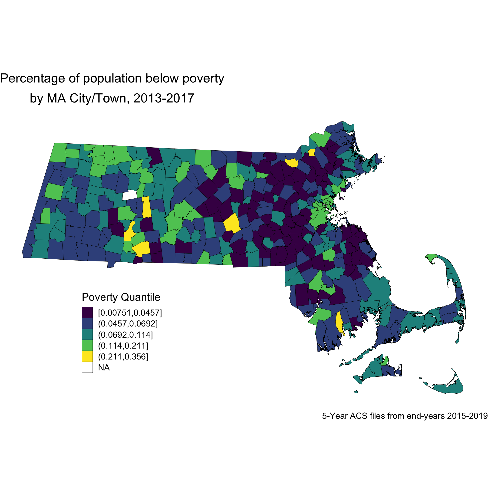
```

Now, let’s look at the spatial distribution of the other area-based socioeconomic measure that we constructed: the ICE measure for racialized economic segregation. Compare this map of city/town ICE (racialized group + income) quantile to the first map of city/town poverty quantile. Do you notice any differences? Do you find one of these area-based socioeconomic measures to be more visually clear and compelling than the other, and why or why not?

```{r ice map, eval = FALSE}
ma_ice_map <- town_ma_absm_sum %>% 
  left_join(town_geometry, by= "super_town") %>% 
  ggplot() +
  geom_sf(mapping = aes(geometry=geometry, 
                        fill=ICE_qt),
          lwd = 0.1,
          color = "black") +
  scale_fill_viridis_d(option = "E") +
  labs(title = expression(atop("Index of Concentration at the Extremes for Racialized Economic Segregation", "by MA city/town, 2013-2017")),
       caption = "5-year ACS files from end-years 2015-2019",
       fill = "ICE quantile", x="", y="") +
  theme_void() +
  theme(axis.text.x=element_blank(), #remove x axis labels
        axis.ticks.x=element_blank(), #remove x axis ticks
        axis.text.y=element_blank(),  #remove y axis labels
        axis.ticks.y=element_blank(),
        legend.position = c(0.25, 0.25),
        legend.key.size = unit(0.4, "cm"))

ggsave("ma_ice_map.png")
```

```{r, echo = FALSE}
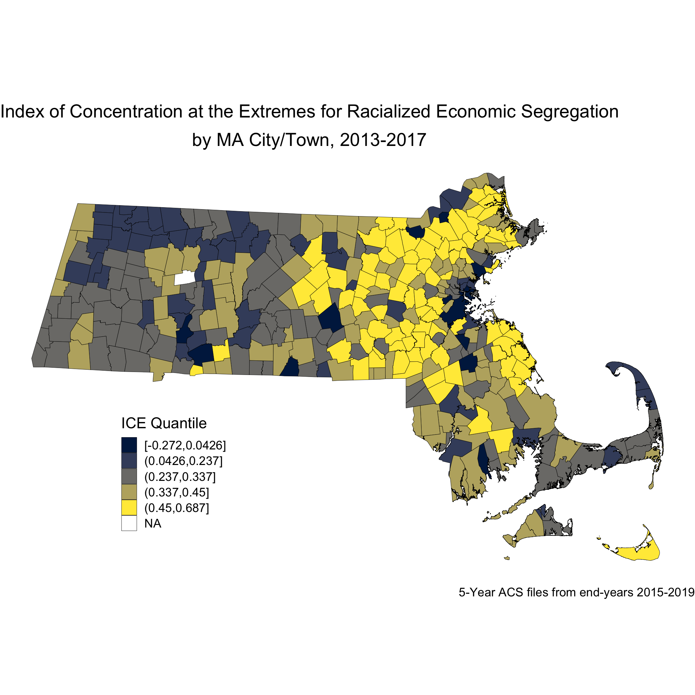
```

Next, we will look at how breast cancer mortality varies across the ICE measure for racialized economic segregation. Using the 2015-2019 American Community Survey (ACS) 5-year estimates counts, we compute age- and sex-standardized 2013-2017 breast cancer mortality rates (per 1000) for each MA city/town ICE quantile using the direct method. This method will require a reference population, which we have downloaded (and wrangled) from the National Cancer Institute. (https://seer.cancer.gov/stdpopulations/).

```{r, echo = FALSE}
seer_std <- readRDS("data/08-breast-cancer-mortality/seer_std.RDS")
seer_std
```


```{r age standardized by poverty, eval = FALSE}
ma_mort_ice_qt <- town_ma_mort_bc %>%
  inner_join(town_ma_demo_acs_bc, by = c("year","super_town","race_group","sex","age_cat")) %>% 
  left_join(town_ma_absm_sum, by= "super_town") %>% 
  filter(age_cat != "Total") %>% 
  group_by(ICE_qt, age_cat) %>% 
  summarise(num = sum(deaths, na.rm=T),
            den = sum(population, na.rm=T))%>%
  mutate(den = den + 0.001) %>% 
  left_join(seer_std, by="age_cat") %>%
  mutate(rate_i = wt*num/den,
         var_rate_i = (num*wt^2)/den^2) %>%
  group_by(ICE_qt) %>%
  summarise(num = sum(num, na.rm=T),
            den = sum(den, na.rm=T),
            std_rate = sum(rate_i, na.rm=T),
            var_std_rate = sum(var_rate_i, na.rm=T),
            sumwt = sum(wt),
            sumwt2 = sum(wt^2)) %>%
  mutate(std_rate = std_rate / sumwt *1000,
         var_std_rate = var_std_rate / sumwt2 *1000,
         std_rate_lo95 = std_rate - 1.96*sqrt(var_std_rate),
         std_rate_up95 = std_rate + 1.96*sqrt(var_std_rate)) %>%
  ungroup() %>% 
  ggplot(aes(x=ICE_qt, y=std_rate)) +
    geom_bar(stat="identity", fill = "limegreen",color = "black") +
    labs(title = expression(atop("Age-standardized breast cancer mortality rate by MA city/town","ICE for racialized group & income quantile, 2013-2017")),
         caption = expression(atop("Source: Massachusetts Mortality Data 2013-2017", 
                                   "5-year ACS files from end-years 2015-2019"))) +
    ylab("Breast cancer mortality per 1000") +
    xlab("ICE quantile") +
    theme(legend.position="bottom") +
    theme_minimal()


ggsave("ma_mort_ice_qt.png")
```

```{r, echo = FALSE}
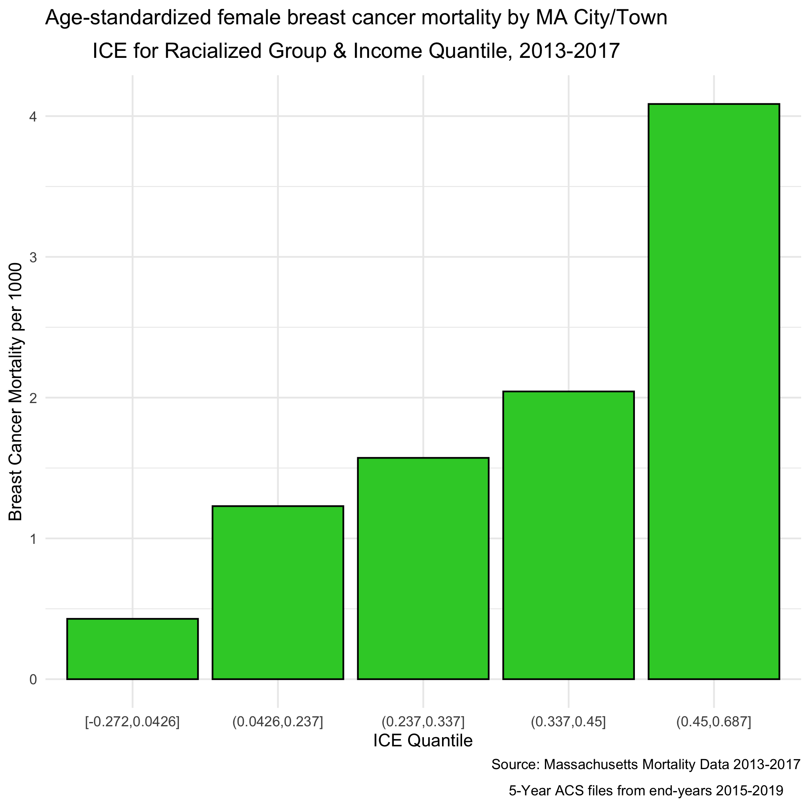
```

We can see a clear socioeconomic gradient in breast cancer mortality rates at the city/town level in Massachusetts for years 2013-2017. How would you interpret this socioeconomic gradient? Is it what you expected, why or why not?

### Question 2: What is the racialized disparity in breast cancer mortality overall?

We can describe inequities by racialized groups much the same way we describe inequities by ABSMs: by aggregating death and population data. We've already got this data aggregated, so we can stratify our analysis to compare Black non-Hispanic and White non-Hispanic populations. Note: Throughout the case study we may refer to these groups as Black and White as a shorthand.

As we did for the first question, we age-adjust our aggregated data by racialized group to compare standardized mortality rates for Black and White populations. We can see lots of variation here as the mortality rates increase - what is causing that?

```{r stratified analyses, eval = FALSE}
ma_mort_stratified <- town_ma_mort_bc %>%
  inner_join(town_ma_demo_acs_bc, by = c("year","super_town","race_group","sex","age_cat"))%>% 
  filter(race_group %in% c("Non-Hispanic White","Non-Hispanic Black"),
         age_cat != "Total") %>% 
  group_by(super_town, race_group, age_cat) %>% 
  summarise(num = sum(deaths, na.rm=T),
            den = sum(population, na.rm=T))%>%
  mutate(den = den + 0.001) %>% 
  left_join(seer_std, by="age_cat") %>%
  mutate(rate_i = wt*num/den,
         var_rate_i = (num*wt^2)/den^2) %>%
  group_by(super_town, race_group) %>%
  summarise(num = sum(num, na.rm=T),
            den = sum(den, na.rm=T),
            std_rate = sum(rate_i, na.rm=T),
            var_std_rate = sum(var_rate_i, na.rm=T),
            sumwt = sum(wt),
            sumwt2 = sum(wt^2)) %>%
  mutate(std_rate = std_rate / sumwt *1000,
         var_std_rate = var_std_rate / sumwt2 *1000,
         std_rate_lo95 = std_rate - 1.96*sqrt(var_std_rate),
         std_rate_up95 = std_rate + 1.96*sqrt(var_std_rate)) %>%
  ungroup()

bc_dotplot_agg_rates <- ma_mort_stratified %>% 
  filter(!is.na(std_rate),
         den > 0.01) %>% 
  select(super_town,race_group, contains("std_rate")) %>% 
  arrange(std_rate) %>% 
  group_by(race_group) %>% 
  mutate(orderID = row_number()) %>%
  ungroup() %>% 
  ggplot(aes(x=orderID, y=std_rate)) + 
    geom_point(color = "limegreen", alpha = 0.8, size = 1) +
    geom_errorbar(aes(ymin = std_rate_lo95, ymax=std_rate_up95), size = 0.1) +
    labs(title = "Age-standardized breast cancer mortality rate",
         caption = expression(atop("Source: Massachusetts Mortality Data 2013-2017", 
                                   "5-year ACS files from end-years 2015-2019"))) +
    xlab("City/towns") +
    ylab("Mortality rates") +
    facet_wrap(vars(race_group), ncol = 2, scales = "free_x") +
    theme_minimal() +
    theme(axis.ticks.x = element_blank(), 
          axis.text.x = element_blank())

ggsave("bc_dotplot_agg_rates.png")

```

```{r, echo = FALSE}
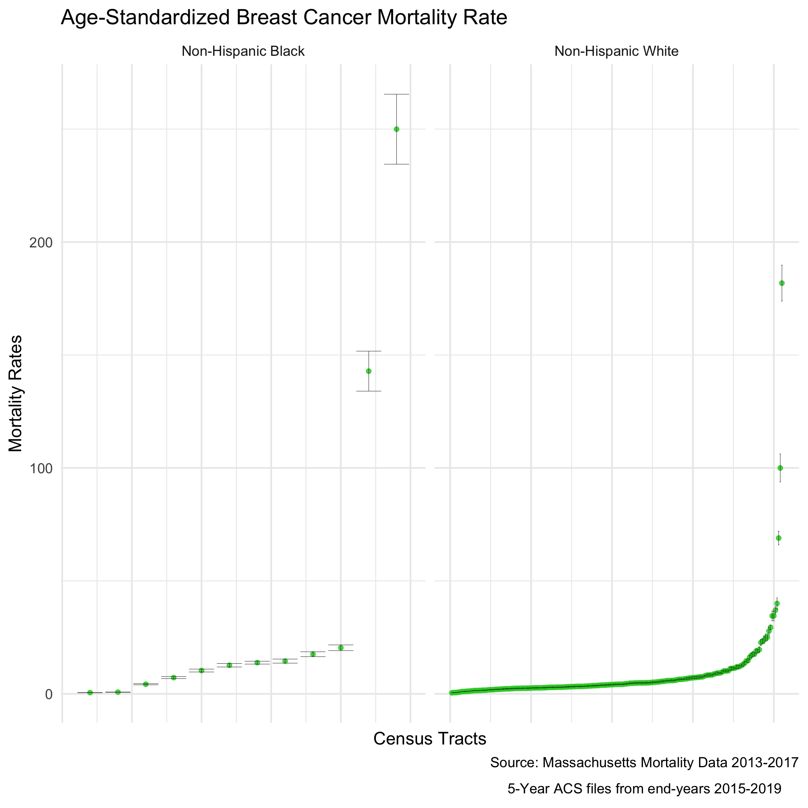
```

Before we explore that variation, as a reminder, we age-adjust our aggregated data by racialized group so we can compare standardized mortality rates, as differences in breast cancer mortality between the two groups may be due to differential distribution of ages by race. We can see that the age distributions for each racialized group are quite different. How would you describe the differences? 

```{r age_cat_bar_chart, eval = FALSE}
bc_tab_age_race <- town_ma_demo_acs_bc %>%
      filter(race_group %in% c("Non-Hispanic White","Non-Hispanic Black"),
         sex == "Female",
         age_cat != "Total") %>% 
  group_by(super_town, race_group, sex, age_cat) %>% 
  summarise(pop = sum(population, na.rm=T)) %>%
  inner_join(town_ma_absm_sum, by = c("super_town")) %>% 
  mutate(age_cat_broad = case_when(age_cat %in% c("0-4","5-9","10-14","15-19","20-24") ~ "0-24",
                                   age_cat %in% c("25-29","30-34","35-39","35-44","40-44") ~ "25-44",
                                   age_cat %in% c("45-49","45-54","50-54","55-59","55-64","60-64") ~ "45-64",
                                   age_cat %in% c("65-69","65-74","70-74","75-59","75-84","80-84","85+") ~ "65+")) %>%
  group_by(race_group, age_cat_broad) %>%
  summarise(pop = sum(pop, na.rm=T)) %>%
  group_by(race_group) %>%
  mutate(percentage = pop/sum(pop)) %>% 
  ggplot(aes(x=race_group, y=percentage, fill= age_cat_broad)) +
    geom_bar(position="stack", stat="identity") +
    scale_fill_viridis_d(option = "A") +
    labs(title ="Age distribution by racialized group",
         fill = "Age category",
         caption = "5-year ACS files from end-years 2015-2019") +
    ylab("Percentage of population") +
    xlab("Racialized group") +
    theme(legend.position="bottom") +
    theme_minimal()
    
ggsave("bc_tab_age_race.png")
```

```{r}
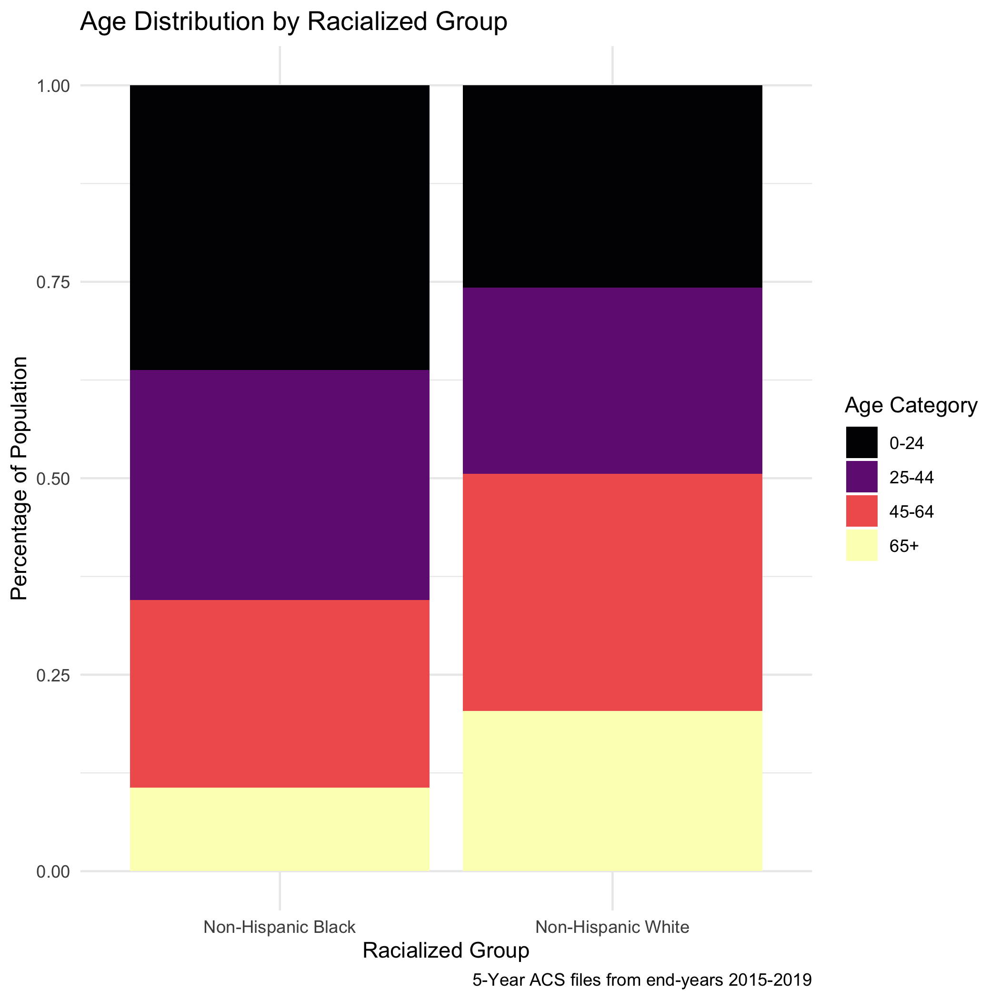
```

Now, to return to this question of why we see lots of variation in mortality rates. As we might expect, these extremely variable mortality rates are occurring in small populations. What do these maps look like?

```{r, eval = FALSE}
plotlist <- vector(mode = "list", length = 2)
names(plotlist) <- c("Non-Hispanic White","Non-Hispanic Black")
for (plt in names(plotlist)) {

  map.state <- ma_mort_stratified %>% 
    filter(race_group == plt) %>%
    mutate(std_rate = ifelse(std_rate > 10, 10, std_rate)) %>% 
    left_join(town_geometry, by= "super_town") %>% 
    ggplot() +
      geom_sf(mapping = aes(geometry = geometry,
                            fill = std_rate),
              lwd = 0.1,
              color = "black") +
      scale_fill_viridis(option = "B", limits = c (0, 10)) +
      labs(title = plt,
           fill = "Age Standardized Mortality Rate", x="", y="") +
      theme_void() +
      theme(axis.text.x=element_blank(), #remove x axis labels
            axis.ticks.x=element_blank(), #remove x axis ticks
            axis.text.y=element_blank(),  #remove y axis labels
            axis.ticks.y=element_blank(),
            legend.position = c(0.25, 0.25),
            legend.key.size = unit(0.2, "cm"))
  
  map.boston <- ma_mort_stratified %>% 
    filter(race_group == plt,
           super_town == "boston") %>% 
    mutate(std_rate = ifelse(std_rate > 10, 10, std_rate)) %>% 
    left_join(town_geometry, by= "super_town") %>% 
    ggplot() +
      geom_sf(mapping = aes(geometry = geometry,
                            fill = std_rate),
              lwd = 0) +
      scale_fill_viridis(option = "B", limits = c (0, 10)) +
      labs(title = "Boston") +
      theme_void() + 
      theme(strip.text.x = element_blank(),
            legend.position = "None",
            plot.title      = element_text(hjust = 0.5)) 
  
  plotlist[[plt]] <- ggdraw() +
    draw_plot(map.state , x = 0.00, y = 0.00, width = 0.80, height = 1.00) +
    draw_plot(map.boston, x = 0.65, y = 0.50, width = 0.30, height = 0.30)
  
}

title <- ggdraw() +
  draw_label("Age-standardized breast cancer mortality rates", size = 12, fontface='bold', hjust = 0.2)
caption1 <- ggdraw() +
  draw_label("Source: Massachusetts Mortality Data 2013-2017", size = 8, hjust = 0.5) 
caption2 <- ggdraw() +
  draw_label("5-year ACS files from end-years 2015-2019", size = 8, hjust = 0.5) 
plots <- plot_grid(plotlist = plotlist,
                  ncol = 1)

bc_byrace_std_rates <- plot_grid(title, plots, caption1, caption2,
          rel_heights = c(0.05, 1.0, 0.05, 0.05),
          ncol = 1)


ggsave("bc_byrace_std_rates.png")

```

```{r, echo = FALSE}
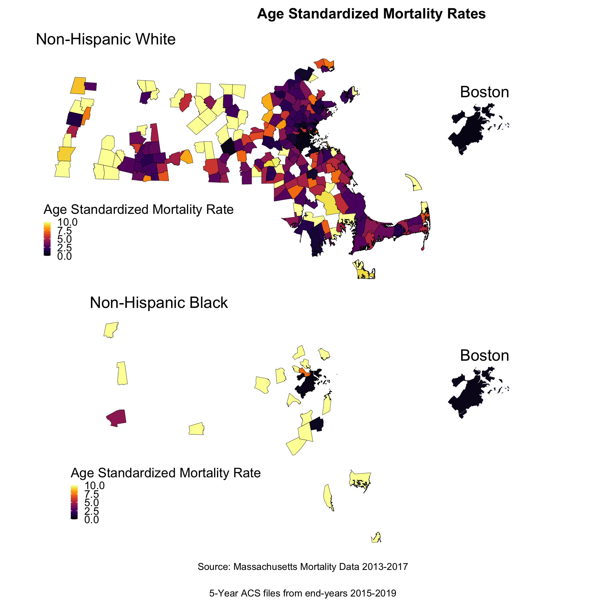
```

We are seeing some really extreme rates in the Black population, where we have smaller overall sample sizes. We are also seeing many cities and towns with no recorded breast cancer deaths for both Black and White populations, but this is particularly the case for the Black population (it is likely that these are cities and towns with very small or no resident Black populations due to racialized economic segregation). What else do you observe?

We can also display these two maps as one, by calculating the rate difference, or the rate ratio. We will calculate and display the incidence rate ratio comparing the age-standardized mortality rates for the Black non-Hispanic and White non-Hispanic populations, as we visualized at the start of this section. 

```{r, eval = FALSE}
irr_data <- ma_mort_stratified %>% 
  select(super_town,race_group, std_rate, var_std_rate) %>% 
  pivot_wider(id_cols = super_town,
              names_from = race_group,
              values_from = c(std_rate, var_std_rate)) %>% 
  mutate(irr = ifelse(`std_rate_Non-Hispanic White` == 0, NA_real_, `std_rate_Non-Hispanic Black` / `std_rate_Non-Hispanic White`),
         irr_var = `var_std_rate_Non-Hispanic Black` + `var_std_rate_Non-Hispanic White`,
         irr_lo95 = irr - 1.96*sqrt(irr_var),
         irr_up95 = irr + 1.96*sqrt(irr_var)) 

irr_plot <- irr_data %>% 
  arrange(irr) %>% 
  filter(!is.na(irr)) %>% 
  mutate(orderID = row_number()) %>%
  ungroup() %>% 
  ggplot(aes(x=orderID, y=irr)) + 
    geom_point(color = "limegreen", alpha = 0.8, size = 1) +
    geom_errorbar(aes(ymin = irr_lo95, ymax=irr_up95), size = 0.1) +
    labs(title = expression(atop("Incidence Rate Ratio Comparing Non-Hispanic Black", 
                                 "and Non Hispanic White Populations")),
         caption = expression(atop("Source: Massachusetts Mortality Data 2013-2017",
                                   "5-Year ACS files from end-years 2015-2019"))) +
         xlab("Census Tracts") +
         ylab("Incidence Rate Ration") +
    theme_minimal() 
  
irr_plot
```
We can also map this like the other maps.

```{r, eval = FALSE}
map.irr.bc <- irr_data %>% 
  mutate(irr = case_when(irr > 4  ~ 4,
                         TRUE     ~ irr)) %>% 
  left_join(town_geometry, by= "super_town") %>% 
  ggplot() +
    geom_sf(mapping = aes(geometry = geometry,
                          fill = irr),
            lwd = 0.1) +
  scale_fill_viridis(option = "E",
                     trans = scales::pseudo_log_trans(sigma=0.01),
                     limits = exp(c(-1,1)*log(4)),
                     breaks=c(0.25, 0.5,1,2,4),
                     na.value = "white") +
  labs(title = expression(atop("Incidence Rate Ratio Comparing Non-Hispanic Black", 
                                 "and Non Hispanic White Populations")),
       caption = expression(atop("Source: Massachusetts Mortality Data 2013-2017", 
                                 "5-Year ACS files from end-years 2015-2019")),
       fill = "IRR", x="", y="") +
  theme_void() +
    theme(legend.position = c(0.25, 0.25),
          legend.key.size = unit(0.3, "cm"),
          plot.title      = element_text(hjust = 0.1),
          plot.subtitle   = element_text(hjust = 0.1))

map.boston.irr <- irr_data %>% 
  filter(super_town == "boston") %>% 
  mutate(irr = case_when(irr > 4  ~ 4,
                         irr == 0 ~ 0.0000001,
                         TRUE     ~ irr)) %>% 
  left_join(town_geometry, by= "super_town") %>% 
  ggplot() +
    geom_sf(mapping = aes(geometry = geometry,
                          fill = irr),
            lwd = 0.1) +
  scale_fill_viridis(option = "E",
                     trans = scales::pseudo_log_trans(sigma=0.01),
                     limits = exp(c(-1,1)*log(4)),
                     breaks=c(0.25, 0.5,1,2,4),
                     na.value = "white") +
    labs(title = "Boston") +
    theme_void() + 
    theme(strip.text.x = element_blank(),
          legend.position = "None",
          plot.title      = element_text(hjust = 0.5)) 

ggsave("map.irr.bc.png")
```

```{r, echo = FALSE}
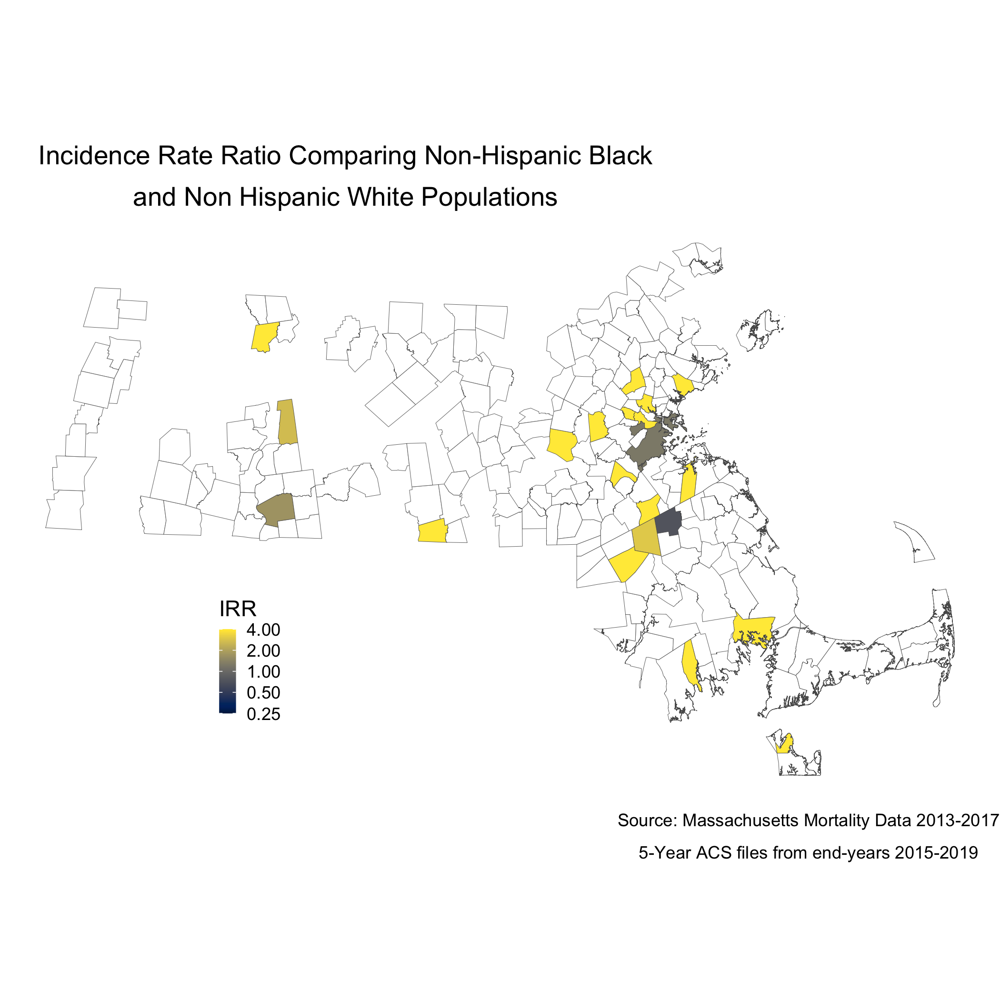
```

Note that the boundaries for some cities and towns are completely blank. These areas did not have any recorded breast cancer deaths for Black or White women so they don’t get visualized because there is literally no data. Cities and towns that are visualized, but are white or “empty,” only have data for White women. Again, we see that only a handful of cities and towns recorded breast cancer deaths for Black women, so these cities and towns get visualized as white or “empty” because an IRR can't be calculated. Key is understanding that these rates are influenced by the small sample sizes and large potential errors we have previously visualized. It's for researchers and communities to interpret how "real" the effects we see are. 

### Question 3: How do area-based socioeconomic measures interact with individual-level membership in racialized groups to affect patterns of breast cancer mortality (i.e., interactions between socioeconomic position and racialized groups, not just socioeconomic inequities within racialized groups)? 

```{r poisson, eval = FALSE}

poisson_data <- town_ma_mort_bc %>%
  inner_join(town_ma_demo_acs_bc, by = c("year","super_town","race_group","sex","age_cat")) %>%
  filter(race_group %in% c("Non-Hispanic White","Non-Hispanic Black"),
         age_cat != "Total") %>% 
  group_by(super_town, race_group, age_cat) %>% 
  summarise(num = sum(deaths, na.rm=T),
            den = sum(population, na.rm=T))%>%
  mutate(den = den + 0.001,
         race_group = factor(race_group)) %>%
  inner_join(town_ma_absm_sum, by = c("super_town")) %>% 
  fastDummies::dummy_cols(select_columns=c("pov_cat", "ICE_qt")) %>%
  rename(pov_cat_1 = "pov_cat_0-4.9%",
         pov_cat_2 = "pov_cat_5-9.9%",
         pov_cat_3 = "pov_cat_10-19.9%",
         pov_cat_4 = "pov_cat_20-100%",
         ICE_qt_1 = "ICE_qt_[-0.272,0.0426]",
         ICE_qt_2 = "ICE_qt_(0.0426,0.237]" , 
         ICE_qt_3 = "ICE_qt_(0.237,0.337]" ,  
         ICE_qt_4 = "ICE_qt_(0.337,0.45]" ,  
         ICE_qt_5 = "ICE_qt_(0.45,0.687]") 

# Null poisson model
model0 <- glm(num ~ race_group + factor(age_cat) + offset(log(den)),
                        family=poisson(link=log),
                        data=poisson_data)

summary.model0 <- summary(model0)
saveRDS(summary.model0, file = "poisson0_bc.rds")


poisson_data$fit <- as_tibble(predict(model0)) %>% 
  transmute(fit = exp(value))

poisson_irr <- poisson_data %>%
  group_by(super_town, race_group) %>% 
  summarise(num = sum(fit, na.rm=T),
            den = sum(den, na.rm=T)) %>% 
  mutate(fit_rate = num/den * 1000) %>% 
  pivot_wider(id_cols = super_town,
              names_from = race_group,
              values_from = fit_rate) %>% 
  mutate(fit_irr = ifelse(`Non-Hispanic White` == 0, NA_real_, `Non-Hispanic Black` / `Non-Hispanic White`))

poisson_irr_plot <- poisson_irr %>% 
  ungroup() %>% 
  arrange(fit_irr) %>% 
  mutate(orderID = row_number())%>%
  ggplot(aes(x=orderID, y=fit_irr)) + 
    geom_point(color = "limegreen", alpha = 0.8, size = 1) +
    labs(title = expression(atop("Incidence Rate Ratio Comparing Non-Hispanic Black", 
                                 "and Non Hispanic White Populations")),
         caption = expression(atop("Source: Massachusetts Mortality Data 2013-2017",
                                   "5-Year ACS files from end-years 2015-2019"))) +
         xlab("Census Tracts") +
         ylab("IRR") +
    theme_minimal() 

ggsave("poisson_irr_plot_bc.png")
```

```{r, echo = FALSE}
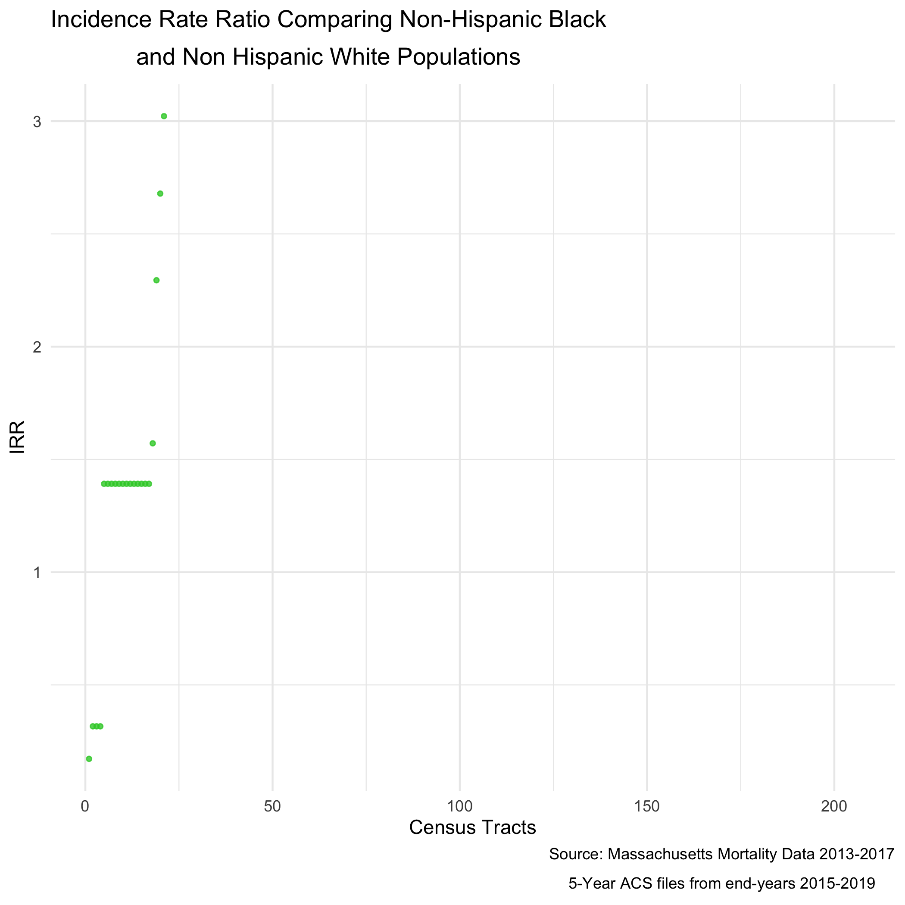
```

And of course, now we can map that value as well.

```{r poisson map, eval = FALSE, echo = FALSE}
map.state.p.irr <- poisson_irr %>% 
  mutate(fit_irr = case_when(fit_irr > 4  ~ 4,
                         TRUE     ~ fit_irr)) %>% 
  left_join(town_geometry, by= "super_town") %>% 
  ggplot() +
    geom_sf(mapping = aes(geometry = geometry,
                          fill = fit_irr),
            lwd = 0.1) +
  scale_fill_viridis(option = "E",
                     trans = scales::pseudo_log_trans(sigma=0.01),
                     limits = exp(c(-1,1)*log(4)),
                     breaks=c(0.25, 0.5,1,2,4),
                     na.value = "white") +
  labs(title = expression(atop("Incidence Rate Ratio Comparing Non-Hispanic Black", 
                                 "and Non Hispanic White Populations")),
       caption = expression(atop("Source: Massachusetts Mortality Data 2013-2017", 
                                 "5-Year ACS files from end-years 2015-2019")),
       fill = "IRR", x="", y="") +
  theme_void() +
    theme(legend.position = c(0.25, 0.25),
          legend.key.size = unit(0.3, "cm"),
          plot.title      = element_text(hjust = 0.1),
          plot.subtitle   = element_text(hjust = 0.1))

ggsave("map.p.irr_bc.png")

```

```{r, echo = FALSE}
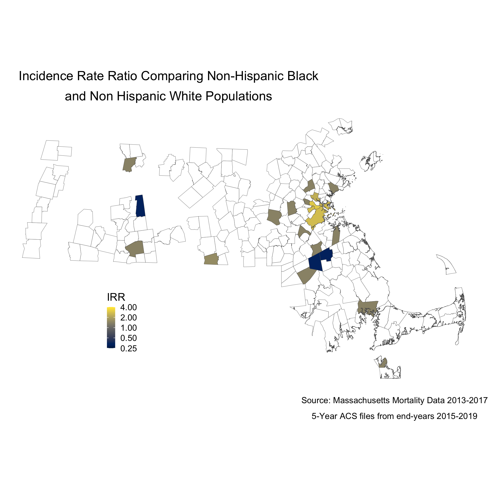
```

An adjusted model would allow for us to see how poverty rates are impacting the incidence rate ratio.

```{r, eval = FALSE}
# Adjusted Poisson Model
model1 <- glm(num ~ race_group + factor(age_cat) + (race_group * factor(pov_cat, exclude = NULL)) + offset(log(den)),
                        family=poisson(link=log),
                        data=poisson_data)

summary.model1 <- summary(model1)
saveRDS(summary.model1, file = "poisson1_bc.rds")

poisson_data$adj_fit <- as_tibble(predict(model1)) %>% 
  transmute(adj_fit = exp(value))

adj_poisson_irr <- poisson_data %>%
  group_by(super_town, race_group) %>% 
  summarise(num = sum(adj_fit, na.rm=T),
            den = sum(den, na.rm=T)) %>% 
  mutate(adj_fit_rate = num/den * 1000) %>% 
  pivot_wider(id_cols = super_town,
              names_from = race_group,
              values_from = adj_fit_rate) %>% 
  mutate(adj_fit_irr = ifelse(`Non-Hispanic White` == 0, NA_real_, `Non-Hispanic Black` / `Non-Hispanic White`))

adj_poisson_irr_plot <- adj_poisson_irr %>% 
  ungroup() %>% 
  arrange(adj_fit_irr) %>% 
  mutate(orderID = row_number())%>%
  ggplot(aes(x=orderID, y=adj_fit_irr)) + 
    geom_point(color = "limegreen", alpha = 0.8, size = 1) +
    labs(title = expression(atop("Poverty Adjusted Incidence Rate Ratio", 
                                 "Comparing Non-Hispanic Black and Non Hispanic White Populations")),
         caption = expression(atop("Source: Massachusetts Mortality Data 2013-2017",
                                   "5-Year ACS files from end-years 2015-2019"))) +
         xlab("Census Tracts") +
         ylab("Mortality Rates") +
    theme_minimal() 

ggsave("adj_poisson_irr_plot_bc.png")

```

```{r, echo = FALSE}
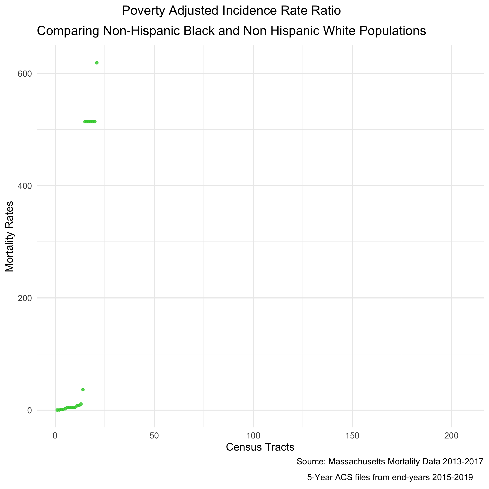
```

And now the map.

```{r, eval = FALSE}
adj_map.state.p.irr <- adj_poisson_irr %>% 
  mutate(adj_fit_irr = case_when(adj_fit_irr > 4  ~ 4,
                         TRUE     ~ adj_fit_irr)) %>% 
  left_join(town_geometry, by= "super_town") %>% 
  ggplot() +
    geom_sf(mapping = aes(geometry = geometry,
                          fill = adj_fit_irr),
            lwd = 0.1) +
  scale_fill_viridis(option = "E",
                     trans = scales::pseudo_log_trans(sigma=0.01),
                     limits = exp(c(-1,1)*log(4)),
                     breaks=c(0.25, 0.5,1,2,4),
                     na.value = "white") +
  labs(title = expression(atop("Poverty Adjusted Incidence Rate Ratio", 
                                 "Comparing Non-Hispanic Black and Non Hispanic White Populations")),
       caption = expression(atop("Source: Massachusetts Mortality Data 2013-2017", 
                                 "5-Year ACS files from end-years 2015-2019")),
       fill = "IRR", x="", y="") +
  theme_void() +
    theme(legend.position = c(0.25, 0.25),
          legend.key.size = unit(0.3, "cm"),
          plot.title      = element_text(hjust = 0.1),
          plot.subtitle   = element_text(hjust = 0.1))

ggsave("adj_map.p.irr_bc.png")
```

```{r, echo = FALSE}
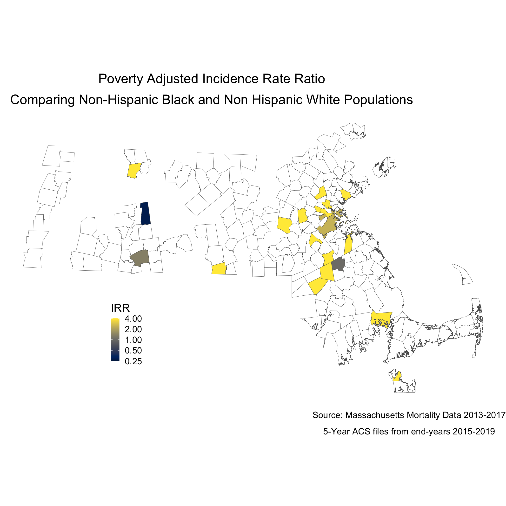
```

To understand statistically how city/town poverty level is impacting the relationship between racialized groups and breast cancer mortality, we can compare the models with and without poverty. We can see the impact of social membership in racialized group is reduced with the presence of the city/town level poverty.

```{r, echo = FALSE}
summary.model0 <- readRDS("data/08-breast-cancer-mortality/poisson0_bc.rds")
summary.model0
```

```{r, echo = FALSE}
summary.model1 <- readRDS("data/08-breast-cancer-mortality/poisson1_bc.rds")
summary.model1
```

### References 

Breast Cancer Research Foundation. (2022). Black women and breast cancer: Why disparities persist and how to end them. https://www.bcrf.org/blog/black-women-and-breast-cancer-why-disparities-persist-and-how-end-them/; accessed June 14, 2022.

Friedman D, Hunter E, Parrish R (eds). (2005). Health statistics. New York: Oxford University Press.

Hetzel AM. (1997). History and organization of vital statistics systems. Bethesda, MA: National Center for Health Statistics. https://www.cdc.gov/nchs/data/misc/usvss.pdf; accessed June 14, 2022.

Krieger N. (2019). The US Census and the People's Health: Public Health Engagement From Enslavement and "Indians Not Taxed" to Census Tracts and Health Equity (1790-2018). Am J Public Health. 2019 Aug;109(8):1092-1100. doi: 10.2105/AJPH.2019.305017. Epub 2019 Jun 20.

Krieger N, Singh, N, Waterman, PD. (2016). Metrics for monitoring cancer inequities: residential segregation, the Index of Concentration at the Extremes (ICE), and breast cancer estrogen receptor status (USA, 1992-2012). Cancer Causes Control. 2016 Sep;27(9):1139-51. doi: 10.1007/s10552-016-0793-7. Epub 2016 Aug 8.

US Office of Management and Budget. Revisions to the Standards for the Classification of Federal Data on Race and Ethnicity. Federal Register 1997; 62(210):58782-58790. https://www.govinfo.gov/content/pkg/FR-1997-10-30/pdf/97-28653.pdf; accessed June 14, 2022.

Williams DR, Collins C. (2001). Racial residential segregation: a fundamental cause of racial disparities in health. Public Health Rep. Sep-Oct 2001;116(5):404-16. doi: 10.1093/phr/116.5.404.
