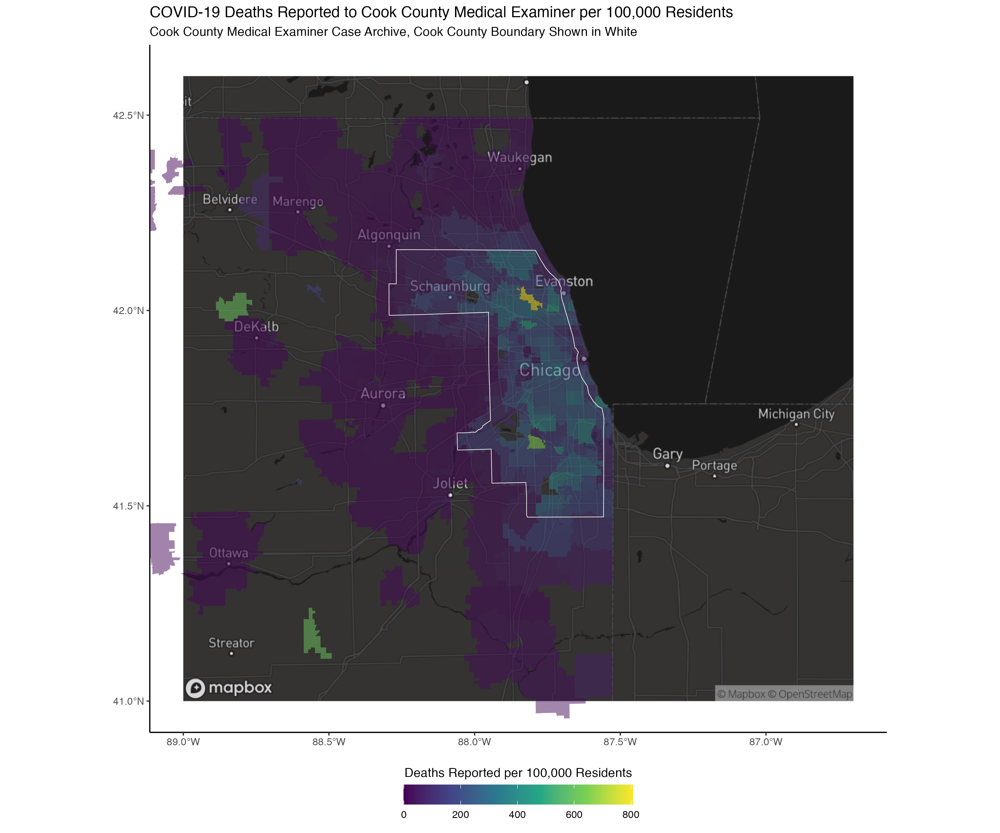

# Case Example 3: COVID-19 Mortality in Chicago {#cook-county-covid}

```{r}
#| echo = FALSE,
#| fig.cap =  
#|   "COVID-19 raw (un-adjusted) mortality rates, death counts from 
#|   the Cook County Medical Examiner's Office, population counts from the 
#|   American Community Survey"

```