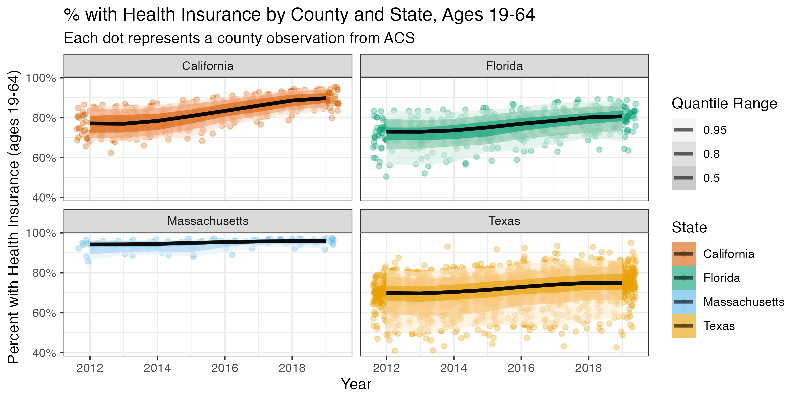

# Case Study 4: Health Insurance over Time {#temporal-health-insurance}

Outline for Case Study: 

We want participants to learn the following skills from this case study.  Though this
case study will follow uninsurance rates over time from specified counties, the
skills learned should be generalizable to pulling other variables from the ACS at
other geographic levels. 

    - How to pull variables from the ACS over time
    - How to visualize (plot) and map estimates 
    - Characterizing trends in the estimates by social variables
    - How to work with estimate uncertainty (margin of error) data to:
        * Aggregate it up from stratified estimates (like aggregating 
          private and public uninsurance rates together into overall 
          uninsurance rates)
        * Visualize uncertainty for individual areal units over time 
    - Model temporal trends
        * with linear models
        * with temporal fixed effects 
        * with smoothing splines 
        * weighted by margin of error or denominator data 
        * stratified by social variables 
    - Model estimates incorporating spatial uncertainty to smooth estimates
      and reduce noisiness in estimates in areas where little data is observed
          

```{r}
#| echo = TRUE,
#| eval = FALSE

library(tidycensus)
library(tidyverse)
library(tidyr)
library(magrittr) # magrittr defines the %<>% operator, read more here: https://magrittr.tidyverse.org/

# build a data dictionary - based on ACS 2013
data_dictionary <- tibble::tribble(
  ~variable,     ~shortname,                       ~description,
  "B18135_002",  'under18_denom',                   "Estimate!!Total!!Under 18 years",
  "B18135_004",  'under18_insured_with_disability', "Estimate!!Total!!Under 18 years!!With a disability!!With health insurance coverage",
  "B18135_009",  'under18_insured_no_disability',   "Estimate!!Total!!Under 18 years!!No disability!!With health insurance coverage",
  "B18135_013",  'adult_denom',                     "Estimate!!Total!!18 to 64 years",
  "B18135_015",  'adult_insured_with_disability',   "Estimate!!Total!!18 to 64 years!!With a disability!!With health insurance coverage",
  "B18135_020",  'adult_insured_no_disability',     "Estimate!!Total!!18 to 64 years!!No disability!!With health insurance coverage",
  # ICEraceinc variables
  "B19001_001",  'hhinc_total',   "total population for household income estimates",
  "B19001A_002", 'hhinc_w_1',     "white n.h. pop with household income <$10k",
  "B19001A_003", 'hhinc_w_2',     "white n.h. pop with household income $10k-14 999k",
  "B19001A_004", 'hhinc_w_3',     "white n.h. pop with household income $15k-19 999k",
  "B19001A_005", 'hhinc_w_4',     "white n.h. pop with household income $20k-24 999k",
  "B19001A_014", 'hhinc_w_5',     "white n.h. pop with household income $100 000 to $124 999",
  "B19001A_015", 'hhinc_w_6',     "white n.h. pop with household income $125k-149 999k",
  "B19001A_016", 'hhinc_w_7',     "white n.h. pop with household income $150k-199 999k",
  "B19001A_017", 'hhinc_w_8',     "white n.h. pop with household income $196k+",
  "B19001_002",  'hhinc_total_1', "total pop with household income <$10k",
  "B19001_003",  'hhinc_total_2', "total pop with household income $10k-14 999k",
  "B19001_004",  'hhinc_total_3', "total pop with household income $15k-19 999k",
  "B19001_005",  'hhinc_total_4', "total pop with household income $20k-24 999k",
  "B05010_002",  'in_poverty',    "total pop in poverty",
  "B05010_001", 'total_pop_for_poverty_estimates', 
                                  "denominator population for poverty estimates"
)

# another way to create a data dictionary is to use tidycensus to get the variables tables and filter it:
acs2012variables <- tidycensus::load_variables(year = 2012, dataset = 'acs5')
acs2012variables %<>% filter(
  name %in% c("B18135_002", "B18135_004", "B18135_009", "B18135_013", "B18135_015", "B18135_020")) 
# then you could append `shortname` data if you'd like

# write a function to help query county insurance rates by state
get_county_health_insurance <- function(state, year) {
  get_acs(state = state, year = year, geography = 'county', variables = data_dictionary$variable)
}

# create a table shell for each year of data for each of texas, massachusetts, florida, and california
health_insurance <- expand.grid(state = c('TX', 'MA', 'FL', 'CA'), year = 2012:2019)

# query the data from ACS
health_insurance %<>% 
  rowwise() %>% 
  mutate(
  acs_data = list(get_county_health_insurance(state = state, year = year))) 

# unnest our data
health_insurance %<>% tidyr::unnest(cols = acs_data)

# recode variables to use friendlier shortnames
health_insurance$variable %<>% recode( !!! setNames(data_dictionary$shortname, data_dictionary$variable))

# pivot into wide format
health_insurance %<>% 
  tidyr::pivot_wider(
    id_cols = c('year', 'state', 'GEOID', 'NAME'),
    names_from = 'variable',
    values_from = c('estimate', 'moe'))

# calculate adult, child, and 0-64 insurance rates by county and year 
health_insurance %<>% mutate(
  # calculate numerators
  estimate_adult_insurance_numerator = (estimate_adult_insured_with_disability + estimate_adult_insured_no_disability),
  estimate_under18_insurance_numerator = (
    estimate_under18_insured_with_disability + estimate_under18_insured_no_disability
  ),
  estimate_zero_to_64_insurance_numerator = (
    estimate_adult_insured_with_disability +
      estimate_adult_insured_no_disability +
      estimate_under18_insured_with_disability +
      estimate_under18_insured_no_disability
  ),
  # calculate denominator
  estimate_zero_to_64_insurance_denom = estimate_under18_denom + estimate_adult_denom,
  # calculate proportions
  estimate_adult_insurance_prop = estimate_adult_insurance_numerator / estimate_adult_denom,
  estimate_under18_insurance_prop = estimate_under18_insurance_numerator / estimate_under18_denom,
  estimate_zero_to_64_insurance_prop = estimate_zero_to_64_insurance_numerator / (estimate_zero_to_64_insurance_denom),
  
  # calculate social metrics
  poverty_prop = estimate_in_poverty / estimate_total_pop_for_poverty_estimates,
  
      # we calculate the people of color low income counts as the overall 
    # low income counts minus the white non-hispanic low income counts
    people_of_color_low_income = 
      (estimate_hhinc_total_1 + estimate_hhinc_total_2 + estimate_hhinc_total_3 + estimate_hhinc_total_4) - 
      (estimate_hhinc_w_1 + estimate_hhinc_w_2 + estimate_hhinc_w_3 + estimate_hhinc_w_4),
    # sum up the white non-hispanic high income counts
    white_non_hispanic_high_income = 
      (estimate_hhinc_w_5 + estimate_hhinc_w_6 + estimate_hhinc_w_7 + estimate_hhinc_w_8),
    # calculate the index of concentration at the extremes for racialized 
    # economic segregation (high income white non-hispanic vs. low income 
    # people of color)
    ICEraceinc = 
      (white_non_hispanic_high_income - people_of_color_low_income) / 
      estimate_hhinc_total,
  )

health_insurance %<>% rowwise() %>% 
  mutate(
    # calculate moe for numerators
  moe_adult_insurance_numerator = tidycensus::moe_sum(
    moe = c(moe_adult_insured_with_disability, moe_adult_insured_no_disability),
    estimate = c(estimate_adult_insured_with_disability, estimate_adult_insured_no_disability)), 
  moe_under18_insurance_numerator = tidycensus::moe_sum(
    moe = c(moe_under18_insured_with_disability, moe_under18_insured_no_disability),
    estimate = c(estimate_under18_insured_with_disability, estimate_under18_insured_no_disability)), 
  moe_zero_to_64_insurance_numerator = tidycensus::moe_sum(
    moe = c(moe_adult_insured_with_disability,
      moe_adult_insured_no_disability,
      moe_under18_insured_with_disability,
      moe_under18_insured_no_disability),
    estimate = c(estimate_adult_insured_with_disability,
      estimate_adult_insured_no_disability,
      estimate_under18_insured_with_disability,
      estimate_under18_insured_no_disability)),
  # calculate moe for proportions
  moe_adult_insurance_prop = tidycensus::moe_prop(
    num = estimate_adult_insurance_numerator,
    denom = estimate_adult_denom,
    moe_num = moe_adult_insurance_numerator,
    moe_denom = moe_adult_denom), 
  moe_under18_insurance_prop = tidycensus::moe_prop(
    num = estimate_under18_insurance_numerator,
    denom = estimate_under18_denom,
    moe_num = moe_under18_insurance_numerator,
    moe_denom = moe_under18_denom), 
  moe_zero_to_64_insurance_prop = tidycensus::moe_prop(
    num = estimate_zero_to_64_insurance_numerator,
    denom = estimate_zero_to_64_insurance_denom,
    moe_num = moe_zero_to_64_insurance_numerator,
    moe_denom = tidycensus::moe_sum(
      moe = c(moe_under18_denom, moe_adult_denom),
      estimate = c(estimate_under18_denom, estimate_adult_denom))
  ))

# use full state names
health_insurance$state %<>% recode(
  CA = 'California',
  FL = 'Florida',
  MA = 'Massachusetts',
  TX = 'Texas')

health_insurance$state %<>% factor(levels = sort(c('California', 'Florida', 'Massachusetts', 'Texas')))

# remove any unncessary variables going forward
health_insurance %<>% select(
  year, state, GEOID, NAME,
  estimate_adult_denom,
  estimate_under18_denom,
  estimate_zero_to_64_insurance_denom,
  estimate_adult_insurance_numerator,
  estimate_under18_insurance_numerator,
  estimate_zero_to_64_insurance_numerator,
  estimate_adult_insurance_prop,
  estimate_under18_insurance_prop,
  estimate_zero_to_64_insurance_prop,
  moe_adult_insurance_prop,
  moe_under18_insurance_prop,
  moe_zero_to_64_insurance_prop,
  poverty_prop,
  ICEraceinc
)

DT::datatable(health_insurance)
```

```{r}
#| echo = FALSE
health_insurance <- readRDS("data/10-temporal-health-insurance/health_insurance.rds")
```

Congrats!  You've downloaded your dataset!

Now on to visualizing estimates:


```{r}
# create plot of county level % with health insurance by year and smooth with geom_smooth method = 'loess' by year 
ggplot(health_insurance, aes(x = year, y = estimate_zero_to_64_insurance_prop, color = state)) + 
  geom_jitter(alpha = 0.6, height = 0) + 
  geom_smooth(method = 'loess', color = 'dimgrey') + 
  facet_wrap(~state) + 
  xlab("Year") + 
  ylab("Percent with Health Insurance (age 0-64)") + 
  scale_y_continuous(labels = scales::percent_format()) + 
  ggtitle("% with Health Insurance by County and State", 
          "Each dot represents a county observation from ACS\nSmooth fit shows average county observation")

# here's a version using ggdist to plot quantile ribbons on top of the jittered points 
library(ggdist)
library(colorblindr)
ggplot(health_insurance,
       aes(
         x = year,
         y = estimate_zero_to_64_insurance_prop,
         fill = factor(state),
         color = factor(state)
       )) +
  geom_jitter(alpha = 0.3, height = 0) + 
  stat_lineribbon(aes(fill_ramp = stat(level)), color = 'black', alpha = 0.6) + 
  facet_wrap(~state) + 
  scale_fill_manual(
    values = setNames(palette_OkabeIto[c(1,2,3,6)],
                      c('Texas', 'Massachusetts', 'Florida', 'California'))
                      ) + 
  scale_color_manual(
    values = setNames(palette_OkabeIto[c(1,2,3,6)],
                      c('Texas', 'Massachusetts', 'Florida', 'California'))
                      ) + 
  xlab("Year") + 
  ylab("Percent with Health Insurance (ages 0-64)") + 
  ggtitle("% with Health Insurance by County and State, Ages 0-64", 
          "Each dot represents a county observation from ACS\nSmoothed line represents median county estimate") +
  labs(
    fill_ramp = 'Quantile Range',
    color = 'State',
    fill = 'State',
    ) + 
  theme_bw() + 
  guides(fill = guide_legend(reverse = TRUE)) + 
  guides(color = guide_legend(reverse = TRUE)) + 
  scale_y_continuous(labels = scales::percent_format())


health_insurance %>% 
  filter(NAME == 'McCulloch County, Texas') %>% 
  ggplot(aes(x = year, y = estimate_zero_to_64_insurance_prop,
             ymax = pmin(moe_zero_to_64_insurance_prop/2 + estimate_zero_to_64_insurance_prop, 1),
             ymin = pmax(estimate_zero_to_64_insurance_prop - moe_zero_to_64_insurance_prop/2), 0)) + 
  geom_ribbon(fill = '#3182BD', alpha = .8, size = 0) + 
  geom_line() + 
  geom_point() + 
  scale_y_continuous(labels = scales::percent_format()) + 
  ylab("Percent with Health Insurance") +
  ggtitle("% with Health Insurance, McCulloch County, Texas",
          "90% Margin of Error and Estimates Shown") 
```

Now we might want to map our quantities of interest

Since we didn't download the geometry with our queries to the Census API through
`tidycensus`, we can now download our county geometry from `tigris` and merge it
in. 

We didn't want to download the geometry data in our calls to `tidycensus` for two 
reasons: 
  
  1. Because the `tidycensus` package returns tidy formatted data (one variable
  and observation per row, our geometry data would be repeated many times taking
  up more space than necessary; and
  
  2. Because it's easier to do our aggregation and data manipulation without the
  spatial/geometry data and to add it in afterwards as some functions from
  `dplyr` or the `tidyverse` may not work well with spatial data frames.

```{r}
counties_sf <- 
  tigris::counties(
    state = c('CA', 'FL', 'MA', 'TX'),
    cb = TRUE,
    resolution = '20m') # here we're downloading 1:20m resolution data 

# make sure to do an inner join since we have more than 1 row per county
health_insurance_sf <- inner_join(
  counties_sf %>% select(GEOID, STATE_NAME), # when joining spatial data in, put the spatial data argument first so
  # the output inherits the spatial data class 
  health_insurance,
  by = c('GEOID' = 'GEOID'))

# Function to make maps for each of California, Florida, Massachusetts, Texas
# counties over time
map_health_insurance_over_time <- function(state_name, outcome_var,
                                           fill_label = 'Percent with Health Insurance') {
  health_insurance_sf %>% 
    filter(STATE_NAME == state_name) %>% 
    ggplot(aes(fill = {{ outcome_var }}, label = 'NAME')) + 
    geom_sf(color = 'white', size = .15) + 
    facet_wrap(~year, nrow = 2) + 
    scale_fill_distiller(palette = 'Blues', direction = 1, labels = scales::percent_format()) + 
    theme_bw() + 
    labs(fill = fill_label) + 
    theme(legend.position = 'bottom',
          axis.text.x = element_blank(),
          axis.text.y = element_blank(),
          axis.ticks.x = element_blank(),
          axis.ticks.y = element_blank(),
          legend.key.width = unit(1.5, 'cm')
          ) + 
    ggtitle("Percent with Health Insurance by County over Time", state_name) 
}

library(plotly)

map_health_insurance_over_time('California', estimate_zero_to_64_insurance_prop)
map_health_insurance_over_time('Florida', estimate_zero_to_64_insurance_prop)
map_health_insurance_over_time('Massachusetts', estimate_zero_to_64_insurance_prop)
map_health_insurance_over_time('Texas', estimate_zero_to_64_insurance_prop) %>% ggplotly()

map_health_insurance_over_time('Texas', outcome_var = moe_zero_to_64_insurance_prop, 
                               fill_label = 'Margin of Error') + 
  scale_fill_distiller(palette = 'Greys', direction = 1, trans = 'log10', labels = scales::percent_format())

map_health_insurance_over_time('Massachusetts', outcome_var = moe_zero_to_64_insurance_prop, 
                               fill_label = 'Margin of Error') + 
  scale_fill_distiller(palette = 'Greys', direction = 1, trans = 'log10', labels = scales::percent_format())

map_health_insurance_over_time('Florida', outcome_var = moe_zero_to_64_insurance_prop, 
                               fill_label = 'Margin of Error') + 
  scale_fill_distiller(palette = 'Greys', direction = 1, trans = 'log10', labels = scales::percent_format())

```


Congrats!  You can now visualize your estimates and uncertainty in plots
and maps. 


Now let's look at our social metrics

```{r}

health_insurance %>% 
  filter(state == 'Texas') %>% 
  ggplot(aes(x = poverty_prop, y = estimate_zero_to_64_insurance_prop)) + 
  geom_point() + 
  geom_smooth(method = 'lm') + 
  facet_wrap(~year, nrow = 2) + 
  xlab("Percent in Poverty") + 
  ylab("Percent with Health Insurance") + 
  scale_x_continuous(labels = scales::percent_format()) + 
  scale_y_continuous(labels = scales::percent_format()) + 
  ggtitle("Relationship Between Percent in Poverty and Percent with Health Insurance",
          "County Observations, Texas") 

plt1 <- 
health_insurance %>% 
  filter(state == 'Texas') %>% 
  ggplot(aes(x = poverty_prop, y = estimate_zero_to_64_insurance_prop)) + 
  geom_point() + 
  geom_smooth(method = 'lm') + 
  facet_wrap(~year, nrow = 2) + 
  xlab("Percent in Poverty") + 
  ylab("Percent with Health Insurance") + 
  scale_x_continuous(labels = scales::percent_format()) + 
  scale_y_continuous(labels = scales::percent_format()) + 
  ggtitle("Relationship Between Percent in Poverty and Percent with Health Insurance",
          "County Observations, Texas -- Unweighted") 

plt2 <- 
health_insurance %>% 
  filter(state == 'Texas') %>% 
  ggplot(aes(x = poverty_prop, y = estimate_zero_to_64_insurance_prop, weight = 1/moe_zero_to_64_insurance_prop)) + 
  geom_point() + 
  geom_smooth(method = 'lm') + 
  facet_wrap(~year, nrow = 2) + 
  xlab("Percent in Poverty") + 
  ylab("Percent with Health Insurance") + 
  scale_x_continuous(labels = scales::percent_format()) + 
  scale_y_continuous(labels = scales::percent_format()) + 
  ggtitle("Relationship Between Percent in Poverty and Percent with Health Insurance",
          "County Observations, Texas -- Weighted by Inverse Margin of Error") 

library(patchwork)

plt1 / plt2 


plt1 <- 
health_insurance %>% 
  filter(state == 'Massachusetts') %>% 
  ggplot(aes(x = poverty_prop, y = estimate_zero_to_64_insurance_prop)) + 
  geom_point() + 
  geom_smooth(method = 'lm') + 
  facet_wrap(~year, nrow = 2) + 
  xlab("Percent in Poverty") + 
  ylab("Percent with Health Insurance") + 
  scale_x_continuous(labels = scales::percent_format()) + 
  scale_y_continuous(labels = scales::percent_format()) + 
  ggtitle("Relationship Between Percent in Poverty and Percent with Health Insurance",
          "County Observations, Massachusetts -- Unweighted") 

plt2 <- 
health_insurance %>% 
  filter(state == 'Massachusetts') %>% 
  ggplot(aes(x = poverty_prop, y = estimate_zero_to_64_insurance_prop, weight = 1/moe_zero_to_64_insurance_prop)) + 
  geom_point() + 
  geom_smooth(method = 'lm') + 
  facet_wrap(~year, nrow = 2) + 
  xlab("Percent in Poverty") + 
  ylab("Percent with Health Insurance") + 
  scale_x_continuous(labels = scales::percent_format()) + 
  scale_y_continuous(labels = scales::percent_format()) + 
  ggtitle("Relationship Between Percent in Poverty and Percent with Health Insurance",
          "County Observations, Massachusetts -- Weighted by Inverse Margin of Error") 

library(patchwork)

plt1 + plt2 

health_insurance %>% 
  filter(state == 'Texas') %>% 
  ggplot(aes(x = ICEraceinc, y = estimate_zero_to_64_insurance_prop, weight = 1/moe_zero_to_64_insurance_prop)) + 
  geom_point() + 
  geom_smooth(method = 'lm') + 
  facet_wrap(~year, nrow = 2) + 
  xlab("ICEraceinc") + 
  ylab("Percent with Health Insurance") + 
  scale_y_continuous(labels = scales::percent_format()) + 
  ggtitle("Relationship Between ICE for Racialized Economic Segregation and Percent with Health Insurance",
          "County Observations, Texas -- Weighted by Inverse Margin of Error") 

health_insurance %>% 
  filter(state == 'Texas', year == 2019) %>% 
  ggplot(aes(x = poverty_prop, y = estimate_zero_to_64_insurance_prop, 
             fill = cut(ICEraceinc, quantile(ICEraceinc, seq(0, 1, .2)), include.lowest = TRUE),
             color = cut(ICEraceinc,  quantile(ICEraceinc, seq(0, 1, .2)), include.lowest = TRUE),
             weight = 1/moe_zero_to_64_insurance_prop)) + 
  geom_point() + 
  stat_ellipse(geom = "polygon", alpha = .25) + 
  facet_wrap(~year, nrow = 2) + 
  scale_fill_brewer(palette = 'BrBG') + 
  scale_color_brewer(palette = 'BrBG') + 
  xlab("Percent in Poverty") + 
  ylab("Percent with Health Insurance") + 
  scale_x_continuous(labels = scales::percent_format()) + 
  scale_y_continuous(labels = scales::percent_format()) + 
  ggtitle("Relationship Between Percent in Poverty and Percent with Health Insurance Stratified by ICE for Racialized Economic Segregation",
          "County Observations, Texas -- Weighted by Inverse Margin of Error") 


health_insurance %>% 
  filter(state == 'Texas') %>% 
  ggplot(aes(x = year, y = estimate_zero_to_64_insurance_prop, 
             color = cut(ICEraceinc, quantile(ICEraceinc, seq(0, 1, .2)), include.lowest = T),
             weight = 1/moe_zero_to_64_insurance_prop)) + 
  geom_jitter(height = 0) + 
  geom_smooth(alpha = 0.5, alpha = .5) +
  scale_color_brewer(palette = 'BrBG') + 
  xlab("Year") +
  ylab("Percent with Health Insurance") + 
  scale_y_continuous(labels = scales::percent_format()) + 
  ggtitle("Relationship Between Percent with Health Insurance by ICE for Racialized Economic Segregation over Time",
          "County Observations, Texas -- Weighted by Inverse Margin of Error") 

health_insurance %>% 
  filter(state == 'Texas', ! is.na(poverty_prop)) %>% 
  ggplot(aes(x = year, y = estimate_zero_to_64_insurance_prop, 
             color = cut(poverty_prop, quantile(poverty_prop, seq(0, 1, .2),na.rm=T),
                         include.lowest = TRUE),
             fill = cut(poverty_prop, quantile(poverty_prop, seq(0, 1, .2),na.rm=T),
                         include.lowest = TRUE)
             )) + 
  geom_jitter(height = 0) + 
  ggdist::stat_lineribbon(alpha = 1/4, .width = c(.5, .8)) +
  scale_color_brewer(palette = 'BrBG', direction = -1) + 
  scale_fill_brewer(palette = 'BrBG', direction = -1) + 
  xlab("Year") +
  ylab("Percent with Health Insurance") + 
  scale_y_continuous(labels = scales::percent_format()) + 
  ggtitle("Relationship Between Percent with Health Insurance by Percent in Poverty over Time",
          "County Observations, Texas -- Weighted by Inverse Margin of Error") 

```


```{r}
#| echo = FALSE,
#| include = FALSE,
#| eval = FALSE
ggsave("images/10-temporal-health-insurance/health_insurance_county_temporal.png", width = 8, height = 4)
```

```{r}
#| echo = FALSE,
#| include = TRUE,
#| fig.cap = 'County observations of adult (age 19-64) health insurance rates in California, Florida, Massachusetts, and Texas'


# TODO: add figure caption explaining the jitter and transparency mapping to quantile ranges
```