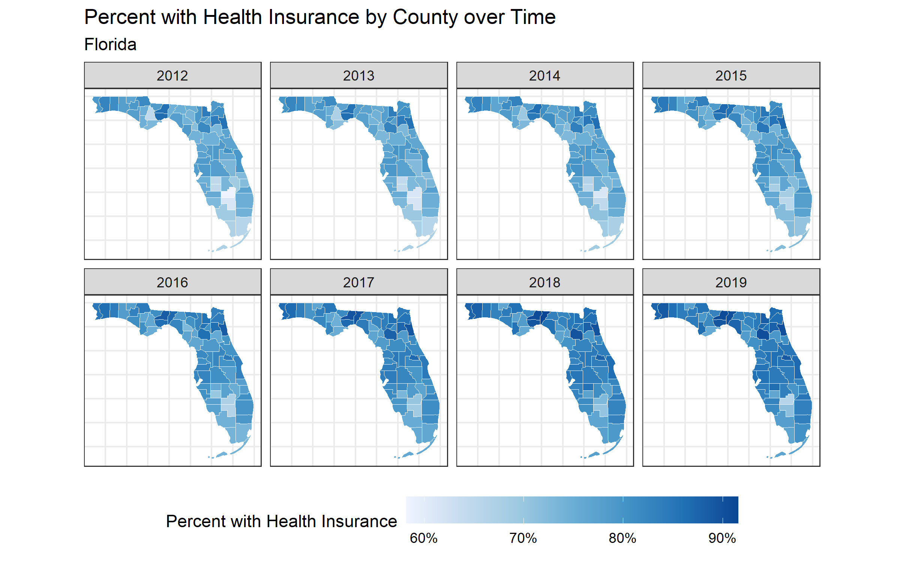
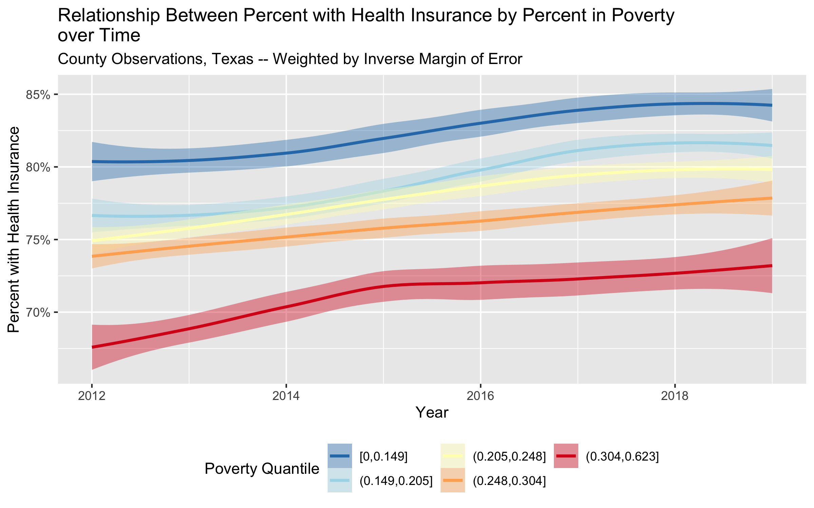

---
output:
  pdf_document: default
  html_document: default
---
# Case Study 4: Case Study on Temporal Trends using American Community Survey (ACS) data (2012-2019) {#temporal-health-insurance}

*By: Dena Javadi, Tamara Ruschovich, Christian Testa*

## Introduction 

The American Community Survey (ACS), conducted by the U.S. census bureau is a yearly survey (monthly samples providing annual updates) that provides vital information on educational attainment, jobs, occupations, veterans, house ownership, disability, poverty status, demographics, [and more](https://www.census.gov/programs-surveys/acs/guidance/subjects.html).

To learn more about the survey methodology used, please visit the [ACS website](https://www.census.gov/programs-surveys/acs/methodology/design-and-methodology.html).

## Motivation, Research Questions, and Learning Objectives

The goal of this case study is to gain familiarity with the ACS, visualize trends over time, model the effect of different Area-Based Social Metrics (ABSMs) on trends in a particular outcome. 

The outcome of interest in this case study is health insurance. The specific learning objectives are to: 

  - Download health outcome and ABSM data from the ACS   
  - Visualize (plot) and map data  
  - Characterize trends in outcome of interest by ABSMs  
  - Work with estimate uncertainty (margin of error) data to:  
  
      - Aggregate it up from stratified estimates (like aggregating private and public insurance rates together into overall insurance rates)
      - Visualize uncertainty for individual areal units over time
      - Model trends over time

Although this case study will follow insurance rates over time from specified counties, the skills learned should be generalizable to pulling other ACS variables at other geographic levels.

In this case study, we are particularly interested in observed differences in health insurance coverage across four US states (Massachusetts, California, Texas, and Florida) from 2012-2019. Our research questions are:  

1) What are the trends in health insurance coverage from 2012-2019 in each state and what is the level of certainty in these trends?    
2) How is county-level poverty associated with health insurance coverage from 2012-2019 in each state?   
3) How is county-level racialized economic segregation as measured by the Index of Concentration at the Extremes (ICE) associated with health insurance coverage from 2012-2019 in each state?  

:::: {.infobox .dataWrangling}
In this next section, **Downloading your Data**, we will show you how to download ACS data by querying the census API and how to manipulate the data into the format we need for the rest of the analysis. This case study investigates the ACS variable of health insurance in four states. See if you can replicate the analysis with a different ACS variable or in different states!
::::

## Downloading your data

Explore the ACS data dictionary to identify the variables of interest and to create your own data dictionary. Here is an example of the [2016 dictionary](https://api.census.gov/data/2016/acs/acs5/variables.html).

```{r}
#| echo = TRUE,
#| eval = FALSE

# We need to load the following packages:
library(tidycensus)
library(tidyverse)
library(tidyr)
library(magrittr) # magrittr defines the %<>% operator, read more here: https://magrittr.tidyverse.org/
library(patchwork)

# build a data dictionary - based on ACS 2013
data_dictionary <- tibble::tribble(
  ~variable,     ~shortname,                       ~description,
  "B18135_002",  'under18_denom',                   "Estimate!!Total!!Under 18 years",
  "B18135_004",  'under18_insured_with_disability', "Estimate!!Total!!Under 18 years!!With a disability!!With health insurance coverage",
  "B18135_009",  'under18_insured_no_disability',   "Estimate!!Total!!Under 18 years!!No disability!!With health insurance coverage",
  "B18135_013",  'adult_denom',                     "Estimate!!Total!!18 to 64 years",
  "B18135_015",  'adult_insured_with_disability',   "Estimate!!Total!!18 to 64 years!!With a disability!!With health insurance coverage",
  "B18135_020",  'adult_insured_no_disability',     "Estimate!!Total!!18 to 64 years!!No disability!!With health insurance coverage",
  # ICEraceinc variables
  "B19001_001",  'hhinc_total',   "total population for household income estimates",
  "B19001A_002", 'hhinc_w_1',     "white n.h. pop with household income <$10k",
  "B19001A_003", 'hhinc_w_2',     "white n.h. pop with household income $10k-14 999k",
  "B19001A_004", 'hhinc_w_3',     "white n.h. pop with household income $15k-19 999k",
  "B19001A_005", 'hhinc_w_4',     "white n.h. pop with household income $20k-24 999k",
  "B19001A_014", 'hhinc_w_5',     "white n.h. pop with household income $100 000 to $124 999",
  "B19001A_015", 'hhinc_w_6',     "white n.h. pop with household income $125k-149 999k",
  "B19001A_016", 'hhinc_w_7',     "white n.h. pop with household income $150k-199 999k",
  "B19001A_017", 'hhinc_w_8',     "white n.h. pop with household income $196k+",
  "B19001_002",  'hhinc_total_1', "total pop with household income <$10k",
  "B19001_003",  'hhinc_total_2', "total pop with household income $10k-14 999k",
  "B19001_004",  'hhinc_total_3', "total pop with household income $15k-19 999k",
  "B19001_005",  'hhinc_total_4', "total pop with household income $20k-24 999k",
  "B05010_002",  'in_poverty',    "total pop in poverty",
  "B05010_001", 'total_pop_for_poverty_estimates', 
                                  "denominator population for poverty estimates"
)

# another way to create a data dictionary is to use tidycensus to get the variables tables and filter it:
acs2012variables <- tidycensus::load_variables(year = 2012, dataset = 'acs5')
acs2012variables %<>% filter(
  name %in% c("B18135_002", "B18135_004", "B18135_009", "B18135_013", "B18135_015", "B18135_020")) 
# then you could append `shortname` data if you'd like

# write a function to help query county insurance rates by state
get_county_health_insurance <- function(state, year) {
  get_acs(state = state, year = year, geography = 'county', variables = data_dictionary$variable)
}

# create a table shell for each year of data for each of texas, massachusetts, florida, and california
health_insurance <- expand.grid(state = c('TX', 'MA', 'FL', 'CA'), year = 2012:2019)

# query the data from ACS
health_insurance %<>% 
  rowwise() %>% 
  mutate(
  acs_data = list(get_county_health_insurance(state = state, year = year))) 

# unnest our data
health_insurance %<>% tidyr::unnest(cols = acs_data)

# recode variables to use friendlier shortnames
# the !!! operator, sometimes called the splat operator, expands a named vector into named argumes for a function;
# in this case, the output of setNames() is a named character vector with variable shortnames as the names and 
# variable codes as the values.  Passing these to !!! and then recode says "rename the variable codes to the 
# more human-readable, shortnames"
health_insurance$variable %<>% recode( !!! setNames(data_dictionary$shortname, data_dictionary$variable))

# pivot into wide format
health_insurance %<>% 
  tidyr::pivot_wider(
    id_cols = c('year', 'state', 'GEOID', 'NAME'),
    names_from = 'variable',
    values_from = c('estimate', 'moe'))

# calculate adult (18+ years), child, and 0-64 insurance rates by county and year 
# Below we are add the estimated number of insured adults with a disability and the number of insured adults without a disability 
# to get the total number of insured adults. We do the same for children and people aged 0-64 years.
health_insurance %<>% mutate(
  # calculate numerators
  estimate_adult_insurance_numerator = (estimate_adult_insured_with_disability + estimate_adult_insured_no_disability),
  estimate_under18_insurance_numerator = (
    estimate_under18_insured_with_disability + estimate_under18_insured_no_disability
  ),
  estimate_zero_to_64_insurance_numerator = (
    estimate_adult_insured_with_disability +
      estimate_adult_insured_no_disability +
      estimate_under18_insured_with_disability +
      estimate_under18_insured_no_disability
  ),
  # calculate denominator
  estimate_zero_to_64_insurance_denom = estimate_under18_denom + estimate_adult_denom,
  # calculate proportions
  estimate_adult_insurance_prop = estimate_adult_insurance_numerator / estimate_adult_denom,
  estimate_under18_insurance_prop = estimate_under18_insurance_numerator / estimate_under18_denom,
  estimate_zero_to_64_insurance_prop = estimate_zero_to_64_insurance_numerator / (estimate_zero_to_64_insurance_denom),
  
  # calculate social metrics
  poverty_prop = estimate_in_poverty / estimate_total_pop_for_poverty_estimates,
  
      # we calculate the people of color low income counts as the overall 
    # low income counts minus the white non-hispanic low income counts
    people_of_color_low_income = 
      (estimate_hhinc_total_1 + estimate_hhinc_total_2 + estimate_hhinc_total_3 + estimate_hhinc_total_4) - 
      (estimate_hhinc_w_1 + estimate_hhinc_w_2 + estimate_hhinc_w_3 + estimate_hhinc_w_4),
    # sum up the white non-hispanic high income counts
    white_non_hispanic_high_income = 
      (estimate_hhinc_w_5 + estimate_hhinc_w_6 + estimate_hhinc_w_7 + estimate_hhinc_w_8),
    # calculate the index of concentration at the extremes for racialized 
    # economic segregation (high income white non-hispanic vs. low income 
    # people of color)
    ICEraceinc = 
      (white_non_hispanic_high_income - people_of_color_low_income) / 
      estimate_hhinc_total,
  )

# use the moe_sum and moe_prop functions from tidycensus to create margin of error
# for aggregated estimates and proportion variables
health_insurance %<>% rowwise() %>% 
  mutate(
    # calculate moe for numerators
  moe_adult_insurance_numerator = tidycensus::moe_sum(
    moe = c(moe_adult_insured_with_disability, moe_adult_insured_no_disability),
    estimate = c(estimate_adult_insured_with_disability, estimate_adult_insured_no_disability)), 
  moe_under18_insurance_numerator = tidycensus::moe_sum(
    moe = c(moe_under18_insured_with_disability, moe_under18_insured_no_disability),
    estimate = c(estimate_under18_insured_with_disability, estimate_under18_insured_no_disability)), 
  moe_zero_to_64_insurance_numerator = tidycensus::moe_sum(
    moe = c(moe_adult_insured_with_disability,
      moe_adult_insured_no_disability,
      moe_under18_insured_with_disability,
      moe_under18_insured_no_disability),
    estimate = c(estimate_adult_insured_with_disability,
      estimate_adult_insured_no_disability,
      estimate_under18_insured_with_disability,
      estimate_under18_insured_no_disability)),
  # calculate moe for proportions
  moe_adult_insurance_prop = tidycensus::moe_prop(
    num = estimate_adult_insurance_numerator,
    denom = estimate_adult_denom,
    moe_num = moe_adult_insurance_numerator,
    moe_denom = moe_adult_denom), 
  moe_under18_insurance_prop = tidycensus::moe_prop(
    num = estimate_under18_insurance_numerator,
    denom = estimate_under18_denom,
    moe_num = moe_under18_insurance_numerator,
    moe_denom = moe_under18_denom), 
  moe_zero_to_64_insurance_prop = tidycensus::moe_prop(
    num = estimate_zero_to_64_insurance_numerator,
    denom = estimate_zero_to_64_insurance_denom,
    moe_num = moe_zero_to_64_insurance_numerator,
    moe_denom = tidycensus::moe_sum(
      moe = c(moe_under18_denom, moe_adult_denom),
      estimate = c(estimate_under18_denom, estimate_adult_denom))
  ))

# use full state names
health_insurance$state %<>% recode(
  CA = 'California',
  FL = 'Florida',
  MA = 'Massachusetts',
  TX = 'Texas')

health_insurance$state %<>% factor(levels = sort(c('California', 'Florida', 'Massachusetts', 'Texas')))

# remove any unncessary variables going forward
health_insurance %<>% select(
  year, state, GEOID, NAME,
  estimate_adult_denom,
  estimate_under18_denom,
  estimate_zero_to_64_insurance_denom,
  estimate_adult_insurance_numerator,
  estimate_under18_insurance_numerator,
  estimate_zero_to_64_insurance_numerator,
  estimate_adult_insurance_prop,
  estimate_under18_insurance_prop,
  estimate_zero_to_64_insurance_prop,
  moe_adult_insurance_prop,
  moe_under18_insurance_prop,
  moe_zero_to_64_insurance_prop,
  poverty_prop,
  ICEraceinc
)

# table the top few lines of our dataframe so we can check that everything is
knitr::kable(head(health_insurance))
```

```{r}
#| eval = FALSE,
#| echo = FALSE
saveRDS(health_insurance, "data/10-temporal-health-insurance/health_insurance.rds")
```

```{r}
#| echo = FALSE
health_insurance <- readRDS("data/10-temporal-health-insurance/health_insurance.rds")
```

Congrats!  You've downloaded your dataset!

## Visualizing your Data

Now on to visualizing estimates:

```{r}
#| echo = FALSE,
#| eval = TRUE
library(tidyverse)
library(sf)
library(mapview)
library(magrittr)
library(patchwork)
```

```{r}
#| echo = TRUE,
#| eval = FALSE
library(colorblindr)
# create plot of county level % with health insurance by year and smooth with geom_smooth method = 'loess' by year 
ggplot(health_insurance, aes(x = year, y = estimate_zero_to_64_insurance_prop, color = state)) + 
  geom_jitter(alpha = 0.6, height = 0) + 
  geom_smooth(method = 'loess', color = 'dimgrey') + 
  facet_wrap(~state) + 
  scale_fill_manual(
    values = setNames(palette_OkabeIto[c(1,2,3,6)],
                      c('Texas', 'Massachusetts', 'Florida', 'California'))
                      ) + 
  scale_color_manual(
    values = setNames(palette_OkabeIto[c(1,2,3,6)],
                      c('Texas', 'Massachusetts', 'Florida', 'California'))
                      ) + 
  xlab("Year") + 
  ylab("Percent with Health Insurance (age 0-64)") + 
  scale_y_continuous(labels = scales::percent_format()) + 
  ggtitle("% with Health Insurance by County and State", 
          "Each dot represents a county observation from ACS\nSmooth fit shows average county observation")

# here's a version using ggdist to plot quantile ribbons on top of the jittered points 
library(ggdist)
ggplot(health_insurance,
       aes(
         x = year,
         y = estimate_zero_to_64_insurance_prop,
         fill = factor(state),
         color = factor(state)
       )) +
  geom_jitter(alpha = 0.3, height = 0) + 
  stat_lineribbon(aes(fill_ramp = stat(level)), color = 'black', alpha = 0.6) + 
  facet_wrap(~state) + 
  scale_fill_manual(
    values = setNames(palette_OkabeIto[c(1,2,3,6)],
                      c('Texas', 'Massachusetts', 'Florida', 'California'))
                      ) + 
  scale_color_manual(
    values = setNames(palette_OkabeIto[c(1,2,3,6)],
                      c('Texas', 'Massachusetts', 'Florida', 'California'))
                      ) + 
  xlab("Year") + 
  ylab("Percent with Health Insurance (ages 0-64)") + 
  ggtitle("% with Health Insurance by County and State, Ages 0-64", 
          "Each dot represents a county observation from ACS\nSmoothed line represents median county estimate") +
  labs(
    fill_ramp = 'Quantile Range',
    color = 'State',
    fill = 'State',
    ) + 
  theme_bw() + 
  guides(fill = guide_legend(reverse = TRUE)) + 
  guides(color = guide_legend(reverse = TRUE)) + 
  scale_y_continuous(labels = scales::percent_format())

```

```{r}
#| echo = FALSE,
#| include = FALSE,
#| eval = FALSE
ggsave("images/10-temporal-health-insurance/perc_with_health_insurance.png", width = 8, height = 4)
```

```{r}
#| echo = FALSE,
#| include = TRUE,

knitr::include_graphics("images/10-temporal-health-insurance/perc_with_health_insurance.png")

```

:::: {.infobox .dataWrangling}
Now, we might want to map our quantities of interest!

Since we didn't download the geometry with our queries to the Census API through
`tidycensus`, we can now download our county geometry from `tigris` and merge it
in. 

We didn't want to download the geometry data in our calls to `tidycensus` for two 
reasons: 
  
  1. Because the `tidycensus` package returns tidy formatted data (one variable
  and observation per row), our geometry data would be repeated many times taking
  up more space than necessary; and
  
  2. Because it's easier to do our aggregation and data manipulation without the
  spatial/geometry data and to add them in afterwards as some functions from
  `dplyr` or the `tidyverse` may not work well with spatial data frames.
  
When you look at the maps, make sure to note the scales because sometimes they 
differ! 
::::


```{r}
#| echo = TRUE,
#| eval = FALSE
counties_sf <- 
  tigris::counties(
    state = c('CA', 'FL', 'MA', 'TX'),
    cb = TRUE,
    resolution = '20m') # here we're downloading 1:20m resolution data 

# make sure to do an inner join since we have more than 1 row per county
# for more information on different types of joins: https://statisticsglobe.com/r-dplyr-join-inner-left-right-full-semi-anti
health_insurance_sf <- inner_join(
  counties_sf %>% select(GEOID, STATE_NAME), # when joining spatial data in, put the spatial data argument first so
  # the output inherits the spatial data class 
  health_insurance,
  by = c('GEOID' = 'GEOID'))

# Function to make maps for each of California, Florida, Massachusetts, Texas
# counties over time
map_health_insurance_over_time <- function(state_name, outcome_var,
                                           fill_label = 'Percent with Health Insurance') {
  health_insurance_sf %>% 
    filter(STATE_NAME == state_name) %>% 
    ggplot(aes(fill = {{ outcome_var }}, label = NAME)) + 
    geom_sf(color = 'white', size = .15) + 
    facet_wrap(~year, nrow = 2) + 
    scale_fill_distiller(palette = 'Blues', direction = 1, labels = scales::percent_format()) + 
    theme_bw() + 
    labs(fill = fill_label) + 
    theme(legend.position = 'bottom',
          axis.text.x = element_blank(),
          axis.text.y = element_blank(),
          axis.ticks.x = element_blank(),
          axis.ticks.y = element_blank(),
          legend.key.width = unit(1.5, 'cm')
          ) + 
    ggtitle("Percent with Health Insurance by County over Time", state_name) 
}

# create choropleth maps over time for each measure
map_health_insurance_over_time('California', estimate_zero_to_64_insurance_prop)
ggsave("images/10-temporal-health-insurance/california.png", width = 5, height = 3)
map_health_insurance_over_time('Florida', estimate_zero_to_64_insurance_prop)
ggsave("images/10-temporal-health-insurance/florida.png", width = 5, height = 3)
map_health_insurance_over_time('Massachusetts', estimate_zero_to_64_insurance_prop)
ggsave("images/10-temporal-health-insurance/massachusetts.png", width = 5, height = 3)
map_health_insurance_over_time('Texas', estimate_zero_to_64_insurance_prop)
ggsave("images/10-temporal-health-insurance/texas.png", width = 5, height = 3)
```


```{r}
#| echo = FALSE,
#| include = TRUE,

knitr::include_graphics("images/10-temporal-health-insurance/california.png")

knitr::include_graphics("images/10-temporal-health-insurance/massachusetts.png")
knitr::include_graphics("images/10-temporal-health-insurance/texas.png")

```

:::: {.infobox .interpretation}
Notice, in Texas there is one county that seems to experience a decrease in insurance coverage over time. This seems strange! What do you think is the reason for this? Let's investigate further. 
::::

:::: {.infobox .dataWrangling}
One way to identify which county in Texas appears to be decreasing is by using the R package plotly. The function ggplotly, produces a map that will allow you to hover your cursor over a county to see the name of the county and the percent with health insurance. This is how we can identify that the percent with health insurance in McCulloch County appears to be decreasing over time. Try it out below!
::::


```{r}
#| echo = TRUE,
#| eval = FALSE
library(plotly)
ggplotly(map_health_insurance_over_time('Texas', estimate_zero_to_64_insurance_prop))

#Now we can take a closer look at McCulloch County, TX and see that it has a large margin of error!
health_insurance %>% 
  filter(NAME == 'McCulloch County, Texas') %>% 
  ggplot(aes(x = year, y = estimate_zero_to_64_insurance_prop,
             ymax = pmin(moe_zero_to_64_insurance_prop/2 + estimate_zero_to_64_insurance_prop, 1),
             ymin = pmax(estimate_zero_to_64_insurance_prop - moe_zero_to_64_insurance_prop/2), 0)) + 
  geom_ribbon(fill = '#3182BD', alpha = .8, size = 0) + 
  geom_line() + 
  geom_point() + 
  scale_y_continuous(labels = scales::percent_format()) + 
  ylab("Percent with Health Insurance") +
  ggtitle("% with Health Insurance, McCulloch County, Texas",
          "90% Margin of Error and Estimates Shown") 

```

:::: {.infobox .dataWrangling}
For more information on how the ACS calculates margin of error, see https://www.census.gov/data/academy/webinars/2020/calculating-margins-of-error-acs.html 
::::

:::: {.infobox .communication}
The margin of error is a measure of uncertainty of the estimate. Often the width of the margin of error has to do with the sample size, whereby very small sample sizes yield estimates with large margins of error. Why do you think it is important to communicate uncertainty in the data to the public?
::::

```{r}
#| echo = TRUE,
#| eval = FALSE
# visualize the margin of error data.
map_health_insurance_over_time('Texas', outcome_var = moe_zero_to_64_insurance_prop,
                               fill_label = 'Margin of Error') +
  scale_fill_distiller(
    palette = 'Greys',
    direction = 1,
    trans = 'log10',
    labels = scales::percent_format()
  )

ggsave("images/10-temporal-health-insurance/texasmoe.png", width = 5, height = 3)

map_health_insurance_over_time('Massachusetts',
                               outcome_var = moe_zero_to_64_insurance_prop,
                               fill_label = 'Margin of Error') +
  scale_fill_distiller(
    palette = 'Greys',
    direction = 1,
    trans = 'log10',
    labels = scales::percent_format()
  )

ggsave("images/10-temporal-health-insurance/massmoe.png", width = 5, height = 3)

map_health_insurance_over_time('Florida', outcome_var = moe_zero_to_64_insurance_prop,
                               fill_label = 'Margin of Error') +
  scale_fill_distiller(
    palette = 'Greys',
    direction = 1,
    trans = 'log10',
    labels = scales::percent_format()
  )

ggsave("images/10-temporal-health-insurance/floridamoe.png", width = 5, height = 3)
```

```{r}
#| echo = FALSE,
#| include = TRUE,


knitr::include_graphics("images/10-temporal-health-insurance/massmoe.png")
knitr::include_graphics("images/10-temporal-health-insurance/floridamoe.png")

```

Congrats!  You can now visualize your estimates and uncertainty in plots and maps. 

## Adding Area Based Social Metrics

Now let's look at our ABSMs. We are going to assess the association between poverty and health insurance and between racialized economic segregation (as measured by the ICE) and health insurance. 

First, we will assess the association between poverty and health insurance by plotting scatter plots of the county percent poverty and the county percent with health insurance. We will add a smoothed line to the scatter using linear regression.  In plot 1, we will use unweighted data, and in plot 2, will use the inverse of the margin of error to weight the data. Can you see a difference when the inverse margin of error weights are included? 

Next, we will plot the trend in heath insurance status by quintiles of poverty and ICE using loess smoothing. 

```{r}
#| echo = TRUE,
#| eval = FALSE
# look at relationship between poverty and insurance proportion
plt1 <- 
health_insurance %>% 
  filter(state == 'Texas') %>% 
  ggplot(aes(x = poverty_prop, y = estimate_zero_to_64_insurance_prop)) + 
  geom_point() + 
  geom_smooth(method = 'lm') + 
  facet_wrap(~year, nrow = 2) + 
  xlab("Percent in Poverty") + 
  ylab("Percent with Health Insurance") + 
  scale_x_continuous(labels = scales::percent_format()) + 
  scale_y_continuous(labels = scales::percent_format()) + 
  ggtitle("Relationship Between Percent in Poverty and Percent with Health Insurance",
          "County Observations, Texas -- Unweighted") 

# the same as above, but with inverse margin of error weighting
plt2 <- 
health_insurance %>% 
  filter(state == 'Texas') %>% 
  ggplot(aes(x = poverty_prop, y = estimate_zero_to_64_insurance_prop, weight = 1/moe_zero_to_64_insurance_prop)) + 
  geom_point() + 
  geom_smooth(method = 'lm') + 
  facet_wrap(~year, nrow = 2) + 
  xlab("Percent in Poverty") + 
  ylab("Percent with Health Insurance") + 
  scale_x_continuous(labels = scales::percent_format()) + 
  scale_y_continuous(labels = scales::percent_format()) + 
  ggtitle("Relationship Between Percent in Poverty and Percent with Health Insurance",
          "County Observations, Texas -- Weighted by Inverse Margin of Error") 

# display plot 1 and 2 over each other
plt1 / plt2 

# massachusetts poverty relationship unweighted
plt1 <- 
health_insurance %>% 
  filter(state == 'Massachusetts') %>% 
  ggplot(aes(x = poverty_prop, y = estimate_zero_to_64_insurance_prop)) + 
  geom_point() + 
  geom_smooth(method = 'lm') + 
  facet_wrap(~year, nrow = 2) + 
  xlab("Percent in Poverty") + 
  ylab("Percent with Health Insurance") + 
  scale_x_continuous(labels = scales::percent_format()) + 
  scale_y_continuous(labels = scales::percent_format()) + 
  labs(title=str_wrap("Relationship Between Percent in Poverty and Percent with Health Insurance",width =33, indent=0, exdent=0),
       subtitle=str_wrap("County Observations, Massachusetts -- Unweighted",width =42, indent=0, exdent=0)) 

# massachusetts poverty relationship weighted by inverse margin of error
plt2 <- 
health_insurance %>% 
  filter(state == 'Massachusetts') %>% 
  ggplot(aes(x = poverty_prop, y = estimate_zero_to_64_insurance_prop, weight = 1/moe_zero_to_64_insurance_prop)) + 
  geom_point() + 
  geom_smooth(method = 'lm') + 
  facet_wrap(~year, nrow = 2) + 
  xlab("Percent in Poverty") + 
  ylab("Percent with Health Insurance") + 
  scale_x_continuous(labels = scales::percent_format()) + 
  scale_y_continuous(labels = scales::percent_format()) + 
  labs(title=str_wrap("Relationship Between Percent in Poverty and Percent with Health Insurance",width =33, indent=0, exdent=0),
       subtitle=str_wrap("County Observations, Massachusetts -- Weighted by Inverse Margin of Error",width =42, indent=0, exdent=0)) 

# display plot 1 and 2 side by side
plt1 + plt2 

```

```{r}
#| echo = FALSE,
#| include = FALSE,
#| eval = FALSE
ggsave("images/10-temporal-health-insurance/povertycomparison.png", width = 5, height = 3)
```

```{r}
#| echo = FALSE,
#| include = TRUE,
#| fig.cap = 'County observations of adult (age 19-64) health insurance rates in California'

knitr::include_graphics("images/10-temporal-health-insurance/povertycomparison.png")

```

Notice the difference in weighted vs unweighted estimates. 

Now we will explore the relationships between ICE and health insurance, weighted by the inverse margin of error as well as poverty and health insurance, weighted by the inverse margin of error.

```{r}
# look at the relationship with ICEraceinc and insurance, weighted by inverse margin of error
health_insurance %>% 
  filter(state == 'Texas') %>% 
  ggplot(aes(x = ICEraceinc, y = estimate_zero_to_64_insurance_prop, weight = 1/moe_zero_to_64_insurance_prop)) + 
  geom_point() + 
  geom_smooth(method = 'lm') + 
  facet_wrap(~year, nrow = 2) + 
  xlab("ICEraceinc") + 
  ylab("Percent with Health Insurance") + 
  scale_y_continuous(labels = scales::percent_format()) + 
  ggtitle("Relationship Between ICE for Racialized Economic Segregation and \nPercent with Health Insurance",
          "County Observations, Texas -- Weighted by Inverse Margin of Error") 


# smoothed insurance relationship with ICEraceinc quantiles over time 
# using loess smoothing
health_insurance %>% 
  filter(state == 'Texas') %>% 
  ggplot(aes(x = year, y = estimate_zero_to_64_insurance_prop, 
             color = cut(ICEraceinc, quantile(ICEraceinc, seq(0, 1, .2)), include.lowest = T),
             fill = cut(ICEraceinc, quantile(ICEraceinc, seq(0, 1, .2)), include.lowest = T),
             weight = 1/moe_zero_to_64_insurance_prop)) + 
  # geom_jitter(height = 0) + 
  geom_smooth(alpha = 0.5, alpha = .5) +
  scale_color_brewer(palette = 'RdYlBu') + 
  scale_fill_brewer(palette = 'RdYlBu') + 
  xlab("Year") +
  ylab("Percent with Health Insurance") + 
  guides(fill = guide_legend(nrow = 2), color = guide_legend(nrow = 2)) + 
  labs(fill = "ICEraceinc Quantile", color = "ICEraceinc Quantile") + 
  theme(legend.position = 'bottom') + 
  scale_y_continuous(labels = scales::percent_format()) + 
  ggtitle("Relationship Between Percent with Health Insurance by ICE for Racialized \nEconomic Segregation over Time",
          "County Observations, Texas -- Weighted by Inverse Margin of Error") 
ggsave("images/10-temporal-health-insurance/healthinsurance_ICE_time.png", width = 5, height = 3)

# smoothed relationship between poverty (cut in quantiles) and insurance rates
# using loess smoothing
health_insurance %>% 
  filter(state == 'Texas', ! is.na(poverty_prop)) %>% 
  ggplot(aes(x = year, y = estimate_zero_to_64_insurance_prop, 
             color = cut(poverty_prop, quantile(poverty_prop, seq(0, 1, .2),na.rm=T),
                         include.lowest = TRUE),
             fill = cut(poverty_prop, quantile(poverty_prop, seq(0, 1, .2),na.rm=T),
                         include.lowest = TRUE),
             weight = 1/moe_zero_to_64_insurance_prop
             )) + 
  geom_smooth() + 
  scale_color_brewer(palette = 'RdYlBu', direction = -1) + 
  scale_fill_brewer(palette = 'RdYlBu', direction = -1) + 
  xlab("Year") +
  ylab("Percent with Health Insurance") + 
  scale_y_continuous(labels = scales::percent_format()) + 
  guides(fill = guide_legend(nrow = 2), color = guide_legend(nrow = 2)) + 
  labs(fill = "Poverty Quantile", color = "Poverty Quantile") + 
  theme(legend.position = 'bottom') + 
  ggtitle("Relationship Between Percent with Health Insurance by Percent in Poverty \nover Time",
          "County Observations, Texas -- Weighted by Inverse Margin of Error")
ggsave("images/10-temporal-health-insurance/healthinsurance_poverty_time.png", width = 5, height = 3)

```


```{r}
#| echo = FALSE,
#| include = TRUE,




```


Now, we are going to use linear regression with inverse margin of error weighting to assess the trends in insurance coverage by county. We will categorize each county as increase, stable/uncertain, or decreasing. We will visualize these results with both maps and histograms.

```{r fit models to insurance data}
#| eval = FALSE,
#| echo = TRUE

# cleaning before modeling
health_insurance %<>% rename(county = NAME)
health_insurance %<>% mutate(year_centered = year - mean(c(2012, 2019)))

# create linear models with inverse margin of error weighting for each county
# regressing insurance rates on year
model_df <- 
  health_insurance %>% 
  nest_by(GEOID, county, state) %>% 
  mutate(
    # for each county, fit a linear model and store it in a list column
    model = list(
      lm(
        estimate_zero_to_64_insurance_prop ~ year_centered,
        data = data,
        weights = 1 / data$moe_zero_to_64_insurance_prop
      )
    ), 
    # use broom::tidy to extract coefficients
    coefs = list(broom::tidy(model, conf.int=T)),
  ) %>% 
  rowwise() %>% 
  # extract coefficients on year for each model
  mutate(
    coef_on_year = coefs %>% filter(term == 'year_centered') %>% pull(estimate),
    coef_on_year_ci_low = coefs %>% filter(term == 'year_centered') %>% pull(conf.low),
    coef_on_year_ci_high = coefs %>% filter(term == 'year_centered') %>% pull(conf.high)
  )

# plot coefficients distribution
model_df %>% 
  ggplot(aes(x = coef_on_year)) + 
  geom_vline(xintercept = 0, alpha = .5, linetype = 'dashed') + 
  geom_histogram() + 
  scale_x_continuous(labels = scales::percent_format()) + 
  xlab("Coefficient Estimates for Average Percentage Point Increase Each Year") + 
  facet_wrap(~state) + 
  ggtitle("Estimates for County Change in Percent with Health Insurance")

ggsave("images/10-temporal-health-insurance/estimate_countychange.png", width = 8, height = 4)

# classify into increasing, decreasing, or uncertain/stable
model_df %<>% mutate(
  change_over_time = case_when(
    coef_on_year_ci_low > 0 ~ 'increasing',
    coef_on_year_ci_high < 0 ~ 'decreasing',
    TRUE ~ 'stable/uncertain'
  )
)

# make factor levels for change over time
model_df %<>% mutate(change_over_time = factor(
  change_over_time,
  levels = c('decreasing', 'stable/uncertain', 'increasing')
))

# plot distribution of change over time categories
model_df %>% 
  ggplot(aes(x = change_over_time)) + 
  geom_bar() + 
  facet_wrap(~state) + 
  theme(axis.text.x = element_text(angle = 75, hjust = 1))

# merge in spatial data and coefficients
health_insurance_sf_w_model_coefs <- 
  health_insurance %>% 
  # nest by GEOID, county, and state so we can make interactive popup graphs by county 
  nest_by(GEOID, county, state) %>% 
  # join in the change over time variables
  left_join(model_df %>% ungroup() %>% select(GEOID, coef_on_year, change_over_time), by = c('GEOID' = 'GEOID')) %$% 
  # join in the spatial data; 
  # we use %$% for this because when joining spatial data and tabular data, it is critical 
  # that the spatial data be passed as the first argument to the join function
  left_join(health_insurance_sf %>% filter(year == min(year)) %>% select(GEOID),
            ., by = c('GEOID'))

# plot texas change over time 
health_insurance_sf_w_model_coefs %>% 
  filter(state == 'Texas') %>% 
  ggplot(aes(fill = change_over_time)) + 
  geom_sf(color = 'white', size = .05, alpha = .8) + 
  scale_fill_manual(values = c('increasing' = '#67A9CF', 
                                'stable/uncertain' = '#FFFFBF', 
                                'decreasing' = '#EF8A62'
                               )) + 
  theme_bw() + 
  labs(fill = 'Change over Time') + 
  ggtitle("Change in Health Insurance Rates, 2012-2019, Texas")

health_insurance_sf_w_model_coefs %>% 
  filter(state == 'Texas') %>% 
  ggplot(aes(fill = coef_on_year)) + 
  geom_sf(color = 'white', size = .1) + 
  scale_fill_gradient2(high = '#0072B2',
                       mid = '#FFFFBF',
                       low = '#D55E00') + 
  theme_bw() + 
  labs(fill = 'Change over Time') + 
  ggtitle("Change in Health Insurance Rates, 2012-2019, Texas")


library(leaflet)
library(leafpop)

pal <- colorFactor(palette = RColorBrewer::brewer.pal(name='RdBu', n = 3), 
                   domain = health_insurance_sf_w_model_coefs$change_over_time)

tx_health_insurance_sf_w_model_coefs <- 
  health_insurance_sf_w_model_coefs %>% filter(state == 'Texas')

tx_health_insurance_sf_w_model_coefs %<>% 
  rowwise() %>% mutate(
  plot = list(ggplot(
    data = data,
    mapping = aes(
      x = year, 
      y = estimate_zero_to_64_insurance_prop, 
      ymin = pmax(estimate_zero_to_64_insurance_prop - (1.96/1.645)*moe_zero_to_64_insurance_prop, 0),
      ymax = pmin(estimate_zero_to_64_insurance_prop + (1.96/1.645)*moe_zero_to_64_insurance_prop, 1)
      )) + 
      geom_pointrange() + 
      geom_line() + 
      ylab("Percent with Health Insurance\nAge 0-64") +
      ggtitle(county) + 
      scale_y_continuous(labels = scales::percent_format())
  )
)

map <- 
  tx_health_insurance_sf_w_model_coefs %>% 
  leaflet() %>% 
  addTiles() %>% 
  addPolygons(color = ~pal(change_over_time), 
              label = ~county,
              popup = popupGraph(tx_health_insurance_sf_w_model_coefs$plot, type = 'png', width = 400, height = 400),
              weight = 1) %>% 
  addLegend(
    position = 'topright',
    pal = pal,
    values = c('increasing', 'stable/uncertain', 'decreasing'),
    labels = c('Increasing', 'Stable/Uncertain', 'Decreasing')
  )

# additional ways to map change in insurance coverage over time
library(htmlwidgets)
saveWidget(map, "map.html")

health_insurance_sf %>% 
  filter(year == min(year)) %>% 
  left_join(model_df %>% ungroup() %>% select(GEOID, change_over_time), by = c('GEOID' = 'GEOID')) %>% 
  filter(state == 'Texas') %>% 
  ggplot(aes(fill = change_over_time)) + 
  geom_sf(color = 'white', size = .05) + 
  scale_fill_manual(values = c('increasing' = '#67A9CF', 
                                'uncertain/stable' = '#FFFFBF', 
                                'decreasing' = '#EF8A62'
                               )) 
  
health_insurance_sf %>% 
  filter(year == min(year)) %>% 
  left_join(model_df %>% ungroup() %>% select(GEOID, change_over_time), by = c('GEOID' = 'GEOID')) %>% 
  filter(state == 'Florida') %>% 
  ggplot(aes(fill = change_over_time)) + 
  geom_sf(color = 'white', size = .05) + 
  scale_fill_manual(values = c('increasing' = '#67A9CF', 
                                'uncertain/stable' = '#FFFFBF', 
                                'decreasing' = '#EF8A62'
                               )) 

health_insurance_sf %>% 
  filter(year == min(year)) %>% 
  left_join(model_df %>% ungroup() %>% select(GEOID, change_over_time), by = c('GEOID' = 'GEOID')) %>% 
  filter(state == 'California') %>% 
  ggplot(aes(fill = change_over_time)) + 
  geom_sf(color = 'white', size = .05) + 
  scale_fill_manual(values = c('increasing' = '#67A9CF', 
                                'uncertain/stable' = '#FFFFBF', 
                                'decreasing' = '#EF8A62'
                               ))

```


```{r}
#| echo = FALSE,
#| include = TRUE,
#| fig.cap = 'County observations of adult (age 19-64) health insurance rates in California'

knitr::include_graphics("images/10-temporal-health-insurance/estimate_countychange.png")


```

What additional analyses might you be interested in?
