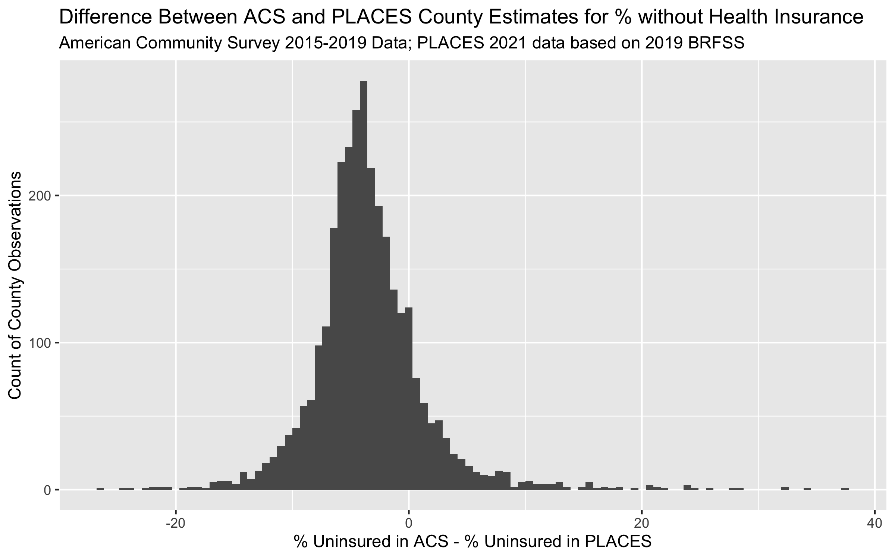

# Case Study 5: Case Study Comparing County Analyses of Inequities in Health Insurance using ACS vs. CDC PLACES data (2019) {#health-insurance-comparison}

## Introduction 

The [CDC PLACES](https://www.cdc.gov/places/) dataset and [American Community Survey (ACS)](https://www.census.gov/data/developers/data-sets/acs-5year.html) 
represent two distinct approaches to collecting and reporting on small area 
level data:  the CDC PLACES uses a method called small area estimation (SAE)
to produce estimates at the Census tract level, while the ACS provides survey 
based estimates directly at the Census tract level.

The [methodology page from CDC PLACES](https://www.cdc.gov/places/methodology/index.html) provides
further explanation as to exactly how they implemented SAE. 

In their article [*Multilevel Regression and Postratification for Small-Area Estimation of Population Health Outcomes: A Case Study of Chronic Obstructive Pulmonary Disease Prevalence Using the Behavioral Risk Factor Surveillance System*](http://aje.oxfordjournals.org/content/179/8/1025.full.pdf?cited-by=yes&legid=amjepid;179/8/1025), Zhang et al. describe how SAE was performed to estimate  
chronic obstructive pulmonary disease (COPD) in CDC PLACES.

## Motivation, Research Questions, and Learning Objectives

The goal of this case study is to gain familiarity with the ACS and CDC’s
PLACES, understand how SAEs are created, and visualize comparisons between SAEs.
The outcome of interest in this case study is health insurance. The specific
learning objectives are to: Download specific ACS and CDC’s PLACES data
Visualize (plot) and map estimates Characterize trends in the estimates by area
based socioeconomic measures (ABSMs) Understand limitations of SAEs Explore
validity of model-based estimates Understand the effect of smoothing estimates
in very small areas Given that both CDC PLACES and the ACS provide estimates of
the Census tract prevalence of health insurance, we were interested in assessing
what difference there are between the two datasets and how that difference may
vary according to area based social metrics (ABSMs) and estimation of health
inequities.

Given that both CDC PLACES and the ACS provide estimates of the Census tract 
prevalence of health insurance, we were interested in assessing what difference 
there are between the two datasets and how that difference may vary according
to area based social measures (ABSMs). 

## Understanding Small Area Estimates

_**What is Small Area Estimation?**_

Goal: To provide finer geographic detail of published statistics for
various subpopulations.

Problem: Surveys generally do not provide large enough samples for
reliable direct estimates for small areas (counties, and especially
census tracts).

Challenges: model misspecification and failure to account for
informative sampling.

How valid and reliable are the PLACES county level estimates?

  -   Depends on quality of underlying data
  -   Depends on assumptions and appropriateness of statistical models
      used
  -   smaller uncertainty ranges for model-based estimates as compared to
      direct estimates
  -   smoothing out of local geographic variation which results in
      potentially underestimating small areas with high prevalence
      estimates and overestimating small areas with lower prevalence
      estimates
  -   higher discrepancies for behavior indicators than for diagnosed
      chronic diseases potentially due to different biases such as
      self-report or recall bias
  
Model based estimates are also not sensitive to local area interventions or
shocks, meaning that prevalence may be over or underestimated based on prior
trends without accounting for what local surveys may capture - such as a
targeted local intervention or a disaster event. An example of this can be seen
in Zhang et al's study where model-based estimates of current smoking prevalence
for two adjacent counties in Missouri were 24.2% and 25.0% while direct survey
estimates from a local survey were 25.3% and 13.5% due to the latter county's
local tobacco control initiative.

_**What is Multilevel Regression and Post-stratification (MRP)?**_

Multilevel statistical modeling framework linking geocoded health
surveys and high spatial resolution population demographic and
socioeconomic data

To conduct MRP, we need:
  
  -   Surveys with outcome of interest, demographic data, and geographic
      indicator
  -   The geographic and demographic data will be used as predictors in
      the first stage model to define geographic and demographic levels
      for the second stage
  -   Continuous variables will need to be split into intervals to create
      levels
  -   Factors and levels must match those in the poststratification table
      (so individual level demographic and geographic variables must match
      population level variables)

_**What is a postratification table?**_
  
  -   Representation of the combination of demographic and geographic
      factors that correspond to the number of individuals in a population
      of interest
  -   The number of rows in a poststratification table would correspond to
      the product of the number of options for each of the variables
      included
      -   I.e. 6 age groups \* 3 gender categories \* 8 racialized
          categories \* 50 states = 7200 rows
  -   First stage
      -   Multilevel logistic regression model
  -   Second stage
      -   Weight model predictions for each subgroup by population
          estimated frequency of these subgroups
      -   Considerations: missing variables for post-stratification table,
          nonresponse, missing data, inclusion of interaction terms
          (useful for studying demographic subgroups within geographic
          levels) and use of structured priors to share information across
          levels of a factor, violation of positivity assumption

## Create our Cleaned Dataset

```{r}
#| eval = FALSE,
#| echo = FALSE
# if running the following code chunk in developing the bookdown, you may put
# the CDC places dataset at this relative path (which is gitignored to avoid
# bloating the repository);  download the county dataset and store it at the 
# path below from the following url: 
# https://chronicdata.cdc.gov/500-Cities-Places/PLACES-Local-Data-for-Better-Health-County-Data-20/swc5-untb
places <- readr::read_csv("data/11-health-insurance-comparison/places_2021_release_county_level.csv")
```

```{r}
#| eval = FALSE
# dependencies 
library(tidyverse)
library(magrittr)
library(tidycensus)

# get our data from PLACES 
# download the county level data from https://chronicdata.cdc.gov/500-Cities-Places/PLACES-Local-Data-for-Better-Health-County-Data-20/swc5-untb 
# rename it to "places_2021_release_county_level.csv"
places <- readr::read_csv("places_2021_release_county_level.csv")


# filter for our measure of interest
places %<>% filter(Measure == "Current lack of health insurance among adults aged 18-64 years") 

# download ACS data
# remember you can check the variable table here: 
# https://api.census.gov/data/2019/acs/acs5/variables.html  
acs <- tidycensus::get_acs(
  geography = 'county',
  variables = c(
    'total_population' = 'B18135_013E',
    'with_disability_no_insurance' = 'B18135_018E',
    'no_disability_no_insurance' = 'B18135_023E'
  ), 
  year = 2019,
  state = c(state.abb, 'DC'),
  geometry = TRUE,
  output = 'tidy',
  survey = 'acs5')

# recode the variable names
acs_cleaned <- acs %>% 
  as_tibble() %>%  # as_tibble drops the geometry, which causes an error later with data manipulation
  select(GEOID, variable, estimate, moe) %>% 
  mutate(
    variable = recode(variable,
                      "B18135_013" = "total 19-64 population",
                      "B18135_018" = "uninsured 19-64 population, disabled",
                      "B18135_023" = "uninsured 19-64 population, not disabled"))

# pivot wider so we can do arithmetic with the columns
acs_cleaned %<>% 
  pivot_wider(  # pivot into a wide format so we can do arithmetic with the columns
    id_cols = GEOID,
    names_from = variable,
    values_from = c(estimate, moe)) 

# calculate rates of uninsurance and corresponding margin of error
acs_cleaned %<>% 
  janitor::clean_names() %>% 
  rowwise() %>% # rowwise is necessary for the tidycensus::moe_* functions to work correctly
  mutate(
    # calculate uninsured numerator 
    uninsured_numerator = (
      estimate_uninsured_19_64_population_disabled + estimate_uninsured_19_64_population_not_disabled
    ),
    uninsured_numerator_moe = tidycensus::moe_sum(
      moe = c(
        moe_uninsured_19_64_population_disabled,
        moe_uninsured_19_64_population_not_disabled
      ),
      estimate = c(
        estimate_uninsured_19_64_population_disabled,
        estimate_uninsured_19_64_population_not_disabled
      )
    ),
    # calculate proportion uninsured
    pct_uninsured_19_64_acs = uninsured_numerator / estimate_total_19_64_population * 100,
    # calculate moe for percent uninsured
    pct_uninsured_19_64_acs_moe =
      tidycensus::moe_prop(
        num = uninsured_numerator,
        denom = estimate_total_19_64_population,
        moe_num = uninsured_numerator_moe,
        moe_denom = moe_total_19_64_population
      ) * 100
  ) %>%
  select(geoid, pct_uninsured_19_64_acs, pct_uninsured_19_64_acs_moe, estimate_total_19_64_population) # select only the columns we need

# join the places and acs datasets
uninsurance <- places %>% full_join(acs_cleaned, by = c("LocationID" = "geoid"))

# rename to geoid for consistency
uninsurance %<>% rename(geoid = LocationID)

# extract the counties shapefile from what we downloaded from acs
county_sf <-
  acs %>%
  # it doesn't matter which variable is used here, we just have to make sure
  # we only get one measure per census tract
  filter(variable == variable[[1]]) %>%
  # select just the GEOID so we get the GEOID and geometry
  select(GEOID)
  
# join in the counties shapefile data
uninsurance <- 
  county_sf %>% 
  left_join(
    uninsurance,
    by = c("GEOID" = 'geoid'))

# clean the column names
uninsurance %<>% select(
  GEOID,
  Year,
  StateAbbr,
  StateDesc,
  LocationName,
  Data_Value,
  Low_Confidence_Limit,
  High_Confidence_Limit,
  pct_uninsured_19_64_acs,
  pct_uninsured_19_64_acs_moe,
  estimate_total_19_64_population
) %>%
  janitor::clean_names() %>%
  ungroup() %>%
  rename(
    state_name = state_desc,
    county_name = location_name,
    pct_uninsured_18_64_places = data_value,
    pct_uninsured_18_64_places_ci_low = low_confidence_limit,
    pct_uninsured_18_64_places_ci_high = high_confidence_limit
  )

# calculate confidence intervals for the percent uninsured 
uninsurance %<>% mutate(
  pct_uninsured_19_64_acs_moe_95pct = 1.96 / 1.645 * pct_uninsured_19_64_acs_moe,
  pct_uninsured_18_64_acs_ci_low = pmax(
    pct_uninsured_19_64_acs - pct_uninsured_19_64_acs_moe_95pct,
    0
  ),
  pct_uninsured_18_64_acs_ci_high = pmin(
    pct_uninsured_19_64_acs + pct_uninsured_19_64_acs_moe_95pct,
    100
  )
)
```

```{r}
#| eval=FALSE,
#| echo=FALSE
saveRDS(
  uninsurance,
  "data/11-health-insurance-comparison/county_uninsurance.rds"
)
```

## Visualizing the Data

```{r}
#| eval=FALSE
# load our cleaned dataset
uninsurance <- readRDS(here("data/11-health-insurance-comparison/county_uninsurance.rds"))

# calculate the difference in the 
uninsurance %<>% mutate(
  difference_in_acs_minus_places = pct_uninsured_19_64_acs - pct_uninsured_18_64_places
)

# plot the distribution of difference in ACS vs. PLACES
ggplot(uninsurance, aes(x = difference_in_acs_minus_places)) + 
  geom_histogram(bins = 100) + 
  ylab("Count of County Observations") + 
  xlab("% Uninsured in ACS - % Uninsured in PLACES") + 
  ggtitle("Difference Between ACS and PLACES County Estimates for % without Health Insurance",
      subtitle = "American Community Survey 2015-2019 Data; PLACES 2021 data based on 2019 BRFSS") 
```

```{r}
#| eval=FALSE,
#| echo=FALSE
ggsave(
  "images/11-health-insurance-comparison/histogram.png",
  width = 8,
  height = 5
)
```

```{r}
#| echo = FALSE

```

```{r}
#| eval=FALSE
ggplot(uninsurance,
       aes(x = pct_uninsured_19_64_acs, y = pct_uninsured_18_64_places))+
  geom_point(alpha = 0.5) + 
  geom_abline(slope = 1, intercept = 0) + 
  geom_smooth(method = 'lm') + 
  scale_x_continuous(breaks = seq(0, 60, 10), limits = c(0, NA)) + 
  scale_y_continuous(breaks = seq(0, 60, 10), limits = c(0, NA)) + 
  ylab("PLACES Estimate of % without Health Insurance") + 
  xlab("ACS Estimate of % without Health Insurance") + 
  ggtitle("Comparing ACS vs. PLACES Estimate of % without Health Insurance by County",
    subtitle = "American Community Survey 2015-2019 Data; PLACES 2021 data based on 2019 BRFSS")
```

```{r}
#| eval=FALSE,
#| echo=FALSE
ggsave(
  "images/11-health-insurance-comparison/scatter.png",
  width = 8,
  height = 8
)
```

```{r}
#| fig.cap = paste0("A scatterplot of ACS vs. PLACES estimates for the % without health insurance. ",
#|   "The solid line shoes the line with slope = 1 and intercept = 0, while the line in blue shows ",
#|   "a linear model line of best fit."),
#| echo = FALSE
knitr::include_graphics("images/11-health-insurance-comparison/scatter.png")
```

```{r}
#| eval=FALSE
ggplot(uninsurance,
       aes(x = estimate_total_19_64_population, y = difference_in_acs_minus_places ))+
  geom_point(alpha = 0.5) + 
  scale_x_log10(
    breaks = c(1e4,1e5,1e7),
    labels = c("1,000", "100,000", "10m")
    ) + 
  labs(x = "19-64 Population Size Estimate, ACS 2015-2019",
       y = "ACS % Uninsured - PLACES % Uninsured") +
  ggtitle("Comparing ACS vs. PLACES Estimate of % without Health Insurance by County",
    subtitle = "American Community Survey 2015-2019 Data; PLACES 2021 data based on 2019 BRFSS")
```

```{r}
#| eval=FALSE,
#| echo=FALSE
ggsave(
  "images/11-health-insurance-comparison/population_size_vs_difference_scatter.png",
  width = 8,
  height = 6
)
```

```{r}
#| echo=FALSE
knitr::include_graphics("images/11-health-insurance-comparison/population_size_vs_difference_scatter.png")
```

## Adding ABSMs

```{r}
#| eval = FALSE
variables_dict <-
  tibble::tribble(
  # ICEraceinc
  ~var, ~varname, ~description,
  # total population
  "B01001_001",  "total_popsize", "total population estimate", 
  
  # racial composition 
  'B01003_001',  "race_ethnicity_total", "race_ethnicity_total",
  
  # ICEraceinc
  "B19001_001",  'hhinc_total',   "total population for household income estimates",
  "B19001A_002", 'hhinc_w_1',     "white n.h. pop with household income <$10k",
  "B19001A_003", 'hhinc_w_2',     "white n.h. pop with household income $10k-14 999k",
  "B19001A_004", 'hhinc_w_3',     "white n.h. pop with household income $15k-19 999k",
  "B19001A_005", 'hhinc_w_4',     "white n.h. pop with household income $20k-24 999k",
  "B19001A_014", 'hhinc_w_5',     "white n.h. pop with household income $100 000 to $124 999",
  "B19001A_015", 'hhinc_w_6',     "white n.h. pop with household income $125k-149 999k",
  "B19001A_016", 'hhinc_w_7',     "white n.h. pop with household income $150k-199 999k",
  "B19001A_017", 'hhinc_w_8',     "white n.h. pop with household income $196k+",
  "B19001_002",  'hhinc_total_1', "total pop with household income <$10k",
  "B19001_003",  'hhinc_total_2', "total pop with household income $10k-14 999k",
  "B19001_004",  'hhinc_total_3', "total pop with household income $15k-19 999k",
  "B19001_005",  'hhinc_total_4', "total pop with household income $20k-24 999k",

  # poverty
  "B05010_002",  'in_poverty',    "population with household income < poverty line",
  "B05010_001",  'total_pop_for_poverty_estimates',  "total population for poverty estimates",

  # median income
  "B06011_001",  'median_income',  "median income estimate for total population",
  
  # crowded housing
  "B25014_005",  'owner_occupied_crowding1', 'owner occupied, 1 to 1.5 per room',
  "B25014_006",  'owner_occupied_crowding2', 'owner occupied, 1.51 to 2 per room',
  "B25014_007",  'owner_occupied_crowding3', 'owner occupied, 2.01 or more per room',
  "B25014_011",  'renter_occupied_crowding1', 'owner occupied, 1 to 1.5 per room',
  "B25014_012",  'renter_occupied_crowding2', 'owner occupied, 1.51 to 2 per room',
  "B25014_013",  'renter_occupied_crowding3', 'owner occupied, 2.01 or more per room',
  "B25014_001",  'crowding_total',            'total for crowding (occupants per room)',
  
  "B01001I_001",  'total_hispanic',           'total hispanic population estimate',
  "B01001B_001",  'total_black',              'total black, hispanic or non-hispanic estimate',
  "B01001H_001",  'total_white_nh',           'total white, non-hispanic population estimate'
)

# fetch the absms from the American Community Survey API 
absms <- tidycensus::get_acs(
  geography = 'county',
  state = c(state.abb, 'DC'),
  year = 2019,
  variables = variables_dict$var)


# pivot to a wide format for renaming, dropping the margin of error data
absms %<>% select(-moe) %>% pivot_wider(names_from = variable, values_from = estimate)

# rename the columns using our rename_vars
# 
# first we create a named vector, rename_vars, which has elements that are the
# acs variables we request and convenient, human readable names.
# 
# then we use rename_vars with the rename function from dplyr. 
# typically the rename function takes a syntax as follows: 
#   data %>% rename(oldname1 = newname1, oldname2 = newname2, ...)
# but in our case, we already have a named vector (rename_vars) that we 
# want to use, and so to use the rename_vars named vector inside rename
# we use the injection-operator `!!`.  you can learn more about the injection
# operator by running ?`!!` in your R console. 
rename_vars <- setNames(variables_dict$var, variables_dict$varname)
absms <- absms %>% rename(!!rename_vars)

# calculate ABSMs
absms %<>%
  mutate(
    # we calculate the people of color low income counts as the overall
    # low income counts minus the white non-hispanic low income counts
    people_of_color_low_income =
      (hhinc_total_1 + hhinc_total_2 + hhinc_total_3 + hhinc_total_4) -
      (hhinc_w_1 + hhinc_w_2 + hhinc_w_3 + hhinc_w_4),
    # sum up the white non-hispanic high income counts
    white_non_hispanic_high_income =
      (hhinc_w_5 + hhinc_w_6 + hhinc_w_7 + hhinc_w_8),
    # calculate the index of concentration at the extremes for racialized
    # economic segregation (high income white non-hispanic vs. low income
    # people of color)
    ICEraceinc =
      (white_non_hispanic_high_income - people_of_color_low_income) /
      hhinc_total,

    prop_in_poverty = in_poverty / total_pop_for_poverty_estimates,
    
    crowding = (
      owner_occupied_crowding1 + owner_occupied_crowding2 + owner_occupied_crowding3 +
        renter_occupied_crowding1 + renter_occupied_crowding2 + renter_occupied_crowding3
    ) / crowding_total,
    
    prop_black = total_black / total_popsize,
    prop_hispanic = total_hispanic / total_popsize,
    prop_white_nh = total_white_nh / total_popsize
  ) %>%
  select(
    GEOID,
    ICEraceinc,
    prop_in_poverty,
    median_income,
    crowding,
    prop_black,
    prop_hispanic,
    prop_white_nh
  )

# join in the ABSMs data
uninsurance %<>% left_join(
  select(
    absms,
    GEOID,
    ICEraceinc,
    prop_in_poverty,
    median_income,
    crowding,
    prop_black,
    prop_hispanic,
    prop_white_nh
  ),
  by = c('geoid' = 'GEOID')
)

# add quantile cutpoints to ICEraceinc
ICEraceinc_cutpoints <- Hmisc::wtd.quantile(uninsurance$ICEraceinc,
                                            weights = uninsurance$estimate_total_19_64_population,
                                            probs = seq(0,1,.2))
uninsurance %<>% mutate(
  ICEraceinc_cut = cut(ICEraceinc, ICEraceinc_cutpoints, include.lowest = TRUE))

# reverse the factor ordering so the most advantaged group is the reference category
uninsurance$ICEraceinc_cut %<>% forcats::fct_rev()

# add cutpoints to pct in poverty
uninsurance %<>% mutate(
  poverty_cut = cut(
    prop_in_poverty, 
    c(0,.05,.1,.15,.2,1),
    include.lowest=TRUE
  )
)

# add cutpoints to median income
median_income_cutpoints <- Hmisc::wtd.quantile(uninsurance$median_income,
                                               weights = uninsurance$total_popsize,
                                               probs = seq(0,1,.2))
uninsurance %<>% mutate(
  median_income_cut = cut(
    median_income, 
    median_income_cutpoints,
    include.lowest=TRUE
  )
)
uninsurance$median_income_cut %<>% forcats::fct_rev()

# add cutpoints to crowding
crowding_cutpoints <- Hmisc::wtd.quantile(uninsurance$crowding,
                                               weights = uninsurance$total_popsize,
                                               probs = seq(0,1,.2))
uninsurance %<>% mutate(
  crowding_cut = cut(
    crowding, 
    crowding_cutpoints,
    include.lowest=TRUE
  )
)


# add cutpoints to proportion black
prop_black_cutpoints <- Hmisc::wtd.quantile(uninsurance$prop_black,
                                               weights = uninsurance$total_popsize,
                                               probs = seq(0,1,.2))
uninsurance %<>% mutate(
  prop_black_cut = cut(
    prop_black, 
    prop_black_cutpoints,
    include.lowest=TRUE
  )
)

# add cutpoints to proportion hispanic
prop_hispanic_cutpoints <- Hmisc::wtd.quantile(uninsurance$prop_hispanic,
                                               weights = uninsurance$total_popsize,
                                               probs = seq(0,1,.2))
uninsurance %<>% mutate(
  prop_hispanic_cut = cut(
    prop_hispanic, 
    prop_hispanic_cutpoints,
    include.lowest=TRUE
  )
)

# add cutpoints to proportion white
prop_white_nh_cutpoints <- Hmisc::wtd.quantile(uninsurance$prop_white_nh,
                                               weights = uninsurance$total_popsize,
                                               probs = seq(0,1,.2))
uninsurance %<>% mutate(
  prop_white_nh_cut = cut(
    prop_white_nh, 
    prop_white_nh_cutpoints,
    include.lowest=TRUE
  )
)
```

```{r}
#| eval=FALSE
model_formulae <- 
  tidyr::expand_grid(
    exposure = c('ICEraceinc_cut',
      'poverty_cut',
      'median_income_cut',
      'crowding_cut',
      'prop_black_cut',
      'prop_hispanic_cut',
      'prop_white_nh_cut'),
    outcome = c('pct_uninsured_19_64_acs', 'pct_uninsured_18_64_places'))

model_formulae %<>% mutate(formula = paste0(outcome, " ~ ", exposure))

model_formulae %<>% rowwise() %>% mutate(
  model = list(
    # note that you do need to have the MASS package installed;
    # we aren't loading it with library() anywhere it because it causes
    # conflicts with the dplyr::select function
    MASS:::rlm.formula(
      formula = formula,
      data = uninsurance,
      weights = uninsurance$estimate_total_19_64_population
    )
  ),
  model_coefs = list(broom::tidy(model, conf.int=TRUE))
)

model_formulae %<>% mutate(model_coefs = list(filter(model_coefs, term != '(Intercept)')))

model_formulae %<>% unnest(cols = model_coefs)

model_formulae %>% 
  mutate(
    term = stringr::str_remove(term, exposure),
    term_size = as.numeric(stringr::str_extract(term, "[0-9\\-\\.e\\+]+")),
    term = forcats::fct_reorder(term, -term_size)
  ) %>% 
  ggplot(aes(x = estimate, xmin = conf.low, xmax = conf.high, y = term,
             shape = outcome, color = outcome)) + 
  geom_vline(xintercept = 0, linetype='dashed') + 
  geom_linerange(position = position_dodge(width=.4)) + 
  geom_point(position = position_dodge(width=.4)) + 
  facet_wrap(~exposure, scales='free_y') + 
  xlab("Additional Percentage Points of Uninsurance") + 
  ggtitle("Modeled Effects Associated with Each ABSM",
          subtitle = paste0('Models were fit separately for each ABSM')
  )
```

```{r}
#| eval=FALSE,
#| echo=FALSE
ggsave(
  "images/11-health-insurance-comparison/modeled_effects_for_each_absm.png",
  width = 8, height = 6, scale = 1.2
)
```

```{r}
#| echo=FALSE
knitr::include_graphics("images/11-health-insurance-comparison/modeled_effects_for_each_absm.png")
```

<!-- ## Using CDC’s PLACES -->

<!-- _**What are the strengths and limitations of CDC’s PLACES SAEs?**_ -->

<!-- STRENGTHS:  -->

<!--   -	unique source of CT-level health relevant data -->
<!--   -	can be linked to other CT and other area-based measures of structural and social determinants of health -->
<!--   -	Good starting point for understanding baseline health-related disparities  -->
<!--   -	Can be used to assess general trends across areas in order to inform outreach and further contextualized research and program planning -->

<!-- WEAKNESSES:  -->

<!--   -	Data not meant for longitudinal research (studies have tried to use PLACES -->
<!--   estimates as outcomes and applied regressions on exposure data extracted -->
<!--   elsewhere, despite warning at the PLACES website that the data should not be -->
<!--   used in this way) -->
<!--   -	Post-stratification done using 2010 census estimates (cannot disentangle -->
<!--   predictors) -->
<!--   -	Environmental exposures are not captured (as the assumption is that -->
<!--   confounding by these are accounted for by looking at census tract level), so -->
<!--   estimates cannot be used to evaluate local policies or programs -->
<!--   -	Stratification by racialized group, age, or socioeconomic position not -->
<!--   available (hence cannot do sub-analyses for specific age/racialized/income -->
<!--   groups) -->
<!--   -	Paucity of validation studies  -->

