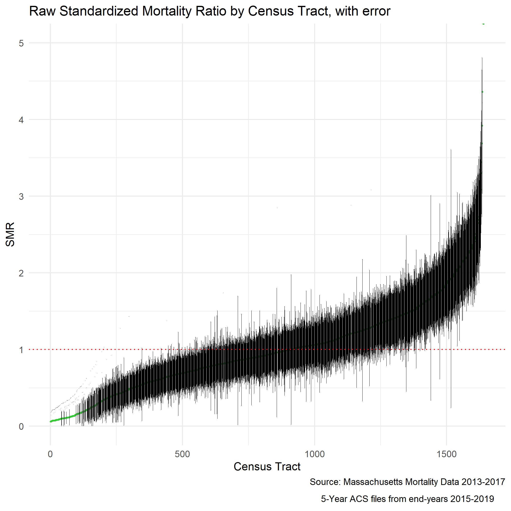

```{r setup, include=FALSE}
knitr::opts_chunk$set(
  echo = TRUE,
  out.width = '100%')

library(here)
```

# Public Health Disparities Geocoding Project 2.0 Training Manual {-}

Harvard T.H. Chan School of Public Health, Boston MA <br>
June 21-25, 2022 and July 25-August 1, 2022

https://www.hsph.harvard.edu/thegeocodingproject/save-the-date-the-public-health-disparities-geocoding-project-2-0/

<center>
<mark>
<span style='color:red'>
DRAFT: FOR WORKSHOP PARTICIPANTS ONLY <br>
DO NOT COPY, CITE OR CIRCULATE WITHOUT PERMISSION <br>
INTENDED FOR RELEASE AUGUST 1 2022
</span>
</mark>
</center>

Source of funding: American Cancer Society Clinical Research Professor Award to N. Krieger

<a rel="license" href="http://creativecommons.org/licenses/by-nc/4.0/"></a><br />This work is licensed under a <a rel="license" href="http://creativecommons.org/licenses/by-nc/4.0/">Creative Commons Attribution-NonCommercial 4.0 International License</a>. Credit for use is required. 

Please cite this work as Testa C, Chen JT, Hall E, Javadi D, Morgan J, Rushovich T,  Saha S, Waterman PD, Krieger N. The Public Health Disparities Geocoding Project 2.0. Training Manual. Available as of June 30, 2022


<!--chapter:end:index.Rmd-->

# Preface {#preface .unnumbered}

In June 2004, a team based at the Harvard School of Public Health
published a [monograph](https://www.hsph.harvard.edu/thegeocodingproject/public-health-disparities-geocoding-project-monograph-june-2004/) (Krieger et al, 2004) based on the research and trainings we
created for our *Public Health Disparities Geocoding Project* (Krieger et al, 2004).
This project built on and systematized approaches the team members had
been developing, since the early 1990s, for using geocoding and
area-based socioeconomic measures to overcome the absence of
socioeconomic data in most US health records (Krieger, 1992; Krieger, 1998, Krieger et al, 2004).

The objective was to boost efforts to document and inform efforts to
address socioeconomic inequities in health, overall and in relation to
US racialized health inequities.

Oriented to academic researchers, health department staff, cancer
registries, and public health students, this training offered a solution
to the problem of lack of socioeconomic data in US public health
surveillance systems: the geocoding of public health surveillance data
and using census-derived area-based socioeconomic measures (ABSMs) to
characterize both the cases and populations in the catchment area,
thereby enabling computation of rates stratified by the area-based
measure of socioeconomic position. In addition to informing the analyses
of numerous scientific investigations, the work of the Public Health
Disparities Geocoding Project was adopted by numerous US state and local
health departments and cancer registries, and also informed the
decisions of the US National Cancer Institute's cancer registry system
to geocode their data to the census tract level and enable researchers
to access not only county-level ABSMs (public access data) but also
census tract level ABSMs (restricted data).

Since 2004, there has been a huge increase in conceptual and
methodological work regarding use of ABSMs to document and analyze

REFERENCES


Krieger N. Overcoming the absence of socioeconomic data in medical records: validation and application of a census-based methodology. Am J Public Health. 1992 May;82(5):703-10. doi: 10.2105/ajph.82.5.703.

Krieger N. Epidemiology and the web of causation: has anyone seen the spider? Soc Sci Med. 1994 Oct;39(7):887-903. doi: 10.1016/0277-9536(94)90202-x.

Krieger N (PI). Area-based socioeconomic measures for health data. NIH (NICHD) R01 HD3865-01 (1998-2003).

Krieger N, Waterman PD, Chen JT, Rehkopf DH, Subramanian SV. The Public Health Disparities Geocoding Project Monograph. Available as of June 30, 2004 at: http://www.hsph.harvard.edu/thegeocodingproject

Krieger N, Waterman PD, Chen JT, Rehkopf DH, Subramanian SV. The Public Health Disparities Geocoding Project Monograph: Publications. Available as of June 30, 2004 at: https://www.hsph.harvard.edu/thegeocodingproject/publications

Krieger, N. Epidemiology and The People’s Health: Theory and Context. New York: Oxford University Press, 2011.

Krieger N. Ecosocial Theory, Embodied Truths, and The People's Health. New York: Oxford University Press, 2021.

PHDGP.The Public Health Disparities Geocoding Project 2.0. Available as of March 15, 2022 at: https://www.hsph.harvard.edu/thegeocodingproject/save-the-date-the-public-health-disparities-geocoding-project-2-0/


<!--chapter:end:01-preface.Rmd-->

# Background and History of Analytic Methods {#background}

In 2004, a team based at the Harvard T.H Chan School of Public Health's
Department of Social and Behavioral Sciences published a [[Project
Monograph]{.underline}](https://www.hsph.harvard.edu/thegeocodingproject/public-health-disparities-geocoding-project-monograph-june-2004/)
describing the
[[motivation]{.underline}](https://www.hsph.harvard.edu/thegeocodingproject/introduction/)
behind the *Public Health Disparities Geocoding Project* and its
analytic approaches, both conceptually and methodologically. The
monograph dove into methods of
[[geocoding]{.underline}](https://www.hsph.harvard.edu/thegeocodingproject/geocoding/),
generating [[area-based social metrics
(ABSMs)]{.underline}](https://www.hsph.harvard.edu/thegeocodingproject/generating-absms/),
[[Multi-level
Modeling]{.underline}](https://www.hsph.harvard.edu/thegeocodingproject/multi-level-modeling/),
[[data
visualization]{.underline}](https://www.hsph.harvard.edu/thegeocodingproject/visual-display/),
and [[basic epidemiologic methods for generating descriptive
statistics]{.underline}](https://www.hsph.harvard.edu/thegeocodingproject/analytic-methods/),
with the intent of providing population health scientists, health
department staff, cancer registries, policy makers, and advocates and
activists for health justice with tools to put on the map -- literally
-- rampant but underreported socioeconomic inequities in health and
their links to racialized and spatial health inequities (Krieger et al, 2005; Krieger, 2009).

Key publications on these topics can also be found on the project's
[[publications
page]{.underline}](https://www.hsph.harvard.edu/thegeocodingproject/publications/).

The *Public Health Disparities Geocoding Project* is informed by the
ecosocial theory of disease distribution, developed by Dr. Nancy Krieger
in
[[1994]{.underline}](https://www.sciencedirect.com/science/article/pii/027795369490202X?casa_token=_9JKsxrdf5gAAAAA:5s38ClF44ISx9OGzrDq-8DqY4b3iFHHY5WYQnBChxAO8pd5IVbPTgWOIWwsVGCcCCLDud_zskzk),
specifically "its focus on how people literally biologically embody
their societal and ecological context at multiple levels, across the
life course and historical generations" (Krieger, 2012).

Administrative health data, disease surveillance systems, and routine
health surveys are important tools in understanding disease distribution
and informing public health programming, advocacy, and policy
development. However, the social patterning of disease distribution is
often obscured by a lack of robust social metrics, including
socioeconomic data, pertinent to understanding health inequities -
defined as unfair, avoidable, and preventable health differences across
social groups(Krieger, 2011). These social groups, co-defined by social
relationships involving power, are among the many groups which together
comprise the "populations" that embody health, experience health
injustice (or health justice), and are the focus of public health
monitoring, research, and action. As defined by Krieger (2012),
"populations are dynamic beings constituted by intrinsic relationships
both among their members and with the other populations that together
produce their existence." Addressing health inequities across social
groups and within populations accordingly requires data on the
population-defined and defining relationships and characteristics that
create and are created by structures and systems. Further, theories of
disease distribution and the underlying agendas, ideologies, and
motivations contributing to their implicit or explicit use in turn shape
what data gets analyzed, how the analysis is interpreted, and what
visualizations are used to disseminate findings (Krieger, 2011). Misuse or poor
use of data analysis and visualization tools can contribute to obscuring
health inequities, leaving out certain subpopulations or misrepresenting
trends in disease distribution, resulting in poor policy decisions and
inadequate or misleading data to inform community and advocacy
organizing for health justice. Therefore, not only is the availability
of robust health information systems important, so too is the use of
appropriate methods and a health equity lens in their analyses.

Using routine information systems to inform disease prevention is not a
21st or even 20th century concept. In 1829, William Farr, a "Compiler of
Abstracts" at the General Register included a letter to the Register's
first report which stated that

> *"Diseases are more easily prevented than cured, and the first step to
> their prevention is the discovery of their exciting causes. The
> Registry will show the agency of these causes by numerical facts and
> measure the intensity of their influence and will collect information
> on the laws of vitality with the variation in these laws in the two
> sexes at different ages and the influence of civilisation, occupation,
> locality, seasons and other physical agencies whether in generating
> diseases and inducing death or in improving the public health"
> (Whitehead, 2000).*

In the US, linking of public health data to US census-based
socioeconomic data was carried out by the National Tuberculosis
Association in the 1920s and 1930s (Green, 1932; Nathan, 1932).
Similarly, cancer epidemiologists have used geocoded data to generate
and stratify cancer incidence, categorizing social groups using
variables defined in relation to race/ethnicity, sex, and socioeconomic
position, for many decades (Krieger, 2001). Of note, US health data have
long been reported by US government agencies (federal, state, and local)
stratified by "race" and "sex," informed by a long history of biological
essentialism that treats these variables as a matter of innate biology,
with no attention to inequitable racial, gender, or class relations
(Krieger, 2021; Hunter et al, 2005). Adding socioeconomic data to the mix can aid with understanding
the contribution of socioeconomic inequities to racialized and gender
health inequities, but with the caveat that the 20th century CE
framework of eugenics (whose shadow continues to be cast well into the
21st c CE) also has held that people's socioeconomic position reflects
their genetic inheritance (Krieger, 2018; Levine, 2017).

Despite these early emphases on social metrics as critical in
understanding inequitable and differential population rates and
distributions of morbidity and mortality, the integration of
socioeconomic data in national surveillance systems has been slow. A
recent OECD report on national monitoring systems for health
inequalities by socioeconomic status found that only seven of the 26
high-income countries included in the study had national routine
monitoring systems with regular reports on socioeconomic inequalities in
health over time (Frank and Matsunaga, 2020).

When the first *Public Health Disparities Geocoding Project* was
launched, it presented a solution in the form of area-based
socioeconomic measures (ABSMs) where multilevel approaches to
understanding area-based measures, classified by socioeconomic
characteristics, could be used to calculate stratified rates and render
the invisible, visible. The project articulated the lack of a
standardized approach in the choice of geographic levels and types of
ABSMs used for monitoring disease distribution, making comparison across
heterogeneous methods difficult.

The project took on the task of identifying which ABSMs would be most
apt for monitoring socioeconomic inequalities in health and at what
geographic level. Findings suggested that census tract poverty level -
defined as "percent of persons below poverty" - was most apt (Krieger et
al, 2003).

Since then, there has been significant development in both the
conceptualization of geocoded health disparities, types of ABSMs, and
the technologies available to capture, analyze, and visualize them.

Many ABSMs have been developed around the world. Globally,
the Gini coefficient is one of the standards for measuring income
inequality (with caveats around its use beyond larger aggregations and
issues around spatial social polarization) (Shaw et al, 2007; Krieger et
al, 2016). In Canada, examples include the Socioeconomic Factor Index
(SEFI), the General Deprivation Index (GDI), and the Deprivation Index
for Health and Welfare Planning for Quebec (DIHWPQ) (Schuurman et al,
2007). Starting in the early 20th c CE, the UK began using the Registrar
General's social class classification systems (an ad hoc approach based
on skill-level demarcations in occupational class), which in was
replaced in 2000 by the theoretically-grounded National Statistics
Socio-economic Classification (NS-SEC), which emphasizes employment
relations and the conditions of occupations (UK Office of National Statistics, 2022). Also commonly used is the English Index of Multiple Deprivation (McLennan et al, 2019). In the US, studies
have generated or used composite indices of deprivation or social
vulnerability based on selected census variables (O'Campo et al, 2008;
Messer et al, 2006; Hu et al, 2021; ATSDR 2022).

However, one problem common to many indices, and also single-variable
measures (such as percent below poverty), is that they do not provide
insight into the power relations and spatial social polarization driving
health inequities (Krieger et al, 2016A; Krieger et al, 2017). For example, the metric "percent below
poverty," while useful for describing socioeconomic gradients in health,
notably provides no information on the income distribution of those
"above poverty," which can range from barely above poverty to extremely
affluent. Similarly, a commonly used variable in the US, such as
"percent of population classified as being Black Americans" says nothing
about the distribution of other racialized groups and the social
relationships that are core to racialized economic segregation. An
additional problem is that diverse metrics intended to measure
inequality across the full population distribution, such as the Gini
coefficient or the dissimilarity index (which measures the proportion of
a population that would need to move within a geographic area to achieve
evenness of distribution), is that they are only meaningful at higher
geographic levels (Krieger et al, 2016A; Krieger et al, 2017). At issue is how, within the US, policies and
practices, past and present, to generate and enforce racialized economic
segregation have worked to buttress neighborhood boundaries, especially
to keep some areas white and affluent and relegate lower-income
populations, disproportionately Black, Latinx, Indigenous and immigrant
in the US to underdeveloped neighborhoods lacking resources for people
to thrive (Krieger et al, 2016A; Krieger et al, 2017; Rothstein, 2017; Bailey et al, 2017).

A new approach to capturing the extreme range of concentrations of
economic deprivation and privilege, termed the "Index of Concentration
at the Extremes" (ICE), was developed in 2001 by Douglass Massey, a
leading US scholar on residential segregation (Massey, 2001; Massey, 1996; Massey, 2012). This measure, which ranges from -1 to 1 and captures the extent to which an area's population is concentrated into
one end of the other of extremes of privilege and deprivation, notably
can be used meaningfully at multiple levels of geography, from census
block on up to counties and higher. In recent years, members of our
*Public Health Disparities Geocoding Project* team have produced work
promoting use of the ICE in public health research, and also extending
Massey's original work to develop ICE measures that quantify not only
racialized residential segregation but also racialized economic
segregation, with the latter comprising the first metric of its kind
(Krieger et al, 2016A; Krieger et al, 2016B; Scally et al, 2018; Krieger
et al, 2018; Chen & Krieger, 2021; Krieger et al, 2015). The intent is to provide insight
into who and what drives health inequities, not just focus solely on
those harmed (Krieger et al, 2010; Beckfield, 2018; Bambra et al, 2021; Bailey et al, 2017).

The Covid-19 pandemic - due to the social and geographic patterning in
the spread of the virus and associated hospitalizations and deaths - has
highlighted the critical need for improved surveillance systems and
systematic monitoring of health inequities (Presidential Task Force, 2021; Bambra, 2021). As a result, the
*Public Health Disparities Geocoding Project* has compiled resources to
support efforts in carrying out the analyses of health inequities in
this context (Krieger, Chen, Waterman, 2020).

The 2020 [[update to the
project]{.underline}](https://www.hsph.harvard.edu/thegeocodingproject/covid-19-resources/),
shared in May 2020 in the thick of the first months of the pandemic,
provides:

-   List of conceptual and empirical publications

-   List of variables constructed using the US Census American Community
    Survey (ACS) data

-   R code for extracting ABSMs from the ACS and replicating analyses in
    the published empirical papers

The *Public Health Disparities Geocoding Project 2.0* training in June
and July 2022 builds on the work of our team throughout the pandemic and
is offering an updated and revised training on why & how to analyze
population health and health inequities in relation to census tract,
county, and other georeferenced societal and environmental data. Because
the area-based metrics we employ in this study include diverse social
metrics, no longer restricted solely to economic measures, we employ the
updated terminology of "area-based social metrics" -- which we continue
to abbreviate as "ABSMs."

The training and final version of our training module are designed to be
available asynchronously, by the end of 2022, following the
administration of two synchronous sessions in June 2022 and July 2022.

This online companion site will walk through each step of the training
including:

-   Chapter 2 Getting Set Up

-   Chapter 3: Getting your Data

-   Chapter 4: Visualizing your Data

-   Chapter 5: Analyzing your data

-   Chapter 6: Case Study - Premature Mortality

-   Chapter 7: Case Study - Breast Cancer Mortality

-   Chapter 8: Case Study - Cook County Covid-19

-   Chapter 9: Case Study - Temporal Trends using American Community Survey (ACS) data (2012-2019)

-   Chapter 10: Case Study - Comparing County Analyses of Inequities in Health Insurance using ACS vs. CDC PLACES data (2019)
    Survey

-   Chapter 11: Conclusions

We hope that this resource is of use to you. If you have questions or
comments, please reach out to: geoproj@hsph.harvard.edu

REFERENCES

Agency for Toxic Substances and Disease Registry (ATSDR). CDC/ATSDR Social Vulnerability Index. https://www.atsdr.cdc.gov/placeandhealth/svi/index.html ; accessed June 14, 2022.

Bailey ZD, Krieger N, Agénor M, Graves J, Linos N, Bassett MT. Structural racism and health inequities in the USA: evidence and interventions. Lancet. 2017 Apr 8;389(10077):1453-1463. doi: 10.1016/S0140-6736(17)30569-X.

Bambra C, Lynch J, Smith KE. The Unequal Pandemic: COVID-19 and Health Inequalities. Bristol, UK: Policy Press, University of Bristol, 2021.

Beckfield J. Political Sociology and The People's Health. New York: Oxford University Press, 2018.

Chen, J.T. and Krieger, N. Revealing the unequal burden of
COVID-19 by income, race/ethnicity, and household crowding: US county
versus zip code analyses. Journal of Public Health Management and
Practice. 2021; 27(1), pp.S43-S56.

Frank, J.W. and Matsunaga, E. National monitoring systems for
health inequalities by socioeconomic status--an OECD snapshot. Critical
Public Health. 2020; pp.1-8.

Green HW. Tuberculosis and economic strata, Cleveland's Five-City
Area, 1928-1931. Cleveland, OH: Anti-Tuberculosis League, 1932.

Hu J, Bartels CM, Rovin RA, Lamb LE, Kind AJH, Nerenz DR. Race, Ethnicity, Neighborhood Characteristics, and In-Hospital Coronavirus Disease-2019 Mortality. Med Care. 2021 Oct 1;59(10):888-892. doi: 10.1097/MLR.0000000000001624. 1.

Hunter E, Friedman D, Parrish R (eds). Health statistics : Shaping policy and practice to improve the population's health. New York ; Oxford: Oxford University Press, 2005.

Krieger N. Epidemiology and the web of causation: has anyone seen the spider? Soc Sci Med. 1994 Oct;39(7):887-903. doi: 10.1016/0277-9536(94)90202-x.

Krieger, N. Socioeconomic data in cancer registries. American
journal of public health. 2001; 91(1), p.156.

Krieger, N. Chen, J.T., Waterman, P.D., Rehkopf, D.H. and Subramanian,
S.V. Race/ethnicity, gender, and monitoring socioeconomic
gradients in health: a comparison of area-based socioeconomic
measures---the public health disparities geocoding project. American
journal of public health. 2003; 93(10), pp.1655-1671.

Krieger N, Chen JT, Waterman PD, Rehkopf DH, Subramanian SV. Painting a truer picture of US socioeconomic and racial/ethnic health inequalities: the Public Health Disparities Geocoding Project. Am J Public Health. 2005 Feb;95(2):312-23. doi: 10.2105/AJPH.2003.032482.

Krieger N. Putting health inequities on the map: social epidemiology meets medical/health geography––an ecosocial perspective. GeoJournal. 2009 Apr;74(2):87-97.

Krieger N, Alegría M, Almeida-Filho N et al. Who, and what, causes health inequities? Reflections on emerging debates from an exploratory Latin American/North American workshop. J Epidemiol Community Health. 2010;64(9):747–749.


Krieger, N. Epidemiology and The People’s Health: Theory and Context. New York: Oxford University Press, 2011.

Krieger, N., 2012. Who and what is a "population"? Historical debates,
current controversies, and implications for understanding "population
health" and rectifying health inequities. The Milbank Quarterly, 90(4),
pp.634-681.

Krieger N, Waterman PD, Gryparis A, Coull BA. Black carbon exposure, socioeconomic and racial/ethnic spatial polarization, and the Index of Concentration at the Extremes (ICE) Health Place. 2015;34:215–228.

Krieger, N., Waterman, P.D., Spasojevic, J., Li, W., Maduro, G. and Van
Wye, G. Public health monitoring of privilege and deprivation
with the index of concentration at the extremes. American journal of
public health. 2016A; 106(2), pp.256-263.

Krieger, N., Singh, N. and Waterman, P.D.Metrics for monitoring
cancer inequities: residential segregation, the Index of Concentration
at the Extremes (ICE), and breast cancer estrogen receptor status (USA,
1992--2012). Cancer Causes & Control. 2016B; 27(9), pp.1139-1151.

Krieger N, Feldman JM, Waterman PD, Chen JT, Coull BA, Hemenway D. Local Residential Segregation Matters: Stronger Association of Census Tract Compared to Conventional City-Level Measures with Fatal and Non-Fatal Assaults (Total and Firearm Related), Using the Index of Concentration at the Extremes (ICE) for Racial, Economic, and Racialized Economic Segregation, Massachusetts (US), 1995-2010. J Urban Health. 2017 Apr;94(2):244-258. doi: 10.1007/s11524-016-0116-z.

Krieger, N., Feldman, J.M., Kim, R. and Waterman, P.D. Cancer
incidence and multilevel measures of residential economic and racial
segregation for cancer registries. JNCI Cancer Spectrum. 2018; 2(1), p.pky009.

Krieger N. Inheritance and Health: What Really Matters? Am J Public Health. 2018 May;108(5):606-607. doi: 10.2105/AJPH.2018.304353.

Krieger N, Chen JT, Waterman PD. Using the methods of the Public Health Disparities Geocoding Project to monitor COVID-19 inequities and guide action for social justice. Available as of May 15, 2020 at:
[[https://www.hsph.harvard.edu/thegeocodingproject/covid-19-resources/]{.underline}](https://www.hsph.harvard.edu/thegeocodingproject/covid-19-resources/)

Krieger N. Structural Racism, Health Inequities, and the Two-Edged Sword of Data: Structural Problems Require Structural Solutions. Front Public Health. 2021 Apr 15;9:655447. doi: 10.3389/fpubh.2021.655447.

Levine P. Eugenics: A Very Short Introduction. New York: Oxford University Press, 2017.

Massey DS. The age of extremes: concentrated affluence and poverty in the twenty-first century. Demography. 1996;33(4):395–412.

Massey DS. The prodigal paradigm returns: ecology comes back to sociology. In: Booth A, Crouter A, editors. Does It Take a Village? Community Effects on Children, Adolescents, and Families. Mahwah, NJ: Lawrence Erlbaum Associates; 2001. pp. 41–48.

Massey DS. Reflections on the dimensions of segregation. Soc Forces. 2012;91(1):39–43.

McLennan, David, Stefan Noble, Michael Noble, Emma Plunkett, Gemma Wright, and Nils Gutacker. The English indices of deprivation 2019: technical report. 2019.

Messer, L.C., Laraia, B.A., Kaufman, J.S., Eyster, J., Holzman, C.,
Culhane, J., Elo, I., Burke, J.G. and O'campo, P. The development
of a standardized neighborhood deprivation index. Journal of Urban
Health. 2006; 83(6), pp.1041-1062.

Nathan WB. Health conditions in North Harlem 1923-1927. New York:
National Tuberculosis Association, 1932.

O'Campo, P., Burke, J.G., Culhane, J., Elo, I.T., Eyster, J., Holzman,
C., Messer, L.C., Kaufman, J.S. and Laraia, B.A. Neighborhood
deprivation and preterm birth among non-Hispanic Black and White women
in eight geographic areas in the United States. American journal of
epidemiology. 2008; 167(2), pp.155-163.

Presidential COVID-19 Health Equity Task Force. Final reportand recommendations. HHS, Office of Minority Health. https://minorityhealth.hhs.gov/omh/browse.aspx?lvl=2&lvlid=100. UpdatedNovember 10, 2021. Accessed June 14, 2022.

Rothstein, R. The color of law : A forgotten history of how our government segregated America (First ed., Democracy and urban landscapes). New York ; London: Liveright Publishing Corporation, a division of W.W. Norton & Company, 2017.

Schuurman, N., Bell, N., Dunn, J.R. and Oliver, L. Deprivation
indices, population health and geography: an evaluation of the spatial
effectiveness of indices at multiple scales. Journal of urban health. 2007;
84(4), pp.591-603.

Scally, B.J., Krieger, N. and Chen, J.T. Racialized economic
segregation and stage at diagnosis of colorectal cancer in the United
States. Cancer Causes & Control. 2018; 29(6), pp.527-537.

Shaw M, Galobardes B, Lawlor DA, Lynch J, Wheeler B, Davey Smith G.
The Handbook of Inequality and Socioeconomic Position: Concepts
and Measures. Bristol, UK: The Policy Press, 2007.

UK Office of National Statistics. The National Statistics Socio-economic classification (NS-SEC). https://www.ons.gov.uk/methodology/classificationsandstandards/otherclassifications/thenationalstatisticssocioeconomicclassificationnssecrebasedonsoc2010 ; accessed June 14, 2022.

Whitehead, M. William Farr's legacy to the study of inequalities
in health. Bulletin of the World Health Organization. 2000; 78(1), p.86.

<!--chapter:end:02-background.Rmd-->

# Getting Setup with R and RStudio {#getting-setup}

We recommend before moving on, readers should download and install R and RStudio
and the recommended R packages and dependencies.

### Principles for Reproducible Workflow and Programming

Two principles underlie why R and RStudio have been chosen to use throughout
these course materials. First, as a matter of equity, the use of free (both free
to use and freely licensed) software such as R and RStudio removes financial and
administrative barriers to engaging with our work and facilitates the inclusion
of people from more diverse backgrounds in science. Second, data analysis and
science should be open and transparent wherever and whenever possible, so as to
promote the external reproduction, verification, and validation of findings.

:::: {.infobox}
The code examples in this book assume familiarity with the R programming
language. You can still benefit from this book by reading the exposition without
focusing on the code examples if you are not very familiar with R programming.

If you want to become more familiar with R programming, you may want to start by
familiarizing yourself with R. The *R for Data Science* book, available free and
online here: https://r4ds.had.co.nz/, which provides a free, online, accessible
introduction.
::::
    
## Downloading and Installing R and RStudio

In order to follow along with these resources, you will need to have R and
RStudio installed and setup.  You can download R from
https://www.r-project.org/. You can download RStudio from
https://www.rstudio.com/.

## Basic Features of R

Throughout this text, the example code given will depend on various R packages
which are all available free and open-source, easily installed in R with the 
`install.packges` function. 

To work through the case examples here, you will need to install at least the 
following packages: 

```{r}
#| echo = TRUE,
#| eval = FALSE
# for data manipulation and visualization
install.packages("tidyverse")
install.packages("Hmisc") # mostly for the weighted quantile function
install.packages("fastDummies") # for creating "dummy"/ "indicator" variables


# for retrieving census data
install.packages("tidycensus") # note the special instructions below

# for mapping
install.packages("sf") # note the special instructions below
install.packages("mapview")
install.packages("tigris")
install.packages("leaflet")


# for visualization/color palettes
install.packages("RColorBrewer")
install.packages("viridis")
install.packages("cowplot")

# for multilevel modeling
install.packages("lme4")

# for spatial modeling
install.packages("INLA",repos=c(getOption("repos"),INLA="https://inla.r-inla-download.org/R/stable"), dep=TRUE)

```


### Note about "compiling from source"

If, when installing these packages, R prompts you asking whether you would like
to install these packages “from source,” you do not need to. Sometimes compiling
from source can be more difficult than installing the pre-built packages from
CRAN if there are compilation errors.

### Tidycensus Special Instructions

You need to register for a Census API key as part of the setup 
procedures to use `tidycensus`. 

See the instructions for installing [on the tidycensus
website](https://walker-data.com/tidycensus/articles/basic-usage.html).

Note that you only need to run the `census_api_key("YOUR API KEY GOES HERE")` 
command once. 

### sf Special Instructions

For the `sf` package, there are additional instructions here: https://r-spatial.github.io/sf/
which are OS (Mac, Windows, Linux) specific, which walk through getting setup
with the `gdal` (or Geospatial Data Abstraction Library, a translator library
for raster and vector geospatial data formats) which is a dependency of `sf`.

### INLA Install Instructions

The code above installs the stable version of INLA.  Should you ever need
to upgrade your installation, instructions are online here: 
https://www.r-inla.org/download-install 


## References for Spatial Programming in R

As additional reference material to supplement the R programming code provided
here, we would recommend: 

  - Geocomputation with R by Robin Lovelace, Jakub Nowosad, and Jannes Muenchow. 
  https://geocompr.robinlovelace.net/.
  - Spatial Data Science with Applications in R by Edzer Pebesma and Roger Bivand. 
  https://r-spatial.org/book/.
  - Geospatial Health Data: Modeling and Visualization with R-INLA and Shiny by Paula Moraga. https://www.paulamoraga.com/book-geospatial/index.html.

<!--chapter:end:03-getting-setup.Rmd-->

# Getting your data {#getting-your-data}

<!-- Outline for Chapter --> 
<!-- 
  - Downloading data 
    - Health data
    - Population data
        - Numerator and Denominator Issues
    - Social Metric Data 
    - Data governance (whose lives are affected by the data, who owns the data) 
    - tidycensus, shape files
        - simple example (percent poverty)
        - constructing the ICE measures
      - Health data, social metric data
          - Issues of representativeness (Full enumerationn data vs. Survey estimates)
  - Geocoding  (different ways to geocode, Google, openstreetmaps, ArcGIS)
--> 

```{r child='child_documents/04-getting-your-data/high-level-overview.Rmd'}
```

```{r child='child_documents/04-getting-your-data/data-sources.Rmd'}
```

```{r child='child_documents/04-getting-your-data/tidycensus-and-mapview-demo.Rmd'}
```

```{r child='child_documents/04-getting-your-data/cleaning-area-identifiers.Rmd'}
```

```{r child='child_documents/04-getting-your-data/numerators-and-denominators.Rmd'}
```

```{r child='child_documents/04-getting-your-data/geocoding.Rmd'}
```

```{r child='child_documents/04-getting-your-data/data-governance.Rmd'}
```

```{r child='child_documents/04-getting-your-data/references.Rmd'}
```

<!--chapter:end:04-getting-your-data.Rmd-->

# Visualizing your data {#visualizing-your-data}

Data visualization is a critical component in communicating and advocating for
health equity as it makes data accessible and transparent.  However, it is not 
without its pitfalls, and in this chapter we will discuss some of the important
points to consider when visualizing data for advancing health equity. 

Firstly, as a matter of accessibility, we strive to use colorblind friendly
color palettes when using color so that individuals with one of the different
kinds of colorblindness can still interpret our visualizations. 
We encourage you to learn more about colorblindness and colorblind friendly
palettes from a number of resources (Katsnelson, 2021) (Ou, 2021). The color
vision deficiency simulator from the `colorblindr` package is especially helpful
in testing if a visual you are creating is colorblind friendly.

:::: {.infobox .info}
If you are looking for help learning how to create data visualizations in R, we
recommend checking out the online, free book: 
[ggplot2: Elegant Graphics for Data Analysis](https://ggplot2-book.org/).

If you are looking for help learning how to work with spatial data in R, we recommend
the following free, online books: 

  - Spatial Data Science with applications in R by Edzer Pebesma and Roger Bivand <br> https://r-spatial.org/book/
  - Geocomputation with R by Robin Lovelace, Jakub Nowosad, and Jannes Muenchow <br> https://geocompr.robinlovelace.net/ 
  - Analyzing US Census Data: Methods, Maps, and Models in R, by Kyle Walker <br> https://walker-data.com/census-r/ 
  - Geospatial Health Data: Modeling and Visualization with R-INLA and Shiny by Paula Moraga. https://www.paulamoraga.com/book-geospatial/index.html.
::::


One of the main points we urge caution around with respect to the visualization
and mapping of area based health outcome data are the presentation of rates
which are unstable due to small population sizes.  As a broader principle, we 
emphasize the need for careful choice of the area level at which results are
presented. In part, this is because it is well established that changing the
areal units into which data are aggregated and analyzed can change the
relationships observed in the data. This is known as the Modifiable Areal Unit
Problem, which can be read about in (Wong 2004) and (Buzzelli 2020). Of note,
choice of area should not be arbitrary, but should be guided by a priori
reasons, including which areas make the most sense to use to answer which
questions. For example, analyses of population-wide health inequities within the
entire US may wish to use census tract or county level data, whereas analyses
more specifically focused on the political geography of health inequities may
wish to use areas with political boundaries, e.g., state or congressional
legislative districts [ref].

For example at small area levels like the Census tract level, the underlying
population may be so small that the health outcomes observed are quite noisy
because a single additional case represents a large shift in the rate. In such a
situation, it it could potentially be erroneous to infer that the Census tract
with the highest observed rate has the greatest underlying risk because it could
be an artifact of noise. This motivates the need for spatial smoothing, and we
encourage the use of spatially smoothed estimates for choropleth maps showing
health outcome rates to avoid such a potential pitfall.
As an introduction to these pitfalls, we recommend the [Pitfalls to avoid](https://mgimond.github.io/Spatial/pitfalls-to-avoid.html) chapter from (Gimond 2022).


It is worthwhile to remark on how different areal units can either center or
marginalize social groups based on the geographic boundaries employed. It is
also crucial to be clear about which social groups are excluded or inaccurately
represented in the area-based data, including but not limited to people who are
unhoused, incarcerated, otherwise institutionalized or experiencing other kinds
of marginalization. Warranting scrutiny are the protocols employed by the data
holders to assign addresses and/or georeferenced codes to the records of persons
who are not living in non-institutional residences, as well as who is counted
towards the population totals of the specified geographic areas.As an example,
one lesson we have learned from analyzing Boston area mortality data is that it
can be quite useful to know the locations of and areas containing homeless
shelters, because we have found that individuals designated as experiencing
homelessness at the time of their death have had their place of death in the
residential field of the death certificate listed as the address of the homeless
shelter. The net impact can be to inflate the mortality rate of the census
tracts in which these shelters are located.

Oftentimes georeferenced and geocoded data will have anomalous or idiosyncratic
features such as areas where the rate appears to be infinite because population
estimates are zero for that area despite having observed health outcomes,
especially if the data are for small areas or particular sub-populations.
Although there is not a single solution to these problems, a key starting place
is to examine the data critically to understand the socially-produced data
protocols and social distribution of the populations at issue, so as to be on
the lookout for these very real problems that arise from and manifest social
spatial inequities. We accordingly encourage data analysts and visualizers to
consider carefully the impacts the choice of areas, their boundaries, the
processes by which the locations of people are assigned to these areas (whether
as “numerators” or “denominators”), and the power relations affecting who is
likely to be geocoded to these areas – and who is missed – whether as a “case”
or member of the population from which the cases arise (i.e., “denominator”).


To start to develop a wider perspective on how data visualization and mapping
can be used, we list below a range of recommended books and articles. Because
data visualization and mapping are powerful tools to communicate (or
miscommunicate) data, it is critical to be aware of how they can reflect bias
and tell lies (Deluca and Nelson, 2017), (Fleckenstein 1991), (Monmonier 2021),
as well as reveal powerful truths (Koch 2017om Koch outlines the history of
disease mapping in his book Disease Maps, Epidemics on the Ground (2011), and in
his 2017 follow-up book, Ethics in Everyday Places: Mapping Moral Stress,
Distress, and Injury, he takes a broader perspective.


<!-- 
  # discussed above:
  - ggplot2, color palettes & accessibility 
  - mapping point estimates vs uncertainty 
  - references: "how maps lie";  tom koch disease maps, "ethics in everyday places: mapping moral stress, distress, and injury"
  - point layers vs. choropleth layers 
  - visualizing raw data may be unstable 
  
  # TODO: 
  do we cover these topics here again, in addition to in "getting your data"?
  - visualizing health measures (actually getting to look at maps)
  - showing how mapview helps to reality-check your understanding of the geography 
  based on including streetmap features, satellite imagery, etc.
  --> 

## References

Katsnelson, A. (2021) ‘Colour me better: fixing figures for colour blindness’, Nature, 598(7879), pp. 224–225. doi:10.1038/d41586-021-02696-z.

Ou, J. (2021) Safe colorsets. Available at: https://cran.r-project.org/web/packages/colorBlindness/vignettes/colorBlindness.html (Accessed: 7 June 2022).

Wong, D. (2004) ‘The modifiable areal unit problem (MAUP)’, in WorldMinds: Geographical Perspectives on 100 Problems. Springer Netherlands. Available at: https://link.springer.com/chapter/10.1007/978-1-4020-2352-1_93.

Buzzelli, M. (2020) ‘Modifiable Areal Unit Problem’, International Encyclopedia of Human Geography, pp. 169–173. doi:10.1016/B978-0-08-102295-5.10406-8.

Deluca, E. and Nelson, S. (2017) ‘Lying With Maps’. Available at: https://open.lib.umn.edu/mapping/chapter/7-lying-with-maps/ (Accessed: 7 June 2022).

Fleckenstein, L. (1991) ‘How Maps Lie’, Syracuse University Magazine, December. Available at: https://surface.syr.edu/cgi/viewcontent.cgi?article=1245&context=sumagazine.

Monmonier, M. (2018) How to Lie with Maps, Third Edition. Chicago, IL: University of Chicago Press. Available at: https://press.uchicago.edu/ucp/books/book/chicago/H/bo27400568.html (Accessed: 7 June 2022).

Koch, T. (2011) Disease Maps: Epidemics on the Ground. Chicago, IL: University of Chicago Press. Available at: https://press.uchicago.edu/ucp/books/book/chicago/D/bo8490164.html (Accessed: 7 June 2022).

Koch, T. (2017) Ethics in Everyday Places: Mapping Moral Stress, Distress, and Injury | Esri Press (2017). Available at: https://www.esri.com/en-us/esri-press/browse/ethics-in-everyday-places-mapping-moral-stress-distress-and-injury (Accessed: 7 June 2022).

Dorling D, Fairbairn D (1997). Mapping: Ways of Representing the World. Old Tappen, UK: Routledge.

Tufte D (2001). The Visual Display of Quantitative Information. 2nd ed. Cheshire, CT: Graphics Press.

Tufte ER (2020). Seeing with Fresh Eyes: Meaning, Space, Data, Truth. Cheshire, CT: Graphics Press.

Gimond, M. (2022) Intro to GIS and Spatial Analysis. Available at: https://mgimond.github.io/Spatial/index.html (Accessed: 7 June 2022).

Lovelace, R., Nowosad, J. and Muenchow, J. (2022) Geocomputation with R. Available at: https://geocompr.robinlovelace.net/ (Accessed: 7 June 2022).

## Health Equity 

To understand the distribution of health and disease in place, it is necessary to collect, analyze, and visualize health data and area-based social metrics. It is equally important, however, that when documenting and mapping health inequities, we contextualize such data with adequate analysis of social, political, and ecological context. Shared observations of disparities in health do not necessarily translate to common understandings of cause, especially when population patterns of disease and health mirror population distributions of deprivation and privilege. Mapping and visualizing the uneven social and spatial distribution of health and disease in areas – which can be a particularly effective way of communicating health inequities to decision makers – without offering some explanatory context of the allocation of resources and hazards in these areas can perpetuate harmful ideas and actions that actually undermine the goal of eliminating health inequities.

With the increasing availability of local health data such as the CDC PLACES program, as well as advancements in the availability and accessibility of geocoding services, there is ample opportunity to disaggregate health data, particularly to the neighborhood (census tract) level. Geographic disaggregation allows for more fine-grained analyses, including multilevel spatial modeling, which can inform more “targeted” interventions. But when presented by themselves with no explanatory context, such granular data can create or reinforce what sociologist Loïc Wacquant refers to as “territorial stigmatization,” whereby the characteristics or features of a place are associated with the moral character and behavior of its residents, or vice versa—especially for people and places who are already politically, economically, and socially marginalized and/or materially deprived of important resources (Chowkwanyun and Reed 2020). For example, if some places are found to have a high concentration of illness or disease, narratives and representations of those places as “diseased,” “contaminated,” could produce or reinforce existing stigma and lead to targeted interventions such as heightened policing and surveillance in an attempt to contain and control residents, reclamation or demolition of physical structures, and social neglect and abandonment (There are too many historical case studies of this, for these potential risks to be downplayed or ignored: Craddock 2004; Molina 2006; Roberts 2009; Lopez 2009; Krupar and Ehlers 2017).

There are various approaches to countering territorial stigmatization. Mapping place-based risks and resource deficits that might help explain the spatial distribution of disease, illness, and injury along racial and socioeconomic lines can focus public and policy attention on shifting the context for health rather than individual behaviors and attitudes. For example, in the case of Covid-19, this could look like mapping and visualizing the uneven geographic distribution of preventive health care facilities or the concentration of respiratory hazards in areas of racialized concentrated poverty. Furthermore, one could map historical and political variables such as historical redlining that can offer important insight into how and why the social and spatial patterning of life-enhancing and harmful resources exists in an area as a result of racist policies and practices (Rothstein 2017; Mapping Inequality 2022; Krieger et al 2020a, 2020b; Wright et al. 2022). Additionally, asset mapping can provide helpful information about the strengths and resources of a community to facilitate discussion and action around building on these assets to address community needs and improve community health. 

Analyzing and visualizing patterns of White wealth and health is also important to understanding and addressing patterns of population health and health inequities. Mapping and visualizing “racially concentrated areas of affluence” can help move research and policy attention away from a predominant concern for racially concentrated areas of poverty and toward a more holistic consideration of the full range of health outcomes, resources, and hazards in an area (Goetz et al. 2019). A focus on racially concentrated areas of affluence underscores the reality that structural racism produces both racialized concentrations of poverty (and hazards) and racialized concentrations of wealth (and health-enabling resources). Other measures such as the Index of Concentration of the Extremes (ICE), which quantifies the distribution of persons at the extremes of relationships of privilege and deprivation, also bring the full population and power relations into view, and can be scaled for use at multiple levels of geography (e.g., census block, census block group, census tract, city/town, county, etc.) (Massey 2001; Krieger et al. 2015, 2016, 2017, 2018). Initially developed to measure spatial polarization in economic terms (i.e., economic residential segregation), in public health studies we have extended its use to include novel measures of racialized residential segregation and racialized economic segregation (Krieger et al. 2015, 2016, 2017, 2018). 

In summary, addressing health inequities requires a relational understanding of how systems of power and resource allocation simultaneously produce poor health for some and good health for others. This approach may require analyzing and visualizing patterns in population health and health inequities at large geographic scales such as counties and regions, rather than at the city level for example, to capture a wider range of values for health outcome data and area-based social metrics. 

## References

Chowkwanyun, M., & Reed Jr., A. L. (2020). Racial health disparities and Covid-19—Caution and context. New England Journal of Medicine, 383(3), 201-203. doi:10.1056/NEJMp2012910

Craddock, S. (2004). City of plagues: Disease, poverty, and deviance in San Francisco. University of Minnesota Press. 
Goetz, E. G., Damiano, A., & Williams, R. A. Racially concentrated areas of affluence: A preliminary investigation. Cityscape, 21(1), 99-123. 

Krieger N, Van Wye G, Huynh M, Waterman PD, Maduro G, Li W, Gwynn C, Barbot O, Bassett MT. Historical redlining, structural racism, and preterm birth risk in New York City (2013-2017). Am J Public Health 2020; 110(7):1046-1053.

Krieger N, Wright E, Chen JT, Waterman PD, Huntley ER, Arcaya M. Cancer stage at diagnosis, historical redlining, and current neighborhood characteristics: breast, cervical, lung, and colorectal cancer, Massachusetts, 2001-2015. Am J Epidemiol 2020; 189(10):1065-1075.  

Krieger N, Waterman PD, Spasojevic J, Li W, Maduro G, Van Wye G. Public health monitoring of privilege and deprivation using the Index of Concentration at the Extremes (ICE). Am J Public Health 2016; 106: 256-253

Krieger N, Waterman PD, Gryparis A, Coull BA. Black carbon exposure, socioeconomic and racial/ethnic spatial polarization, and the Index of Concentration at the Extremes (ICE). Health & Place 2015; 34:215-228.

Krieger N, Feldman JM, Waterman PD, Chen JT, Coull BA, Hemenway D. Local residential segregation matters: stronger association of census tract compared to conventional city-level measures with fatal and non-fatal assaults (total and firearm related), using the Index of Concentration at the Extremes (ICE) for racial, economic, and racialized economic segregation, Massachusetts (US), 1995-2010. J Urban Health 2017; 94:244-258. 

Krieger N, Kim R, Feldman J, Waterman PD. Using the Index of Concentration at the Extremes at multiple geographic levels to monitor health inequities in an era of growing spatial social polarization: Massachusetts, USA (2010-2014). Int J Epidemiol 2018; 47:788-819.

Krupar, S., & Ehlers, N. (2017). Biofutures: Race and the governance of health. Environment and Planning D: Society and Space, 35(2), 222-240. doi:10.1177/0263775816654475

Lopez, R. P. (2009). Public health, the APHA, and urban renewal. American Journal of Public Health, 99(9), 1603-1611. doi:10.2105/AJPH.2008.150136

Mapping Inequality: Redlining in New Deal America. https://dsl.richmond.edu/panorama/redlining/#loc=5/39.1/-94.58&text=about ; accessed June 17, 2022.

Molina, N. (2006). Fit to be citizens? Public health and race in Los Angeles, 1879-1939. University of California Press.

Roberts Jr., S. K. (2009). Infectious fear: Politics, disease, and the health effects of segregation. University of North Carolina Press. 

Rothstein R (2017). The Color of Law: A Forgotten History of How Our Government Segregated America. New York: Liveright Publishing Co., W.W. Norton & Co.

Wright E, Waterman PD, Testa C, Chen JT, Krieger N. Breast Cancer Incidence, Hormone Receptor Status, Historical Redlining, and Current Neighborhood Characteristics in Massachusetts, 2005-2015. JNCI Cancer Spectrum 2022; 6(2);  https://doi.org/10.1093/jncics/pkac016; epub on-line: Feb 18, 2022.


<!--chapter:end:05-visualizing-your-data.Rmd-->

# Analyzing your data {#analyzing-your-data}


```{r, include=FALSE}
knitr::opts_chunk$set(echo = TRUE)
library(knitr)
library(readr)
library(tidyverse)
library(kableExtra)
```


## Overview of Methods

In the years since we initially presented the Public Health Disparities Geocoding Training, both the theories around public health disparities and the analytic tools to measure them have evolved. In particular, the availability of software that facilitates data access, mapping, visualization, and fitting of multilevel and spatial models has greatly enhanced the accessibility of these analytic methods for public health scientists and advocates interested in advancing health equity. Our goal in presenting these updated methods is to illustrate their applicability to monitoring, reporting, and investigating health inequities. In doing so, we highlight many of the assumptions underlying the use of these methods and show how they can be applied to real-life data that arise in public health surveillance and health equity monitoring. We comment on some of the pitfalls that may arise when working with imperfect data in real time and discuss analytic and interpretive strategies keeping in mind the overarching goal of accurately documenting health inequities for accountability. Where appropriate, we also comment on ongoing methodologic work to improve analytic approaches.

### Motivating Questions

As the choice of methods for any data analysis depends fundamentally on the goals of the analysis, we will focus our presentation on the following motivating questions:

1. "What is the **geographic distribution** of area-based social metrics across the study area?" This is of particular interest for exploratory analyses in order to understand who in what areas are most affected by social advantage and disadvantage as captured by area-based social metrics. Mapping and visualization tools can be used to communicate geographic patterns and to elicit local knowledge in order to spur hypothesis generation and prioritization of research questions.

2. "What are the **social inequities** in health associated with area-based social metrics across the study area?" We highlight the importance of **descriptive epidemiology** as a first step in understanding inequities in the health of populations living in areas characterized by area-based social metrics. That is, accurate description of where the burden of social inequities falls is a necessary pre-requisite to more causally-oriented investigations or evaluations of interventions. We discuss **aggregated analyses**, which have the advantages of being straightforward to implement and report using tabulation methods and avoiding the problems of small area estimation, as well as **non-spatial regression models**. We focus on health equity settings in which understanding the joint patterning of inequities by racialized group and area-based social metric are of interest, and comment on how analyses may need to consider heterogeneity across age strata.

3. "How can geographic variation in health outcomes be modeled in order to facilitate mapping of **small-area disease estimates** and **estimation of social inequities**?" We review concepts from the extensive statistical literature on small-area estimation and disease mapping with the goal of visualizing geographic patterns in health outcomes for studies of health equity. While these methods entail more complex modeling frameworks and computational details, we focus on their application to health equity and the interpretation and use of model outputs in the context of monitoring and reporting of health disparities. We consider settings in which **multilevel modeling** approaches and **spatial modeling** approaches may be preferred and discuss considerations contributing to the choice of modeling framework.


### Choice of geographic level

<!--
    TODO:
  We need to flesh out this text.
  I think the main point is that we try to analyze at the geographic level that makes sense. The breast cancer mortality example will show that while we can append CT level ABSMs to the data and use the aggregation method or non-spatial regression here, doing spatial analyses doesn't yield much spatial variation at the CT level because the counts are too small. We should bring this point out in this section.
  
  Similarly, rationale for the ZIP code level analysis of Chicago COVID data.
--> 

- A pragmatic approach: at what level are data available?
- For small area level analyses, do the number of events support small area-level analyses?
-  CT vs. city/town, e.g. breast cancer mortality analysis
- ZIP codes and ZCTAs
- MAUP

- note that the smallest level of Census geography with intercensal population estimates is the county. County PEP estimates rely on demographic modeling. 
- CT level estimates are in the ACS, but ACS specifically cautions against using these as population denominator estimates in small area estimation. However, we generally do not have any other sources of population denominators on which to rely. Five year average estimates may help, but there is still year to year variability. Margin of error estimates available, but how to incorporate denominator uncertainty into analyses is still an area of active research.


### Numerator/denominator mismatch

For epidemiologic analyses of health disparities, we generally rely on routinely collected data from health surveillance systems to define the numerators of rates. Such data are available on an ongoing basis with a lag of two or more years to allow for data compilation and cleaning. In contrast, data on population at risk may be obtained from a variety of sources depending on the need for stratification by demographic variables, time frame, and the desired level of geography. For example, the US Decennial Census provides detailed population estimates by age, sex-gender, and selected racialized groups in decennial years. For intercensal years, the US Census uses demographic modeling that takes into consideration births, deaths, and migrations to provide estimates for these demographic groups at the national, state, and county levels via its Population Estimates Program (PEP) [US Census PEP]. For smaller levels of geography, the US Census Bureau's American Community Survey includes estimates of population for all census geographies larger than census blocks based on five year rolling averages. These are also typically made available after a two year delay.

Formally, the US Census Bureau recommends the use of PEP or decennial census counts as population size estimates in intercensal years, while recommending that ACS data be used for information about changing socioeconomic and demographic features. However, for estimation of small area disease rates or analyses of health disparities by ABSM in intercensal years, decennial counts are usually outdated and PEP estimates are not available at the desired geographic level. Thus, in practice, many epidemiologic studies will continue to rely on ACS small-area estimates for population denominators. While private companies are increasingly producing high-resolution gridded population estimates that are based on machine-learning models combining census, remote sensing, land use, and other information, with the promise of providing population sizes at very small geographies in near real time, to date we have not found these data products to provide substantial improvement over using ACS small area estimates and in some cases they can induce bias [ref: Nethery et al. 2021].

Because numerators (case data) and denominators (population estimates) come from different sources, and moreover, because intercensal population estimates in particular may be subject to uncertainty, it is possible to obtain sociodemographic strata in particular areas and years where the observed cases exceed the reported population at risk. This is particularly problematic when the the number of cases is greater than zero but the reported population at risk is exactly zero. We term this phenomenon "numerator/denominator mismatch." Some of the analytic methods we describe will be able yield valid estimates of social inequities in spite of these data anomalies. For example, the aggregation method avoids this problem by aggregating over small areas, whereby small discrepancies in numerators and population at risk are averaged out over areas within ABSM strata. In other modeling approaches, we may need to take steps to address these issues in the data. When doing so, we need to be mindful about potential distortions to the data and their impact on estimates of social inequities. In particular, we must consider that when such data anomalies are more likely for some demographic groups than others (for example, in many areas of the US non-white racialized groups will be of smaller population size), this may result greater bias for demographically stratified analyses (e.g. models stratified by racialized group) (Nethery et al. 2021).


#### Example: Age-specific all-cause mortality by racialized group in Massachusetts, 2013-2017

We compared the use of the aggregation method to a non-spatial Poisson model for analyzing deaths from all causes by age and racialized group. Using the aggregation method, deaths and population person-time at risk are aggregated into strata by age (0-4, 5-9, 10-14, 15-19, 20-24, 25-29, 30-34, 35-44, 45-54, 55-64, 65-74, 75-84, 85+) and racialized group (white non-Hispanic and Black), and mortality rates per 100,000 person-years are computed using the formulas listed in Section xxx. For the non-spatial Poisson model, the inputs are age- and racialized-group specific deaths for each census tract in the study area, the log(population person-time at risk) as an offset, and a set of indicators for each stratum of age category by racialized group. 

When the log(population person-time at risk) variable is zero, however, this presents a problem for the Poisson model-fitting algorithm as the rate is undefined. Census tracts where there are zero deaths and zero person-time at risk in a particular strata can be deleted from the dataset as these observations contribute no information. But situations where the count of deaths in a stratum is greater than zero but the population person-time at risk is zero continue to be an issue (numerator/denominator mismatch). It may be tempting to delete these observations from the dataset as well, reasoning that as these usually involve just one death occurring in a stratum where the population estimate is zero, deleting these observations will not unduly affect the analysis. 

Unfortunately, it turns out that numerator/denominator mismatch occurs more frequently for Black observations in the dataset, due to patterns of racialized residential segregation and that fact that the Black population accounts for a much smaller proportion of the population  compared with the white non-Hispanic population (10.1% vs. 72.9% in Massachusetts according to the ACS population estimates we used for our population denominators). That is, at the census tract level, there are more likely to be age strata where there are deaths reported by zero population person-time at risk for the Black population compared with the white non-Hispanic population.  As a result, when we delete these observations, we end up deleting a larger proportion of the Black deaths across the whole state, which has an impact on our estimates of rates and rate ratios.

To see this, consider the following table where we show the number of deaths and population by age and racialized group aggregated across census tracts. In columns 2-8, we show the deaths, population, and estimated rates per 100,000 person-years for white Non-Hispanics and Blacks in the full dataset, while in columns 9-15 we show the deaths and population after deleting observations where the numerator is greater than zero but the denominator is zero. In columns 16-22 we show the percent bias by strata comparing the dataset with deleted observations to the full dataset. As is evident in column 19, the effect of deleting these observations is to reduce the Black death count in age strata (between 4-30% across strata) to a much greater degree than among the white non-Hispanic age strata (between 0-2%). As a result, the age-specific incidence rate ratios can be depressed by as much as 30% relative to the IRRs calculated using the full aggregated data.

```{r, echo=FALSE, warning=FALSE, message=FALSE}
table_removezeroes <- read_csv("data/06-analyzing-your-data/numden_mismatch_remove_zeroes.csv")

knitr::kable(table_removezeroes, 
             col.names = c("Age", "NHW deaths", "NHW pop", "NHW Rate", 
                           "Black deaths", "Black pop", "Black Rate", "IRR",
                           "NHW deaths", "NHW pop", "NHW Rate", 
                           "Black deaths", "Black pop", "Black Rate", "IRR",
                           "% bias NHW deaths", "% bias NHW pop", "% bias NHW Rate", 
                           "% bias Black deaths", "% bias Black pop", "% bias Black Rate",
                           "% bias IRR"),
             digits=c(0,0,0,1,0,0,1,2,0,0,1,0,0,1,2,3,3,3,3,3,3,3),
             html=TRUE) %>%
            add_header_above(c(" "=1, "Full dataset" = 7, "Adjusted dataset" = 7, "% Bias" = 7))

```

If instead of deleting those strata where deaths>0 and denominator=0, we replace the denominator with the number of deaths, we end up with very slightly larger population counts overall, but the effect on the rates is to bring them more in line with the aggregated analysis. Here is the comparable table comparing the full aggregated dataset (columns 2-8) with a dataset in which the denominators are adjusted to increase the person time at risk to equal the number of deaths the affected strata. 

```{r, echo=FALSE, warning=FALSE, message=FALSE}
  table_adjustdenom <- read_csv("data/06-analyzing-your-data/numden_mismatch_adjust_denom.csv")

knitr::kable(table_adjustdenom, 
             col.names = c("Age", "NHW deaths", "NHW pop", "NHW Rate", 
                           "Black deaths", "Black pop", "Black Rate", "IRR",
                           "NHW deaths", "NHW pop", "NHW Rate", 
                           "Black deaths", "Black pop", "Black Rate", "IRR",
                           "% bias NHW deaths", "% bias NHW pop", "% bias NHW Rate", 
                           "% bias Black deaths", "% bias Black pop", "% bias Black Rate",
                           "% bias IRR"),
             digits=c(0,0,0,1,0,0,1,2,0,0,1,0,0,1,2,3,3,3,3,3,3,3),
             html=TRUE) %>%
            add_header_above(c(" "=1, "Full dataset" = 7, "Adjusted dataset" = 7, "% Bias" = 7))

```

An even better solution, and the one we ultimately recommend, is to add a small number (e.g. 0.001) to all of the population person-time denominators to allow the Poisson model fitting algorithm to incorporate these observations into the analysis. The resulting effect on the overall population denominators is negligible, but this allows for estimation of rates and rate ratios of interest. Note that this is only needed when fitting non-spatial regression models to the data. The aggregation method does not incur this problem as small discrepancies are averaged out over areas, and the spatial models we discuss in Section xx address the problem of zero or infinite rates by smoothing.

To visualize the effect of these adjustments on estimates of the age-specific disparity by racialized group, we plot estimates from aggregated analyses and Poisson models with deletion and denominator adjustment in Figure x. The plot confirms that either (a) adjusting denominators to match the number of observed deaths in problematic strata in census tracts or (b) adding a small number to all population person time estimates (preferred) yields comparable estimates to the aggregation method, whereas removing problematic observations results in bias.

```{r, echo=FALSE, fig.cap="Comparison of estimated age-specific Black/White mortality rate ratios using different methods to address numerator/denominator mismatch"}
knitr::include_graphics("images/06-analyzing-your-data/age_specific_comparison_plot.pdf")
```

## Inference for The Aggregation Approach 

(not done yet)

## Overdispersion

(not done yet)

## Age Standardization 

(not done yet)

## Small Area Estimation

(not done yet)

## Multilevel and Spatial Modeling

(not done yet)

<!--chapter:end:06-analyzing-your-data.Rmd-->

# Case Study 1: Premature Mortality in Massachusetts {#premature-mortality}

## Introduction

For this case study, we will be working with mortality data from the Massachusetts Registry of Vital Records and Statistics [https://www.mass.gov/lists/death-data] for the years 2013-2017. Vital Statistics registries are how states (which submit their data to the federal government) keep an official enumeration of deaths^1-3^; because the death certificates require data on residential address at time of death, they can be useful tools for monitoring health and health equity. Having data on the residential address of each individual allows us to geocode each observation to the physical and social environment in which the person lived. Death records also typically include demographic information about the deceased, including categories for racialized groups that conform to the 1997 US Office of Management and Budget (OMB) standards for the classification of federal data on race and ethnicity^4^. We will explore how social membership in racialized groups, area-based social metrics (ABSMs), and local government spending might impact premature mortality (mortality before the age of 65) across Massachusetts. To do this, we will pair our mortality data with demographic and socioeconomic data from the Census Bureau's 5-year American Community Survey (ACS) files, and utilize expenditure reports from the government of Massachusetts.

## Motivation, Research Questions, and Learning Objectives

The goal of this case study is to develop familiarity with methods of exploring and visualizing racial disparities in health data. Our specific goals will be to:

1. Download and merge different datasets for our analysis
2. Visualize and map estimates of ABSMs and premature mortality
3. Identify the relationships between racialized group, ABSMs, and premature mortality
4. Model how space may impact disparities in premature mortality
 
The research questions we will seek to answer throughout this case study include:
 
1. What is the overall socioeconomic gradient in premature mortality? 
  1a. We can visualize this with a spatial model
2) What is the racialized disparity overall?
  2a. We can visualize this with stratified aggregate analyses
3) What are the associations with ABSM by racialized group?/ How does ABSM interact with individual level membership in racialized groups? (i.e., interactions between socioeconomic position and racialized groups, not just socioeconomic inequities within racialized groups)
  3a. We can observe this using a poisson model with and interaction term
4) How does the racialized disparity vary across space? 
  4a. We can observe this with a multilevel model with city/town level with a random slope for race
  4b. We can also control for city expenditures

## Getting and Wrangling Your Data

We are providing datasets for you to use throughout these case studies that have been wrangled and reshaped for your use, and we also provide code to show how you could go through that process on your own. Once you copy and run the code for your "Dependencies" You can skip ahead to the "Approach" section and follow along with the case study without issue.
 
You can look at whole datasets in RStudio using the `View()` command, or look at summaries of the datasets by simply typing the dataset name into the console.

### Dependencies

You will need these packages throughout our case study

```{r dependencies, message = FALSE}

#| eval = FALSE,
#| warning = FALSE,
#| message = FALSE

# Libraries - if this code does not run for you, you may need to run install.package("package_name")
library(knitr)
library(tidyverse)
library(readxl)
library(ggplot2)
library(cowplot)
library(tidycensus)
library(tigris)
options(tigris_use_cache = TRUE)
library(sf)
library(spdep)
library(viridis) 
library(Hmisc)
library(fastDummies)
library(lme4)
library(INLA)
library(broom)
```

### Your Health Outcome Data - Premature Mortality

Your data has been aggregated from individual observations into death counts by age, racialized group, census tract, and town. When you get unrestricted mortality files from government sources for research, you will likely receive files with one observation per death. After you have geocoded these observations, you will need to aggregate them up to the level of interest for your analysis. This requires aggregation not only up to the census tract level, but also age groups so we can do an appropriate age standardization, racialized groups so we can stratify our analyses by these groups, and towns so we can explore a second areal level of analysis. Below is some code (for example) to turn a raw mortality file into what has been provided to you, by merging census tracts and towns to the data, and then aggregating into groups that align with the age and racialized groups that match your denominator data. The vast majority of our area-based social metrics come from the U.S. Census, so the most detailed level for analysis available will be the census tract. We can use the `tigris` package to download census tract geometries and the `sf` package to link our geocoded observations to the appropriate census tracts. Ideally when performing an analysis that might include two or more levels, the smaller level (here, census tracts) would be nested entirely within the larger level (towns). In Massachusetts though, there are many towns that have such small populations that they are smaller than census tracts. For these towns, we have created a crosswalk wherein small towns have been combined to create larger super towns. These super towns each make up one census tract, so that each super town in the analysis will now have at least one census tract nested within it for an eventual multilevel analysis

```{r wrangling_outcome, eval = FALSE}

#| eval = FALSE,
#| warning = FALSE,
#| message = FALSE

# the raw mortality data, with the geocoded coordinates converted into spatial feature (sf) data
ma_mort <- read_rds("ma_mort_geo.RDS") %>% 
  st_as_sf(coords=c("lon","lat"), crs = 4269)

# Importing tract shapefile using tigris package
tracts_sf <- tracts(state = "25", year = "2010")

# Linking Census Tracts and Tiny Towns File
supertowns <- read_excel("ma ct to supertinytowns.xlsx", col_names = FALSE, col_types = "text") %>%
  transmute(GEOID10 = ...1,
            super_town = str_to_lower(...2))

tracts_sf <- inner_join(tracts_sf,supertowns, by = "GEOID10")

# Merging to geocoded mortality and dropping geometries
# The geometries of a shapefile can be very unweildy and slow data wrangling commands. Since we only need them to map, we will remove them for now
ma_mort_ct <- st_join(tracts_sf, ma_mort, left = FALSE) %>%
  st_drop_geometry() %>%
  arrange(id) %>%
  mutate(super_town = case_when(GEOID10   == "25023500101" ~ "hull",
                                super_town == "stt1"       ~ "charlemont-colrain-hawley-heath-monroe-rowe",
                                super_town == "stt2"       ~ "cummington-middlefield-plainfield-worthington",
                                super_town == "stt3"       ~ "monterey-tyringham",
                                super_town == "stt4"       ~ "hardwick-new braintree",
                                super_town == "stt5"       ~ "bernardston-gill-leyden",
                                super_town == "stt6"       ~ "blandford-chester-granville-montgomery-russell-tolland",
                                super_town == "stt7"       ~ "sunderland-whateley",
                                super_town == "stt8"       ~ "becket-washington",
                                super_town == "stt9"       ~ "holland-wales",
                                super_town == "stt10"      ~ "peru-windsor",
                                super_town == "stt11"      ~ "goshen-williamsburg",
                                super_town == "stt12"      ~ "hancock-new ashford-richmond",
                                super_town == "stt13"      ~ "leverett-new salem-shutesbury",
                                super_town == "stt14"      ~ "sandisfield-otis",
                                super_town == "stt15"      ~ "erving-warwick-wendell",
                                super_town == "stt16"      ~ "buckland-shelburne",
                                super_town == "stt17"      ~ "alford-egremont-mount washington",
                                super_town == "stt18"      ~ "ashfield-conway",
                                super_town == "stt19"      ~ "aquinnah-chilmark-gosnold-west tisbury",
                                super_town == "stt20"      ~ "petersham-phillipston",
                                super_town == "stt21"      ~ "florida-savoy",
                                geo_town != super_town     ~ super_town,
                                TRUE                       ~ geo_town)) %>% 
  select(id, year, date,
         age, sex, starts_with("race"), hisp, immigrant, starts_with("educ"),
         contains("icd10"),
         address, zip, starts_with("geo"), super_town, contains("type"), north, south, east, west,
         GEOID10)

# Aggregating the data by our selected variables of interest
# Dropping deaths that occurred after age 65
ma_mort_agg <- ma_mort_ct %>%
  filter(age < 65) %>% 
  mutate(age_cat = cut(age,
                       breaks = c(-1,4,9,14,19,24,29,34,39,44,49,54,59,64),
                       labels = c("0-4",  "5-9",  "10-14","15-19","20-24",
                                  "25-29","30-34","35-39","40-44","45-49",
                                  "50-54","55-59","60-64")),
         race_group = racegroup) %>%
  select(-c(age, race, immigrant, educ_years, contains("icd10"),
            contains("address"), zip, geo_town, contains("type"),
            north, south, east, west, date, hisp)) %>%
  group_by(year,
           age_cat,
           sex,
           race_group,
           super_town,
           GEOID10) %>%
  summarise(deaths = n()) %>%
  ungroup() 

ma_mort_agg
```
```{r head_ma_mort_agg, echo = FALSE}
head_ma_mort_agg <- read_rds("head_ma_mort_agg.rds")
head_ma_mort_agg
```

### 6.3.3 Your Denominator Data and ABSM’s

We download population data to use as denominators in our rates and ABSMs from the U.S. Census Bureau using the tidycensus package. This requires registering with the U.S. Census for an API key. The key is redacted here, but you can get your own from https://api.census.gov/data/key_signup.html. The ABSMs we will use for this analysis are percentage of the population in poverty, the Index of Concentration at the Extremes (ICE) which quantifies how persons in a specified area are concentrated into the top vs bottom of a specified societal distribution, and the ATSDR/CDC Social Vulnerability Index, which employs data on poverty, transportation access, crowded housing and other social variables to generate a measure of vulnerability for communities.

```{r wrangling_denominators, eval = FALSE}
#| eval = FALSE,
#| warning = FALSE,
#| message = FALSE


# Population Denominators
ma_demo_acs <- vector(mode = "list", length = 5)
names(ma_demo_acs) <- c(2013,2014,2015,2016,2017)
for (nm in names(ma_demo_acs)) {
  ma_demo_acs[[nm]] <- get_acs(geography = "tract",
                               # These are the myriad variables that make up the variables we intend to use
                               variables = c("B01001_003","B01001_004","B01001_005","B01001_006",
                                             "B01001_007","B01001_008","B01001_009","B01001_010",
                                             "B01001_011","B01001_012","B01001_013","B01001_014",
                                             "B01001_015","B01001_016","B01001_017","B01001_018",
                                             "B01001_019","B01001_027","B01001_028","B01001_029",
                                             "B01001_030","B01001_031","B01001_032","B01001_033",
                                             "B01001_034","B01001_035","B01001_036","B01001_037",
                                             "B01001_038","B01001_039","B01001_040","B01001_041",
                                             "B01001_042","B01001_043", 
                                             "B01001B_003","B01001B_004","B01001B_005","B01001B_006",
                                             "B01001B_007","B01001B_008","B01001B_009","B01001B_010",
                                             "B01001B_011","B01001B_012","B01001B_013","B01001B_018",
                                             "B01001B_019","B01001B_020","B01001B_021","B01001B_022",
                                             "B01001B_023","B01001B_024","B01001B_025","B01001B_026",
                                             "B01001B_027","B01001B_028", 
                                             "B01001C_003","B01001C_004","B01001C_005","B01001C_006",
                                             "B01001C_007","B01001C_008","B01001C_009","B01001C_010",
                                             "B01001C_011","B01001C_012","B01001C_013","B01001C_018",
                                             "B01001C_019","B01001C_020","B01001C_021","B01001C_022",
                                             "B01001C_023","B01001C_024","B01001C_025","B01001C_026",
                                             "B01001C_027","B01001C_028", 
                                             "B01001D_003","B01001D_004","B01001D_005","B01001D_006",
                                             "B01001D_007","B01001D_008","B01001D_009","B01001D_010",
                                             "B01001D_011","B01001D_012","B01001D_013","B01001D_018",
                                             "B01001D_019","B01001D_020","B01001D_021","B01001D_022",
                                             "B01001D_023","B01001D_024","B01001D_025","B01001D_026",
                                             "B01001D_027","B01001D_028", 
                                             "B01001E_003","B01001E_004","B01001E_005","B01001E_006",
                                             "B01001E_007","B01001E_008","B01001E_009","B01001E_010",
                                             "B01001E_011","B01001E_012","B01001E_013","B01001E_018",
                                             "B01001E_019","B01001E_020","B01001E_021","B01001E_022",
                                             "B01001E_023","B01001E_024","B01001E_025","B01001E_026",
                                             "B01001E_027","B01001E_028", 
                                             "B01001H_003","B01001H_004","B01001H_005","B01001H_006",
                                             "B01001H_007","B01001H_008","B01001H_009","B01001H_010",
                                             "B01001H_011","B01001H_012","B01001H_013","B01001H_018",
                                             "B01001H_019","B01001H_020","B01001H_021","B01001H_022",
                                             "B01001H_023","B01001H_024","B01001H_025","B01001H_026",
                                             "B01001H_027", "B01001H_028", 
                                             "B01001I_003","B01001I_004","B01001I_005","B01001I_006",
                                             "B01001I_007","B01001I_008","B01001I_009","B01001I_010",
                                             "B01001I_011","B01001I_012","B01001I_013","B01001I_018",
                                             "B01001I_019","B01001I_020","B01001I_021","B01001I_022",
                                             "B01001I_023","B01001I_024","B01001I_025","B01001I_026",
                                             "B01001I_027","B01001I_028"), 
                               year = as.numeric(nm) + 2,
                               output = "wide",
                               state = "MA",
                               geometry = FALSE,
                               key = "4407a63721e192545e1e2a2fc7f6920477b10108",
                               moe_level = 95,
                               survey = "acs5") %>%
    rowwise() %>%
    # Here, we will transform those variables into variables that align better with our outcome data
    mutate(year = as.numeric(nm),
           GEOID10 = GEOID,
           # Total Male Age Groups
           `total_male_00-04` = B01001_003E,
           `total_male_05-09` = B01001_004E,
           `total_male_10-14` = B01001_005E,
           `total_male_15-19` = B01001_006E + B01001_007E,
           `total_male_20-24` = B01001_008E + B01001_009E + B01001_010E,
           `total_male_25-29` = B01001_011E,
           `total_male_30-34` = B01001_012E,
           `total_male_35-39` = B01001_013E,
           `total_male_40-44` = B01001_014E,
           `total_male_45-49` = B01001_015E,
           `total_male_50-54` = B01001_016E,
           `total_male_55-59` = B01001_017E,
           `total_male_60-64` = B01001_018E + B01001_019E,
           total_male_total  = sum(c_across(starts_with("total_male"))),
           # Total Female Age Groups
           `total_female_00-04` = B01001_027E,
           `total_female_05-09` = B01001_028E,
           `total_female_10-14` = B01001_029E,
           `total_female_15-19` = B01001_030E + B01001_031E,
           `total_female_20-24` = B01001_032E + B01001_033E + B01001_034E,
           `total_female_25-29` = B01001_035E,
           `total_female_30-34` = B01001_036E,
           `total_female_35-39` = B01001_037E,
           `total_female_40-44` = B01001_038E,
           `total_female_45-49` = B01001_039E,
           `total_female_50-54` = B01001_040E,
           `total_female_55-59` = B01001_041E,
           `total_female_60-64` = B01001_042E + B01001_043E,
           total_female_total  = sum(c_across(starts_with("total_female"))),
           total_total_total   = total_male_total + total_female_total,
           # Black Male Age Groups
           `black_male_00-04` = B01001B_003E,
           `black_male_05-09` = B01001B_004E,
           `black_male_10-14` = B01001B_005E,
           `black_male_15-19` = B01001B_006E + B01001B_007E,
           `black_male_20-24` = B01001B_008E,
           `black_male_25-29` = B01001B_009E,
           `black_male_30-34` = B01001B_010E,
           `black_male_35-44` = B01001B_011E,
           `black_male_45-54` = B01001B_012E,
           `black_male_55-64` = B01001B_013E,
           black_male_total  = sum(c_across(starts_with("black_male"))),
           # Black Female Age Groups
           `black_female_00-04` = B01001B_018E,
           `black_female_05-09` = B01001B_019E,
           `black_female_10-14` = B01001B_020E,
           `black_female_15-19` = B01001B_021E + B01001B_022E,
           `black_female_20-24` = B01001B_023E,
           `black_female_25-29` = B01001B_024E,
           `black_female_30-34` = B01001B_025E,
           `black_female_35-44` = B01001B_026E,
           `black_female_45-54` = B01001B_027E,
           `black_female_55-64` = B01001B_028E,
           black_female_total = sum(c_across(starts_with("black_female"))),
           black_total_total = black_male_total + black_female_total,
           # native Male Age Groups
           `native_male_00-04` = B01001C_003E,
           `native_male_05-09` = B01001C_004E,
           `native_male_10-14` = B01001C_005E,
           `native_male_15-19` = B01001C_006E + B01001C_007E,
           `native_male_20-24` = B01001C_008E,
           `native_male_25-29` = B01001C_009E,
           `native_male_30-34` = B01001C_010E,
           `native_male_35-44` = B01001C_011E,
           `native_male_45-54` = B01001C_012E,
           `native_male_55-64` = B01001C_013E,
           native_male_total  = sum(c_across(starts_with("native_male"))),
           # native Female Age Groups
           `native_female_00-04` = B01001C_018E,
           `native_female_05-09` = B01001C_019E,
           `native_female_10-14` = B01001C_020E,
           `native_female_15-19` = B01001C_021E + B01001C_022E,
           `native_female_20-24` = B01001C_023E,
           `native_female_25-29` = B01001C_024E,
           `native_female_30-34` = B01001C_025E,
           `native_female_35-44` = B01001C_026E,
           `native_female_45-54` = B01001C_027E,
           `native_female_55-64` = B01001C_028E,
           native_female_total = sum(c_across(starts_with("native_female"))),
           native_total_total = native_male_total + native_female_total,
           # Asian PI Male Age Groups
           `asian_male_00-04` = B01001D_003E + B01001E_003E,
           `asian_male_05-09` = B01001D_004E + B01001E_004E,
           `asian_male_10-14` = B01001D_005E + B01001E_005E,
           `asian_male_15-19` = B01001D_006E + B01001E_006E + B01001D_007E + B01001E_007E,
           `asian_male_20-24` = B01001D_008E + B01001E_008E,
           `asian_male_25-29` = B01001D_009E + B01001E_009E,
           `asian_male_30-34` = B01001D_010E + B01001E_010E,
           `asian_male_35-44` = B01001D_011E + B01001E_011E,
           `asian_male_45-54` = B01001D_012E + B01001E_012E,
           `asian_male_55-64` = B01001D_013E + B01001E_013E,
           asian_male_total  = sum(c_across(starts_with("asian_male"))),
           # Asian PI Female Age Groups
           `asian_female_00-04` = B01001D_018E + B01001E_018E,
           `asian_female_05-09` = B01001D_019E + B01001E_019E,
           `asian_female_10-14` = B01001D_020E + B01001E_020E,
           `asian_female_15-19` = B01001D_021E + B01001E_021E + B01001D_022E + B01001E_022E,
           `asian_female_20-24` = B01001D_023E + B01001E_023E,
           `asian_female_25-29` = B01001D_024E + B01001E_024E,
           `asian_female_30-34` = B01001D_025E + B01001E_025E,
           `asian_female_35-44` = B01001D_026E + B01001E_026E,
           `asian_female_45-54` = B01001D_027E + B01001E_027E,
           `asian_female_55-64` = B01001D_028E + B01001E_028E,
           asian_female_total = sum(c_across(starts_with("asian_female"))),
           asian_total_total = asian_male_total + asian_female_total,
           # White Male Age Groups
           `white_male_00-04` = B01001H_003E,
           `white_male_05-09` = B01001H_004E,
           `white_male_10-14` = B01001H_005E,
           `white_male_15-19` = B01001H_006E + B01001H_007E,
           `white_male_20-24` = B01001H_008E,
           `white_male_25-29` = B01001H_009E,
           `white_male_30-34` = B01001H_010E,
           `white_male_35-44` = B01001H_011E,
           `white_male_45-54` = B01001H_012E,
           `white_male_55-64` = B01001H_013E,
           white_male_total  = sum(c_across(starts_with("white_male"))),
           # White Female Age Groups
           `white_female_00-04` = B01001H_018E,
           `white_female_05-09` = B01001H_019E,
           `white_female_10-14` = B01001H_020E,
           `white_female_15-19` = B01001H_021E + B01001H_022E,
           `white_female_20-24` = B01001H_023E,
           `white_female_25-29` = B01001H_024E,
           `white_female_30-34` = B01001H_025E,
           `white_female_35-44` = B01001H_026E,
           `white_female_45-54` = B01001H_027E,
           `white_female_55-64` = B01001H_028E,
           white_female_total = sum(c_across(starts_with("white_female"))),
           white_total_total = white_male_total + white_female_total,
           # Hispanic Male Age Groups
           `hisp_male_00-04` = B01001I_003E,
           `hisp_male_05-09` = B01001I_004E,
           `hisp_male_10-14` = B01001I_005E,
           `hisp_male_15-19` = B01001I_006E + B01001I_007E,
           `hisp_male_20-24` = B01001I_008E,
           `hisp_male_25-29` = B01001I_009E,
           `hisp_male_30-34` = B01001I_010E,
           `hisp_male_35-44` = B01001I_011E,
           `hisp_male_45-54` = B01001I_012E,
           `hisp_male_55-64` = B01001I_013E,
           `hisp_male_total` = sum(c_across(starts_with("hisp_male"))),
           # HispaniI Female Age Groups
           `hisp_female_00-04` = B01001I_018E,
           `hisp_female_05-09` = B01001I_019E,
           `hisp_female_10-14` = B01001I_020E,
           `hisp_female_15-19` = B01001I_021E + B01001I_022E,
           `hisp_female_20-24` = B01001I_023E,
           `hisp_female_25-29` = B01001I_024E,
           `hisp_female_30-34` = B01001I_025E,
           `hisp_female_35-44` = B01001I_026E,
           `hisp_female_45-54` = B01001I_027E,
           `hisp_female_55-64` = B01001I_028E,
           hisp_female_total = sum(c_across(starts_with("hisp_female"))),
           hisp_total_total = hisp_male_total + hisp_female_total) %>%
    ungroup() %>%
    select(-starts_with("B0")) %>%
    pivot_longer(cols      = c(starts_with("total"),
                               starts_with("hisp"),
                               starts_with("black"),
                               starts_with("native"),
                               starts_with("white"),
                               starts_with("asian")),
                 names_to  = c("racegroup", "sex", "age_cat"),
                 names_sep = "_",
                 values_to = "population") %>%
    mutate(age_cat   = case_when(age_cat == "00-04" ~ "0-4",
                                 age_cat == "05-09" ~ "5-9",
                                 age_cat == "total" ~ "Total",
                                 TRUE               ~ age_cat),
           sex       = str_to_title(sex),
           racegroup = case_when(racegroup == "white"  ~ "Non-Hispanic White",
                                 racegroup == "black"  ~ "Non-Hispanic Black",
                                 racegroup == "native" ~ "Non-Hispanic Native American, Alaskan Native, Other",
                                 racegroup == "asian"  ~ "Non-Hispanic Asian or Pacific Islander",
                                 racegroup == "hisp"   ~ "Hispanic",
                                 racegroup == "total"  ~ "Total"))
}
# Combining all 5 years into one dataset
ma_demo_acs <- rbind(ma_demo_acs[[1]],
                     ma_demo_acs[[2]],
                     ma_demo_acs[[3]],
                     ma_demo_acs[[4]],
                     ma_demo_acs[[5]]) %>%
  select(year, GEOID10, GEO_NAME = NAME, everything(), -GEOID)
```
```{r head_ma_demo_acs, echo = FALSE}
head_ma_demo_acs <- read_rds("head_ma_demo_acs.rds")
head_ma_demo_acs
```

```{r wrandling_absm, eval = FALSE}

#| eval = FALSE,
#| warning = FALSE,
#| message = FALSE


# Area Based Social Metrics
ma_absm_acs <- vector(mode = "list", length = 5)
names(ma_absm_acs) <- c(2013,2014,2015,2016,2017)
for (nm in names(ma_absm_acs)) {
  ma_absm_acs[[nm]] <- get_acs(geography = "tract",
                               variables = c("B01003_001E","B02001_001E","B02001_002E","B02001_003E",
                                             "B02001_004E","B02001_005E","B02001_006E","B02001_007E",
                                             "B02001_008E","B02001_009E","B02001_010E","B03001_001E",
                                             "B03001_003","B01001H_001E"), 
                               year = as.numeric(nm) + 2,
                               output = "wide",
                               state = "MA",
                               geometry = FALSE,
                               key = "4407a63721e192545e1e2a2fc7f6920477b10108",
                               moe_level = 95,
                               survey = "acs5",
                               cache_table = TRUE) %>%
    # Transforming ACS variables into the ABSM's we want to use for our dataset
    mutate(GEOID10 = GEOID,
           percBlack = B02001_003E/B02001_001E,
           percHisp = B03001_003E/B03001_001E,
           pop_total = B01003_001E,
           pop_white = B02001_002E,
           pop_black = B02001_003E,
           pop_amind = B02001_004E,
           pop_api = B02001_005E + B02001_006E,
           pop_hisp = B03001_003E,
           pop_wnh = B01001H_001E,
           percColor = (B01003_001E - B01001H_001E)/B01003_001E,
           year = as.numeric(nm)) %>%
    select(GEOID10, percBlack, percHisp, percColor, pop_total,
           pop_white, pop_black, pop_amind, pop_api,
           pop_hisp, pop_wnh, year)
  
  # Downloading tables from the ACS in addition to those variables

    raw.white <- get_acs(geography="tract", table="B19001A", state="MA", year= as.numeric(nm) + 2, 
                         output="wide", cache_table=TRUE)
    raw.black <- get_acs(geography="tract", table="B19001B", state="MA", year= as.numeric(nm) + 2, 
                         output="wide", cache_table=TRUE)
    raw.all   <- get_acs(geography="tract", table="B19001",  state="MA", year= as.numeric(nm) + 2, 
                         output="wide", cache_table=TRUE)
    raw.pov   <- get_acs(geography="tract", table="B17001",  state="MA", year= as.numeric(nm) + 2, 
                         output="wide", cache_table=TRUE)
    raw.crowd <- get_acs(geography="tract", table="B25014",  state="MA", year= as.numeric(nm) + 2, 
                         output="wide", cache_table=TRUE)
    raw.wnh   <- get_acs(geography="tract", table="B19001H", state="MA", year= as.numeric(nm) + 2, 
                         output="wide", cache_table=TRUE)
    
    d.merge <- left_join(raw.white, raw.black, by="GEOID") %>%
      left_join(raw.wnh, by="GEOID") %>%
      left_join(raw.all, by="GEOID") %>%
      left_join(raw.pov, by="GEOID") %>%
      left_join(raw.crowd, by="GEOID") %>%
      select(c("GEOID","B19001_001E","B19001_002E","B19001_003E","B19001_004E","B19001_005E",
               "B19001_014E","B19001_015E","B19001_016E","B19001_017E","B19001A_014E",
               "B19001A_015E","B19001A_016E","B19001A_017E","B19001B_002E","B19001B_003E",
               "B19001B_004E","B19001B_005E","B19001H_002E","B19001H_003E","B19001H_004E",
               "B19001H_005E","B19001H_014E","B19001H_015E","B19001H_016E","B19001H_017E",
               "B17001_001E","B17001_002E","B25014_001E", "B25014_005E","B25014_006E",
               "B25014_007E","B25014_011E","B25014_012E","B25014_013E")) %>% 
      mutate(ICEwbinc=((B19001A_014E + B19001A_015E + B19001A_016E + B19001A_017E) -
                         (B19001B_002E + B19001B_003E + B19001B_004E + B19001B_005E))/B19001_001E,
             ICEwnhinc=((B19001H_014E + B19001H_015E + B19001H_016E + B19001H_017E) -
                          (B19001_002E + B19001_003E + B19001_004E + B19001_005E -
                             B19001H_002E - B19001H_003E - B19001H_004E - B19001H_005E))/B19001_001E,
             ice_wnh_highinc= (B19001H_014E + B19001H_015E + B19001H_016E + B19001H_017E)/B19001_001E,
             ice_poc_lowinc = (B19001_002E + B19001_003E + B19001_004E + B19001_005E -
                                 B19001H_002E - B19001H_003E - B19001H_004E - B19001H_005E)/B19001_001E,
             ice_wnh_lowinc = (B19001H_002E + B19001H_003E + B19001H_004E + B19001H_005E)/B19001_001E,
             ice_poc_highinc = (B19001_014E + B19001_015E + B19001_016E + B19001_017E -
                                  B19001H_014E - B19001H_015E - B19001H_016E - B19001H_017E)/B19001_001E,
             tractPov = B17001_002E/B17001_001E,
             tractCrowd = (B25014_005E + B25014_006E + B25014_007E +
                             B25014_011E + B25014_012E + B25014_013E) / B25014_001E,
             tractSevereCrowd = (B25014_006E + B25014_007E +
                                   B25014_012E + B25014_013E) / B25014_001E,
             year = as.numeric(nm)) %>%
     select(GEOID10 = GEOID, ICEwbinc, ICEwnhinc, tractPov, tractCrowd, tractSevereCrowd, year,
            ice_wnh_highinc, ice_wnh_lowinc, ice_poc_lowinc, ice_poc_highinc)
    
    ma_absm_acs[[nm]] <- left_join(ma_absm_acs[[nm]], d.merge, by=c("GEOID","year"))
}

ma_absm_acs <- rbind(ma_absm_acs[[1]],
                     ma_absm_acs[[2]],
                     ma_absm_acs[[3]],
                     ma_absm_acs[[4]],
                     ma_absm_acs[[5]]) %>%
  select(year, GEOID10, everything())

# Downloading and formatting the SVI data

svi.tract <- read.csv("ma_svi.csv") %>%
  mutate(GEOID=ifelse(FIPS<9999999999, paste0("0",FIPS), paste0(FIPS)),
         svi_themes = ifelse(RPL_THEMES==-999, NA, RPL_THEMES),
         svi_theme1 = ifelse(RPL_THEME1==-999, NA, RPL_THEME1),
         svi_theme2 = ifelse(RPL_THEME2==-999, NA, RPL_THEME2),
         svi_theme3 = ifelse(RPL_THEME3==-999, NA, RPL_THEME3),
         svi_theme4 = ifelse(RPL_THEME4==-999, NA, RPL_THEME4)) %>%
  dplyr::select(GEOID, svi_themes, svi_theme1, svi_theme2, svi_theme3, svi_theme4) %>%
  filter(substr(GEOID,1,2)=="25")


# Creating a dataset for visualization and analysis from the weighted ABSM over all 5 years
ma_absm_sum <- ma_absm_acs %>% 
  group_by(GEOID10) %>% 
  mutate(wt = pop_total / sum(pop_total, na.rm = TRUE)) %>% 
  summarise(percBlack        = mean(percBlack, wt = wt, na.rm = TRUE),
            percHisp         = mean(percHisp,  wt = wt, na.rm = TRUE),
            percColor        = mean(percColor, wt = wt, na.rm = TRUE),
            ICEwbinc         = mean(ICEwbinc, wt = wt, na.rm = TRUE),
            ICEwnhinc        = mean(ICEwnhinc, wt = wt, na.rm = TRUE),
            tractPov         = mean(tractPov, wt = wt, na.rm = TRUE),
            tractCrowd       = mean(tractCrowd, wt = wt, na.rm = TRUE),
            tractSevereCrowd = mean(tractSevereCrowd, wt = wt, na.rm = TRUE),
            ice_wnh_highinc  = mean(ice_wnh_highinc, wt = wt, na.rm = TRUE),
            ice_wnh_lowinc   = mean(ice_wnh_lowinc, wt = wt, na.rm = TRUE),
            ice_poc_lowinc   = mean(ice_poc_lowinc, wt = wt, na.rm = TRUE),
            ice_poc_highinc  = mean(ice_poc_highinc, wt = wt, na.rm = TRUE),
            pop_total        = sum(pop_total, na.rm = TRUE)) %>% 
  left_join(svi.tract, by="GEOID10") %>%
  mutate(pov_cat=factor(case_when(0<=tractPov  & tractPov<0.05 ~ "0-4.9%",
                                   0.05<=tractPov & tractPov<0.10 ~ "5-9.9%",
                                   0.10<=tractPov & tractPov<0.2 ~ "10-19.9%",
                                   0.20<=tractPov & tractPov<=1 ~ "20-100%",
                                   TRUE ~ NA_character_), 
                         levels=c("0-4.9%","5-9.9%","10-19.9%","20-100%")),
         pov_qt=cut(tractPov, wtd.quantile(tractPov, weights=pop_total,
                                            probs=c(0,0.2,0.4,0.6,0.8,1)),
                     na.rm=TRUE, 
                     include.lowest=T),
         ICE_qt=cut(ICEwnhinc, wtd.quantile(ICEwnhinc, weights=pop_total,
                                                probs=c(0,0.2,0.4,0.6,0.8,1)),
                        na.rm=TRUE, 
                        include.lowest=T),
         perc_Color_qt = cut(percColor, wtd.quantile(percColor, weights=pop_total,
                                                  probs=c(0,0.2,0.4,0.6,0.8,1)),
                          na.rm=TRUE, 
                          include.lowest=T),
         perc_BLACK_qt = cut(percBlack, wtd.quantile(percBlack, weights=pop_total,
                                                  probs=c(0,0.2,0.4,0.6,0.8,1)),
                          na.rm=TRUE, 
                          include.lowest=T),
         SVI_qt = cut(svi_themes, wtd.quantile(svi_themes, weights=pop_total,
                                             probs=c(0,0.2,0.4,0.6,0.8,1)),
                    na.rm=TRUE, 
                    include.lowest=T))
```
```{r head_absm_sum, echo = FALSE}
head_ma_absm_sum <- read_rds("head_ma_absm_sum.rds")
head_ma_absm_sum
```

## Approach 

Now that we have our data, let’s revisit our questions of interest:

1. What is the overall socioeconomic gradient in premature mortality?
2. What is the racialized disparity overall?
3. What are the association with ABSM by racialized group?/ How does ABSM interact with individual level membership in racialized groups? (i.e., interactions between socioeconomic position and racialized groups, not just socioeconomic inequities within racialized groups)
4. How does the racialized  disparity vary across space?

Let’s first visualize the overall socioeconomic gradient in premature mortality.

### What is the overall socioeconomic gradient in premature mortality?

```{r}
include_graphics("adj_smr_map.png")
```

How exactly do we get from our data to this map visualizing how the standard mortality ratio for premature mortality varies across space?
We can visualize how premature mortality varies across space using spatial models. For our spatial models, we first need to utilize the indirect method to age-standardize our data and create reference rates for the population groups.

```{r age_standardization, eval = FALSE}
ref_pop <- ma_demo_acs %>% 
  filter(race_group =="Total",
         sex != "Total",
         age_cat != "Total") %>% 
  pivot_wider(id_cols = c(year, GEOID10,GEO_NAME,race_group,sex),
              names_from = age_cat,
              values_from = population) %>% 
  mutate(`35-44` = `35-39` + `40-44`,
         `45-54` = `45-49` + `50-54`,
         `55-64` = `55-59` + `60-64`)%>% 
  pivot_longer(cols = `0-4`:`55-64`,
               names_to = "age_cat",
               values_to = "population")

ref_rates <- ma_mort_agg %>% 
  filter(race_group == "Total",
         sex != "Total",
         age_cat != "Total") %>% 
  pivot_wider(id_cols = c(year, GEOID10,super_town,race_group,sex),
              names_from = age_cat,
              values_from = deaths) %>% 
  mutate(`35-44` = `35-39` + `40-44`,
         `45-54` = `45-49` + `50-54`,
         `55-64` = `55-59` + `60-64`) %>% 
  pivot_longer(cols = `0-4`:`55-64`,
               names_to = "age_cat",
               values_to = "deaths") %>% 
  left_join(ref_pop, by = c("year","GEOID10","race_group","sex","age_cat")) %>% 
  group_by(age_cat) %>%
  summarise(num = sum(deaths),
            den = sum(population)) %>%
  mutate(ref_rate = num/den) %>%
  select(age_cat, ref_rate)
```

Once we have the data age standardized we can calculate raw standardized mortality ratios. These ratios are susceptible to much of what is discussed in previous chapters with regards to infinity rates and small sample sizes leading to extreme results. But as we are going to eventually smooth this data with our model, we are not as concerned here about the state of the raw data. Here we can see our raw standardized mortality ratios extend from zero to infinity.

```{r std_data, eval = FALSE}

#| eval = FALSE,
#| warning = FALSE,
#| message = FALSE
ma_mort_indirect <- ma_mort_agg %>% 
  inner_join(ma_demo_acs, by = c("year","GEOID10","race_group","sex","age_cat")) %>% 
  filter(race_group == "Total",
         sex != "Total",
         age_cat != "Total") %>% 
  left_join(ref_rates, by= "age_cat") %>%
  mutate(expected = ref_rate*population) %>% 
  group_by(GEOID10, super_town) %>% 
  summarise(O = sum(deaths),
            E = sum(expected),
            raw_smr = O/E,
            var_raw_smr = O/E^2,
            raw_smr_lo95 = raw_smr - 1.96*sqrt(var_raw_smr),
            raw_smr_up95 = raw_smr + 1.96*sqrt(var_raw_smr)) %>%
  inner_join(ma_absm_sum, by = "GEOID10") %>% 
  mutate(id=row_number()) %>% 
  fastDummies::dummy_cols(select_columns=c("pov_cat", "ICE_qt", "SVI_qt")) %>%
  rename(pov_cat_1 = "pov_cat_0-4.9%",
         pov_cat_2 = "pov_cat_5-9.9%",
         pov_cat_3 = "pov_cat_10-19.9%",
         pov_cat_4 = "pov_cat_20-100%",
         ICE_qt_1 = "ICE_qt_[-0.689,0.0607]",
         ICE_qt_2 = "ICE_qt_(0.0607,0.245]" , 
         ICE_qt_3 = "ICE_qt_(0.245,0.362]" ,  
         ICE_qt_4 = "ICE_qt_(0.362,0.465]" ,  
         ICE_qt_5 = "ICE_qt_(0.465,0.727]" ,
         SVI_qt_1 = "SVI_qt_[0,0.195]",
         SVI_qt_2 = "SVI_qt_(0.195,0.397]"  ,
         SVI_qt_3 = "SVI_qt_(0.397,0.583]",
         SVI_qt_4 = "SVI_qt_(0.583,0.781]",
         SVI_qt_5 = "SVI_qt_(0.781,1]") 


```

```{r head_ma_mort_indirect, echo = FALSE}
head_ma_mort_indirect <- read_rds("head_ma_mort_indirect.rds")
head_ma_mort_indirect
```

```{r raw_smr_dotplot, eval = FALSE}

#| eval = FALSE,
#| warning = FALSE,
#| message = FALSE

raw_smr_dotplot <- ma_mort_indirect %>%
  ungroup() %>% 
  arrange(raw_smr) %>% 
  mutate(orderID = row_number()) %>% 
  ggplot(aes(x=orderID, y=raw_smr)) + 
    geom_point(color = "limegreen", alpha = 0.8, size = 0.5) +
    geom_errorbar(aes(ymin = raw_smr_lo95, ymax=raw_smr_up95), size = 0.1) +
    geom_hline(yintercept = 1, col="red", linetype="dotted") +
    ylim(0,5) +
    labs(title = "Raw Standardized Mortality Ratio by Census Tract, with error",
         caption = expression(atop("Source: Massachusetts Mortality Data 2013-2017", 
                                 "5-Year ACS files from end-years 2015-2019"))) +
    xlab("Census Tract") +
    ylab("SMR") +
    theme_minimal()

ggsave("raw_smr_dotplot.png")
```

```{r, echo = FALSE}

```

We can also produce a map of these relationships. To do so, we will import a map file produced by the State of Massachuestts [https://www.mass.gov/info-details/massgis-data-municipalities].

```{r, eval = FALSE}
tract_geometry <- st_read("CENSUS2010_BLK_BG_TRCT_SHP",
                       layer = "CENSUS2010TRACTS_POLY") %>% 
  mutate(id_order = row_number()) %>% 
  select(GEOID10, id_order)
```
```{r head_geoms, echo = FALSE}
head_geoms <- readRDS("head_geoms.RDS")
head_geoms
```
We will include a cut-out of Boston so we can see some census tracts in more detail:

```{r raw_smr_map, eval = FALSE}

#| eval = FALSE,
#| warning = FALSE,
#| message = FALSE

raw_smr_map.state <- ma_mort_indirect %>% 
  left_join(tract_geometry, by= "GEOID10") %>% 
  ggplot() +
  geom_sf(mapping = aes(geometry=geometry, 
                        fill=exp(raw_smr)),
          lwd = 0.1) +
  scale_fill_viridis(option = "E",
                     trans  = scales::pseudo_log_trans(sigma=0.01),
                     limits = exp(c(-1,1)*log(4)),
                     breaks = c(0.25, 0.5, 1, 2, 4)) +
  labs(title = "Raw Standardized Mortality Ratios (SMR)",
       caption = expression(atop("Source: Massachusetts Mortality Data 2013-2017", 
                                 "5-Year ACS files from end-years 2015-2019")),
       fill = "SMR", x="", y="") +
  theme_void() +
  theme(axis.text.x=element_blank(), #remove x axis labels
        axis.ticks.x=element_blank(), #remove x axis ticks
        axis.text.y=element_blank(),  #remove y axis labels
        axis.ticks.y=element_blank(),
        legend.position = c(0.25, 0.25),
        legend.key.size = unit(0.4, "cm"))

raw_smr_map.boston <- ma_mort_indirect %>% 
  left_join(tract_geometry, by= "GEOID10") %>% 
  filter(super_town == "boston") %>% 
  ggplot() +
    geom_sf(mapping = aes(geometry = geometry,
                          fill = exp(raw_smr)),
            lwd = 0.1) +
  scale_fill_viridis(option = "E",
                     trans  = scales::pseudo_log_trans(sigma=0.01),
                     limits = exp(c(-1,1)*log(4)),
                     breaks = c(0.25, 0.5,1,2,4)) +
    labs(title = "Boston") +
    theme_void() +
    theme(strip.text.x = element_blank(),
          legend.position = "None",
          plot.title      = element_text(hjust = 0.5)) 

raw_smr_map <- ggdraw() +
  draw_plot(raw_smr_map.state , x = 0.00, y = 0.00, width = 0.80, height = 1.00) +
  draw_plot(raw_smr_map.boston, x = 0.65, y = 0.50, width = 0.30, height = 0.30)

ggsave("raw_smr_map.png")
```

```{r raw_smr_map.png, echo = FALSE}
include_graphics("raw_smr_map.png")
```

We can fit a spatial model using the INLA package which will “smooth” our results by fitting our data to a BYM model that will adjust estimates based on the surrounding areas. We first need to be able to create an adjacency matrix, so that the package knows which census tracts are neighbors

```{r inla_model, eval = FALSE}

#| eval = FALSE,
#| warning = FALSE,
#| message = FALSE

# Make sure that the data file has areas in the same order as the shape file
ma_mort_indirect_ordered <- ma_mort_indirect %>% 
  mutate(intercept = 1) %>%
  right_join(tract_geometry, by="GEOID10")%>% 
  arrange(id_order) %>%
  select(-geometry)

numarea <- ma_mort_indirect_ordered %>% 
  select(GEOID10) %>% 
  unique() %>% 
  nrow()

# calculate neighbors matrix
W.nb <- poly2nb(tract_geometry , snap=0.001)
W.list <- nb2listw(W.nb, style="B", zero.policy = TRUE)

#Make adjacency matrix in format INLA can understand
nb2INLA("INLA_adj_mat", W.nb) #this saves a file in the working directory
INLA_adj_mat <- "INLA_adj_mat"

# Intercept only BYM model 
model_form <- O ~ 1 + f(id_order, model="bym2", graph=INLA_adj_mat, scale.model=TRUE, constr=TRUE)

model_0 <- inla(model_form, family="poisson", 
                data=ma_mort_indirect_ordered, E=E, # E points to the expected count field
                control.predictor=list(compute=TRUE), # computes transformed posterior marginals
                control.compute=list(dic=TRUE)) # computes DIC for model fit

# Extract posterior means of the area effects
null_random <- model_0$summary.random$id_order$mean[1:numarea]

# Percentage of spatial variation has to be calculated empirically
mat.marg <- matrix(NA, nrow=numarea, ncol=100000) #create empty matrix
m <- model_0$marginals.random$id_order

for (i in 1:numarea){
  #the first block of the random effects matrix contains area-specific effects (u + v), 
  #and the second block contains spatially structured residuals (u). 
  #So this is extracting from the second block of rows
  u <- m[[numarea+i]] 
  mat.marg[i,] <- inla.rmarginal(100000, u) #randomly pick 100000 values from posterior distributions of area-specific spatially structures residuals
}
#Get empirical variance from 100000 obs
var.u <- apply(mat.marg, 2, var) 

#Get unstructured variance
var.v <- inla.rmarginal(100000,
                        inla.tmarginal(function(x) 1/x, model_0$marginals.hyperpar$`Precision for id_order`))

#Calculate spatially structured variance percentage
perc.var.u <- mean(var.u/(var.u+var.v))
# compute QR90 = comparing the 95th to the 5th quantile of the random effects distribution
qr90 <- exp(diff(quantile(null_random, probs=c(0.05, 0.95))))

# append estimated random effects ma_mort_indirect_ordered for mapping
ma_mort_indirect_ordered <- data.frame(smooth_smr = null_random) %>%
  mutate(id_order = row_number()) %>%
  right_join(ma_mort_indirect_ordered, by="id_order") %>% 
  mutate(raw_smr = log(O/E)+0.046)

```

Note the code above provides code to calculate the percentage of the variance in the data that is spatially correlated - in this case,  about 80%.

We can now visualize our smoothed SMR. First, lets look at a similar dot plot to what we did with the raw SMR:

```{r smoothed_plot, eval = FALSE}

#| eval = FALSE,
#| warning = FALSE,
#| message = FALSE

smooth_smr_dotplot <- ma_mort_indirect_ordered %>%
  ungroup() %>% 
  arrange(smooth_smr) %>% 
  mutate(orderID = row_number()) %>% 
  ggplot(aes(x=orderID, y=exp(smooth_smr))) + 
    geom_point(color = "limegreen", alpha = 0.8, size = 0.5) +
    geom_hline(yintercept = 1, col="red", linetype="dotted") +
    ylim(0,5) +
    labs(title = "Smoothed Standardized Mortality Ratio by Census Tract",
         caption = "Source: Massachusetts Mortality Data 2013-2017, 5-Year ACS files from end-years 2015-2019") +
    xlab("Census Tract") +
    ylab("Smoothed SMR") +
    theme_minimal()

ggsave("smooth_smr_dotplot.png")
```

```{r, echo = FALSE}
include_graphics("smooth_smr_dotplot.png")
```

And now we can visualize the smooth map

```{r, echo = FALSE, eval = FALSE}
#| eval = FALSE,
#| warning = FALSE,
#| message = FALSE
smooth_smr_map.state <- ma_mort_indirect_ordered %>% 
  left_join(tract_geometry, by= "GEOID10") %>% 
  ggplot() +
  geom_sf(mapping = aes(geometry=geometry, 
                        fill=exp(smooth_smr)),
          lwd = 0.1) +
  scale_fill_viridis(option = "E",
                     trans  = scales::pseudo_log_trans(sigma=0.01),
                     limits = exp(c(-1,1)*log(4)),
                     breaks = c(0.25, 0.5, 1, 2, 4)) +
  labs(title = "Smoothed Standardized Mortality Ratios (SMR)",
       caption = expression(atop("Source: Massachusetts Mortality Data 2013-2017", 
                                 "5-Year ACS files from end-years 2015-2019")),
       fill = "Smoothed SMR", x="", y="") +
  theme_void() +
  theme(axis.text.x=element_blank(), #remove x axis labels
        axis.ticks.x=element_blank(), #remove x axis ticks
        axis.text.y=element_blank(),  #remove y axis labels
        axis.ticks.y=element_blank(),
        legend.position = c(0.25, 0.25),
        legend.key.size = unit(0.4, "cm"))

smooth_smr_map.boston <- ma_mort_indirect_ordered %>% 
  left_join(tract_geometry, by= "GEOID10") %>% 
  filter(super_town == "boston") %>% 
  ggplot() +
    geom_sf(mapping = aes(geometry = geometry,
                          fill = exp(smooth_smr)),
            lwd = 0.1) +
  scale_fill_viridis(option = "E",
                     trans  = scales::pseudo_log_trans(sigma=0.01),
                     limits = exp(c(-1,1)*log(4)),
                     breaks = c(0.25, 0.5,1,2,4)) +
    labs(title = "Boston") +
    theme_void() +
    theme(strip.text.x = element_blank(),
          legend.position = "None",
          plot.title      = element_text(hjust = 0.5)) 

smooth_smr_map <- ggdraw() +
  draw_plot(smooth_smr_map.state , x = 0.00, y = 0.00, width = 0.80, height = 1.00) +
  draw_plot(smooth_smr_map.boston, x = 0.65, y = 0.50, width = 0.30, height = 0.30)

ggsave("smooth_smr_map.png")
```

```{r, echo = FALSE}
include_graphics("smooth_smr_map.png")
```

We can see from the plot and the map that while there is still variation in the SMR - it is much less extreme than the raw SMR.
But to get a true sense of how premature mortality varies across the socioeconomic gradient, we should look at a model that adjusts for our ABSMs and see if there are any changes in variation. Lets look at the SMR after we adjust for poverty, giving us the map we introduced this section with.

```{r, eval = FALSE}
#| eval = FALSE,
#| warning = FALSE,
#| message = FALSE
#Code to include our ABSM
these_variables <- c("pov_cat_2 + pov_cat_3 + pov_cat_4 + pov_cat_NA",
                     "ICE_qt_1 + ICE_qt_2 + ICE_qt_3 + ICE_qt_4 + ICE_qt_NA",
                     "SVI_qt_2 + SVI_qt_3 + SVI_qt_4 + SVI_qt_5 + SVI_qt_NA")

model_form_stem <- "O ~ 1 + f(id_order, model='bym2', graph=INLA_adj_mat, scale.model=TRUE, constr=TRUE) + "
model_form <- paste0(model_form_stem, these_variables) %>%
  sapply(as.formula)

model_results <- list()
# Run models with different ABSMs
for (formula_i in 1:length(model_form)){
  
  model_results[[formula_i]] <- inla(model_form[[formula_i]], family="poisson", 
                                     data = ma_mort_indirect_ordered, E=E, # E points to the expected count field
                                     control.predictor = list(compute=TRUE), # computes transformed posterior marginals
                                     control.compute   = list(dic=TRUE)) # computes DIC for model fit
}

# extract results
fixed_results <- lapply(model_results, function(x){ x$summary.fixed })
dic_results <- sapply(model_results, function(x){ summary(x)$dic$dic} )

# the first block of the summary.random output are the area effects (u + v)
random_results <- lapply(model_results, function(x){x$summary.random$id_order$mean[1:numarea]})


absm_residuals <- data.frame(pov_cat_residuals = random_results[[1]],
                             ICE_qt_residuals = random_results[[2]],
                             SVI_qt_residuals = random_results[[3]]) %>%
  mutate(id_order = row_number())

# append to ma_mort_indirect_ordered
ma_mort_indirect_ordered <- data.frame(smooth_SMR = null_random) %>%
  mutate(id_order = row_number()) %>%
  right_join(ma_mort_indirect_ordered, by="id_order") %>% 
  left_join(absm_residuals, by="id_order")

# Visualize map after adjusting for poverty
adj_smr_map.state <- ma_mort_indirect_ordered %>% 
  left_join(tract_geometry, by= c("GEOID10","id_order")) %>% 
  ggplot() +
  geom_sf(mapping = aes(geometry = geometry, 
                        fill     = exp(pov_cat_residuals)),
          lwd = 0.1) +
  scale_fill_viridis(option = "E",
                     trans  = scales::pseudo_log_trans(sigma=0.01),
                     limits = exp(c(-1,1)*log(4)),
                     breaks = c(0.25, 0.5, 1, 2, 4)) +
  labs(title = "Residual Standardized Mortality Ratios after adjusting for Poverty",
       caption = expression(atop("Source: Massachusetts Mortality Data 2013-2017", 
                                 "5-Year ACS files from end-years 2015-2019")),
       fill = "Adjusted SMR", x="", y="") +
  theme_void() +
  theme(axis.text.x=element_blank(), #remove x axis labels
        axis.ticks.x=element_blank(), #remove x axis ticks
        axis.text.y=element_blank(),  #remove y axis labels
        axis.ticks.y=element_blank(),
        legend.position = c(0.25, 0.25),
        legend.key.size = unit(0.4, "cm"))

adj_smr_map.boston <- ma_mort_indirect_ordered %>% 
  left_join(tract_geometry, by= c("GEOID10","id_order")) %>% 
  filter(super_town == "boston") %>% 
  ggplot() +
    geom_sf(mapping = aes(geometry = geometry,
                          fill = exp(pov_cat_residuals)),
            lwd = 0.1) +
  scale_fill_viridis(option = "E",
                     trans  = scales::pseudo_log_trans(sigma=0.01),
                     limits = exp(c(-1,1)*log(4)),
                     breaks = c(0.25, 0.5,1,2,4)) +
    labs(title = "Boston") +
    theme_void() +
    theme(strip.text.x = element_blank(),
          legend.position = "None",
          plot.title      = element_text(hjust = 0.5)) 

adj_smr_map <- ggdraw() +
  draw_plot(adj_smr_map.state , x = 0.00, y = 0.00, width = 0.80, height = 1.00) +
  draw_plot(adj_smr_map.boston, x = 0.65, y = 0.50, width = 0.30, height = 0.30)

ggsave("adj_smr_map.png")

```

```{r, echo=FALSE}
include_graphics("adj_smr_map.png")
```

In comparing the smoothed effect from our null model and the effects of our model adjusting for poverty, we can visualize the extent of the impact poverty has on the distribution of premature mortality

```{r, echo=FALSE}
include_graphics("smooth_smr_map.png")
```

### 6.4.2 What is the racial disparity in premature mortality overall?

```{r}
include_graphics("map.irr.png")
```

We can describe inequities in race much the same way we describe inequities in ABSM - by aggregating death and population data. We've already got this data aggregated - we can stratify our analysis to compare the White Non-Hispanic and Black Non-Hispanic populations. Throughout the example we may refer to these groups as White and Black as a shorthand.

We will need to age-adjust our data here, as differences in premature mortality may be due to differential distribution of ages by race:

```{r, eval = FALSE, echo = FALSE}
#| eval = FALSE,
#| warning = FALSE,
#| message = FALSE
tab_age_race <- ma_demo_acs %>%
      filter(race_group %in% c("Non-Hispanic White","Non-Hispanic Black"),
         sex != "Total",
         age_cat != "Total") %>% 
  group_by(GEOID10, race_group, sex, age_cat) %>% 
  summarise(pop = sum(population, na.rm=T)) %>%
  inner_join(ma_absm_sum, by = c("GEOID10")) %>% 
  mutate(age_cat_broad = case_when(age_cat %in% c("0-4","5-9","10-14","15-19","20-24") ~ "0-24%",
                                   age_cat %in% c("25-29","30-34","35-39","35-44","40-44") ~ "25-44%",
                                   age_cat %in% c("45-49","45-54","50-54","55-59","55-64","60-64") ~ "45-64%")) %>%
  group_by(race_group, age_cat_broad) %>%
  summarise(pop = sum(pop, na.rm=T)) %>%
  group_by(race_group) %>%
  mutate(percentage = pop/sum(pop)) %>% 
  ggplot(aes(x=race_group, y=percentage, fill= age_cat_broad)) +
    geom_bar(position="stack", stat="identity") +
    scale_fill_viridis_d(option = "A") +
    labs(title ="Age Distribution by Racialized Group",
         fill = "Age Category",
         caption = "5-Year ACS files from end-years 2015-2019") +
    ylab("Percentage pf Population") +
    xlab("Racialized Group") +
    theme(legend.position="bottom") +
    theme_minimal()
    
ggsave("tab_age_race.png")
```

```{r, echo = FALSE}
include_graphics("tab_age_race.png")
```

Direct age adjustment to get standardized mortality ratios will require a reference population, which we have downloaded (and wrangled) from the National Cancer Institute (https://seer.cancer.gov/stdpopulations/).

```{r, echo = FALSE}
seer_std <- readRDS("seer_std.RDS")
seer_std
```

Let’s now age adjust our aggregated data by racialized group so we can compare standardized mortality rates.

```{r, eval = FALSE}
#| eval = FALSE,
#| warning = FALSE,
#| message = FALSE
ma_mort_direct <- ma_mort_agg %>%
  inner_join(ma_demo_acs, by = c("year","GEOID10","race_group","sex","age_cat")) %>% 
  filter(race_group %in% c("Non-Hispanic White","Non-Hispanic Black"),
         age_cat != "Total") %>% 
  group_by(GEOID10,super_town, race_group, age_cat) %>% 
  summarise(num = sum(deaths, na.rm=T),
            den = sum(population, na.rm=T))%>%
  mutate(den = den + 0.001) %>% 
  left_join(seer_std, by="age_cat") %>%
  mutate(rate_i = wt*num/den,
         var_rate_i = (num*wt^2)/den^2) %>%
  group_by(GEOID10, super_town, race_group) %>%
  summarise(num = sum(num, na.rm=T),
            den = sum(den, na.rm=T),
            std_rate = sum(rate_i, na.rm=T),
            var_std_rate = sum(var_rate_i, na.rm=T),
            sumwt = sum(wt),
            sumwt2 = sum(wt^2)) %>%
  mutate(std_rate = std_rate / sumwt *1000,
         var_std_rate = var_std_rate / sumwt2 *1000,
         std_rate_lo95 = std_rate - 1.96*sqrt(var_std_rate),
         std_rate_up95 = std_rate + 1.96*sqrt(var_std_rate)) %>%
  ungroup()

plot.agg_rates <- ma_mort_direct %>% 
  filter(!is.na(std_rate)) %>% 
  select(GEOID10,race_group, contains("std_rate")) %>% 
  arrange(std_rate) %>% 
  group_by(race_group) %>% 
  mutate(orderID = row_number()) %>%
  ungroup() %>% 
  ggplot(aes(x=orderID, y=std_rate)) + 
    geom_point(color = "limegreen", alpha = 0.8, size = 1) +
    geom_errorbar(aes(ymin = std_rate_lo95, ymax=std_rate_up95), size = 0.1) +
    labs(title = "Age-Standardized Premature Mortality Rate",
         caption = expression(atop("Source: Massachusetts Mortality Data 2013-2017", 
                                   "5-Year ACS files from end-years 2015-2019"))) +
    xlab("Census Tracts") +
    ylab("Mortality Rates") +
    facet_wrap(vars(race_group), ncol = 2, scales = "free_x") +
    theme_minimal() +
    theme(axis.ticks.x = element_blank(), 
          axis.text.x = element_blank())

ggsave("plot.agg_rates.png")

```

```{r, echo = FALSE}
include_graphics("plot.agg_rates.png")
```
We can see lots of variation here as the mortality rates increase - what is causing that?

```{r, eval = FALSE, echo = FALSE}
#| eval = FALSE,
#| warning = FALSE,
#| message = FALSE
ordered.agg_rates <- ma_mort_direct %>% 
  filter(!is.na(std_rate)) %>% 
  select(GEOID10, race_group, contains("std_rate"), den) %>% 
  ggplot(aes(x=den, y=std_rate)) + 
    geom_point(color = "limegreen", alpha = 0.8, size = 1) +
    geom_errorbar(aes(ymin = std_rate_lo95, ymax=std_rate_up95), size = 0.1) +
    labs(title = "Age-Standardized Premature Mortality Rate",
         caption = expression(atop("Source: Massachusetts Mortality Data 2013-2017", 
                                   "5-Year ACS files from end-years 2015-2019"))) +
         xlab("Size of Census Tract") +
         ylab("Mortality Rates") +
    facet_wrap(vars(race_group), ncol = 2, scales = "free_x") +
    theme_minimal() 

ggsave("ordered.agg_rates.png")
```

```{r, echo = FALSE}
include_graphics("ordered.agg_rates.png")
```

As we might expect, these extremely variable mortality rates are occurring in small populations. What do these maps look like?

```{r, eval = FALSE}
#| eval = FALSE,
#| warning = FALSE,
#| message = FALSE
plotlist <- vector(mode = "list", length = 2)
names(plotlist) <- c("Non-Hispanic White","Non-Hispanic Black")
for (plt in names(plotlist)) {

  map.state <- ma_mort_direct %>% 
    filter(race_group == plt) %>%
    mutate(std_rate = ifelse(std_rate > 10, 10, std_rate)) %>% 
    left_join(tract_geometry, by= "GEOID10") %>% 
    ggplot() +
      geom_sf(mapping = aes(geometry = geometry,
                            fill = std_rate),
              lwd = 0) +
      scale_fill_viridis(option = "B", limits = c (0, 10)) +
      labs(title = plt,
           fill = "Age Standardized Mortality Rate", x="", y="") +
      theme_void() +
      theme(axis.text.x=element_blank(), #remove x axis labels
            axis.ticks.x=element_blank(), #remove x axis ticks
            axis.text.y=element_blank(),  #remove y axis labels
            axis.ticks.y=element_blank(),
            legend.position = c(0.25, 0.25),
            legend.key.size = unit(0.2, "cm"))
  
  map.boston <- ma_mort_direct %>% 
    filter(race_group == plt,
           super_town == "boston") %>% 
    mutate(std_rate = ifelse(std_rate > 10, 10, std_rate)) %>% 
    left_join(tract_geometry, by= "GEOID10") %>% 
    ggplot() +
      geom_sf(mapping = aes(geometry = geometry,
                            fill = std_rate),
              lwd = 0) +
      scale_fill_viridis(option = "B", limits = c (0, 10)) +
      labs(title = "Boston") +
      theme_void() + 
      theme(strip.text.x = element_blank(),
            legend.position = "None",
            plot.title      = element_text(hjust = 0.5)) 
  
  plotlist[[plt]] <- ggdraw() +
    draw_plot(map.state , x = 0.00, y = 0.00, width = 0.80, height = 1.00) +
    draw_plot(map.boston, x = 0.65, y = 0.50, width = 0.30, height = 0.30)
  
}

title <- ggdraw() +
  draw_label("Age Standardized Mortality Rates", size = 12, fontface='bold', hjust = 0.2)
caption1 <- ggdraw() +
  draw_label("Source: Massachusetts Mortality Data 2013-2017", size = 8, hjust = 0.5) 
caption2 <- ggdraw() +
  draw_label("5-Year ACS files from end-years 2015-2019", size = 8, hjust = 0.5) 
plots <- plot_grid(plotlist = plotlist,
                  ncol = 1)

byrace_std_rates <- plot_grid(title, plots, caption1, caption2,
          rel_heights = c(0.05, 1.0, 0.05, 0.05),
          ncol = 1)


byrace_std_rates <- plot_grid(plotlist = plotlist,
                              ncol = 1)
ggsave("byrace_std_rates.png")
```

```{r, echo = FALSE}
include_graphics("byrace_std_rates.png")
```

We are seeing some really extreme rates in the Black population, where we have smaller overall sample sizes. We are also seeing many census tracts with no black population. We can also display these two maps as one, by calculating the Rate Difference, or the Rate Ratio. Here we will show the Rate Ratio of the Age Standardized rates, as we visualized at the start of this section. Key is understanding that these rates are influenced by the small sample sizes and large potential errors we have previously visualized. It's for researchers and communities to interpret how "real" the effects we see are

```{r, eval = FALSE}
#| eval = FALSE,
#| warning = FALSE,
#| message = FALSE
irr_data <- ma_mort_direct %>% 
  select(GEOID10,super_town,race_group, std_rate, var_std_rate) %>% 
  pivot_wider(id_cols = c(GEOID10,super_town),
              names_from = race_group,
              values_from = c(std_rate, var_std_rate)) %>% 
  mutate(irr = ifelse(`std_rate_Non-Hispanic White` == 0, NA_real_, `std_rate_Non-Hispanic Black` / `std_rate_Non-Hispanic White`),
         irr_var = `var_std_rate_Non-Hispanic Black` + `var_std_rate_Non-Hispanic White`,
         irr_lo95 = irr - 1.96*sqrt(irr_var),
         irr_up95 = irr + 1.96*sqrt(irr_var)) 

irr_plot <- irr_data %>% 
  arrange(irr) %>% 
  mutate(orderID = row_number()) %>%
  ungroup() %>% 
  ggplot(aes(x=orderID, y=irr)) + 
    geom_point(color = "limegreen", alpha = 0.8, size = 1) +
    geom_errorbar(aes(ymin = irr_lo95, ymax=irr_up95), size = 0.1) +
    labs(title = expression(atop("Incidence Rate Ratio Comparing Non-Hispanic Black", 
                                 "and Non Hispanic White Populations")),
         caption = expression(atop("Source: Massachusetts Mortality Data 2013-2017",
                                   "5-Year ACS files from end-years 2015-2019"))) +
         xlab("Census Tracts") +
         ylab("Mortality Rates") +
    theme_minimal() 
  
irr_plot
```
When we map the IRR, we can see the crude rate ratio between Non-Hispanic Black and Non-Hispanic White populations:

```{r, eval = FALSE}
#| eval = FALSE,
#| warning = FALSE,
#| message = FALSE
map.state.irr <- irr_data %>% 
  mutate(irr = case_when(irr > 4  ~ 4,
                         TRUE     ~ irr)) %>% 
  left_join(tract_geometry, by= "GEOID10") %>% 
  ggplot() +
    geom_sf(mapping = aes(geometry = geometry,
                          fill = irr),
            lwd = 0.1) +
  scale_fill_viridis(option = "E",
                     trans = scales::pseudo_log_trans(sigma=0.01),
                     limits = exp(c(-1,1)*log(4)),
                     breaks=c(0.25, 0.5,1,2,4),
                     na.value = "white") +
  labs(title = expression(atop("Incidence Rate Ratio Comparing Non-Hispanic Black", 
                                 "and Non Hispanic White Populations")),
       caption = expression(atop("Source: Massachusetts Mortality Data 2013-2017", 
                                 "5-Year ACS files from end-years 2015-2019")),
       fill = "IRR", x="", y="") +
  theme_void() +
    theme(legend.position = c(0.25, 0.25),
          legend.key.size = unit(0.3, "cm"),
          plot.title      = element_text(hjust = 0.1),
          plot.subtitle   = element_text(hjust = 0.1))

map.boston.irr <- irr_data %>% 
  filter(super_town == "boston") %>% 
  mutate(irr = case_when(irr > 4  ~ 4,
                         irr == 0 ~ 0.0000001,
                         TRUE     ~ irr)) %>% 
  left_join(tract_geometry, by= "GEOID10") %>% 
  ggplot() +
    geom_sf(mapping = aes(geometry = geometry,
                          fill = irr),
            lwd = 0.1) +
  scale_fill_viridis(option = "E",
                     trans = scales::pseudo_log_trans(sigma=0.01),
                     limits = exp(c(-1,1)*log(4)),
                     breaks=c(0.25, 0.5,1,2,4),
                     na.value = "white") +
    labs(title = "Boston") +
    theme_void() + 
    theme(strip.text.x = element_blank(),
          legend.position = "None",
          plot.title      = element_text(hjust = 0.5)) 

map.irr <- ggdraw() +
  draw_plot(plot.state.irr , x = 0.00, y = 0.05, width = 0.80, height = 1.00) +
  draw_plot(plot.boston.irr, x = 0.55, y = 0.55, width = 0.45, height = 0.45)

ggsave("map.irr.png")
```

```{r, echo = FALSE}
include_graphics("map.irr.png")
```

### 6.4.3 What are the associations with ABSM by racialized group? 

```{r, echo = FALSE}
include_graphics("adj_map.p.irr.png")
```

In order to visualize differences in how an ABSM - we will use poverty - interacts with racialized group, we can use a poisson model for the mortality rates, and include an interaction term between race and poverty.

Let's first plot the IRR produced by a poisson model for the rates.

```{r poisson, eval = FALSE}
#| eval = FALSE,
#| warning = FALSE,
#| message = FALSE
poisson_data <- ma_mort_agg %>%
  inner_join(ma_demo_acs, by = c("year","GEOID10","race_group","sex","age_cat")) %>%
  filter(race_group %in% c("Non-Hispanic White","Non-Hispanic Black"),
         age_cat != "Total") %>% 
  group_by(GEOID10,super_town, race_group, age_cat) %>% 
  summarise(num = sum(deaths, na.rm=T),
            den = sum(population, na.rm=T))%>%
  mutate(den = den + 0.001,
         race_group = factor(race_group),
         race_group =  relevel(race_group, ref = 2)) %>%
  inner_join(ma_absm_sum, by = c("GEOID10")) %>% 
  fastDummies::dummy_cols(select_columns=c("pov_cat", "ICE_qt", "SVI_qt")) %>%
  rename(pov_cat_1 = "pov_cat_0-4.9%",
         pov_cat_2 = "pov_cat_5-9.9%",
         pov_cat_3 = "pov_cat_10-19.9%",
         pov_cat_4 = "pov_cat_20-100%",
         ICE_qt_1 = "ICE_qt_[-0.689,0.0607]",
         ICE_qt_2 = "ICE_qt_(0.0607,0.245]" , 
         ICE_qt_3 = "ICE_qt_(0.245,0.362]" ,  
         ICE_qt_4 = "ICE_qt_(0.362,0.465]" ,  
         ICE_qt_5 = "ICE_qt_(0.465,0.727]" ,
         SVI_qt_1 = "SVI_qt_[0,0.195]",
         SVI_qt_2 = "SVI_qt_(0.195,0.397]"  ,
         SVI_qt_3 = "SVI_qt_(0.397,0.583]",
         SVI_qt_4 = "SVI_qt_(0.583,0.781]",
         SVI_qt_5 = "SVI_qt_(0.781,1]") 

# Null poisson model
model0 <- glm(num ~ race_group + factor(age_cat) + offset(log(den)),
                        family=poisson(link=log),
                        data=poisson_data)

summary.model0 <- summary(model0)
saveRDS(summary.model0, file = "poisson0.rds")


poisson_data$fit <- as_tibble(predict(model0)) %>% 
  transmute(fit = exp(value))

poisson_irr <- poisson_data %>%
  group_by(GEOID10,super_town, race_group) %>% 
  summarise(num = sum(fit, na.rm=T),
            den = sum(den, na.rm=T)) %>% 
  mutate(fit_rate = num/den * 1000) %>% 
  pivot_wider(id_cols = c(GEOID10,super_town),
              names_from = race_group,
              values_from = fit_rate) %>% 
  mutate(fit_irr = ifelse(`Non-Hispanic White` == 0, NA_real_, `Non-Hispanic Black` / `Non-Hispanic White`))

poisson_irr_plot <- poisson_irr %>% 
  ungroup() %>% 
  arrange(fit_irr) %>% 
  mutate(orderID = row_number())%>%
  ggplot(aes(x=orderID, y=fit_irr)) + 
    geom_point(color = "limegreen", alpha = 0.8, size = 1) +
    labs(title = expression(atop("Incidence Rate Ratio Comparing Non-Hispanic Black", 
                                 "and Non Hispanic White Populations")),
         caption = expression(atop("Source: Massachusetts Mortality Data 2013-2017",
                                   "5-Year ACS files from end-years 2015-2019"))) +
         xlab("Census Tracts") +
         ylab("Mortality Rates") +
    theme_minimal() 

ggsave("poisson_irr_plot.png")
```

```{r, echo = FALSE}
include_graphics("poisson_irr_plot.png")
```

And of course, now we can map that value as well.

```{r poisson map, eval = FALSE, echo = FALSE}
#| eval = FALSE,
#| warning = FALSE,
#| message = FALSE
map.state.p.irr <- poisson_irr %>% 
  mutate(fit_irr = case_when(fit_irr > 4  ~ 4,
                         TRUE     ~ fit_irr)) %>% 
  left_join(tract_geometry, by= "GEOID10") %>% 
  ggplot() +
    geom_sf(mapping = aes(geometry = geometry,
                          fill = fit_irr),
            lwd = 0.1) +
  scale_fill_viridis(option = "E",
                     trans = scales::pseudo_log_trans(sigma=0.01),
                     limits = exp(c(-1,1)*log(4)),
                     breaks=c(0.25, 0.5,1,2,4),
                     na.value = "white") +
  labs(title = expression(atop("Incidence Rate Ratio Comparing Non-Hispanic Black", 
                                 "and Non Hispanic White Populations")),
       caption = expression(atop("Source: Massachusetts Mortality Data 2013-2017", 
                                 "5-Year ACS files from end-years 2015-2019")),
       fill = "IRR", x="", y="") +
  theme_void() +
    theme(legend.position = c(0.25, 0.25),
          legend.key.size = unit(0.3, "cm"),
          plot.title      = element_text(hjust = 0.1),
          plot.subtitle   = element_text(hjust = 0.1))

map.boston.p.irr <- poisson_irr %>% 
  filter(super_town == "boston") %>% 
  mutate(fit_irr = case_when(fit_irr > 4  ~ 4,
                         TRUE     ~ fit_irr)) %>% 
  left_join(tract_geometry, by= "GEOID10") %>% 
  ggplot() +
    geom_sf(mapping = aes(geometry = geometry,
                          fill = fit_irr),
            lwd = 0.1) +
  scale_fill_viridis(option = "E",
                     trans = scales::pseudo_log_trans(sigma=0.01),
                     limits = exp(c(-1,1)*log(4)),
                     breaks=c(0.25, 0.5,1,2,4),
                     na.value = "white") +
    labs(title = "Boston") +
    theme_void() + 
    theme(strip.text.x = element_blank(),
          legend.position = "None",
          plot.title      = element_text(hjust = 0.5)) 

map.p.irr <- ggdraw() +
  draw_plot(map.state.p.irr , x = 0.00, y = 0.00, width = 0.80, height = 1.00) +
  draw_plot(map.boston.p.irr, x = 0.65, y = 0.50, width = 0.30, height = 0.30)

ggsave("map.p.irr.png")

```

```{r, echo = FALSE}
include_graphics("map.p.irr.png")
```

An adjusted model would allow for us to see how poverty rates are impacting the IRR.

```{r, eval = FALSE}
#| eval = FALSE,
#| warning = FALSE,
#| message = FALSE
# Adjusted Poisson Model
model1 <- glm(num ~ race_group + factor(age_cat) + (race_group * factor(pov_cat, exclude = NULL)) + offset(log(den)),
                        family=poisson(link=log),
                        data=poisson_data)

summary.model1 <- summary(model1)
saveRDS(summary.model1, file = "poisson1.rds")

poisson_data$adj_fit <- as_tibble(predict(model1)) %>% 
  transmute(adj_fit = exp(value))

adj_poisson_irr <- poisson_data %>%
  group_by(GEOID10,super_town, race_group) %>% 
  summarise(num = sum(adj_fit, na.rm=T),
            den = sum(den, na.rm=T)) %>% 
  mutate(adj_fit_rate = num/den * 1000) %>% 
  pivot_wider(id_cols = c(GEOID10,super_town),
              names_from = race_group,
              values_from = adj_fit_rate) %>% 
  mutate(adj_fit_irr = ifelse(`Non-Hispanic White` == 0, NA_real_, `Non-Hispanic Black` / `Non-Hispanic White`))

adj_poisson_irr_plot <- adj_poisson_irr %>% 
  ungroup() %>% 
  arrange(adj_fit_irr) %>% 
  mutate(orderID = row_number())%>%
  ggplot(aes(x=orderID, y=adj_fit_irr)) + 
    geom_point(color = "limegreen", alpha = 0.8, size = 1) +
    labs(title = expression(atop("Poverty Adjusted Incidence Rate Ratio", 
                                 "Comparing Non-Hispanic Black and Non Hispanic White Populations")),
         caption = expression(atop("Source: Massachusetts Mortality Data 2013-2017",
                                   "5-Year ACS files from end-years 2015-2019"))) +
         xlab("Census Tracts") +
         ylab("Mortality Rates") +
    theme_minimal() 

ggsave("adj_poisson_irr_plot.png")

```

```{r, echo = FALSE}
include_graphics("adj_poisson_irr_plot.png")
```

And now the map:

```{r, eval = FALSE}
#| eval = FALSE,
#| warning = FALSE,
#| message = FALSE
adj_map.state.p.irr <- adj_poisson_irr %>% 
  mutate(adj_fit_irr = case_when(adj_fit_irr > 4  ~ 4,
                         TRUE     ~ adj_fit_irr)) %>% 
  left_join(tract_geometry, by= "GEOID10") %>% 
  ggplot() +
    geom_sf(mapping = aes(geometry = geometry,
                          fill = adj_fit_irr),
            lwd = 0.1) +
  scale_fill_viridis(option = "E",
                     trans = scales::pseudo_log_trans(sigma=0.01),
                     limits = exp(c(-1,1)*log(4)),
                     breaks=c(0.25, 0.5,1,2,4),
                     na.value = "white") +
  labs(title = expression(atop("Poverty Adjusted Incidence Rate Ratio", 
                                 "Comparing Non-Hispanic Black and Non Hispanic White Populations")),
       caption = expression(atop("Source: Massachusetts Mortality Data 2013-2017", 
                                 "5-Year ACS files from end-years 2015-2019")),
       fill = "IRR", x="", y="") +
  theme_void() +
    theme(legend.position = c(0.25, 0.25),
          legend.key.size = unit(0.3, "cm"),
          plot.title      = element_text(hjust = 0.1),
          plot.subtitle   = element_text(hjust = 0.1))

adj_map.boston.p.irr <- adj_poisson_irr %>% 
  filter(super_town == "boston") %>% 
  mutate(adj_fit_irr = case_when(adj_fit_irr > 4  ~ 4,
                         TRUE     ~ adj_fit_irr)) %>% 
  left_join(tract_geometry, by= "GEOID10") %>% 
  ggplot() +
    geom_sf(mapping = aes(geometry = geometry,
                          fill = adj_fit_irr),
            lwd = 0.1) +
  scale_fill_viridis(option = "E",
                     trans = scales::pseudo_log_trans(sigma=0.01),
                     limits = exp(c(-1,1)*log(4)),
                     breaks=c(0.25, 0.5,1,2,4),
                     na.value = "white") +
    labs(title = "Boston") +
    theme_void() + 
    theme(strip.text.x = element_blank(),
          legend.position = "None",
          plot.title      = element_text(hjust = 0.5)) 

adj_map.p.irr <- ggdraw() +
  draw_plot(adj_map.state.p.irr , x = 0.00, y = 0.00, width = 0.80, height = 1.00) +
  draw_plot(adj_map.boston.p.irr, x = 0.65, y = 0.50, width = 0.30, height = 0.30)

ggsave("adj_map.p.irr.png")
```

```{r, echo = FALSE}
include_graphics("adj_map.p.irr.png")
```

To understand statistically how poverty is impacting the relationship between racialized groups and premature mortality, we can compare the models with and without poverty. We can see the impact of race is reduced with the presence of the census tract level poverty.

```{r, echo = FALSE}
summary.model0 <- readRDS("poisson0.rds")
summary.model0
```

```{r, echo = FALSE}
summary.model1 <- readRDS("poisson1.rds")
summary.model1
```

The impact of race becomes non-significant when poverty is included in the model. We could interpret this as poverty driving the relationship between race and premature mortality. If this is the case, what conclusions could we draw about the need for appropriately contextualized maps

### 6.4.4 How does the racialized disparity vary across space? 

Although much of our data is at the census tract level, census tracts are not areas of political decision making. Political decisions in Massachusetts are made at the level of cities and towns. We would expect that cities and towns might be more important than census tracts in determining premature mortality, because it is at those boundaries that resources are distributed. We can fit a multilevel model to test this hypothesis.

```{r multilevel, eval = FALSE}
#| eval = FALSE,
#| warning = FALSE,
#| message = FALSE
# Bringing in city expenditure data
expenditures <- readRDS("expenditures.RDS")

mlm_data <- ma_mort_agg %>%
  inner_join(ma_demo_acs, by = c("year","GEOID10","race_group","sex","age_cat")) %>%
  filter(race_group %in% c("Non-Hispanic White","Non-Hispanic Black"),
         age_cat != "Total") %>% 
  group_by(GEOID10,super_town, race_group, age_cat) %>% 
  summarise(num = sum(deaths, na.rm=T),
            den = sum(population, na.rm=T))%>%
  mutate(den = den + 0.001,
         race_group = factor(race_group),
         race_group =  relevel(race_group, ref = 2)) %>%
  inner_join(ma_absm_sum, by = c("GEOID10")) %>% 
  fastDummies::dummy_cols(select_columns=c("pov_cat", "ICE_qt", "SVI_qt")) %>%
  rename(pov_cat_1 = "pov_cat_0-4.9%",
         pov_cat_2 = "pov_cat_5-9.9%",
         pov_cat_3 = "pov_cat_10-19.9%",
         pov_cat_4 = "pov_cat_20-100%",
         ICE_qt_1 = "ICE_qt_[-0.689,0.0607]",
         ICE_qt_2 = "ICE_qt_(0.0607,0.245]" , 
         ICE_qt_3 = "ICE_qt_(0.245,0.362]" ,  
         ICE_qt_4 = "ICE_qt_(0.362,0.465]" ,  
         ICE_qt_5 = "ICE_qt_(0.465,0.727]" ,
         SVI_qt_1 = "SVI_qt_[0,0.195]",
         SVI_qt_2 = "SVI_qt_(0.195,0.397]"  ,
         SVI_qt_3 = "SVI_qt_(0.397,0.583]",
         SVI_qt_4 = "SVI_qt_(0.583,0.781]",
         SVI_qt_5 = "SVI_qt_(0.781,1]") %>% 
  left_join(expenditures, by = "GEOID10") %>% 
  mutate(social_exp_perc = human_services / total_exp)

# Multilevel Models
mlm0 <- glmer(num ~ 1 + (1 | super_town) + offset(log(den)),
              family  = poisson(link=log),
              data    = mlm_data,
              nAGQ    = 0, 
              control = glmerControl(optimizer="Nelder_Mead"))

summary(mlm0)
summary.mlm0 <- summary(mlm0)
saveRDS(summary.mlm0, file = "mlm0.rds")

mlm1 <- glmer(num ~ 1 + race_group + factor(age_cat) + (1 | super_town) + offset(log(den)),
              family  = poisson(link=log),
              data    = mlm_data,
              nAGQ    = 0, 
              control = glmerControl(optimizer="Nelder_Mead"))

summary(mlm1)
summary.mlm1 <- summary(mlm1)
saveRDS(summary.mlm1, file = "mlm1.rds")

mlm2 <- glmer(num ~ 1  + race_group + factor(age_cat) + (race_group | super_town) + offset(log(den)),
              family  = poisson(link=log),
              data    = mlm_data,
              nAGQ    = 0, 
              control = glmerControl(optimizer="Nelder_Mead"))

summary(mlm2)
summary.mlm2 <- summary(mlm2)
saveRDS(summary.mlm2, file = "mlm2.rds")

mlm3 <- glmer(num ~ 1  + race_group + factor(age_cat)  + social_exp_perc + (race_group  + social_exp_perc | super_town) + offset(log(den)),
              family  = poisson(link=log),
              data    = mlm_data,
              nAGQ    = 0, 
              control = glmerControl(optimizer="Nelder_Mead"))

summary(mlm3)
summary.mlm3 <- summary(mlm3)
saveRDS(summary.mlm3, file = "mlm3.rds")
```
So how do we interpret these models? What do they tell us about whether we should be mapping at the census tract level, or the city level? What can they tell us about what sorts of variables we should include in our analyses?

#### Null Model
```{r, echo = FALSE}
summary.mlm0 <- read_rds("mlm0.rds")
summary.mlm0
```

#### Race and Age Fixed Effects Model

```{r, echo = FALSE}
summary.mlm1 <- read_rds("mlm1.rds")
summary.mlm1
```

#### Race Random Effect at the Town Level

```{r, echo = FALSE}
summary.mlm2 <- read_rds("mlm2.rds")
summary.mlm2

```

#### Town Level Spending Random Effect

```{r, echo = FALSE}
summary.mlm3 <- read_rds("mlm3.rds")
summary.mlm3
```

## 6.5 Bibliography

1) Friedman D, Hunter E, Parrish R (eds). (2005). Health statistics. New York: Oxford University Press.

2) Hetzel AM (1997). HIstory and organization of vital statistics systems. Bethesda, MA: National Center for Health Statistics. https://www.cdc.gov/nchs/data/misc/usvss.pdf ; accessed June 14, 2022.

3) Krieger N. The US Census and the People's Health: Public Health Engagement From Enslavement and "Indians Not Taxed" to Census Tracts and Health Equity (1790-2018). Am J Public Health. 2019 Aug;109(8):1092-1100. doi: 10.2105/AJPH.2019.305017. Epub 2019 Jun 20.

4) US Office of Management and Budget. Revisions to the Standards for the Classification of Federal Data on Race and Ethnicity. Federal Register 1997; 62(210):58782-58790. https://www.govinfo.gov/content/pkg/FR-1997-10-30/pdf/97-28653.pdf ; accessed June 14, 2022.

<!--chapter:end:07-premature-mortality.Rmd-->

# Case Study 2: Breast Cancer Mortality in Massachusetts {#breast-cancer-mortality}

<!--chapter:end:08-breast-cancer-mortality.Rmd-->

# Case Study 3: COVID-19 Mortality in Cook County (March 2020 - March 2022) {#cook-county-covid}


## Introduction 

The Cook County Medical Examiner has made a dataset with COVID-19 related deaths publicly available with the following intent: 

>  Cook County Government has created the Medical Examiner COVID-19 Dashboard to provide direct, transparent access to critical information about COVID-19 deaths in the County for public health agencies, medical professionals, first responders, journalists, policymakers and residents. The Medical Examiner’s Office encourages visitors to use this data to explore trends, identify areas of concern and take appropriate action. The data can be utilized to identify communities that are most severely impacted by the virus and can inform proactive public policy.

Read more: https://datacatalog.cookcountyil.gov/stories/s/ttk4-trbu 

Data Source: https://datacatalog.cookcountyil.gov/Public-Safety/Medical-Examiner-Case-Archive-COVID-19-Related-Dea/3trz-enys

## Motivation, Research Questions, and Learning Objectives

This case study focuses on the following research questions: 

  - What are the differences in COVID-19 mortality rates by racialized group accounting for age?
  
  - What are the gradients in overall COVID-19 mortality in relation to ABSMs measuring: racialized group composition, the ICE for racialized economic segregation, percent of population living below the poverty line, percent of people living in crowded housing, and median income;

  - What are the gradients in COVID-19 mortality by racialized group in relation to the ABSMs
  
  - What is the spatial variation in COVID-19 mortality by racialized group, and how is this related to ABSMs?
  

In today's case example using these data, we'll show you how you can use the `tidycensus` package to download relevant area based population estimates and sociodemographic measures from the US Census American Community Survey (ACS) to contextualize the deaths observed in this dataset.

We'll show you how we cleaned the data and merged in data from the ACS in the **Cleaning the Data** section, but we're providing to you a cleaned dataset that should allow you to pick up and follow along from the **Visualizing Your Data** section onwards.

## Approach

  - To look at overall differences in COVID-19 mortality by racialized group, we will model aggregate mortality rates across Cook County by racialized group
  
  - To look at gradients in relation to ABSMs, we will model overall ZCTA-level mortality rates for each ABSM of interest.
  
  - To look at gradients in relation to ABSMs by racialized group, we will model ZCTA-level mortality separately for each racialized group and each ABSM.
  
  - To explore spatial variation we will use spatial models.

## Dependencies 

```{r load packages} 
#| eval = FALSE,
#| warning = FALSE,
#| message = FALSE

# mission critical packages
library(tidycensus) 
library(tidyverse)
library(sf)
library(tigris)
library(mapview)
library(INLA)
library(spdep)


# nice to have packages
library(magrittr) # for the %<>% and %$% pipe
library(janitor)
library(purrr)
library(Hmisc)
library(epitools)
library(leaflet)
library(scales)
```

## Cleaning the Data


```{r cleaning the data}
#| eval = FALSE,
#| echo = TRUE

# census_api_key("Your API KEY goes here")

# get population sizes from ACS -------------------------------------------
acs_vars <- tidycensus::load_variables(2019, dataset = 'acs5')

# the ACS 2015-2019 variables can be viewed online here: 
# https://api.census.gov/data/2019/acs/acs5/variables.html
# 
# the race/ethnicity and age-group stratified population estimates from ACS are
# in the B01001 table.
# 
# B01001_001 through _049 are the sex/gender overall population size estimates,
# and B01001A through B01001I are the race/ethnicity specific tables.  For the
# race/ethnicity specific tables the age-groups suffixes range from _001 to _031
# 
# in the following three steps, we programmatically construct the population
# size variables that we want to retrieve from the ACS since otherwise there are
# a lot of them to type out.
race_chars <-
  c(
    white = 'H',
    black = 'B',
    hispanic_or_latino = 'I'
  )

# for each of A through I, construct B01001*_001 through _031
sex_race_age_vars <-
  paste0(rep(paste0('B01001', race_chars, '_0'), each = 31),
         stringr::str_pad(
           1:31,
           width = 2,
           side = 'left',
           pad = '0'
         ))

# this adds on the sex/gender overall population estimates
sex_race_age_vars %<>% c(.,
                         paste0(
                           'B01001_0',
                           stringr::str_pad(
                             1:49,
                             width = 2,
                             side = 'left',
                             pad = '0'
                           )
                         ))

# split the label
acs_vars %<>%
  tidyr::separate(label,
           into = c('estimate', 'total', 'gender', 'age', 'subgroup'),
           sep = '!!')

# clean label values (remove unnecessary colon characters and leading/trailing spaces)
acs_vars %<>% mutate_at(.vars = vars(estimate, total, gender, age, subgroup),
                        ~ gsub(":", "", .) %>% stringr::str_trim())

# select only what we need
acs_vars %<>% select(name, total, gender, age, concept)

# get sex, race (incl. hispanic or latino), and age stratified population
# estimates
popsizes <-
  tidycensus::get_acs(
    geography = 'zip code tabulation area',
    state = 'IL',
    year = 2019,
    geometry = TRUE,
    variables = sex_race_age_vars,
    output = 'tidy'
  )

# join in our variable names
popsizes %<>% left_join(acs_vars, by = c('variable' = 'name'))

popsizes %<>% janitor::clean_names() # clean column names
popsizes %<>% select(-total) # remove total column that only contains 'total'

# take out the geometry for use later
zip_geometry <- popsizes %>% select(geoid) %>% unique()
# ggplot(zip_geometry) + geom_sf() # zip codes of illinois

# remove geometry before data reshaping
popsizes %<>% sf::st_drop_geometry()

if ('sf' %in% class(popsizes)) {
  stop("popsizes data has geometry, this can cause errors in the group_by and summarize steps using dplyr.")
}

# aggregate by sex/gender
popsizes %<>%
  group_by(geoid, name, age, concept) %>%
  dplyr::summarize(
  estimate = sum(estimate),
  # here we're using the tidycensus::moe_sum function to create margin of error estimates for 
  # sums of population size estimates
  moe = tidycensus::moe_sum(moe = moe, estimate = estimate)
  )
```

Since the Cook County Medical Examiner Case Archive data includes records on  deaths where the decedents' residential ZCTAs are inside as well as outside  Cook County, Illinois, we want to restrict our dataset to deaths where their county of residence was in Cook County. 

```{r get relevant zip codes}
#| echo = TRUE,
#| eval = FALSE

# identify relevant zip codes ---------------------------------------------

# we originally downloaded the county shapefiles using tigris, but 
# we found that those contained water area we wanted to remove. 
# 
# we tried using the tigris::erase_water function but it took a very 
# long time to run for us, so we found that the alternative was easier
# to implement:  downloading a county shapefile directly from the census 
# and using that one which came already with the water areas removed. 
# 
# We got our county shapefile for Cook county in what follows from here: 
# https://www.census.gov/geographies/mapping-files/time-series/geo/carto-boundary-file.html 
counties <- read_sf(here('data/09-cook-county-covid/cb_2018_us_county_5m/cb_2018_us_county_5m.shp'))

# get the map for cook county
cook_county <- counties %>% filter(
  # get the 5-digit FIPS or GEOID for Cook County programmatically by filtering
  # the tigris::fips_codes dataframe, or if you happen to know it's 17031 
  # you could code it explicitly instead
  GEOID == tigris::fips_codes %>% 
    filter(county == 'Cook County', state == 'IL') %$% 
    paste0(state_code, county_code))

# get cook county sf object from tigris that is water inclusive for filtering
IL_counties <- tigris::counties(state = 'IL')
cook_county_incl_water <- IL_counties %>% 
  filter(
    COUNTYFP == {
      tigris::fips_codes %>% 
        filter(state == 'IL', county == 'Cook County') %>% 
        pull(county_code)
    }
  )

# calculate the zip codes intersecting cook county
zips_with_overlap <- zip_geometry[st_intersects(zip_geometry, cook_county_incl_water) %>% map_lgl( ~ length(.) > 0),]

# figure showing cook county and all ZCTAs intersecting it 
ggplot() + 
  geom_sf(data = cook_county_incl_water, color = 'cadetblue', fill = 'cadetblue') + 
  geom_sf(data = zips_with_overlap, color = 'orange', fill = 'white', alpha = .4) + 
  theme_bw()

# interactive file 
leaflet() %>% 
  addTiles() %>% 
  addPolygons(data = cook_county_incl_water, weight = .5) %>% 
  addPolygons(data = zips_with_overlap, color = 'orange', weight = 2, label = ~geoid)

# calculate each zip code total area
zips_with_overlap$total_area <- st_area(zips_with_overlap)

# calculate the intersection of cook county and each zip code tabulation area
zips_with_overlap_intersection <- st_intersection(zips_with_overlap, cook_county_incl_water)
zips_with_overlap_intersection %<>% select(geoid)

# calculate the area of each intersection
zips_with_overlap_intersection$overlapping_area_w_cook_cty <- st_area(zips_with_overlap_intersection)

# drop geometry so we can merge this back in
zips_with_overlap_intersection %<>% sf::st_drop_geometry()

# add in overlap calculation
zips_with_overlap %<>% left_join(
  zips_with_overlap_intersection %>% select(geoid, overlapping_area_w_cook_cty),
  by = c('geoid')
)

# calculate the proportion of area for that zip code within cook county
zips_with_overlap %<>% mutate(
  prop_area_overlap = as.numeric(overlapping_area_w_cook_cty / total_area))

# filter for zip codes with 90% land area inside cook county
zips_with_over_90pct_overlap <- zips_with_overlap %>%
  filter(prop_area_overlap >= .9)

# Visualize Cook County and ZIPs with over 90 percent overlap
ggplot() + 
  geom_sf(data = cook_county, aes(color = "Cook County"), fill = 'white') + 
  geom_sf(
    data = zips_with_over_90pct_overlap,
    mapping = aes(color = "Zip Code Tabulation Areas"),
    size = .5,
    alpha = .6
  ) + 
  scale_color_manual(
    values = c("Cook County" = "#E69F00", "Zip Code Tabulation Areas" = "#56B4E9") 
  ) + 
  # theme_bw() + 
  guides(color = guide_legend(override.aes = list(fill = c('white', 'grey95')))) +
  scale_x_continuous(breaks = c(-88.3, -88.1, -87.9, -87.7, -87.5)) +   
  ggtitle("Cook County and Zip Code Tabulation Areas 90% Contained Within")

# save the plot
# ggsave(here("images/09-cook-county-covid/cook_county_and_zip_codes.png"), width = 10, height = 6)

here("images/04-getting-your-data/poverty_suffolk_county.png")
# group population sizes together by age groups and racialized group and zip code
zips_with_population_estimates_by_race_ethnicity_and_age <-
  popsizes %>%
  filter(! is.na(age) & concept != 'SEX BY AGE') %>% # filter for overall population
  filter(geoid %in% zips_with_over_90pct_overlap$geoid) %$%
  left_join(zips_with_over_90pct_overlap, .)

# code the Census racialized groups
zips_with_population_estimates_by_race_ethnicity_and_age %<>% mutate(
  race_ethnicity = case_when(
    concept ==  "SEX BY AGE (BLACK OR AFRICAN AMERICAN ALONE)" ~ "Black, Hispanic or non-Hispanic",
    concept ==  "SEX BY AGE (HISPANIC OR LATINO)" ~ "Hispanic",
    concept ==  "SEX BY AGE (WHITE ALONE, NOT HISPANIC OR LATINO)" ~ "White, non-Hispanic"
  ))


# remove totals (across age groups) observations
zips_with_population_estimates_by_race_ethnicity_and_age %<>% filter(! is.na(age))
zips_with_population_estimates_by_race_ethnicity_and_age %<>% filter(! is.na(race_ethnicity))

# aggregate into larger age groups
zips_with_population_estimates_by_race_ethnicity_and_age %<>% mutate(
  age_group = case_when(
    age %in% c(
      "Under 5 years",
      "5 to 9 years",
      "10 to 14 years",
      "15 to 17 years",
      "18 and 19 years",
      "20 to 24 years"
    ) ~ "Under 25",
    age %in% c(
      "25 to 29 years",
      "30 to 34 years"
    ) ~ "25 to 34 years",
    age == "35 to 44 years" ~ "35 to 44 years",
    age == "45 to 54 years" ~ "45 to 54 years",
    age == "55 to 64 years" ~ "55 to 64 years",
    age == "65 to 74 years" ~ "65 to 74 years",
    age == "75 to 84 years" ~ "75 to 84 years",
    age == "85 years and over" ~ "85 years and over"
  ))

# sum age group population sizes by racialized group
zips_with_population_estimates_by_race_ethnicity_and_age %<>% group_by(geoid, age_group, race_ethnicity) %>%
  dplyr::summarize(
    estimate = sum(estimate, na.rm=T),
    moe = moe_sum(moe, estimate)
  )

# check how large the population sizes are by racialized group and age
# in each ZCTA
zips_with_population_estimates_by_race_ethnicity_and_age %>% 
  ggplot(
    aes(x = estimate)
  ) + 
  geom_histogram() + 
  facet_grid(race_ethnicity~age_group) + 
  scale_x_log10() +
  xlab("Population Estimate") +
  ggtitle("Population Sizes by Racialized Group and Age Group in ZCTAs") +
  theme(axis.text.x = element_text(angle = 75, hjust = 1))
  

# ggsave(here("images/09-cook-county-covid/population_count_histogram.png"), height = 8, width = 10)

# check how many have estimates less than 10
zips_with_population_estimates_by_race_ethnicity_and_age %>% 
  group_by(estimate < 10) %>% count()
```

```{r image cook county and zip codes}
#| echo = FALSE,
#| eval = TRUE
knitr::include_graphics(here("images/09-cook-county-covid/cook_county_and_zip_codes.png"))
```

Now we're ready to add the population size estimates for each racialized group (white non-Hispanic, Black non-Hispanic, and Hispanic) and age-group by ZIP code.

Note that the unit of geography for analysis is the US census-defined Zip Code Tabulation Area (ZCTA), which is related to but not identical with the US Postal Service ZIP Code (which is a unit of mail delivery, reflecting postal carrier routes, such that a given spatial area can encompass several ZIP Codes). To create ZCTAs, the US Census assigns each census block the most frequently occurring ZIP Code within the block. For technical information about ZCTAs, see: https://www.census.gov/programs-surveys/geography/guidance/geo-areas/zctas.html 

```{r add population size estimates}
#| echo = TRUE,
#| eval = FALSE

# read in your data
cook_county_deaths <- 
  readr::read_csv(here("data/09-cook-county-covid/Medical_Examiner_Case_Archive_-_COVID-19_Related_Deaths.csv"))

# merge racialized group and age-group specific denominators ----------------

# use janitor::clean_names to standardize column name syntax into snake_case
cook_county_deaths %<>% janitor::clean_names()

# check distribution of deaths if needed
#ggplot(cook_county_deaths, aes(x = age)) + geom_bar()
#ggplot(cook_county_deaths, aes(x = race)) + geom_bar() 
#ggplot(cook_county_deaths, aes(x = latino)) + geom_bar() + facet_wrap(~race)
#ggplot(cook_county_deaths, aes(x = latino)) + geom_bar()

# code race/ethnicity into the following: 
#  Black (Hispanic or non-Hispanic)
#  Hispanic and non-Hispanic
#  White non-Hispanic
cook_county_deaths %<>%
  mutate(
    black = race == 'Black',
    white_nh = (! latino) & race == 'White',
    hispanic = latino
  )

# we restrict our time-period to during March 2020 to March 2022 -- noting the 
# information on the dataset stories web page: 
# 
#  https://datacatalog.cookcountyil.gov/stories/s/ttk4-trbu
# 
#  Effective April 1, 2022, the Cook County Medical Examiner’s Office no longer
#  takes jurisdiction over hospital, nursing home or hospice COVID-19 deaths
#  unless there is another factor that falls within the Office’s jurisdiction.
# 
cook_county_deaths %<>% filter(
  lubridate::mdy_hms(date_of_death) >= lubridate::mdy("03/01/2020") & 
    lubridate::mdy_hms(date_of_death) <= lubridate::mdy("04/01/2022")
)


# Truncate Zip Codes to 5 Characters
cook_county_deaths %<>% mutate(residence_zip = stringr::str_extract(residence_zip, "^[0-9]{5}"))

# Categorize Age Group
cook_county_deaths %<>% mutate(
    age_group = case_when(
      age <= 24 ~ "Under 25",
      age >= 25 & age <= 35 ~ "25 to 34 years",
      age >= 35 & age <= 44 ~ "35 to 44 years",
      age >= 45 & age <= 54 ~ "45 to 54 years",
      age >= 55 & age <= 64 ~ "55 to 64 years",
      age >= 65 & age <= 74 ~ "65 to 74 years",
      age >= 75 & age <= 84 ~ "75 to 84 years",
      age >= 85 ~ "85 years and over",
      TRUE ~ NA_character_
    )
  )

cook_county_deaths$age_group %<>% factor(
  levels = c(
   "Under 25",
   "25 to 34 years",
   "30 to 34 years",
   "35 to 44 years",
   "45 to 54 years",
   "55 to 64 years",
   "65 to 74 years",
   "75 to 84 years",
   "85 years and over")
  )

# separate out deaths into the racial categories we're interested in 
# 
# note that these do have overlap: since the ACS variables do not include 
# age tables for the Black non-Hispanic group, we are using the Black 
# Hispanic or non-Hispanic population by age tables, and so there is overlap
# between them and the Hispanic group counts.
deaths_by_race_ethnicity_group <- 
  list(
    black = cook_county_deaths %>% filter(black),
    hispanic = cook_county_deaths %>% filter(hispanic),
    white_nh = cook_county_deaths %>% filter(white_nh)
  ) 

# Assign labels for the racialized groups 
race_ethnicity_groups <- c(
  "Black, Hispanic or non-Hispanic",
  "Hispanic",
  "White, non-Hispanic"
)

# for each racial group, tabulate the number of deaths by age group and 
# residence zip code. 
# 
# here, purrr::map is applying a function which does that tabulation to each of
# the data frames in the deaths_by_race_ethnicity_group list
deaths_by_race_ethnicity_group <- 
  purrr::map(1:3, function(i) {
    group_by(deaths_by_race_ethnicity_group[[i]], residence_zip, age_group) %>% 
        count(name = 'deaths') %>% 
      mutate(race_ethnicity = race_ethnicity_groups[[i]])
  })

# bind the tables for each of the racialized groups together
deaths_by_race_ethnicity_group %<>% bind_rows()

# check how many of the deaths proportionally were NA
ggplot(deaths_by_race_ethnicity_group, aes(x = age_group, y = deaths)) + 
  geom_col() + 
  facet_wrap(~race_ethnicity) + 
  ylab("Count of Deaths") + 
  theme(axis.text.x = element_text(angle = 75, hjust = 1))

# remove missing age, missing race/ethnicity deaths
deaths_by_race_ethnicity_group %<>% filter(! is.na(age_group))
deaths_by_race_ethnicity_group %<>% filter(! is.na(race_ethnicity))

# check distribution of deaths by age group
deaths_by_race_ethnicity_group %>% 
  group_by(age_group) %>% 
  count() 

# check distribution of deaths by racial/ethnic group
deaths_by_race_ethnicity_group %>% 
  group_by(race_ethnicity) %>% 
  count() 

# merge the denominators and deaths together
df <-
  zips_with_population_estimates_by_race_ethnicity_and_age %>% left_join(
  deaths_by_race_ethnicity_group,
  by = c('geoid' = 'residence_zip', 'age_group' = 'age_group', 'race_ethnicity' = 'race_ethnicity'))

# make age_group a factor variable
df$age_group %<>% factor(
  levels = c(
    'Under 25',
    '25 to 34 years',
    '35 to 44 years',
    '45 to 54 years',
    '55 to 64 years',
    '65 to 74 years',
    '75 to 84 years',
    '85 years and over'
  )
)

# add person-time
observation_time_in_years <- as.integer(lubridate::mdy("04-01-2022") - lubridate::mdy("03-01-2020")) / 365
df %<>% mutate(person_time = estimate * observation_time_in_years)
df %<>% mutate(deaths = ifelse(is.na(deaths), 0, deaths))
df %<>% mutate(mortality_per100k_py = deaths / person_time * 1e5)

df %>% 
  group_by(age_group, race_ethnicity) %>% 
  dplyr::summarize(deaths = sum(deaths)) %>%
  ggplot(aes(x = age_group, y = deaths)) + 
  geom_col() + 
  facet_wrap(~race_ethnicity) + 
  xlab("Age Group") + 
  ylab("Count of Deaths") + 
  theme(axis.text.x = element_text(angle = 75, hjust = 1)) + 
  ggtitle("Age Distribution of COVID-19 Deaths in Cook County, IL")

# ggsave(here("images/09-cook-county-covid/age_distribution_deaths.png"), width = 8, height = 6)
```


```{r image age distribution of deaths}
#| echo = FALSE,
#| eval = TRUE
knitr::include_graphics(here("images/09-cook-county-covid/age_distribution_deaths.png"))
```

We're in shape to add our area based social metrics. We'll add the Index of Concentration at the Extremes for Racialized Economic Segregation, the proportion of the population under the poverty line, and the median income in each ZCTA.

```{r add absms}
#| echo = TRUE,
#| eval = FALSE


# add area based socioeconomic measures  ----------------------------------

# get zip code rates for
#   - poverty
#   - ICEraceinc
#   - median income

absms_dictionary <- tibble::tribble(
  ~var, ~varname, ~description,
  # total population
  "B01001_001",  "total_popsize", "total population estimate", 
  
  # racial composition 
  'B01003_001',  "race_ethnicity_total", "race_ethnicity_total",
  
  # ICEraceinc
  "B19001_001",  'hhinc_total',   "total population for household income estimates",
  "B19001A_002", 'hhinc_w_1',     "white n.h. pop with household income <$10k",
  "B19001A_003", 'hhinc_w_2',     "white n.h. pop with household income $10k-14 999k",
  "B19001A_004", 'hhinc_w_3',     "white n.h. pop with household income $15k-19 999k",
  "B19001A_005", 'hhinc_w_4',     "white n.h. pop with household income $20k-24 999k",
  "B19001A_014", 'hhinc_w_5',     "white n.h. pop with household income $100 000 to $124 999",
  "B19001A_015", 'hhinc_w_6',     "white n.h. pop with household income $125k-149 999k",
  "B19001A_016", 'hhinc_w_7',     "white n.h. pop with household income $150k-199 999k",
  "B19001A_017", 'hhinc_w_8',     "white n.h. pop with household income $196k+",
  "B19001_002",  'hhinc_total_1', "total pop with household income <$10k",
  "B19001_003",  'hhinc_total_2', "total pop with household income $10k-14 999k",
  "B19001_004",  'hhinc_total_3', "total pop with household income $15k-19 999k",
  "B19001_005",  'hhinc_total_4', "total pop with household income $20k-24 999k",

  # poverty
  "B05010_002",  'in_poverty',    "population with household income < poverty line",
  "B05010_001",  'total_pop_for_poverty_estimates',  "total population for poverty estimates",

  # median income
  "B06011_001",  'median_income',  "median income estimate for total population",
  
  # crowded housing
  "B25014_005",  'owner_occupied_crowding1', 'owner occupied, 1 to 1.5 per room',
  "B25014_006",  'owner_occupied_crowding2', 'owner occupied, 1.51 to 2 per room',
  "B25014_007",  'owner_occupied_crowding3', 'owner occupied, 2.01 or more per room',
  "B25014_011",  'renter_occupied_crowding1', 'owner occupied, 1 to 1.5 per room',
  "B25014_012",  'renter_occupied_crowding2', 'owner occupied, 1.51 to 2 per room',
  "B25014_013",  'renter_occupied_crowding3', 'owner occupied, 2.01 or more per room',
  "B25014_001",  'crowding_total',            'total for crowding (occupants per room)',
  
  "B01001I_001",  'total_hispanic',           'total hispanic population estimate',
  "B01001B_001",  'total_black',              'total black, hispanic or non-hispanic estimate',
  "B01001H_001",  'total_white_nh',           'total white, non-hispanic population estimate'
)

get_absms <- function(zip_codes) {
  absms <- tidycensus::get_acs(
    year = 2019,
    geography = 'zcta',
    state = 'IL',
    zcta = zip_codes,
    variables = absms_dictionary$var,
    geometry = FALSE
  )

  # pivot wider
  absms %<>% select(-moe) %>%
    tidyr::pivot_wider(names_from = variable, values_from = estimate)

  rename_vars <- setNames(absms_dictionary$var, absms_dictionary$varname)
  absms <- absms %>% rename(!!rename_vars)

  absms %<>%
    mutate(
      # we calculate the people of color low income counts as the overall
      # low income counts minus the white non-hispanic low income counts
      people_of_color_low_income =
        (hhinc_total_1 + hhinc_total_2 + hhinc_total_3 + hhinc_total_4) -
        (hhinc_w_1 + hhinc_w_2 + hhinc_w_3 + hhinc_w_4),
      # sum up the white non-hispanic high income counts
      white_non_hispanic_high_income =
        (hhinc_w_5 + hhinc_w_6 + hhinc_w_7 + hhinc_w_8),
      # calculate the index of concentration at the extremes for racialized
      # economic segregation (high income white non-hispanic vs. low income
      # people of color)
      ICEraceinc =
        (white_non_hispanic_high_income - people_of_color_low_income) /
        hhinc_total,

      prop_in_poverty = in_poverty / total_pop_for_poverty_estimates,
      
      crowding = (owner_occupied_crowding1 + owner_occupied_crowding2 + owner_occupied_crowding3 +
        renter_occupied_crowding1 + renter_occupied_crowding2 + renter_occupied_crowding3) / crowding_total,
      
      prop_black = total_black / total_popsize,
      prop_hispanic = total_hispanic / total_popsize,
      prop_white_nh = total_white_nh / total_popsize
    ) %>%
    select(GEOID, ICEraceinc, prop_in_poverty, median_income, crowding, prop_black, prop_hispanic, prop_white_nh)

  return(absms)
}

absms <- get_absms(unique(df$geoid))

# merge in data
df %<>% left_join(absms, by = c('geoid' = 'GEOID'))

# get cutpoints for ICEraceinc in illinois --------------------------------

# we're doing this because we want our cutpoints to be in reference to the 
# state distribution for the ICEraceinc variable;  other cutpoints can be used, 
# but it's important to be transparent about what cutpoints are used and consider
# how the choice of cutpoints may affect the analysis.
# 
illinois_absms <-
  tidycensus::get_acs(
    year = 2019,
    geography = 'zcta',
    state = 'IL',
    variables = absms_dictionary$var,
    geometry = FALSE
  ) %>%
  select(-moe) %>%
  tidyr::pivot_wider(names_from = variable, values_from = estimate)

rename_vars <- setNames(absms_dictionary$var, absms_dictionary$varname)
illinois_absms %<>% rename(!!rename_vars)

illinois_absms %<>%
  mutate(
    # we calculate the people of color low income counts as the overall
    # low income counts minus the white non-hispanic low income counts
    people_of_color_low_income =
      (hhinc_total_1 + hhinc_total_2 + hhinc_total_3 + hhinc_total_4) -
      (hhinc_w_1 + hhinc_w_2 + hhinc_w_3 + hhinc_w_4),
    # sum up the white non-hispanic high income counts
    white_non_hispanic_high_income =
      (hhinc_w_5 + hhinc_w_6 + hhinc_w_7 + hhinc_w_8),
    # calculate the index of concentration at the extremes for racialized
    # economic segregation (high income white non-hispanic vs. low income
    # people of color)
    ICEraceinc =
      (white_non_hispanic_high_income - people_of_color_low_income) /
      hhinc_total,
    
    # we don't need poverty here since we're going to use pre-specified cutpoints
    # of 0-5%, 5-10%, 10-20% and 20%+ 
    
    # calculate crowding
    crowding = (owner_occupied_crowding1 + owner_occupied_crowding2 + owner_occupied_crowding3 +
        renter_occupied_crowding1 + renter_occupied_crowding2 + renter_occupied_crowding3) / crowding_total,
    
    # racial/ethnic composition variables
    prop_black = total_black / total_popsize,
    prop_hispanic = total_hispanic / total_popsize,
    prop_white_nh = total_white_nh / total_popsize
  ) 

illinois_ICEraceinc_cutpoints <-
  Hmisc::wtd.quantile(illinois_absms$ICEraceinc,
                      illinois_absms$total_popsize,
                      seq(0, 1, .2),
                      na.rm = T)

illinois_ICEraceinc_cutpoints <-
  Hmisc::wtd.quantile(illinois_absms$ICEraceinc,
                      illinois_absms$total_popsize,
                      seq(0, 1, .2),
                      na.rm = T)

illinois_median_income_cutpoints <-
  Hmisc::wtd.quantile(illinois_absms$median_income,
                      illinois_absms$total_popsize,
                      seq(0, 1, .2),
                      na.rm = T)


illinois_crowding_cutpoints <-
  Hmisc::wtd.quantile(illinois_absms$crowding,
                      illinois_absms$total_popsize,
                      seq(0, 1, .2),
                      na.rm = T)

illinois_prop_hispanic_cutpoints <-
  Hmisc::wtd.quantile(illinois_absms$prop_hispanic,
                      illinois_absms$total_popsize,
                      seq(0, 1, .2),
                      na.rm = T)

illinois_prop_black_cutpoints <-
  Hmisc::wtd.quantile(illinois_absms$prop_black,
                      illinois_absms$total_popsize,
                      seq(0, 1, .2),
                      na.rm = T)

illinois_prop_white_nh_cutpoints <-
  Hmisc::wtd.quantile(illinois_absms$prop_white_nh,
                      illinois_absms$total_popsize,
                      seq(0, 1, .2),
                      na.rm = T)

# create cutpoint-leveled version of key ABSM variables
df$ICEraceinc_cut <- df$ICEraceinc %>% cut(., illinois_ICEraceinc_cutpoints, include.lowest=TRUE)
df$median_income_cut <- df$median_income %>% cut(., illinois_median_income_cutpoints, include.lowest=TRUE)
df$prop_in_poverty_cut <- df$prop_in_poverty %>% cut(.,  c(0, .05, .1, .2, 1), include.lowest=TRUE)
df$crowding_cut <- df$crowding %>% cut(., illinois_crowding_cutpoints, include.lowest=TRUE)
df$prop_black_cut <- df$prop_black %>% cut(., illinois_prop_black_cutpoints, include.lowest=TRUE)
df$prop_hispanic_cut <- df$prop_hispanic %>% cut(., illinois_prop_hispanic_cutpoints, include.lowest=TRUE)
df$prop_white_nh_cut <- df$prop_white_nh %>% cut(., illinois_prop_white_nh_cutpoints, include.lowest=TRUE)
```

We have a few remaining necessary cleaning steps to perform before we're ready to model these data. Firstly, we're going to add discretized (cut, i.e. categorical) versions of the percent in poverty and median income measures.  This is because this helps to allow the model flexibility to fit nonlinear responses with increasing levels in these covariates.  Alternative approaches could involve fitting the models with smoothing splines on these variables instead, but we aren't showing that here today.

Additionally, we have to make sure our factor variables have appropriate reference levels set. Typically we set the reference level as the most privileged group so that we can frame the results as "the _____ group has X times the mortality rate of the reference group." 

```{r final cleaning steps}
#| echo = TRUE,
#| eval = FALSE
# prepare data for modeling  ----------------------------------------------

# remove infinite or NA mortality rates since they will cause errors in trying
# to fit the models
df_prepped <- df %>% filter(
  is.finite(mortality_per100k_py) &
    ! is.na(mortality_per100k_py))

# ungroup
df_prepped %<>% ungroup()

# make the most privileged the reference category
df_prepped %<>% mutate(
  race_ethnicity = forcats::fct_relevel(factor(race_ethnicity), "White, non-Hispanic"),
  age_group = age_group,
  ICEraceinc_cut = forcats::fct_rev(ICEraceinc_cut),
  median_income_cut = forcats::fct_rev(median_income_cut)
)

# rename the estimate variable to 'population_estimate' to be more clear
df_prepped %<>% rename(population_estimate = estimate)

# save data 
saveRDS(df_prepped, here("data/09-cook-county-covid/cook_county_mortality_cleaned.rds"))
```

## Visualizing Your Data

```{r visualize data, fig.width = 8, fig.height = 8}
#| eval = FALSE,
#| echo = TRUE

#change this to point to where your downloaded file is
df <- readRDS(here("data/09-cook-county-covid/cook_county_mortality_cleaned.rds")) 

counties <- read_sf(here('data/09-cook-county-covid/cb_2018_us_county_5m/cb_2018_us_county_5m.shp'))

# get the map for cook county
cook_county <- counties %>% filter(
  # get the 5-digit FIPS or GEOID for Cook County programmatically by filtering
  # the tigris::fips_codes dataframe, or if you happen to know it's 17031 
  # you could code it explicitly instead
  GEOID == tigris::fips_codes %>% 
    filter(county == 'Cook County', state == 'IL') %$% 
    paste0(state_code, county_code))

# let's start by mapping the crude mortality rates in each racialized group and 
# age strata

df %<>% mutate(deaths = ifelse(is.na(deaths), 0, deaths))
df %<>% mutate(mortality_per100k_py = deaths / person_time * 1e5)

# plot raw mortality rates
df %>% 
  ggplot(aes(fill = mortality_per100k_py)) + 
  geom_sf(data = cook_county, fill = 'dimgrey') + 
  geom_sf(size = 0) + 
  facet_grid(forcats::fct_rev(race_ethnicity)~age_group) + 
  scale_fill_distiller(palette = 'Reds', trans = scales::pseudo_log_trans(sigma = 100), direction = 1, 
                       labels = scales::comma_format(), na.value = 'dimgrey',
                       breaks = c(0, 1000, 10000, 80000)) +
  scale_x_continuous(breaks = c( -88.1, -87.7)) +   
  theme(legend.position = 'bottom',
        legend.text = element_text(angle = 75, hjust=1)
        ) + 
  ggtitle("Crude COVID-19 Mortality Rates by ZCTA, Racialized Group and Age Group",
          subtitle = "March 2020 - March 2022")

# ggsave(here("images/09-cook-county-covid/raw_rates_by_zcta.png"), width = 14, height = 8)

# plot population sizes
df %>% ggplot(aes(fill = population_estimate)) + 
  geom_sf(data = cook_county, fill = 'dimgrey') + 
  geom_sf(size = 0) + 
  facet_grid(forcats::fct_rev(race_ethnicity)~age_group) + 
  scale_fill_distiller(palette = 'Greens', trans = scales::pseudo_log_trans(sigma = 100), direction = 1, 
                       labels = scales::comma_format(), na.value = 'dimgrey',
                       limits = c(0, NA), 
                       breaks = c(0, 1000, 10000, 30000)) +
  scale_x_continuous(breaks = c( -88.1, -87.7)) +   
  theme(legend.position = 'bottom',
        legend.text = element_text(angle = 75, hjust=1)
        ) + 
  labs(fill = 'Population Estimate') + 
  ggtitle("Population Size by ZCTA, Racialized Group and Age Group",
          subtitle = "Data from ACS 2015-2019")

# ggsave(here("images/09-cook-county-covid/population_size_by_zcta.png"), width = 14, height = 8)


df %>% ggplot(aes(x = mortality_per100k_py, fill = race_ethnicity)) +
  geom_histogram(alpha = .8, position = 'identity') +
  facet_grid(forcats::fct_rev(race_ethnicity) ~ age_group,
             scales = 'free') +
  scale_x_continuous(
    trans = scales::pseudo_log_trans(sigma = 10),
    labels = scales::comma_format(),
    breaks = c(0, 100, 1000, 5e4)
  ) + 
  xlab("Mortality Rate per 100,000 Person Years") + 
  ggtitle("Histogram of Mortality Rates by ZCTA, Age Group and Racialized Group",
          subtitle = "March 2020 - March 2022") +
  theme(legend.position = 'bottom')

# ggsave(here("images/09-cook-county-covid/raw_rates_histogram.png"), width = 16, height = 8)

df %>% 
  ggplot(
    aes(x = population_estimate, 
        y = mortality_per100k_py, 
        color = race_ethnicity)) +
  geom_point(alpha = .8) +
  facet_grid( forcats::fct_rev(race_ethnicity) ~ age_group) +
  scale_y_continuous(
    trans = scales::pseudo_log_trans(sigma = 10),
    labels = scales::comma_format(),
    breaks = c(0, 100, 1000, 5e4)
  ) + 
  scale_x_continuous(
    trans = scales::log_trans(),
    labels = scales::comma_format()
  ) + 
  ylab("Mortality Rate per 100,000 Person Years") + 
  xlab("Population Size") + 
  theme(legend.position = 'bottom') + 
  ggtitle("Population Size and Mortality Rates by ZCTA, Age Group and Racialized Group")

# ggsave(here("images/09-cook-county-covid/raw_rates_scatter.png"), width = 16, height = 8)

```


In the code chunk above we do some exploratory visualizations of the data. The first series of maps show the crude mortality rates by ZCTA, Race/Ethnicity and Age Group. **To see a larger version of this or any other image on the online version of the book right click and select open image in new tab.**

```{r image raw rates by ZCTA}
#| eval = TRUE,
#| echo = FALSE
knitr::include_graphics(here(
  "images/09-cook-county-covid/raw_rates_by_zcta.png"))
```

This figure shows a series of maps highlighting the underlying population at risk in each strata.
```{r image population size by zcta}
#| eval = TRUE,
#| echo = FALSE
knitr::include_graphics(here(
  "images/09-cook-county-covid/population_size_by_zcta.png"))
```

This figure shows the histogram of these rates to visualizate the distribution of the data.
```{r image raw rates histogram}
#| eval = TRUE,
#| echo = FALSE
knitr::include_graphics(here(
  "images/09-cook-county-covid/raw_rates_histogram.png"))
```

This figure shows the relationship between mortality rates and population size in each strata. You can see that there are a number of zero-counts, and that rates are noisier when population sizes are smaller.
```{r image raw rates scatter}
#| eval = TRUE,
#| echo = FALSE
knitr::include_graphics(here(
  "images/09-cook-county-covid/raw_rates_scatter.png"))
```


```{r visualize racial/ethnic breakdown by zip, fig.width = 8, fig.height = 4}
#| eval = FALSE,
#| echo = TRUE

# in the following visualizations the motivating principle behind the direction of the 
# color palette is to show (for sequential palettes) higher density with darker colors; 
# for the ICEraceinc variable a divergent color palette is used to draw attention to the 
# extreme ends of the scale

# visualize the proportional racial/ethnic breakdown
df %>% select(geoid, prop_black, prop_white_nh, prop_hispanic) %>% 
  tidyr::pivot_longer(
    cols = c(prop_black, prop_white_nh, prop_hispanic),
    names_to = "race_ethnicity",
    values_to = 'proportion'
  ) %>% 
  mutate(
    race_ethnicity = recode(race_ethnicity, 
                            prop_white_nh = 'White, non-Hispanic',
                            prop_black = 'Black, Hispanic or non-Hispanic',
                            prop_hispanic = 'Hispanic'
                            )
  ) %>% 
  ggplot(aes(fill = proportion)) + 
  geom_sf(size = 0) + 
  facet_grid(~race_ethnicity) + 
  scale_fill_distiller(
    palette = "Greens",
    direction = 1,
    labels = scales::percent_format()
  ) + 
  theme_dark() + 
  labs(fill = "Population Percentage") + 
  ggtitle("Composition in Relation to Racialized Groups",
          subtitle = "ZCTAs in Cook County (including Chicago); Data from ACS 2015-2019") + 
  theme(legend.position = 'bottom',
        legend.text = element_text(angle = 75, hjust=1),
        axis.text.x = element_blank(),
        axis.text.y = element_blank(),
        axis.ticks.x = element_blank(),
        axis.ticks.y = element_blank()
        )

# ggsave(here("images/09-cook-county-covid/racial_ethnic_composition.png"), width = 12, height = 8)

# visualize median income
df %>% 
  ggplot(aes(fill = median_income)) + 
  geom_sf(size = 0) + 
  scale_fill_viridis_c(direction = 1, 
                       labels = scales::dollar_format()) +
  theme_dark() + 
  labs(fill = 'Median Income') + 
  theme(legend.position = 'bottom',
        legend.text = element_text(angle = 75, hjust=1),
        axis.text.x = element_blank(),
        axis.text.y = element_blank(),
        axis.ticks.x = element_blank(),
        axis.ticks.y = element_blank()
        ) + 
  ggtitle("Median Income",
          subtitle = "ZCTAs in Cook County (including Chicago); Data from ACS 2015-2019")

# ggsave(here("images/09-cook-county-covid/median_income.png"), width = 8, height = 8)

# visualize ICEraceinc
df %>% 
  ggplot(aes(fill = ICEraceinc)) + 
  geom_sf(size = 0) + 
  scale_fill_distiller(palette = 'BrBG', direction = 1, limits = c(-1,1),
                       labels = scales::number_format(accuracy = .01)) +
  theme_dark() + 
  labs(fill = paste0("High Income (>$100k annual household income) White non-Hispanic (high) vs.\n",
                     "Low Income (<$25k annual household income) People of Color (low)")) + 
  ggtitle("Index of Concentration at the Extremes for Racialized Economic Segregation",
          "ZCTAs in Cook County (including Chicago); Data from ACS 2015-2019") + 
  guides(fill = guide_colourbar(
    title.position = "top",
    title.hjust = 0.5,
    barwidth = 10
    
  ))+
  theme(
    legend.position = 'bottom',
        legend.title = element_text(size = 9),
        legend.text = element_text(angle = 75, hjust = 1),
        axis.text.x = element_blank(),
        axis.text.y = element_blank(),
        axis.ticks.x = element_blank(),
        axis.ticks.y = element_blank()
        )

# ggsave(here("images/09-cook-county-covid/ICEraceinc.png"), width = 8, height = 8)


# visualize crowding 
df %>% 
  ggplot(aes(fill = crowding)) + 
  geom_sf(size = 0) + 
  theme_dark() + 
    scale_fill_viridis_c(direction = 1, 
                       labels = scales::percent_format()) +
  labs(fill = "% Household Crowding") + 
  ggtitle("Household Crowding",
          "ZCTAs in Cook County (including Chicago); Data from ACS 2015-2019") + 
  theme(
    legend.position = 'bottom',
        legend.title = element_text(size = 9),
        legend.text = element_text(angle = 75, hjust = 1),
        axis.text.x = element_blank(),
        axis.text.y = element_blank(),
        axis.ticks.x = element_blank(),
        axis.ticks.y = element_blank()
        )

# ggsave(here("images/09-cook-county-covid/crowding.png"), width = 8, height = 8)


# visualize poverty
df %>% 
  ggplot(aes(fill = prop_in_poverty)) + 
  geom_sf(size = 0) + 
  scale_fill_distiller(palette = 'Purples', direction = 1, limits = c(0,NA),
                       labels = scales::percent_format()) +
  theme_dark() + 
  labs(fill = 'Poverty Level') + 
  ggtitle("Poverty Level",
          subtitle = "ZCTAs in Cook County (including Chicago); Data from ACS 2015-2019") + 
  theme(legend.position = 'bottom',
        legend.text = element_text(angle = 75, hjust=1),
        axis.text.x = element_blank(),
        axis.text.y = element_blank(),
        axis.ticks.x = element_blank(),
        axis.ticks.y = element_blank()
        )

# ggsave(here("images/09-cook-county-covid/poverty.png"), width = 8, height = 8)


```


The code above produces a series of maps that visualize the different ABSMs we will use in this analysis. Note that Chicago is situated in Cook County.
```{r image racialized group composition map}
#| echo = FALSE
knitr::include_graphics(here(
  "images/09-cook-county-covid/racial_ethnic_composition.png"))
```
```{r image median income map}
#| echo = FALSE
knitr::include_graphics(here(
  "images/09-cook-county-covid/median_income.png"))
```
```{r image ICE map}
#| echo = FALSE
knitr::include_graphics(here(
  "images/09-cook-county-covid/ICEraceinc.png"))
```
```{r image crowding map}
#| echo = FALSE
knitr::include_graphics(here(
  "images/09-cook-county-covid/crowding.png"))
```
```{r poverty map}
#| echo = FALSE
knitr::include_graphics(here(
  "images/09-cook-county-covid/poverty.png"))
```

We can utilize the mapview package to plot interactive graphs. 
```{r data load}
#| eval = TRUE,
#| echo = FALSE
# load data so we can use mapview on it 
df <- readRDS(here("data/09-cook-county-covid/cook_county_mortality_cleaned.rds"))
```

```{r mapview example}
#| echo = TRUE,
#| eval = TRUE
# launch an interactive map to view Cook County ICEraceinc by zip code
mapview::mapview(df, zcol = "ICEraceinc")
```

```{r mapview example two}
#| echo = FALSE,
#| eval = FALSE
# launch an interactive map to view Cook County ICEraceinc by zip code
mapview::mapview(df %>%
                   group_by(geoid) %>%
                   dplyr::summarize(deaths = sum(deaths),
                             person_time = sum(person_time)) %>%
                   mutate(mortality_per100k_py = (deaths/person_time) * 1e5), 
                 zcol = "mortality_per100k_py",
                 legend = T,
                 layer.name = 'Mortality per 100,000 person years')
```


## Analyzing the data

### Differences in COVID-19 mortality rates by racialized group

```{r aggregation 1, fig.width = 10, fig.height = 8}
#| echo = TRUE,
#| eval = FALSE

#Since we are not taking into account ABSMs in this first analysis, aggregate the data and visualize
crude_mortality <- df %>% st_drop_geometry() %>%
  group_by(age_group, race_ethnicity) %>%
  summarise(population_estimate = sum(population_estimate),
            deaths = sum(deaths),
            person_time = sum(person_time)) %>%
  mutate(mortality_per100k_py = (deaths / person_time)*100000)


ggplot() + 
  geom_pointrange(
    data = crude_mortality,
    aes(
      x = age_group,
      color = race_ethnicity,
      y = mortality_per100k_py,
      ymin = epitools::pois.exact(x=deaths, pt=person_time, conf.level=0.95)[,4]*1e5,
      ymax = pois.exact(x=deaths, pt=person_time, conf.level=0.95)[,5]*1e5,
      shape = race_ethnicity
    ),
    position = position_dodge(width = .4)) + 
  xlab("Age Group") +
  ylab("Mortality per 100,000 person years")  +
  labs(color = 'Racialized Group', shape = 'Racialized Group') +
  scale_color_manual(values = c("#E69F00", "#56B4E9", "#009E73")) + 
  scale_y_log10() + 
  ggtitle("Mortality Rates by Racialized Group",
          subtitle = "Poisson Model Confidence Intervals Shown") + 
  theme(axis.text.x = element_text(angle = 75, hjust=1)) 

# ggsave(here("images/09-cook-county-covid/crude_rates_by_raceethnicity.png"), width = 8, height = 6)
```

```{r image crude rates by racialized group}
#| echo = FALSE,
#| eval = TRUE
knitr::include_graphics(here("images/09-cook-county-covid/crude_rates_by_raceethnicity.png"))
```

We can fit models to the aggregate data to adjust for age and obtain relative risk estimates.

```{r crude models}
#| echo = TRUE,
#| eval = FALSE

crude_poisson_model <- glm(deaths ~ race_ethnicity + age_group + offset(log(person_time / 1e5)),
                           data = crude_mortality, family = poisson(link = "log"))
crude_quasipoisson_model <- glm(deaths ~ race_ethnicity + age_group + offset(log(person_time / 1e5)),
                           data = crude_mortality, family = quasipoisson(link = 'log'))
crude_negbin_model <- MASS::glm.nb(deaths ~ race_ethnicity + age_group + offset(log(person_time / 1e5)),
                           data = crude_mortality)

# extract the model coefficients
crude_results <- bind_rows(
  broom::tidy(crude_poisson_model, exponentiate = TRUE, conf.int = TRUE) %>% mutate(Model = "Poisson"),
  broom::tidy(crude_quasipoisson_model, exponentiate = TRUE, conf.int = TRUE) %>% mutate(Model = "Quasi-Poisson"),
  broom::tidy(crude_negbin_model, exponentiate = TRUE, conf.int = TRUE) %>% mutate(Model = "Negative Binomial")
) %>%
  select(term, estimate, conf.low, conf.high, Model) %>%
  filter(term != '(Intercept)') %>%
  filter(! stringr::str_detect(term, "age_group")) %>%
  mutate(term = str_replace(term, "race_ethnicity", ""))

ggplot(crude_results,
       aes(
         x = estimate,
         xmax = conf.high,
         xmin = conf.low,
         y = term,
         color = Model,
         fill = Model,
         shape = Model,
         group = Model
       )
) +
  geom_vline(xintercept = 1, linetype = 'dashed') +
  geom_pointrange(position = position_dodge(width = .45)) +
  scale_x_continuous(
    limits = c(0, NA),
    n.breaks = 4,
    trans = scales::pseudo_log_trans()
  ) +
  ylab("Racialized Group") + 
  theme(axis.text.x = element_text(angle = 75, hjust = 1)) + 
  ggtitle("Modeled Incident Rate Ratios",
          subtitle = "White, Non-Hispanic is the reference racialized group")

# ggsave(here("images/09-cook-county-covid/modeled_IRR_by_raceethnicity.png"), width = 6, height = 4)
```

```{r image crude models results}
#| echo = FALSE,
#| eval = TRUE
knitr::include_graphics(here("images/09-cook-county-covid/modeled_IRR_by_raceethnicity.png"))
```

### Gradients in COVID-19 mortality by in relation to ABSMs
```{r modeling 1, fig.width = 10, fig.height = 8}
#| echo = TRUE,
#| eval = FALSE

## We will aggregate data across race/ethnicity since we are looking at overall relationships
age_ZCTA_mortality <- df %>% st_drop_geometry() %>%
  group_by(geoid, age_group) %>%
  summarise(population_estimate = sum(population_estimate),
            deaths = sum(deaths),
            person_time = sum(person_time),
            ICEraceinc_cut = first(ICEraceinc_cut),
            prop_in_poverty_cut = first(prop_in_poverty_cut),
            median_income_cut = first(median_income_cut),
            crowding_cut = first(crowding_cut),
            prop_black_cut = first(prop_black_cut),
            prop_hispanic_cut = first(prop_hispanic_cut),
            prop_white_nh_cut = first(prop_white_nh_cut)) %>%
  mutate(mortality_per100k_py = (deaths / person_time)*100000) %>%
  mutate(race_ethnicity="All")

# specify our variables of interest
variables_of_interest <- c("ICEraceinc_cut",
      "prop_in_poverty_cut",
      "median_income_cut",
      "crowding_cut",
      "prop_black_cut",
      "prop_hispanic_cut",
      "prop_white_nh_cut")

# specify our model formulae with each variable of interest
model_formula <- 
  purrr::map(variables_of_interest,
    ~ paste0("deaths ~ ",
             ., " + age_group + offset(log(person_time / 1e5))")
  )

# set the names of the model formulae accordingly 
names(model_formula) <- variables_of_interest

# estimate overall models
overall_models <- 
  age_ZCTA_mortality %>% ungroup() %>% 
  nest_by(race_ethnicity) %>%
  mutate(poisson = list(
    purrr::map(model_formula, ~ glm(
      .,
      family = poisson(link = 'log'),
      data = data
    ))),
    quasipoisson = list(purrr::map(model_formula, ~ glm(
      .,
      family = quasipoisson(link = 'log'),
      data = data
    ))),
    negbin = list(purrr::map(model_formula, ~ MASS::glm.nb(.,
                               data = data)))
  )

# extract the model coefficients
overall_models %<>% mutate(
  poisson = list(purrr::map(poisson, broom::tidy, exponentiate = TRUE, conf.int = TRUE)), 
  quasipoisson = list(purrr::map(quasipoisson, broom::tidy, exponentiate = TRUE, conf.int = TRUE)), 
  negbin = list(purrr::map(negbin, broom::tidy, exponentiate = TRUE, conf.int = TRUE))
)

# insert names for which model distribution they're associated with
overall_models %<>% mutate(
  poisson = list(purrr::map(names(poisson), ~ mutate(poisson[[.]], exposure_var = .))),
  quasipoisson = list(purrr::map(names(quasipoisson), ~ mutate(quasipoisson[[.]], exposure_var = .))),
  negbin = list(purrr::map(names(negbin), ~ mutate(negbin[[.]], exposure_var = .)))
)

# pivot longer so that each row represents a model coefficient
overall_models %<>% pivot_longer(
  cols = c(poisson, quasipoisson, negbin),
  names_to = 'model',
  values_to = 'coefficients'
)

# unnest the list column for coefficients
overall_models %<>% tidyr::unnest(cols = coefficients)
overall_models %<>% tidyr::unnest(cols = coefficients)

overall_models %>%
  filter(term != '(Intercept)') %>%
  filter(! stringr::str_detect(term, "age_group")) %>%
  mutate(term = stringr::str_remove(term, exposure_var)) %>% 
  #mutate(exposure_var = stringr::str_replace_all(exposure_var, "_", " ")) %>% 
  mutate(exposure_var = recode(exposure_var, 
                               crowding_cut = "Household Crowding",
                               ICEraceinc_cut = "ICE for Racialized Economic Segregation",
                               median_income_cut = "Median Income",
                               prop_hispanic_cut = "Proportion Hispanic",
                               prop_black_cut = "Proportion Black, Hispanic and non-Hispanic",
                               prop_white_nh_cut = "Proportion White, non-Hispanic",
                               prop_in_poverty_cut = "Proportion in Poverty"
                               )) %>%
  mutate(exposure_var = stringr::str_wrap(exposure_var, 10)) %>% 
  mutate(term_size = as.numeric(stringr::str_extract(term, "(?<=[\\(\\[])(.*)(?=,)"))) %>% 
  mutate(term = forcats::fct_reorder(term, -term_size)) %>% 
  ggplot(
    aes(
      x = estimate,
      xmax = conf.high,
      xmin = conf.low,
      y = term,
      color = model,
      fill = model,
      shape = model,
      group = model  
    )
  ) +
  geom_vline(xintercept = 1, linetype = 'dashed') +
  geom_pointrange(position = position_dodge(width=.45)) +
  facet_grid(exposure_var~., scales='free_y') + 
  scale_x_continuous(
    limits = c(0, NA),
    n.breaks = 4,
    trans = scales::pseudo_log_trans()
  ) +
  ylab("Weighted Quantile (excluding the Reference Category)") + 
  theme(axis.text.x = element_text(angle = 75, hjust = 1)) + 
  ggtitle("Incident Rate Ratios",
          subtitle = "Separate Models Fit for Each Categorical Exposure")

# ggsave(here("images/09-cook-county-covid/exposure_coefficient_estimates_ecological.png"), width = 8, height = 8)
```


```{r image exposure coefficient est 1}
#| echo = FALSE
knitr::include_graphics(here("images/09-cook-county-covid/exposure_coefficient_estimates_ecological.png"))
```


### Gradients in COVID-19 mortality by Racialized Group in relation to ABSMs
```{r modeling 2, fig.width = 10, fig.height = 8}
#| eval = FALSE,
#| echo = TRUE

# specify our variables of interest
variables_of_interest <- c("ICEraceinc_cut",
      "prop_in_poverty_cut",
      "median_income_cut",
      "crowding_cut",
      "prop_black_cut",
      "prop_hispanic_cut",
      "prop_white_nh_cut")

# specify our model formulae with each variable of interest
model_formula <- 
  purrr::map(variables_of_interest,
    ~ paste0("deaths ~ ",
             ., " + age_group + offset(log(person_time / 1e5))")
  )

# set the names of the model formulae accordingly 
names(model_formula) <- variables_of_interest

# estimate race/ethnicity stratified models
race_ethnicity_stratified_models <- 
  df %>% 
  nest_by(race_ethnicity) %>%
  mutate(poisson = list(
    purrr::map(model_formula, ~ glm(
      .,
      family = poisson(link = 'log'),
      data = data
    ))),
    quasipoisson = list(purrr::map(model_formula, ~ glm(
      .,
      family = quasipoisson(link = 'log'),
      data = data
    ))),
    negbin = list(purrr::map(model_formula, ~ MASS::glm.nb(.,
                               data = data)))
  )

# extract the model coefficients
race_ethnicity_stratified_models %<>% mutate(
  poisson = list(purrr::map(poisson, broom::tidy, exponentiate = TRUE, conf.int = TRUE)), 
  quasipoisson = list(purrr::map(quasipoisson, broom::tidy, exponentiate = TRUE, conf.int = TRUE)), 
  negbin = list(purrr::map(negbin, broom::tidy, exponentiate = TRUE, conf.int = TRUE))
)

# insert names for which model distribution they're associated with
race_ethnicity_stratified_models %<>% mutate(
  poisson = list(purrr::map(names(poisson), ~ mutate(poisson[[.]], exposure_var = .))),
  quasipoisson = list(purrr::map(names(quasipoisson), ~ mutate(quasipoisson[[.]], exposure_var = .))),
  negbin = list(purrr::map(names(negbin), ~ mutate(negbin[[.]], exposure_var = .)))
)

# pivot longer so that each row represents a model coefficient
race_ethnicity_stratified_models %<>% pivot_longer(
  cols = c(poisson, quasipoisson, negbin),
  names_to = 'model',
  values_to = 'coefficients'
)

# unnest the list column for coefficients
race_ethnicity_stratified_models %<>% tidyr::unnest(cols = coefficients)
race_ethnicity_stratified_models %<>% tidyr::unnest(cols = coefficients)

race_ethnicity_stratified_models %>%
  filter(term != '(Intercept)') %>%
  filter(! stringr::str_detect(term, "age_group")) %>%
  mutate(term = stringr::str_remove(term, exposure_var)) %>% 
  #mutate(exposure_var = stringr::str_replace_all(exposure_var, "_", " ")) %>% 
  mutate(exposure_var = recode(exposure_var, 
                               crowding_cut = "Household Crowding",
                               ICEraceinc_cut = "ICE for Racialized Economic Segregation",
                               median_income_cut = "Median Income",
                               prop_hispanic_cut = "Proportion Hispanic",
                               prop_black_cut = "Proportion Black, Hispanic and non-Hispanic",
                               prop_white_nh_cut = "Proportion White, non-Hispanic",
                               prop_in_poverty_cut = "Proportion in Poverty"
                               )) %>%
  mutate(exposure_var = stringr::str_wrap(exposure_var, 10)) %>% 
  mutate(term_size = as.numeric(stringr::str_extract(term, "(?<=[\\(\\[])(.*)(?=,)"))) %>% 
  mutate(term = forcats::fct_reorder(term, -term_size)) %>% 
  ggplot(
    aes(
      x = estimate,
      xmax = conf.high,
      xmin = conf.low,
      y = term,
      color = model,
      fill = model,
      shape = model,
      group = model  
    )
  ) +
  geom_vline(xintercept = 1, linetype = 'dashed') +
  geom_pointrange(position = position_dodge(width=.45)) +
  scale_x_continuous(limits = c(0, NA), n.breaks = 4, trans = scales::pseudo_log_trans()) + 
  facet_grid(exposure_var~race_ethnicity, scales='free_y') + 
  theme(axis.text.x = element_text(angle = 75, hjust = 1)) + 
  ggtitle("Incident Rate Ratios",
          subtitle = "Separate Models Fit for Each Categorical Exposure and Racialized Group")

# ggsave(here("images/09-cook-county-covid/exposure_coefficient_estimates.png"), width = 14, height = 18)

race_ethnicity_stratified_models %>%
  filter(term != '(Intercept)') %>%
  filter(stringr::str_detect(term, "age_group")) %>%
  ggplot(
    aes(
      x = estimate,
      xmax = conf.high,
      xmin = conf.low,
      y = term,
      color = model,
      fill = model,
      shape = model,
      group = model 
    )
  ) +
  geom_vline(xintercept = 1, linetype = 'dashed') +
  geom_pointrange(position = position_dodge(width=.45)) +
  scale_x_continuous(limits = c(0, NA), n.breaks = 4, trans = scales::pseudo_log_trans()) + 
  facet_grid(exposure_var~race_ethnicity, scales='free_y') + 
  theme(axis.text.x = element_text(angle = 75, hjust = 1)) + 
  ggtitle("Incident Rate Ratios")

# ggsave(here("images/09-cook-county-covid/age_coefficient_estimates.png"), width = 14, height = 18)


```

```{r image exposure coefficient est 2}
#| echo = FALSE,
#| eval = TRUE
knitr::include_graphics(here("images/09-cook-county-covid/exposure_coefficient_estimates.png"))
```


### Hierarchical and Spatial Models

In the examples above, we modeled the associations between individual- and area-based measures with the outcome in aggregate across the county. However, we may also be interested in modeling the risk of mortality in each ZCTA. This can help us better understand the spatial distribution of risk. 

We may also want to take into account the fact that these ZCTAs are likely not independent of each other, but rather related to each other in a spatially structured fashion. That is, ZCTAs that are next to each other are more likely to have similar rates than ZCTAs that are farther apart.

One of the *statistical* challenges of estimating the risk in each ZCTA (or any other small areal unit), is that, due to small underlying populations and sparse events interspersed in time, small-area estimation (SAE) of risk and incidence rates can be quite unstable. This has led to the use of various strategies to smooth estimates, by borrowing information from nearby spatial units. Thus, by accounting for the fact that ZCTAs that are closer together are more likely to be similar, we can obtain spatially smoothed risk estimates. 

Put another way: let us say that a particular part of the county has high mortality rates. If we look at observations over a limited period of time, in each specific ZCTA separately, we may miss this just by chance due to the fact that the populations in individual ZCTAs are small, and thus fewer events are observed. However, if we pool information from neighboring ZCTAs, we would be able to obtain a more stable estimate of the risk.

Hierarchical Bayesian models are a popular set of tools to conduct such estimations. Often, in such approaches, we will model the Standardized Mortality Ratio (SMR), standardized by age. The relative risk or SMR in area $i$, ($\theta_i$) is obtained by dividing the expected count ($E_i$) by the observed count $O_i$). How we calculate the "expected count" depends on the objectives of our study and analysis. For example, if we know that there are strong age effects, and want to estimate excess risk after accounting for age-composition differences between ZCTAs, we can take the age-strata-specific mortality rates for all of Cook County, and apply it to the age-distribution of each ZCTA. This tells us what the "expected" mortality count would be if each ZCTA experienced Cook County's average age-specific mortality rates. One could also standardize by composition in relation to racialized groups, but then we would not be able to estimate how membership in racialized groups was associated with mortality. Similarly, age-standardization precludes the ability to look at the interaction between age and membership in racialized groups, for example.

In this case, we will estimate the SMR using age-standardization. For each racialized group in each ZCTA, we obtain the age standardized SMR.

```{r SMR calculation}
#| eval = FALSE,
#| echo = TRUE

## We will need to have a ZCTA specific ID number that starts from 1 eventually, so let's first make that
df <- df %>% group_by(geoid) %>%
  mutate(id = cur_group_id()) %>% ungroup()
  

## Calculate overall age-specific mortality
overall_mortality <- df %>% st_drop_geometry %>%
  group_by(age_group) %>%
  summarise(deaths = sum(deaths),
            person_time = sum(person_time)) %>%
  mutate(mortality_per_py = (deaths/person_time))


## Apply this to each ZCTA
smr_df <- df %>% st_drop_geometry %>%
  left_join(overall_mortality[, c("age_group", "mortality_per_py")], by="age_group") %>% #Join the overall age-specific mortality rates
  mutate(Exp = mortality_per_py * person_time, #Multiply the overall age-specific mortality to the person-time in each ZCTA-race-age strata %>%
         Obs = deaths) %>%
  group_by(geoid, id, race_ethnicity) %>%
  summarise(Exp = sum(Exp),
            Obs = sum(Obs),
            across(ICEraceinc:prop_white_nh_cut, ~ first(.x))) %>%
  mutate(raw_SMR = Obs/Exp,
         raw_CI95low = pois.exact(x=Obs, pt=Exp, conf.level=0.95)[,4],
         raw_CI95up = pois.exact(x=Obs, pt=Exp, conf.level=0.95)[,5]) #calculate 95% CI bounds based on Poisson parameters 


```

So, in our dataset we can calculate the Observed count $O_i$, the Expected count $E_i$ (based on age standardization), and the SMR $\theta_i$. The observed count approximately follows a Poisson distribution, such that:

$$
O_i \sim Poisson(\theta_i*E_i)
$$

That is, the observed county in any one ZCTA follows a Poisson distribution whose mean is the expected county times a relative risk / SMR. We are interested in this last component since it quantifies the "excess" or "reduced" risk in each area beyond what is "expected" by an age-composition. In our particular case, since we actually have strata of racialized groups within each ZCTA, we can create a hierarchical structure such that:

$$
O_{ij} \sim Poisson(\theta_{ij}*E_{ij})
$$

Now, we are looking at observed, expected counts and SMR within each racialized group strata $j$, within each ZCTA $i$.

Let us visualize these crude SMRs for each ZCTA-racialized group strata, along with their confidence intervals

```{r crude_SMR_plot}
#| eval = FALSE,
#| echo = TRUE

ggplot(data = smr_df %>% arrange(raw_SMR, desc(Exp)) %>% ungroup() %>% 
         mutate(order_id = row_number(),
                raw_CI95up = ifelse(raw_CI95up > 40, 40, raw_CI95up))) + # Since there are large confidence intervals, we are going to cut them off at 40 for easier visualization.
  geom_point(aes(x = order_id, y = raw_SMR), size = 0.2) +
  geom_errorbar(aes(x = order_id, ymin = raw_CI95low, ymax = raw_CI95up),
                size=0.2, alpha=0.4) +
  ylim(0,40) +
  ylab("Crude SMR") +
  xlab("ZCTA-Racialized Group strata") +
  theme_bw() +
  theme(axis.text.x = element_blank())

# ggsave(here("images/09-cook-county-covid/raw_SMR_caterpillar.png"), height = 6, width = 8)
  
```


```{r image raw SMR caterpillar}
#| echo = FALSE
knitr::include_graphics(here("images/09-cook-county-covid/raw_SMR_caterpillar.png"))
```

Here we can see that there is large variability in these strata-specific SMRs, as well as large confidence intervals for many strata — especially when the predicted rate is zero.

Instead of just calculating the crude SMRs, we can model them using a Poisson log-normal model such that:

$$
log(\theta_{ij}) = \beta_0 + v_i \\
where \ v_i \sim Normal(0,\sigma^2_v)
$$

Here there is a county-wide intercept $\beta_0$, and ZCTA random effects $v_i$ that quantify the excess/reduced risk in each area from the county-wide average. Note that this is not a spatial model and we are still assuming that the ZCTAs are independent of each other.

However, this model does not have any fixed effects for individual-level variables, so we are estimating the same SMR for each racialized group strata within each ZCTA. We may do just this if we did not have any individual-level data. However, in our case, we are interested in estimating the effect of race-ethnicity, and we can include that in the fixed part of the model such that:

$$
log(\theta_{ij}) = \beta_0 + \mathbf{\beta}(race\_ethnicity_j) + v_i \\
where \ v_i \sim Normal(0,\sigma^2_v)
$$
Here, there is a county-wide intercept for a reference racialized group $\beta_0$, $\beta$s for each other racialized group. Note that here we are modeling a constant effect for each racialized group across all ZCTAs.

Let us fit this model
```{r model 1}
#| eval = FALSE,
#| echo = TRUE

formula_poisson_mod1 <- Obs ~ 1 + race_ethnicity + f(geoid, model="iid")

model_poisson_mod1 <- inla(formula_poisson_mod1, family="poisson", data=smr_df, E=Exp, control.predictor=list(compute=TRUE), control.compute = list(dic = TRUE), verbose = F)

# Save the fitted SMRs and their confidence intervals for each ZCTA into the dataframe we have.
smr_df <- smr_df %>% ungroup() %>%
  mutate(poissonmod1_SMR = model_poisson_mod1$summary.fitted.values$mean,
         poissonmod1_CI95low = model_poisson_mod1$summary.fitted.values$`0.025quant`,
         poissonmod1_CI95up = model_poisson_mod1$summary.fitted.values$`0.975quant`) %>%
  left_join(model_poisson_mod1$summary.random$geoid[, c("ID", "mean")], by=c("geoid"="ID")) %>%
  mutate(mean = exp(mean)) %>%
  rename(poissonmod1_RE = mean)
         
```


Next, as mentioned before, we may want to take into account the fact that neighboring ZCTAs are more closely related. One way to do this is to fit a "Besag-York-Mollie" or BYM model. This builds on the previous model, and partitions the random effects into two components - a spatially structured one, and a spatially structured one. A BYM model would be:

$$
log(\theta_{ij}) = \beta_0 + \mathbf{\beta}(race/ethnicity) + u_i + v_i \\
where \ v_i \sim Normal(0,\sigma^2_v) \ and \\
u_i \sim Conditional \ Autoregressive(W, \sigma_u^2)
$$

What this specifies is that the part of the residual variation across the ZCTAs is spatially structured such that neighboring ZCTAs have similar excess risks. This part is indicated by the new $u_i$ introduced above. After accounting for the spatial structure, further residual variation is indicated by $v_i$. After fitting such models, we can also calculate the proportion of the residual variance that is spatially structured (that is, $u_i$), and this is known as the spatial fraction.

Let us fit this model:
```{r bym model}
#| eval = FALSE,
#| echo = TRUE
#Calculate Neighbours matrix
W.nb <- poly2nb(unique(df %>% select(id)), snap=0.001)
#W.list <- nb2listw(W.nb, style="B", zero.policy = TRUE)

# Visualize the neighbourhood matrix
coords <- st_coordinates(st_centroid(st_geometry(unique(df %>% select(id)))))
plot(st_geometry(unique(df %>% select(id))), border="grey")
plot(W.nb, coords, add=TRUE)

#Make adjacency matrix in format INLA can understand
nb2INLA("INLA_adj_mat", W.nb) #this saves a file in the working directory
INLA_adj_mat <- "INLA_adj_mat"

formula_bym_mod1 <- Obs ~ 1 + race_ethnicity + f(id, model="bym2", graph=INLA_adj_mat, scale.model=TRUE, constr=TRUE)

model_bym_mod1 <- inla(formula_bym_mod1, family="poisson", data=smr_df, E=Exp, 
                       control.predictor=list(compute=TRUE), 
                       control.compute = list(dic = TRUE), verbose = F)

#Save the fitted model estimates and Confidence intervals into the dataframe
smr_df <- smr_df %>% ungroup() %>%
  mutate(bymmod1_SMR = model_bym_mod1$summary.fitted.values$mean,
         bymmod1_CI95low = model_bym_mod1$summary.fitted.values$`0.025quant`,
         bymmod1_CI95up = model_bym_mod1$summary.fitted.values$`0.975quant`) %>%
  left_join(model_bym_mod1$summary.random$id[, c("ID", "mean")], by=c("id"="ID")) %>%
  mutate(mean = exp(mean)) %>%
  rename(bymmod1_RE = mean)

## Calculate Spatial Fraction
#Going to create a function to calculate this

spatial_frac <- function(inla_model, numarea){
  mat.marg <- matrix(NA, nrow=numarea, ncol=100000) #create empty matrix
  m <- inla_model$marginals.random$id
  
  for (i in 1:numarea){
  #the first block of the random effects matrix contains area-specific effects (u + v), 
  #and the second block contains spatially structured residuals (u). 
  #So this is extracting from the second block of rows
    u <- m[[numarea+i]] 
    mat.marg[i,] <- inla.rmarginal(100000, u) #randomly pick 100000 values from posterior distributions of area-specific spatially structures residuals
    }
#Get empirical variance from 100000 obs
  var.u <- apply(mat.marg, 2, var) 

#Get unstructured variance
  var.v <- inla.rmarginal(100000,
                          inla.tmarginal(function(x) 1/x, 
                                         inla_model$marginals.hyperpar$`Precision for id`))

#Calculate spatially structured variance percentage
  perc.var.u <- mean(var.u/(var.u+var.v))
  return(perc.var.u)
}


spatial_frac(model_bym_mod1, length(unique(smr_df$geoid)))

```


### Comparing Fitted SMRs
Having fit all of these models, let us visualize all of their components and see what we gain from using these different types of models, and how they differ.

First, we can look at the the estimates of the fixed effects. Since our non-hierarchical models also estimated fixed effects, we can include them in this comparison, with the caveat that we are modeling SMRs in the hierarchical models.

```{r fixed_effects_plot}
#| eval = FALSE,
#| echo = TRUE

tidy.inla <- function(x){
  
  # x = model_inla
  term_names <- rownames(x$summary.fixed)

  tibble::as_tibble(x$summary.fixed) %>%
    dplyr::mutate(terms = term_names) %>%
    dplyr::rename(term = terms,
                  estimate = mean,
                  std.error = sd,
                  conf.low = `0.025quant`, 
                  conf.high = `0.975quant`) %>%
    dplyr::select(term, estimate, std.error,
                  conf.low, conf.high)
}

coefficients_together <-
  bind_rows(crude_results,
            tidy.inla(model_poisson_mod1) %>%
              mutate(Model = "Hierarchical Poisson",
                     across(estimate:conf.high, ~ exp(.x))),
            tidy.inla(model_bym_mod1) %>%
              mutate(Model = "BYM",
                     across(estimate:conf.high, ~ exp(.x)))) %>%
  mutate(term = str_replace(term, "race_ethnicity", ""))
    
```

```{r model_results, fig.width = 10, fig.height = 8}
#| eval = FALSE,
#| echo = TRUE

# visualize the effects in each model
coefficients_together %>%
  filter(term != '(Intercept)') %>%
  filter(! stringr::str_detect(term, "age_group")) %>%
  ggplot(aes(x = estimate, xmax = conf.high, xmin = conf.low, y = term, color = Model, shape = Model)) +
  geom_vline(xintercept = 1, linetype = 'dashed') +
  geom_pointrange(position = position_dodge(width=.45)) +
  scale_x_continuous(limits = c(0, NA), n.breaks = 4) +
  ggtitle("Comparing Coefficient Estimates for Racialized Groups from Different Models")

# ggsave(here("images/09-cook-county-covid/coefficient_comparison.png"), height = 6, width = 8)

```


```{r image coefficients comparison}
#| echo = FALSE
knitr::include_graphics(here("images/09-cook-county-covid/coefficient_comparison.png"))
```

One of the motivations for fitting the hierarchical models is to get stable and smoothed estimates of each ZCTA. Let us visualize the modeled SMRs for each ZCTA-racialized group strata, along with their confidence intervals, and compare them to the crude SMRs we calculated in the beginning.

```{r SMR plots}
#| eval = FALSE,
#| echo = TRUE
caterpillar_plot <- smr_df %>% arrange(raw_SMR, desc(Exp)) %>% ungroup() %>% 
  mutate(order_id = row_number(),
         raw_CI95up = ifelse(raw_CI95up > 10, 10, raw_CI95up)) %>%
  select(!ends_with("_RE")) %>%
  pivot_longer(cols = raw_SMR:bymmod1_CI95up, 
               names_to = c("SMR_type", ".value"),
               names_sep = "_") %>%
  mutate(SMR_type = ifelse(SMR_type == "bymmod1", "BYM",
                           ifelse(SMR_type == "poissonmod1", "Hierarchical Poisson",
                                  "Raw")))

ggplot(data = caterpillar_plot) +
  geom_point(aes(x = order_id, y = SMR, color = SMR_type, 
                 group = SMR_type), size = 0.2) +
  geom_errorbar(aes(x = order_id, ymin = CI95low, ymax = CI95up, color = SMR_type, 
                 group = SMR_type),
                size=0.2, alpha=0.4) +
  facet_wrap(~SMR_type) +
  ylim(0,10) +
  ylab("Estimated and Crude SMRs") +
  xlab("ZCTA-Racialized Group strata") +
  theme_bw() +
  theme(axis.text.x = element_blank()) +
  labs(color = "SMR Type") +
  ggtitle("Raw and Modeled SMRs for each ZCTA-Racialized Group strata")
  

# ggsave(here("images/09-cook-county-covid/caterpillar_plot_SMRs.png"), width = 9, height = 6)
  
```

```{r image all caterpillar plot}
#| echo = FALSE
knitr::include_graphics(here("images/09-cook-county-covid/caterpillar_plot_SMRs.png"))
```


The hierarchical models can be most useful when we visualize the estimated ZCTA-specific effects. Since we have racialized group strata within ZCTAs, we can plot maps for each group.

```{r modeled SMR comparison}
#| eval = FALSE,
#| echo = TRUE

smr_df %>% 
  arrange(raw_SMR, desc(Exp)) %>% ungroup() %>% 
  mutate(order_id = row_number(),
         raw_CI95up = ifelse(raw_CI95up > 10, 10, raw_CI95up)) %>%
  select(!ends_with("_RE")) %>%
  pivot_longer(cols = raw_SMR:bymmod1_CI95up, 
               names_to = c("SMR_type", ".value"),
               names_sep = "_") %>%
  left_join(df %>% select(geoid, geometry), by="geoid") %>% st_as_sf(sf_column_name = "geometry") %>%
  mutate(SMR_type = ifelse(SMR_type == "bymmod1", "BYM",
                           ifelse(SMR_type == "poissonmod1", "Hierarchical Poisson",
                                  "Raw"))) %>%
  ggplot(aes(fill = SMR)) + 
  geom_sf(size = 0.1) + 
  facet_grid(forcats::fct_rev(race_ethnicity)~SMR_type) + 
  scale_fill_distiller(palette = "BrBG",
                       trans = scales::pseudo_log_trans(sigma=0.01),
                       limits = exp(c(-1,1)*log(4)),
                       breaks = c(0.25,0.5,1,2,4), 
                       oob = scales::squish) +
  theme_bw() + 
  theme(legend.position = 'bottom',
        legend.text = element_text(angle = 75, hjust=1),
        axis.text.x = element_blank(),
        axis.text.y = element_blank(),
        axis.ticks.x = element_blank(),
        axis.ticks.y = element_blank(),
        panel.grid = element_blank()
        ) +
  ggtitle("Raw and Modeled SMR Maps")

# ggsave(here("images/09-cook-county-covid/modeled_SMR_comparison_1.png"), width = 10, height = 8)
  

```

```{r image modeled SMR comparison}
#| echo = FALSE
knitr::include_graphics(here(
  "images/09-cook-county-covid/modeled_SMR_comparison_1.png"))
```

What we see here is that the crude calculated SMRs are very noisy. Using the Poisson hierarchical and BYM models has clear benefits in smoothing the rates. However, there does not seem to be that much difference, at a high level, between the Poisson hierarchical and BYM model. 

The spatial fraction is 72%.

When we look at these smoothed maps, we can see that the risk is lowest for the White non-Hispanic group. However, the spatial patterning of risk is similar for each racialized group. This is because we did not model the spatial component separately for each group. We are going to do this next by fitting a separate models for each racialized group.

```{r racialized group specific models}
#| eval = FALSE,
#| echo = TRUE

## Fitting the models for the White Non-Hispanic group
smr_df_wnh <- smr_df %>% 
  filter(race_ethnicity == "White, non-Hispanic")
#Poisson
formula_poisson_wnh <- Obs ~ 1 + f(geoid, model="iid")

model_poisson_wnh <- inla(formula_poisson_wnh, family="poisson", 
                          data = smr_df_wnh, E=Exp,
                          control.predictor=list(compute=TRUE), 
                          control.compute = list(dic = TRUE), verbose = F)


smr_df_wnh <- smr_df_wnh %>% ungroup() %>%
  mutate(poissonmodspecific_SMR = model_poisson_wnh$summary.fitted.values$mean,
         poissonmodspecific_CI95low = model_poisson_wnh$summary.fitted.values$`0.025quant`,
         poissonmodspecific_CI95up = model_poisson_wnh$summary.fitted.values$`0.975quant`) %>%
  left_join(model_poisson_wnh$summary.random$geoid[, c("ID", "mean")], by=c("geoid"="ID")) %>%
  mutate(mean = exp(mean)) %>%
  rename(poissonmodspecific_RE = mean)


#BYM
formula_bym_wnh <- Obs ~ 1 + f(id, model="bym2", graph=INLA_adj_mat, scale.model=TRUE, constr=TRUE)

model_bym_wnh <- inla(formula_bym_wnh, family="poisson", 
                          data = smr_df_wnh, E=Exp,
                          control.predictor=list(compute=TRUE), 
                          control.compute = list(dic = TRUE), verbose = F)


smr_df_wnh <- smr_df_wnh %>% ungroup() %>%
  mutate(bymmodspecific_SMR = model_bym_wnh$summary.fitted.values$mean,
         bymmodspecific_CI95low = model_bym_wnh$summary.fitted.values$`0.025quant`,
         bymmodspecific_CI95up = model_bym_wnh$summary.fitted.values$`0.975quant`) %>%
  left_join(model_bym_wnh$summary.random$id[, c("ID", "mean")], by=c("id"="ID")) %>%
  mutate(mean = exp(mean)) %>%
  rename(bymmodspecific_RE = mean)

spatial_frac(model_bym_wnh, length(unique(smr_df_wnh$geoid)))

## Fitting Black Hispanic and non-Hispanic groups
smr_df_bhnh <- smr_df %>% 
  filter(race_ethnicity == "Black, Hispanic or non-Hispanic")
#Poisson
formula_poisson_bhnh <- Obs ~ 1 + f(geoid, model="iid")

model_poisson_bhnh <- inla(formula_poisson_bhnh, family="poisson", 
                          data = smr_df_bhnh, E=Exp,
                          control.predictor=list(compute=TRUE), 
                          control.compute = list(dic = TRUE), verbose = F)


smr_df_bhnh <- smr_df_bhnh %>% ungroup() %>%
  mutate(poissonmodspecific_SMR = model_poisson_bhnh$summary.fitted.values$mean,
         poissonmodspecific_CI95low = model_poisson_bhnh$summary.fitted.values$`0.025quant`,
         poissonmodspecific_CI95up = model_poisson_bhnh$summary.fitted.values$`0.975quant`) %>%
  left_join(model_poisson_bhnh$summary.random$geoid[, c("ID", "mean")], by=c("geoid"="ID")) %>%
  mutate(mean = exp(mean)) %>%
  rename(poissonmodspecific_RE = mean)


#BYM
formula_bym_bhnh <- Obs ~ 1 + f(id, model="bym2", graph=INLA_adj_mat, scale.model=TRUE, constr=TRUE)

model_bym_bhnh <- inla(formula_bym_bhnh, family="poisson", 
                          data = smr_df_bhnh, E=Exp,
                          control.predictor=list(compute=TRUE), 
                          control.compute = list(dic = TRUE), verbose = F)


smr_df_bhnh <- smr_df_bhnh %>% ungroup() %>%
  mutate(bymmodspecific_SMR = model_bym_bhnh$summary.fitted.values$mean,
         bymmodspecific_CI95low = model_bym_bhnh$summary.fitted.values$`0.025quant`,
         bymmodspecific_CI95up = model_bym_bhnh$summary.fitted.values$`0.975quant`) %>%
  left_join(model_bym_bhnh$summary.random$id[, c("ID", "mean")], by=c("id"="ID")) %>%
  mutate(mean = exp(mean)) %>%
  rename(bymmodspecific_RE = mean)

spatial_frac(model_bym_bhnh, length(unique(smr_df_bhnh$geoid)))

## Fitting Hispanic Group
smr_df_h <- smr_df %>% 
  filter(race_ethnicity == "Hispanic")
#Poisson
formula_poisson_h <- Obs ~ 1 + f(geoid, model="iid")

model_poisson_h <- inla(formula_poisson_h, family="poisson", 
                          data = smr_df_h, E=Exp,
                          control.predictor=list(compute=TRUE), 
                          control.compute = list(dic = TRUE), verbose = F)


smr_df_h <- smr_df_h %>% ungroup() %>%
  mutate(poissonmodspecific_SMR = model_poisson_h$summary.fitted.values$mean,
         poissonmodspecific_CI95low = model_poisson_h$summary.fitted.values$`0.025quant`,
         poissonmodspecific_CI95up = model_poisson_h$summary.fitted.values$`0.975quant`) %>%
  left_join(model_poisson_h$summary.random$geoid[, c("ID", "mean")], by=c("geoid"="ID")) %>%
  mutate(mean = exp(mean)) %>%
  rename(poissonmodspecific_RE = mean)


#BYM
formula_bym_h <- Obs ~ 1 + f(id, model="bym2", graph=INLA_adj_mat, scale.model=TRUE, constr=TRUE)

model_bym_h <- inla(formula_bym_h, family="poisson", 
                          data = smr_df_h, E=Exp,
                          control.predictor=list(compute=TRUE), 
                          control.compute = list(dic = TRUE), verbose = F)


smr_df_h <- smr_df_h %>% ungroup() %>%
  mutate(bymmodspecific_SMR = model_bym_h$summary.fitted.values$mean,
         bymmodspecific_CI95low = model_bym_h$summary.fitted.values$`0.025quant`,
         bymmodspecific_CI95up = model_bym_h$summary.fitted.values$`0.975quant`) %>%
  left_join(model_bym_h$summary.random$id[, c("ID", "mean")], by=c("id"="ID")) %>%
  mutate(mean = exp(mean)) %>%
  rename(bymmodspecific_RE = mean)

spatial_frac(model_bym_h, length(unique(smr_df_h$geoid)))
```

The spatial fraction of the residual variance is 61% for the White, non-Hispanic model; 67.8% for the Black; Hispanic and non-Hispanic model; and 77% for the Hispanic model.

We can visualize the smoothed SMRs from these separate models.
```{r racialized group specific SMR map}
#| eval = FALSE,
#| echo = TRUE

smr_df <- smr_df %>%
  left_join(
    bind_rows(smr_df_wnh, smr_df_bhnh, smr_df_h) %>%
      select(geoid, race_ethnicity, poissonmodspecific_SMR:bymmodspecific_RE),
    by = c("geoid", "race_ethnicity"))


smr_df %>% 
  arrange(raw_SMR, desc(Exp)) %>% ungroup() %>% 
  mutate(order_id = row_number(),
         raw_CI95up = ifelse(raw_CI95up > 10, 10, raw_CI95up)) %>%
  select(!ends_with("_RE")) %>%
  pivot_longer(cols = c(raw_SMR:raw_CI95up, poissonmodspecific_SMR:bymmodspecific_CI95up), 
               names_to = c("SMR_type", ".value"),
               names_sep = "_") %>%
  left_join(df %>% select(geoid, geometry), by="geoid") %>% st_as_sf(sf_column_name = "geometry") %>%
  mutate(SMR_type = recode(SMR_type,
                           bymmodspecific = "BYM", 
                           poissonmodspecific = "Hierarchical Poisson",
                           raw = "Raw")) %>%
  ggplot(aes(fill = SMR)) + 
  geom_sf(size = 0.1) + 
  facet_grid(forcats::fct_rev(race_ethnicity)~SMR_type) + 
  scale_fill_distiller(palette = "BrBG",
                       trans = scales::pseudo_log_trans(sigma=0.01),
                       limits = exp(c(-1,1)*log(4)),
                       breaks = c(0.25,0.5,1,2,4), 
                       oob = scales::squish) +
  theme_bw() + 
  theme(legend.position = 'right', 
        panel.grid = element_blank(),
        axis.text.x = element_blank(),
        axis.text.y = element_blank(),
        axis.ticks.x = element_blank(),
        axis.ticks.y = element_blank()
        ) +
  ggtitle("Modeled SMR Maps", subtitle = "Each Racialized Group Modeled Separately") 

# ggsave(here("images/09-cook-county-covid/modeled_SMR_race_specific.png"), width = 12, height = 8)
```

```{r image racialized group specific SMR map}
#| echo = FALSE
knitr::include_graphics(here(
  "images/09-cook-county-covid/modeled_SMR_race_specific.png"))
```
This approach reflects the different spatial patterning of risks for each racialized group, while also smoothing rates. 

We may also be interested in looking at the area-specific **residuals**. These give us a sense of how much each areas risk deviates from the county-wide mean, conditional on any covariates we include in the model. We can visualize the residuals of the models above (where no covariates were included)

```{r BYM residuals plot}
#| eval = FALSE,
#| echo = TRUE

smr_df %>% 
  arrange(raw_SMR, desc(Exp)) %>% ungroup() %>% 
  mutate(order_id = row_number(),
         raw_CI95up = ifelse(raw_CI95up > 10, 10, raw_CI95up)) %>%
  select(!ends_with(c("_SMR", "_CI95up", "_CI95low"))) %>%
  pivot_longer(cols = c(poissonmodspecific_RE:bymmodspecific_RE), 
               names_to = c("RE_type", ".value"),
               names_sep = "_") %>%
  left_join(df %>% select(geoid, geometry), by="geoid") %>% st_as_sf(sf_column_name = "geometry") %>%
  mutate(SMR_type = recode(RE_type,
                           bymmodspecific = "BYM", 
                           poissonmodspecific = "Hierarchical Poisson")) %>%
  ggplot(aes(fill = RE)) + 
  geom_sf(size = 0.1) + 
  facet_grid(forcats::fct_rev(race_ethnicity)~SMR_type) + 
  scale_fill_distiller(palette = "BrBG",
                       trans = scales::pseudo_log_trans(sigma=0.01),
                       limits = exp(c(-1,1)*log(4)),
                       breaks = c(0.25,0.5,1,2,4), 
                       oob = scales::squish) +
  theme_bw() + 
  theme(legend.position = 'right', 
        panel.grid = element_blank(),
        axis.text.x = element_blank(),
        axis.text.y = element_blank(),
        axis.ticks.x = element_blank(),
        axis.ticks.y = element_blank()
        ) +
  labs(fill = "Residual SMR") +
  ggtitle("ZCTA-specific model residuals", subtitle = "Each Racialized Group Modeled Separately") 

# ggsave(here("images/09-cook-county-covid/model_residuals_race_specific.png"), width = 9, height = 8)
```


```{r image BYM residuals}
#| echo = FALSE
knitr::include_graphics(here(
  "images/09-cook-county-covid/model_residuals_race_specific.png"))
```

Finally, as in the non-hierarchical models above, we can also add ABSMs to these hierarchical models. The model would be as follows:

$$
log(\theta_{ij}) = \beta_0 + \mathbf{\beta}(ABSM_i) + u_i + v_i \\
where \ v_i \sim Normal(0,\sigma^2_v) \ ,\  and \\
u_i \sim Conditional \ Autoregressive(W, \sigma_u^2)
$$


Let us fit this model, using only the ICE for racialized economic segregation as the ABSM of interest:
```{r model 2}
#| eval = FALSE,
#| echo = TRUE

## Fitting the models for the White Non-Hispanic group
smr_df_wnh <- smr_df %>% 
  filter(race_ethnicity == "White, non-Hispanic")
#BYM
formula_bym_wnh2 <- Obs ~ 1 + ICEraceinc_cut + f(id, model="bym2", graph=INLA_adj_mat, scale.model=TRUE, constr=TRUE)

model_bym_wnh2 <- inla(formula_bym_wnh2, family="poisson", 
                          data = smr_df_wnh, E=Exp,
                          control.predictor=list(compute=TRUE), 
                          control.compute = list(dic = TRUE), verbose = F)


smr_df_wnh <- smr_df_wnh %>% ungroup() %>%
  mutate(bymmodspecific2_SMR = model_bym_wnh2$summary.fitted.values$mean,
         bymmodspecific2_CI95low = model_bym_wnh2$summary.fitted.values$`0.025quant`,
         bymmodspecific2_CI95up = model_bym_wnh2$summary.fitted.values$`0.975quant`) %>%
  left_join(model_bym_wnh2$summary.random$id[, c("ID", "mean")], by=c("id"="ID")) %>%
  mutate(mean = exp(mean)) %>%
  rename(bymmodspecific2_RE = mean)

spatial_frac(model_bym_wnh2, length(unique(smr_df_wnh$geoid)))

## Fitting Black Hispanic and non-Hispanic groups
smr_df_bhnh <- smr_df %>% 
  filter(race_ethnicity == "Black, Hispanic or non-Hispanic")

#BYM
formula_bym_bhnh2 <- Obs ~ 1 + ICEraceinc_cut + f(id, model="bym2", graph=INLA_adj_mat, scale.model=TRUE, constr=TRUE)

model_bym_bhnh2 <- inla(formula_bym_bhnh2, family="poisson", 
                          data = smr_df_bhnh, E=Exp,
                          control.predictor=list(compute=TRUE), 
                          control.compute = list(dic = TRUE), verbose = F)


smr_df_bhnh <- smr_df_bhnh %>% ungroup() %>%
  mutate(bymmodspecific2_SMR = model_bym_bhnh2$summary.fitted.values$mean,
         bymmodspecific2_CI95low = model_bym_bhnh2$summary.fitted.values$`0.025quant`,
         bymmodspecific2_CI95up = model_bym_bhnh2$summary.fitted.values$`0.975quant`) %>%
  left_join(model_bym_bhnh2$summary.random$id[, c("ID", "mean")], by=c("id"="ID")) %>%
  mutate(mean = exp(mean)) %>%
  rename(bymmodspecific2_RE = mean)

spatial_frac(model_bym_bhnh2, length(unique(smr_df_bhnh$geoid)))

## Fitting Hispanic Group
smr_df_h <- smr_df %>% 
  filter(race_ethnicity == "Hispanic")

#BYM
formula_bym_h2 <- Obs ~ 1 + ICEraceinc_cut + f(id, model="bym2", graph=INLA_adj_mat, scale.model=TRUE, constr=TRUE)

model_bym_h2 <- inla(formula_bym_h2, family="poisson", 
                          data = smr_df_h, E=Exp,
                          control.predictor=list(compute=TRUE), 
                          control.compute = list(dic = TRUE), verbose = F)


smr_df_h <- smr_df_h %>% ungroup() %>%
  mutate(bymmodspecific2_SMR = model_bym_h2$summary.fitted.values$mean,
         bymmodspecific2_CI95low = model_bym_h2$summary.fitted.values$`0.025quant`,
         bymmodspecific2_CI95up = model_bym_h2$summary.fitted.values$`0.975quant`) %>%
  left_join(model_bym_h2$summary.random$id[, c("ID", "mean")], by=c("id"="ID")) %>%
  mutate(mean = exp(mean)) %>%
  rename(bymmodspecific2_RE = mean)

spatial_frac(model_bym_h2, length(unique(smr_df_h$geoid)))
         
```


```{r coeffcients comparison 2}
#| eval = FALSE,
#| echo = TRUE

coefficients_together2 <-
  bind_rows(race_ethnicity_stratified_models %>% 
              select(-data) %>%
              filter(exposure_var == "ICEraceinc_cut"),
            tidy.inla(model_bym_wnh2) %>%
              mutate(model = "BYM",
                     race_ethnicity = "White, non-Hispanic",
                     exposure_var = "ICEraceinc_cut",
                     across(estimate:conf.high, ~ exp(.x))),
            tidy.inla(model_bym_bhnh2) %>%
              mutate(model = "BYM",
                     race_ethnicity = "Black, Hispanic or non-Hispanic",
                     exposure_var = "ICEraceinc_cut",
                     across(estimate:conf.high, ~ exp(.x))),
            tidy.inla(model_bym_h2) %>%
              mutate(model = "BYM",
                     race_ethnicity = "Hispanic",
                     exposure_var = "ICEraceinc_cut",
                     across(estimate:conf.high, ~ exp(.x)))) 


coefficients_together2 %>%
  filter(term != '(Intercept)') %>%
  filter(! stringr::str_detect(term, "age_group")) %>%
  mutate(term = stringr::str_remove(term, exposure_var)) %>% 
  mutate(term_size = as.numeric(stringr::str_extract(term, "(?<=[\\(\\[])(.*)(?=,)"))) %>% 
  mutate(term = forcats::fct_reorder(term, -term_size)) %>% 
  ggplot(
    aes(
      x = estimate,
      xmax = conf.high,
      xmin = conf.low,
      y = term,
      color = model,
      fill = model,
      shape = model,
      group = model  
    )
  ) +
  geom_vline(xintercept = 1, linetype = 'dashed') +
  geom_pointrange(position = position_dodge(width=.45)) +
  scale_x_continuous(limits = c(0, NA), n.breaks = 4, trans = scales::pseudo_log_trans()) + 
  facet_grid(~race_ethnicity, scales='free_y') + 
  theme(axis.text.x = element_text(angle = 75, hjust = 1)) + 
  ggtitle("Incident Rate Ratios",
          subtitle = "Separate Models Fit for Each Categorical Exposure and Racialized Group")


```

<!--chapter:end:09-cook-county-covid.Rmd-->

# Case Study 4: Case Study on Temporal Trends using American Community Survey (ACS) data (2012-2019) {#temporal-health-insurance}

## Introduction

The American Community Survey (ACS), conducted by the U.S. census bureau is a yearly survey (monthly samples providing annual updates) that provides vital information on educational attainment, jobs, occupations, veterans, house ownership, disability, poverty status, demographics, [and more](https://www.census.gov/programs-surveys/acs/guidance/subjects.html).

To learn more about the survey methodology used, please visit the [ACS website](https://www.census.gov/programs-surveys/acs/methodology/design-and-methodology.html).

## Motivation, Research Questions, and Learning Objectives

The goal of this case study is to gain familiarity with the ACS, visualize trends over time, model the effect of different Area-Based Social Metrics (ABSMs) on trends in a particular outcome. 

The outcome of interest in this case study is health insurance. The specific learning objectives are to: 

  - Download health outcome and ABSM data from the ACS   
  - Visualize (plot) and map data  
  - Characterize trends in outcome of interest by ABSMs  
  - Work with estimate uncertainty (margin of error) data to:  
  
      - Aggregate it up from stratified estimates (like aggregating private and public insurance rates together into overall insurance rates)
      - Visualize uncertainty for individual areal units over time
      - Model trends over time

Although this case study will follow insurance rates over time from specified counties, the skills learned should be generalizable to pulling other ACS variables at other geographic levels.

In this case study, we are particularly interested in observed differences in health insurance coverage across four US states (Massachusetts, California, Texas, and Florida) from 2012-2019. Our research questions are:  

1) What are the trends in health insurance coverage from 2012-2019 in each state and what is the level of certainty in these trends?    
2) How is county-level poverty associated with health insurance coverage from 2012-2019 in each state?   
3) How is county-level racialized economic segregation as measured by the Index of Concentration at the Extremes (ICE) associated with health insurance coverage from 2012-2019 in each state?  


 <!-- TODO: 
   We have done linear models for each county, but we haven't gotten more
   complicated than that
   
      * with linear models
      * with temporal fixed effects 
      * with smoothing splines 
      * weighted by margin of error or denominator data 
      * stratified by social variables 
  - Model estimates incorporating spatial uncertainty to smooth estimates
    and reduce noisiness in estimates in areas where little data is observed
    --> 

## Downloading your data

Explore the ACS data dictionary to identify the variables of interest and to create your own data dictionary. Here is an example of the [2016 dictionary](https://api.census.gov/data/2016/acs/acs5/variables.html).

```{r}
#| echo = TRUE,
#| eval = FALSE

# We need to load the following packages:
library(tidycensus)
library(tidyverse)
library(tidyr)
library(magrittr) # magrittr defines the %<>% operator, read more here: https://magrittr.tidyverse.org/
library(patchwork)

# build a data dictionary - based on ACS 2013
data_dictionary <- tibble::tribble(
  ~variable,     ~shortname,                       ~description,
  "B18135_002",  'under18_denom',                   "Estimate!!Total!!Under 18 years",
  "B18135_004",  'under18_insured_with_disability', "Estimate!!Total!!Under 18 years!!With a disability!!With health insurance coverage",
  "B18135_009",  'under18_insured_no_disability',   "Estimate!!Total!!Under 18 years!!No disability!!With health insurance coverage",
  "B18135_013",  'adult_denom',                     "Estimate!!Total!!18 to 64 years",
  "B18135_015",  'adult_insured_with_disability',   "Estimate!!Total!!18 to 64 years!!With a disability!!With health insurance coverage",
  "B18135_020",  'adult_insured_no_disability',     "Estimate!!Total!!18 to 64 years!!No disability!!With health insurance coverage",
  # ICEraceinc variables
  "B19001_001",  'hhinc_total',   "total population for household income estimates",
  "B19001A_002", 'hhinc_w_1',     "white n.h. pop with household income <$10k",
  "B19001A_003", 'hhinc_w_2',     "white n.h. pop with household income $10k-14 999k",
  "B19001A_004", 'hhinc_w_3',     "white n.h. pop with household income $15k-19 999k",
  "B19001A_005", 'hhinc_w_4',     "white n.h. pop with household income $20k-24 999k",
  "B19001A_014", 'hhinc_w_5',     "white n.h. pop with household income $100 000 to $124 999",
  "B19001A_015", 'hhinc_w_6',     "white n.h. pop with household income $125k-149 999k",
  "B19001A_016", 'hhinc_w_7',     "white n.h. pop with household income $150k-199 999k",
  "B19001A_017", 'hhinc_w_8',     "white n.h. pop with household income $196k+",
  "B19001_002",  'hhinc_total_1', "total pop with household income <$10k",
  "B19001_003",  'hhinc_total_2', "total pop with household income $10k-14 999k",
  "B19001_004",  'hhinc_total_3', "total pop with household income $15k-19 999k",
  "B19001_005",  'hhinc_total_4', "total pop with household income $20k-24 999k",
  "B05010_002",  'in_poverty',    "total pop in poverty",
  "B05010_001", 'total_pop_for_poverty_estimates', 
                                  "denominator population for poverty estimates"
)

# another way to create a data dictionary is to use tidycensus to get the variables tables and filter it:
acs2012variables <- tidycensus::load_variables(year = 2012, dataset = 'acs5')
acs2012variables %<>% filter(
  name %in% c("B18135_002", "B18135_004", "B18135_009", "B18135_013", "B18135_015", "B18135_020")) 
# then you could append `shortname` data if you'd like

# write a function to help query county insurance rates by state
get_county_health_insurance <- function(state, year) {
  get_acs(state = state, year = year, geography = 'county', variables = data_dictionary$variable)
}

# create a table shell for each year of data for each of texas, massachusetts, florida, and california
health_insurance <- expand.grid(state = c('TX', 'MA', 'FL', 'CA'), year = 2012:2019)

# query the data from ACS
health_insurance %<>% 
  rowwise() %>% 
  mutate(
  acs_data = list(get_county_health_insurance(state = state, year = year))) 

# unnest our data
health_insurance %<>% tidyr::unnest(cols = acs_data)

# recode variables to use friendlier shortnames
# the !!! operator, sometimes called the splat operator, expands a named vector into named argumes for a function;
# in this case, the output of setNames() is a named character vector with variable shortnames as the names and 
# variable codes as the values.  Passing these to !!! and then recode says "rename the variable codes to the 
# more human-readable, shortnames"
health_insurance$variable %<>% recode( !!! setNames(data_dictionary$shortname, data_dictionary$variable))

# pivot into wide format
health_insurance %<>% 
  tidyr::pivot_wider(
    id_cols = c('year', 'state', 'GEOID', 'NAME'),
    names_from = 'variable',
    values_from = c('estimate', 'moe'))

# calculate adult (18+ years), child, and 0-64 insurance rates by county and year 
# Below we are add the estimated number of insured adults with a disability and the number of insured adults without a disability 
# to get the total number of insured adults. We do the same for children and people aged 0-64 years.
health_insurance %<>% mutate(
  # calculate numerators
  estimate_adult_insurance_numerator = (estimate_adult_insured_with_disability + estimate_adult_insured_no_disability),
  estimate_under18_insurance_numerator = (
    estimate_under18_insured_with_disability + estimate_under18_insured_no_disability
  ),
  estimate_zero_to_64_insurance_numerator = (
    estimate_adult_insured_with_disability +
      estimate_adult_insured_no_disability +
      estimate_under18_insured_with_disability +
      estimate_under18_insured_no_disability
  ),
  # calculate denominator
  estimate_zero_to_64_insurance_denom = estimate_under18_denom + estimate_adult_denom,
  # calculate proportions
  estimate_adult_insurance_prop = estimate_adult_insurance_numerator / estimate_adult_denom,
  estimate_under18_insurance_prop = estimate_under18_insurance_numerator / estimate_under18_denom,
  estimate_zero_to_64_insurance_prop = estimate_zero_to_64_insurance_numerator / (estimate_zero_to_64_insurance_denom),
  
  # calculate social metrics
  poverty_prop = estimate_in_poverty / estimate_total_pop_for_poverty_estimates,
  
      # we calculate the people of color low income counts as the overall 
    # low income counts minus the white non-hispanic low income counts
    people_of_color_low_income = 
      (estimate_hhinc_total_1 + estimate_hhinc_total_2 + estimate_hhinc_total_3 + estimate_hhinc_total_4) - 
      (estimate_hhinc_w_1 + estimate_hhinc_w_2 + estimate_hhinc_w_3 + estimate_hhinc_w_4),
    # sum up the white non-hispanic high income counts
    white_non_hispanic_high_income = 
      (estimate_hhinc_w_5 + estimate_hhinc_w_6 + estimate_hhinc_w_7 + estimate_hhinc_w_8),
    # calculate the index of concentration at the extremes for racialized 
    # economic segregation (high income white non-hispanic vs. low income 
    # people of color)
    ICEraceinc = 
      (white_non_hispanic_high_income - people_of_color_low_income) / 
      estimate_hhinc_total,
  )

# use the moe_sum and moe_prop functions from tidycensus to create margin of error
# for aggregated estimates and proportion variables
health_insurance %<>% rowwise() %>% 
  mutate(
    # calculate moe for numerators
  moe_adult_insurance_numerator = tidycensus::moe_sum(
    moe = c(moe_adult_insured_with_disability, moe_adult_insured_no_disability),
    estimate = c(estimate_adult_insured_with_disability, estimate_adult_insured_no_disability)), 
  moe_under18_insurance_numerator = tidycensus::moe_sum(
    moe = c(moe_under18_insured_with_disability, moe_under18_insured_no_disability),
    estimate = c(estimate_under18_insured_with_disability, estimate_under18_insured_no_disability)), 
  moe_zero_to_64_insurance_numerator = tidycensus::moe_sum(
    moe = c(moe_adult_insured_with_disability,
      moe_adult_insured_no_disability,
      moe_under18_insured_with_disability,
      moe_under18_insured_no_disability),
    estimate = c(estimate_adult_insured_with_disability,
      estimate_adult_insured_no_disability,
      estimate_under18_insured_with_disability,
      estimate_under18_insured_no_disability)),
  # calculate moe for proportions
  moe_adult_insurance_prop = tidycensus::moe_prop(
    num = estimate_adult_insurance_numerator,
    denom = estimate_adult_denom,
    moe_num = moe_adult_insurance_numerator,
    moe_denom = moe_adult_denom), 
  moe_under18_insurance_prop = tidycensus::moe_prop(
    num = estimate_under18_insurance_numerator,
    denom = estimate_under18_denom,
    moe_num = moe_under18_insurance_numerator,
    moe_denom = moe_under18_denom), 
  moe_zero_to_64_insurance_prop = tidycensus::moe_prop(
    num = estimate_zero_to_64_insurance_numerator,
    denom = estimate_zero_to_64_insurance_denom,
    moe_num = moe_zero_to_64_insurance_numerator,
    moe_denom = tidycensus::moe_sum(
      moe = c(moe_under18_denom, moe_adult_denom),
      estimate = c(estimate_under18_denom, estimate_adult_denom))
  ))

# use full state names
health_insurance$state %<>% recode(
  CA = 'California',
  FL = 'Florida',
  MA = 'Massachusetts',
  TX = 'Texas')

health_insurance$state %<>% factor(levels = sort(c('California', 'Florida', 'Massachusetts', 'Texas')))

# remove any unncessary variables going forward
health_insurance %<>% select(
  year, state, GEOID, NAME,
  estimate_adult_denom,
  estimate_under18_denom,
  estimate_zero_to_64_insurance_denom,
  estimate_adult_insurance_numerator,
  estimate_under18_insurance_numerator,
  estimate_zero_to_64_insurance_numerator,
  estimate_adult_insurance_prop,
  estimate_under18_insurance_prop,
  estimate_zero_to_64_insurance_prop,
  moe_adult_insurance_prop,
  moe_under18_insurance_prop,
  moe_zero_to_64_insurance_prop,
  poverty_prop,
  ICEraceinc
)

# table the top few lines of our dataframe so we can check that everything is
knitr::kable(head(health_insurance))
```

```{r}
#| eval = FALSE,
#| echo = FALSE
saveRDS(health_insurance, "data/10-temporal-health-insurance/health_insurance.rds")
```

```{r}
#| echo = FALSE
health_insurance <- readRDS("data/10-temporal-health-insurance/health_insurance.rds")
```

Congrats!  You've downloaded your dataset!

## Visualizing your Data

Now on to visualizing estimates:

```{r}
#| echo = FALSE,
#| eval = TRUE
library(tidyverse)
library(sf)
library(mapview)
library(magrittr)
library(patchwork)
```

```{r}
# create plot of county level % with health insurance by year and smooth with geom_smooth method = 'loess' by year 
ggplot(health_insurance, aes(x = year, y = estimate_zero_to_64_insurance_prop, color = state)) + 
  geom_jitter(alpha = 0.6, height = 0) + 
  geom_smooth(method = 'loess', color = 'dimgrey') + 
  facet_wrap(~state) + 
  xlab("Year") + 
  ylab("Percent with Health Insurance (age 0-64)") + 
  scale_y_continuous(labels = scales::percent_format()) + 
  ggtitle("% with Health Insurance by County and State", 
          "Each dot represents a county observation from ACS\nSmooth fit shows average county observation")

# here's a version using ggdist to plot quantile ribbons on top of the jittered points 
library(ggdist)
library(colorblindr)
ggplot(health_insurance,
       aes(
         x = year,
         y = estimate_zero_to_64_insurance_prop,
         fill = factor(state),
         color = factor(state)
       )) +
  geom_jitter(alpha = 0.3, height = 0) + 
  stat_lineribbon(aes(fill_ramp = stat(level)), color = 'black', alpha = 0.6) + 
  facet_wrap(~state) + 
  scale_fill_manual(
    values = setNames(palette_OkabeIto[c(1,2,3,6)],
                      c('Texas', 'Massachusetts', 'Florida', 'California'))
                      ) + 
  scale_color_manual(
    values = setNames(palette_OkabeIto[c(1,2,3,6)],
                      c('Texas', 'Massachusetts', 'Florida', 'California'))
                      ) + 
  xlab("Year") + 
  ylab("Percent with Health Insurance (ages 0-64)") + 
  ggtitle("% with Health Insurance by County and State, Ages 0-64", 
          "Each dot represents a county observation from ACS\nSmoothed line represents median county estimate") +
  labs(
    fill_ramp = 'Quantile Range',
    color = 'State',
    fill = 'State',
    ) + 
  theme_bw() + 
  guides(fill = guide_legend(reverse = TRUE)) + 
  guides(color = guide_legend(reverse = TRUE)) + 
  scale_y_continuous(labels = scales::percent_format())

```

Now we might want to map our quantities of interest

Since we didn't download the geometry with our queries to the Census API through
`tidycensus`, we can now download our county geometry from `tigris` and merge it
in. 

We didn't want to download the geometry data in our calls to `tidycensus` for two 
reasons: 
  
  1. Because the `tidycensus` package returns tidy formatted data (one variable
  and observation per row, our geometry data would be repeated many times taking
  up more space than necessary; and
  
  2. Because it's easier to do our aggregation and data manipulation without the
  spatial/geometry data and to add it in afterwards as some functions from
  `dplyr` or the `tidyverse` may not work well with spatial data frames.
  
When you look at the maps, make sure to note that the scales differ! 

```{r}
counties_sf <- 
  tigris::counties(
    state = c('CA', 'FL', 'MA', 'TX'),
    cb = TRUE,
    resolution = '20m') # here we're downloading 1:20m resolution data 

# make sure to do an inner join since we have more than 1 row per county
# for more information on different types of joins: https://statisticsglobe.com/r-dplyr-join-inner-left-right-full-semi-anti
health_insurance_sf <- inner_join(
  counties_sf %>% select(GEOID, STATE_NAME), # when joining spatial data in, put the spatial data argument first so
  # the output inherits the spatial data class 
  health_insurance,
  by = c('GEOID' = 'GEOID'))

# Function to make maps for each of California, Florida, Massachusetts, Texas
# counties over time
map_health_insurance_over_time <- function(state_name, outcome_var,
                                           fill_label = 'Percent with Health Insurance') {
  health_insurance_sf %>% 
    filter(STATE_NAME == state_name) %>% 
    ggplot(aes(fill = {{ outcome_var }}, label = NAME)) + 
    geom_sf(color = 'white', size = .15) + 
    facet_wrap(~year, nrow = 2) + 
    scale_fill_distiller(palette = 'Blues', direction = 1, labels = scales::percent_format()) + 
    theme_bw() + 
    labs(fill = fill_label) + 
    theme(legend.position = 'bottom',
          axis.text.x = element_blank(),
          axis.text.y = element_blank(),
          axis.ticks.x = element_blank(),
          axis.ticks.y = element_blank(),
          legend.key.width = unit(1.5, 'cm')
          ) + 
    ggtitle("Percent with Health Insurance by County over Time", state_name) 
}

# create choropleth maps over time for each measure
map_health_insurance_over_time('California', estimate_zero_to_64_insurance_prop)
map_health_insurance_over_time('Florida', estimate_zero_to_64_insurance_prop)
map_health_insurance_over_time('Massachusetts', estimate_zero_to_64_insurance_prop)
map_health_insurance_over_time('Texas', estimate_zero_to_64_insurance_prop)

# Notice, in Texas there is one county that seems to experience a decrease in insurance coverage over time. This seems strange! Let's investigate. We can use plotly to help us identify that McCulloch County is decreasing. Next, we can plot the estimates and margin of error for just McCulloch County over time. 

# Try it out!
# library(plotly)
# ggplotly(map_health_insurance_over_time('Texas', estimate_zero_to_64_insurance_prop))

health_insurance %>% 
  filter(NAME == 'McCulloch County, Texas') %>% 
  ggplot(aes(x = year, y = estimate_zero_to_64_insurance_prop,
             ymax = pmin(moe_zero_to_64_insurance_prop/2 + estimate_zero_to_64_insurance_prop, 1),
             ymin = pmax(estimate_zero_to_64_insurance_prop - moe_zero_to_64_insurance_prop/2), 0)) + 
  geom_ribbon(fill = '#3182BD', alpha = .8, size = 0) + 
  geom_line() + 
  geom_point() + 
  scale_y_continuous(labels = scales::percent_format()) + 
  ylab("Percent with Health Insurance") +
  ggtitle("% with Health Insurance, McCulloch County, Texas",
          "90% Margin of Error and Estimates Shown") 


# visualize the margin of error data
map_health_insurance_over_time('Texas', outcome_var = moe_zero_to_64_insurance_prop,
                               fill_label = 'Margin of Error') +
  scale_fill_distiller(
    palette = 'Greys',
    direction = 1,
    trans = 'log10',
    labels = scales::percent_format()
  )

map_health_insurance_over_time('Massachusetts',
                               outcome_var = moe_zero_to_64_insurance_prop,
                               fill_label = 'Margin of Error') +
  scale_fill_distiller(
    palette = 'Greys',
    direction = 1,
    trans = 'log10',
    labels = scales::percent_format()
  )


map_health_insurance_over_time('Florida', outcome_var = moe_zero_to_64_insurance_prop,
                               fill_label = 'Margin of Error') +
  scale_fill_distiller(
    palette = 'Greys',
    direction = 1,
    trans = 'log10',
    labels = scales::percent_format()
  )

```


Congrats!  You can now visualize your estimates and uncertainty in plots
and maps. 

## Adding ABSMs

Now let's look at our ABSMs. We are going to assess the association between poverty and health insurance and between racialized economic segregation (as measured by the ICE) and health insurance. 

First, we will assess the association between poverty and health insurance by plotting scatter plots of the county percent poverty and the county percent with health insurance. We will add a smoothed line to the scatter using linear regression.  In plot 1, we will use unweighted data, and in plot 2, will use the inverse of the margin of error to weight the data. Can you see a difference when the inverse margin of error weights are included? 

Next, we will plot the trend in heath insurance status by quintiles of poverty and ICE using loess smoothing. 

```{r}


# look at relationship between poverty and insurance proportion
plt1 <- 
health_insurance %>% 
  filter(state == 'Texas') %>% 
  ggplot(aes(x = poverty_prop, y = estimate_zero_to_64_insurance_prop)) + 
  geom_point() + 
  geom_smooth(method = 'lm') + 
  facet_wrap(~year, nrow = 2) + 
  xlab("Percent in Poverty") + 
  ylab("Percent with Health Insurance") + 
  scale_x_continuous(labels = scales::percent_format()) + 
  scale_y_continuous(labels = scales::percent_format()) + 
  ggtitle("Relationship Between Percent in Poverty and Percent with Health Insurance",
          "County Observations, Texas -- Unweighted") 

# the same as above, but with inverse margin of error weighting
plt2 <- 
health_insurance %>% 
  filter(state == 'Texas') %>% 
  ggplot(aes(x = poverty_prop, y = estimate_zero_to_64_insurance_prop, weight = 1/moe_zero_to_64_insurance_prop)) + 
  geom_point() + 
  geom_smooth(method = 'lm') + 
  facet_wrap(~year, nrow = 2) + 
  xlab("Percent in Poverty") + 
  ylab("Percent with Health Insurance") + 
  scale_x_continuous(labels = scales::percent_format()) + 
  scale_y_continuous(labels = scales::percent_format()) + 
  ggtitle("Relationship Between Percent in Poverty and Percent with Health Insurance",
          "County Observations, Texas -- Weighted by Inverse Margin of Error") 

# plot 1 and 2 over each other
plt1 / plt2 

# massachusetts poverty relationship unweighted
plt1 <- 
health_insurance %>% 
  filter(state == 'Massachusetts') %>% 
  ggplot(aes(x = poverty_prop, y = estimate_zero_to_64_insurance_prop)) + 
  geom_point() + 
  geom_smooth(method = 'lm') + 
  facet_wrap(~year, nrow = 2) + 
  xlab("Percent in Poverty") + 
  ylab("Percent with Health Insurance") + 
  scale_x_continuous(labels = scales::percent_format()) + 
  scale_y_continuous(labels = scales::percent_format()) + 
  labs(title=str_wrap("Relationship Between Percent in Poverty and Percent with Health Insurance",width =33, indent=0, exdent=0),
       subtitle=str_wrap("County Observations, Massachusetts -- Unweighted",width =42, indent=0, exdent=0)) 

# massachusetts poverty relationship weighted by inverse margin of error
plt2 <- 
health_insurance %>% 
  filter(state == 'Massachusetts') %>% 
  ggplot(aes(x = poverty_prop, y = estimate_zero_to_64_insurance_prop, weight = 1/moe_zero_to_64_insurance_prop)) + 
  geom_point() + 
  geom_smooth(method = 'lm') + 
  facet_wrap(~year, nrow = 2) + 
  xlab("Percent in Poverty") + 
  ylab("Percent with Health Insurance") + 
  scale_x_continuous(labels = scales::percent_format()) + 
  scale_y_continuous(labels = scales::percent_format()) + 
  labs(title=str_wrap("Relationship Between Percent in Poverty and Percent with Health Insurance",width =33, indent=0, exdent=0),
       subtitle=str_wrap("County Observations, Massachusetts -- Weighted by Inverse Margin of Error",width =42, indent=0, exdent=0)) 

# put plot 1 and 2 side by side
plt1 + plt2 

# look at the relationship with ICEraceinc and insurance, weighted by inverse margin of error
health_insurance %>% 
  filter(state == 'Texas') %>% 
  ggplot(aes(x = ICEraceinc, y = estimate_zero_to_64_insurance_prop, weight = 1/moe_zero_to_64_insurance_prop)) + 
  geom_point() + 
  geom_smooth(method = 'lm') + 
  facet_wrap(~year, nrow = 2) + 
  xlab("ICEraceinc") + 
  ylab("Percent with Health Insurance") + 
  scale_y_continuous(labels = scales::percent_format()) + 
  ggtitle("Relationship Between ICE for Racialized Economic Segregation and \nPercent with Health Insurance",
          "County Observations, Texas -- Weighted by Inverse Margin of Error") 


# smoothed insurance relationship with ICEraceinc quantiles over time 
# using loess smoothing
health_insurance %>% 
  filter(state == 'Texas') %>% 
  ggplot(aes(x = year, y = estimate_zero_to_64_insurance_prop, 
             color = cut(ICEraceinc, quantile(ICEraceinc, seq(0, 1, .2)), include.lowest = T),
             fill = cut(ICEraceinc, quantile(ICEraceinc, seq(0, 1, .2)), include.lowest = T),
             weight = 1/moe_zero_to_64_insurance_prop)) + 
  # geom_jitter(height = 0) + 
  geom_smooth(alpha = 0.5, alpha = .5) +
  scale_color_brewer(palette = 'RdYlBu') + 
  scale_fill_brewer(palette = 'RdYlBu') + 
  xlab("Year") +
  ylab("Percent with Health Insurance") + 
  guides(fill = guide_legend(nrow = 2), color = guide_legend(nrow = 2)) + 
  labs(fill = "ICEraceinc Quantile", color = "ICEraceinc Quantile") + 
  theme(legend.position = 'bottom') + 
  scale_y_continuous(labels = scales::percent_format()) + 
  ggtitle("Relationship Between Percent with Health Insurance by ICE for Racialized \nEconomic Segregation over Time",
          "County Observations, Texas -- Weighted by Inverse Margin of Error") 

# smoothed relationship between poverty (cut in quantiles) and insurance rates
# using loess smoothing
health_insurance %>% 
  filter(state == 'Texas', ! is.na(poverty_prop)) %>% 
  ggplot(aes(x = year, y = estimate_zero_to_64_insurance_prop, 
             color = cut(poverty_prop, quantile(poverty_prop, seq(0, 1, .2),na.rm=T),
                         include.lowest = TRUE),
             fill = cut(poverty_prop, quantile(poverty_prop, seq(0, 1, .2),na.rm=T),
                         include.lowest = TRUE),
             weight = 1/moe_zero_to_64_insurance_prop
             )) + 
  geom_smooth() + 
  scale_color_brewer(palette = 'RdYlBu', direction = -1) + 
  scale_fill_brewer(palette = 'RdYlBu', direction = -1) + 
  xlab("Year") +
  ylab("Percent with Health Insurance") + 
  scale_y_continuous(labels = scales::percent_format()) + 
  guides(fill = guide_legend(nrow = 2), color = guide_legend(nrow = 2)) + 
  labs(fill = "Poverty Quantile", color = "Poverty Quantile") + 
  theme(legend.position = 'bottom') + 
  ggtitle("Relationship Between Percent with Health Insurance by Percent in Poverty \nover Time",
          "County Observations, Texas -- Weighted by Inverse Margin of Error")


```
Now, we are going to use linear regression with inverse margin of error weighting to assess the trends in insurance coverage by county. We will categorize each county as increase, stable/uncertain, or decreasing. We will visualize these results with maps and histograms.

```{r fit models to insurance data}
#| eval = FALSE,
#| echo = TRUE

# cleaning before modeling
health_insurance %<>% rename(county = NAME)
health_insurance %<>% mutate(year_centered = year - mean(c(2012, 2019)))

# create linear models with inverse margin of error weighting for each county
# regressing insurance rates on year
model_df <- 
  health_insurance %>% 
  nest_by(GEOID, county, state) %>% 
  mutate(
    # for each county, fit a linear model and store it in a list column
    model = list(
      lm(
        estimate_zero_to_64_insurance_prop ~ year_centered,
        data = data,
        weights = 1 / data$moe_zero_to_64_insurance_prop
      )
    ), 
    # use broom::tidy to extract coefficients
    coefs = list(broom::tidy(model, conf.int=T)),
  ) %>% 
  rowwise() %>% 
  # extract coefficients on year for each model
  mutate(
    coef_on_year = coefs %>% filter(term == 'year_centered') %>% pull(estimate),
    coef_on_year_ci_low = coefs %>% filter(term == 'year_centered') %>% pull(conf.low),
    coef_on_year_ci_high = coefs %>% filter(term == 'year_centered') %>% pull(conf.high)
  )

# plot coefficients distribution
model_df %>% 
  ggplot(aes(x = coef_on_year)) + 
  geom_vline(xintercept = 0, alpha = .5, linetype = 'dashed') + 
  geom_histogram() + 
  scale_x_continuous(labels = scales::percent_format()) + 
  xlab("Coefficient Estimates for Average Percentage Point Increase Each Year") + 
  facet_wrap(~state) + 
  ggtitle("Estimates for County Change in Percent with Health Insurance")

# classify into increasing, decreasing, or uncertain/stable
model_df %<>% mutate(
  change_over_time = case_when(
    coef_on_year_ci_low > 0 ~ 'increasing',
    coef_on_year_ci_high < 0 ~ 'decreasing',
    TRUE ~ 'stable/uncertain'
  )
)

# make factor levels for change over time
model_df %<>% mutate(change_over_time = factor(
  change_over_time,
  levels = c('decreasing', 'stable/uncertain', 'increasing')
))

# plot distribution of change over time categories
model_df %>% 
  ggplot(aes(x = change_over_time)) + 
  geom_bar() + 
  facet_wrap(~state) + 
  theme(axis.text.x = element_text(angle = 75, hjust = 1))

# merge in spatial data and coefficients
health_insurance_sf_w_model_coefs <- 
  health_insurance %>% 
  # nest by GEOID, county, and state so we can make interactive popup graphs by county 
  nest_by(GEOID, county, state) %>% 
  # join in the change over time variables
  left_join(model_df %>% ungroup() %>% select(GEOID, coef_on_year, change_over_time), by = c('GEOID' = 'GEOID')) %$% 
  # join in the spatial data; 
  # we use %$% for this because when joining spatial data and tabular data, it is critical 
  # that the spatial data be passed as the first argument to the join function
  left_join(health_insurance_sf %>% filter(year == min(year)) %>% select(GEOID),
            ., by = c('GEOID'))

# plot texas change over time 
health_insurance_sf_w_model_coefs %>% 
  filter(state == 'Texas') %>% 
  ggplot(aes(fill = change_over_time)) + 
  geom_sf(color = 'white', size = .05, alpha = .8) + 
  scale_fill_manual(values = c('increasing' = '#67A9CF', 
                                'stable/uncertain' = '#FFFFBF', 
                                'decreasing' = '#EF8A62'
                               )) + 
  theme_bw() + 
  labs(fill = 'Change over Time') + 
  ggtitle("Change in Health Insurance Rates, 2012-2019, Texas")

health_insurance_sf_w_model_coefs %>% 
  filter(state == 'Texas') %>% 
  ggplot(aes(fill = coef_on_year)) + 
  geom_sf(color = 'white', size = .1) + 
  scale_fill_gradient2(high = '#0072B2',
                       mid = '#FFFFBF',
                       low = '#D55E00') + 
  theme_bw() + 
  labs(fill = 'Change over Time') + 
  ggtitle("Change in Health Insurance Rates, 2012-2019, Texas")

library(leaflet)
library(leafpop)

pal <- colorFactor(palette = RColorBrewer::brewer.pal(name='RdBu', n = 3), 
                   domain = health_insurance_sf_w_model_coefs$change_over_time)

tx_health_insurance_sf_w_model_coefs <- 
  health_insurance_sf_w_model_coefs %>% filter(state == 'Texas')

tx_health_insurance_sf_w_model_coefs %<>% 
  rowwise() %>% mutate(
  plot = list(ggplot(
    data = data,
    mapping = aes(
      x = year, 
      y = estimate_zero_to_64_insurance_prop, 
      ymin = pmax(estimate_zero_to_64_insurance_prop - (1.96/1.645)*moe_zero_to_64_insurance_prop, 0),
      ymax = pmin(estimate_zero_to_64_insurance_prop + (1.96/1.645)*moe_zero_to_64_insurance_prop, 1)
      )) + 
      geom_pointrange() + 
      geom_line() + 
      ylab("Percent with Health Insurance\nAge 0-64") +
      ggtitle(county) + 
      scale_y_continuous(labels = scales::percent_format())
  )
)

map <- 
  tx_health_insurance_sf_w_model_coefs %>% 
  leaflet() %>% 
  addTiles() %>% 
  addPolygons(color = ~pal(change_over_time), 
              label = ~county,
              popup = popupGraph(tx_health_insurance_sf_w_model_coefs$plot, type = 'png', width = 400, height = 400),
              weight = 1) %>% 
  addLegend(
    position = 'topright',
    pal = pal,
    values = c('increasing', 'stable/uncertain', 'decreasing'),
    labels = c('Increasing', 'Stable/Uncertain', 'Decreasing')
  )

library(htmlwidgets)
saveWidget(map, "data/10-temporal-health-insurance/map.html")

health_insurance_sf %>% 
  filter(year == min(year)) %>% 
  left_join(model_df %>% ungroup() %>% select(GEOID, change_over_time), by = c('GEOID' = 'GEOID')) %>% 
  filter(state == 'Texas') %>% 
  ggplot(aes(fill = change_over_time)) + 
  geom_sf(color = 'white', size = .05) + 
  scale_fill_manual(values = c('increasing' = '#91CF60', 
                                'uncertain/stable' = '#FFFFBF', 
                                'decreasing' = '#FC8D59'
                               )) 
  
health_insurance_sf %>% 
  filter(year == min(year)) %>% 
  left_join(model_df %>% ungroup() %>% select(GEOID, change_over_time), by = c('GEOID' = 'GEOID')) %>% 
  filter(state == 'Florida') %>% 
  ggplot(aes(fill = change_over_time)) + 
  geom_sf(color = 'white', size = .05) + 
  scale_fill_manual(values = c('increasing' = '#91CF60', 
                                'uncertain/stable' = '#FFFFBF', 
                                'decreasing' = '#FC8D59'
                               )) 

health_insurance_sf %>% 
  filter(year == min(year)) %>% 
  left_join(model_df %>% ungroup() %>% select(GEOID, change_over_time), by = c('GEOID' = 'GEOID')) %>% 
  filter(state == 'California') %>% 
  ggplot(aes(fill = change_over_time)) + 
  geom_sf(color = 'white', size = .05) + 
  scale_fill_manual(values = c('increasing' = '#91CF60', 
                                'uncertain/stable' = '#FFFFBF', 
                                'decreasing' = '#FC8D59'
                               ))

```


```{r}
#| echo = FALSE,
#| include = FALSE,
#| eval = FALSE
ggsave("images/10-temporal-health-insurance/health_insurance_county_temporal.png", width = 8, height = 4)
```

```{r}
#| echo = FALSE,
#| include = TRUE,
#| fig.cap = 'County observations of adult (age 19-64) health insurance rates in California, Florida, Massachusetts, and Texas'

knitr::include_graphics("images/10-temporal-health-insurance/health_insurance_county_temporal.png")

# TODO: add figure caption explaining the jitter and transparency mapping to quantile ranges
```


<!--chapter:end:10-temporal-health-insurance.Rmd-->

# Case Study 5: Case Study Comparing County Analyses of Inequities in Health Insurance using ACS vs. CDC PLACES data (2019) {#health-insurance-comparison}

## Introduction 

The [CDC Places](https://www.cdc.gov/places/) dataset and [American Community Survey (ACS)](https://www.census.gov/data/developers/data-sets/acs-5year.html) 
represent two distinct approaches to collecting and reporting on small area 
level data:  the CDC Places uses a method called small area estimation (SAE)
to produce estimates at the Census tract level, while the ACS provides survey 
based estimates directly at the Census tract level.

The [methodology page from CDC Places](https://www.cdc.gov/places/methodology/index.html) provides
further explanation as to exactly how they implemented SAE. 

In their article [*Multilevel Regression and Postratification for Small-Area Estimation of Population Health Outcomes: A Case Study of Chronic Obstructive Pulmonary Disease Prevalence Using the Behavioral Risk Factor Surveillance System*](http://aje.oxfordjournals.org/content/179/8/1025.full.pdf?cited-by=yes&legid=amjepid;179/8/1025), Zhang et al. describe how SAE was performed to estimate  
chronic obstructive pulmonary disease (COPD) in CDC Places.

Given that both CDC Places and the ACS provide estimates of the Census tract 
prevalence of health insurance, we were interested in assessing what difference 
there are between the two datasets and how that difference may vary according
to area based social measures (ABSMs). 


<!--chapter:end:11-health-insurance-comparison.Rmd-->

# Conclusions {#conclusions}

(to be drafted after the 1st of the two trainings)

<!--chapter:end:12-conclusions.Rmd-->

# Glossary {#glossary}

**ABSM** see “Area-based socioeconomic measure”/”Area-based social metric”

**address cleaning** The process of taking an original address and retaining only key elements of that address (building number, street and street type), as well as correcting spelling errors and standardizing abbreviations.

**age stratum** One category of age in a series of age categories.

**American Community Survey** A new national survey administered by the US Census Bureau that provides yearly data on states and counties between the decennial censuses and which, by 2008, should provide these data for census tracts as well. For more information see https://www.census.gov/programs-surveys/acs/ .

**area** A geographic region whose boundaries may be defined socially, topographically, or ecologically (singly or in combination).

**area-based measure** see “area-based socioeconomic measure”/”area-based social metric”

**area-based socioeconomic measure/area-based social metric** A specifically defined measure that is used to characterize the social and contextual conditions of an area (as opposed to the social or economic characteristics of individuals). An “area-based socioeconomic measures,” for example, might pertain to the “percent of persons living below poverty”; an “area-based social metric” is a broader construct that can include but not be limited to economic data, e.g., a metric to measure racialized segregation or racialized economic segregation.

**block group** “A subdivision of a census tract, generally containing between 600 and 3,000 people, with an optimum size of 1,500 people. Most block groups were delineated by local participants as part of the U.S. Census Bureau’s Participant Statistical Areas Program. It is the lowest level of the geographic hierarchy for which the U.S. Census Bureau tabulates and presents sample data. (from Appendix A. Census 2000 Geographic Terms and Concepts. https://www2.census.gov/geo/pdfs/reference/glossry2.pdf )

**case record** see case report

**case report** Data on an individual that indicates the incidence or prevalence of a morbidity or mortality outcome.

**cdf** see cumulative distribution function

**cell** A basic unit of aggregation based on the cross-classification of a number of categorical variables. For example, all cases occurring among women ages 40-44 in a given census tract are aggregated into a single cell defined by gender, age, and area.

**census geography** A scheme of classification of areas used by the U.S. census. For example, census tract and block group are both types of areas by which data are classified in U.S. census data.

**census tract** “A small relatively permanent statistical subdivision delineated by local participants as part of the U.S. Census Bureau’s Participant Statistical Areas program. When first delineated they are designed to be relatively homogenous with respect to population characteristics, economic status and living conditions. They average in size between 1,500 and 8,000 people, with an optimum size of 4,000 people. The geographic size varies considerably depending on population density. (from Appendix A. Census 2000 Geographic Terms and Concepts. http://www.census.gov/geo/www/tiger/ glossry2.pdf)

**census variable** Items of data organized by the U.S. Census bureau. Data for these variables is structured in the form of census tables, that may include one or more census variables.

**class** see social class

**comma-delimited file** A text file format where data fields are separated by commas. The Microsoft Excel file extension for this type of data is .csv .

**composite index** see composite measure

**composite measure** A measure that combines information on more than one component variable. For example, the Townsend index consists of percent unemployment, percent renters, percent not owning a car, and percent crowding.

**compositional factors** Attributes of areas that derive from the characteristics of individuals.

**construct** A theoretical concept or idea.

**contextual factors** Attributes of areas that derive from structural or social characteristics of the area.

**CT** see census tract

**cumulative distribution function** For a given value, the area under the probability function up to that value (i.e. cdf(x) = Pr[X<=x]). When calculated as part of deriving the relative index of inequality, the cumulative distribution function of an area-based socioeconomic measure (ordered from most affluent to most deprived) for a given value can be interpreted as the proportion of the population who are more affluent.

**denominator** There are two definitions of denominator that depend on the measure being calculated. For calculating rates, the denominator is the amount of person-time observed during which time cases were eligible to occur. For calculating ABSMs, the denominator is the total number of persons in an area for which the ABSM was measured.

**deprivation** “Deprivation can be conceptualized and measured, at both the individual and area level, in relation to: material deprivation, referring to ‘dietary, clothing, housing, home facilities, environment, location and work (paid and unpaid), and social deprivation, referring to rights in relation to ’employment, family activities, integration into the community, formal participation in social institutions, recreation and education’ “(from Krieger N. A Glossary for Social Epidemiology, J Epidemiol Community Health 2001; 55:693-700.)

**direct age standardization** A method for adjusting a population rate for age, yielding the hypothetical rate that would have been observed if the population being studied had the same age distribution as an externally defined standard population. In direct standardization, stratum specific rates are multiplied by weights derived from a standard reference population, and summed to yield a summary rate. Rates standardized to the same external standard may be meaningfully compared to examine differences that are not due to age.

**ecosocial theory** A theory that seeks to “integrate social and biological reasoning and a dynamic, historical and ecological perspective to develop new insights into determinants of population distributions of disease and social inequalities in health.” The core concepts for ecosocial theory include 1. embodiment, 2. pathways to embodiment, 3. cumulative interplay between exposure, susceptibility, and resistance, and 4. accountability and agency. (from Krieger N. A Glossary for Social Epidemiology, J Epidemiol Community Health 2001; 55:693-700.)

**etiologic period** The duration of time over which a disease develops, referring to the time from an initial exposure to the time at which the outcome caused by this exposure occurs.

**exact confidence limits** Exact confidence limits that do not rely on a normal approximation. We used exact confidence limits to calculate confidence intervals when the rate was zero.

**gamma confidence intervals** Confidence intervals for the direct standardized rate based on the gamma distribution. A practical consequence of using gamma confidence intervals is that confidence intervals for rates will not cross zero. For more details see Fay MP, Feuer EJ. Confidence intervals for directly standardized rates: a method based on the gamma distribution. Statistics in Medicine 1997;16:791-801

**gender** “A social construct regarding culture-bound conventions, roles and behaviors for, as well as relationships between and among, women and men and boys and girls.” (from Krieger N. A Glossary for Social Epidemiology, J Epidemiol Community Health 2001; 55:693-700.) – with this definition focused on social divisions predicated on dominant social structures and norms shaped by both both sexism and gender binarism (see: Krieger N. Measures of Racism, Sexism, Heterosexism, and Gender Binarism for Health Equity Research: From Structural Injustice to Embodied Harm-An Ecosocial Analysis. Annu Rev Public Health. 2020 Apr 2;41:37-62. doi: 10.1146/annurev-publhealth-040119-094017. Epub 2019 Nov 25.).

**geocoding** The assignment of a numeric code to a geographical location

**geographical information systems** Technology based systems that combine layers of geographic data to offer a greater understanding of the characteristics of places.

**Gini** A measurement of inequality that ranges between 0 and 1, which is the ratio of the area under the Lorenz curve to the area under the diagonal on a graph of the Lorenz curve. A value of one would indicate complete inequality of distribution, while a 0 indicates no inequality.

**GIS** see geographical information systems

**incidence rate** The number of events divided by the person-time at risk.

**incidence rate difference** The absolute difference between two incidence rates. The incidence rate among the exposed proportion of the population, minus by the incidence rate in the unexposed portion of the population, gives an absolute measure of the effect of a given exposure.

**incidence rate ratio** The ratio of two incidence rates. The incidence rate among the exposed proportion of the population, divided by the incidence rate in the unexposed portion of the population, gives a relative measure of the effect of a given exposure.

**index of concentration at the extremes (ICE)** a measure of spatial social polarization quantifying the concentrations, within a specified area, of social groups at what are defined to be the extremes of deprivation and privilege for the specific metric chosen; examples of ICE measures can be in relation to income (quantifying the concentration of high vs. low income households, capturing high vs low economic privilege), racialized segregation (e.g., using the social groups white non-Hispanic vs. Black non-Hispanic persons, thereby capturing high vs low racialized privilege), or racialized economic segregation (e.g., using the social groups white non-Hispanic high income households vs. Black non-Hispanic low-income households, thereby capturing the joint exposure of racialized and economic residential segregation).

**indirect age standardization** A method for adjusting a population rate for age, yielding the hypothetical rate that would have been observed if the population being studied had the same age distribution as an externally defined standard population. Indirect standardization is based on deriving an expected number of events using an externally defined standard population, and contrasting this value to the observed number of events in the population being studied. The expected number of events is derived by multiplying the stratum-specific counts in the study population by stratum-specific rates from a standard population. The ratio of total observed events to the number expected is the standardized mortality (or morbidity) ratio (SMR). The indirect standardized rate is calculated by multiplying the SMR by the crude rate from the standard population.

**lifecourse perspective** “Refers to how health status at any given age, for a given birth cohort, reflects not only contemporary conditions but embodiment of prior living circumstances, in utero onwards” (from Krieger N. A Glossary for Social Epidemiology, J Epidemiol Community Health 2001; 55:693-700.), with analyses taking into account age at exposure, duration of exposure, etiologic period, and whether there are critical or sensitive periods (by age group) in which exposures are most likely to increase risk (or protect from) the specified health outcomes.

**material deprivation** see deprivation

**multilevel analysis** Analyses that conceptualize and analyze associations at multiple levels, e.g., employ individual- and area-based data in relation to a specified outcome. These analyses typically entail the use of variance components models to partition the variance at multiple levels, and to examine the contribution of factors measured at these different levels to the overall variation in the outcome.

**numerator** There are two definitions of numerator that depend on the measure calculated. For calculating rates, the numerator is the number of events observed. For calculating ABSMs, the numerator is the number of persons or households in an area with the socioeconomic characteristic of interest.

**occupational class** A measurement of socioeconomic position based upon job characteristics. One example is the original British Registrar General’s Social Class scheme, created in the early 20th c CE, which was based on skill. This was replaced in 2001 by the National Statistics Socio-Economic Classification system (NS-SEC), an occupational metric based on “employment relations and conditions of occupations” (see: https://www.ons.gov.uk/methodology/classificationsandstandards/otherclassifications/thenationalstatisticssocioeconomicclassificationnssecrebasedonsoc2010 ). In a US context, the NS-SEC can be adapted to create an ABSM “working class” measure, comprised of occupations in which those employed are primarily non-supervisory employees (see: Krieger N, Barbeau EM, Soobader MJ. Class matters: U.S. versus U.K. measures of occupational disparities in access to health services and health status in the 2000 U.S. National Health Interview Survey. Int J Health Serv. 2005;35(2):213-36. doi: 10.2190/JKRE-AH92-EDV8-VHYC.)

**operational definition** A description of a variable in terms of how the variable is actually measured.

**person-time** The sum of the time at risk for all persons in a population.

**Poisson model** A regression model used for count data.

**population attributable fraction** The theoretical reduction of incidence that would be expected if the entire population had the same level of exposure as a specified referent group (which could be a group with low or no exposure).

**poverty** “To be impoverished is to lack or be denied adequate resources to participate meaningfully in society” (from Krieger N. A Glossary for Social Epidemiology, J Epidemiol Community Health 2001; 55:693-700.)

**poverty area** In the US, the federal criteria for being a “poverty area” is to be an area with a 20% or more of the population below the poverty line (see: https://www.census.gov/library/publications/1995/demo/sb95-13.html ).

**poverty line** A poverty threshold that takes into account household size and age composition and intended to indicate an income level below which subsistence needs are not met. The poverty line in the US is based on a value of three times the cost of the economy food basket in 1963, adjusted for inflation. See: “How the Census Bureau Measures Poverty (Official Measure)” at: http://www.census.gov/hhes/poverty/ povdef.html

**public health surveillance system** A structure that facilitates the continuous and systematic collection of descriptive information for monitoring the health of populations (from Buehler, Chapter 22: Surveillance, in Rothman and Greenland, Modern Epidemiology, 2nd edition, 1998, p 435-457).

**racialized group and US categories of "race/ethnicity"** “A social, not biological, category, referring to social groups, often sharing cultural heritage and ancestry, that are forged by oppressive systems of race relations, justified by ideology, in which one group benefits from dominating other groups, and defines itself and others through this domination and the possession of selective and arbitrary physical characteristics (for example, skin color)” (from Krieger N. A Glossary for Social Epidemiology, J Epidemiol Community Health 2001; 55:693-700.). In the US, all federal data, including US census data, must conform to the 1997 Office of Management and Budget Revisions to the Standards of Classification of Federal Data on Race and Ethnicity, which require classification into categories of “races” and “ethnicity” (defined solely as “Hispanic” vs. “non-Hispanic”); see: https://www.govinfo.gov/content/pkg/FR-1997-10-30/pdf/97-28653.pdf . Work is underway at the US Census to shift from asking 2 separate questions (one about “race,” the other about “ethnicity”) to one question that includes both (along with the option to tick as many boxes as relevant); see: https://www.census.gov/library/stories/2021/08/improved-race-ethnicity-measures-reveal-united-states-population-much-more-multiracial.html 

**rate difference** see incidence rate difference

**rate ratio** see incidence rate ratio

**relative index of inequality** A summary measure of “total population impact” that takes into account both the socioeconomic gradient in the outcome, as well as the population distribution of the socioeconomic variable. The RII is interpretable as the ratio of the rate in the theoretically most deprived segment of the population, compared to the rate in the theoretically least deprived segment.

**RII** see relative index of inequality

**SEP** see socioeconomic position

**sex** “A biological construct premised upon biological characteristics enabling sexual reproduction” (from Krieger N. A Glossary for Social Epidemiology, J Epidemiol Community Health 2001; 55:693-700.)

**social class** “Refers to social groups arising from interdependent economic relationships among people” (from Krieger N. A Glossary for Social Epidemiology, J Epidemiol Community Health 2001; 55:693-700.)

**social deprivation** see deprivation

**socioeconomic position** “An aggregate concept that includes both resource-based and prestige-based measures, as linked to both childhood and adult social class position” (from Krieger N. A Glossary for Social Epidemiology, J Epidemiol Community Health 2001; 55:693-700.)

**socioeconomic status** A term referring to prestige-based measures of socioeconomic position, as determined by rankings in a social hierarchy (from Krieger N. A Glossary for Social Epidemiology, J Epidemiol Community Health 2001; 55:693-700.)

**spatiotemporal** Of, relating to, or existing in both space and time.

**spatiotemporal mismatch** A mismatch of data derived from different sources that arises because of (1) inconsistency of boundaries between data sources and/or (2) inconsistency of timeframe between data sources.

**transpose** To reverse the orientation of a matrix, so that the values across the rows become the values down the columns, and the values of the columns become the values across the rows.

**wealth** Conceptually, wealth refers to accumulated assets. An ABSM to capture wealth is operationalized from census data as percent of owner-occupied homes worth more than 400% of the median value of owned homes.

**ZCTA** see “Zip code tabulation area”

**ZIPcode** “Administrative units established by the United States Postal Service … for the most efficient delivery of mail, and therefore generally do not respect political or census statistical area boundaries” (from Appendix A. Census 2000 Geographic Terms and Concepts).

**ZIPcode** tabulation area A statistical geographic area that approximates the delivery area for a U.S. Postal service Zip code. This approximation replaces the Zip code areas used by the Census Bureau in conjunction with the 1990 and earlier censuses.(from Appendix A. Census 2000 Geographic Terms and Concepts.)

**Z-score** Also referred to as Z-ratio or Z-value, it is equal to a value of X minus the mean of X, divided by the standard deviation.


<!--chapter:end:13-glossary.Rmd-->

