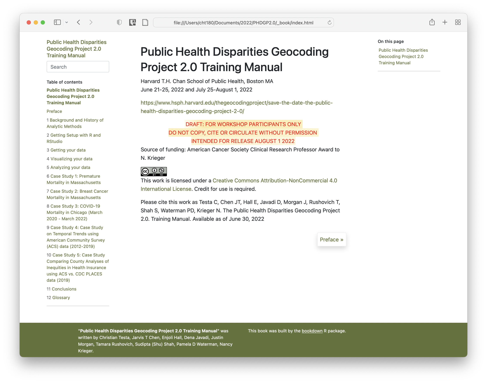

# The Public Health Disparities Geocoding Project 2.0 

[](https://zenodo.org/badge/latestdoi/471407435)

This repository is home to the code behind the free, open-access, online training
materials for the Population Health Disparities Geocoding Project (PHDGP) 2.0
workshop on analyzing geo-referenced health outcomes data.

This project is currently under development.

### Rendering the Book

Once you open this project in RStudio or open an R console in this project's 
top level directory, run the following: 

```r
# if you haven't already installed these dependencies
install.packages("bookdown") 
install.packages("here")
install.package("ggdist")
devtools::install_github("clauswilke/colorblindr")
install.packages("downlit") # for the bs4_theme
install.packages("mapview") # used for interactive maps 
remotes::install_github("rstudio/bslib") # for the bs4_theme

bookdown::render_book('.')
```

### Software Considerations

The bookdown code adopts the paradigm of not running code that doesn't have to 
be run to minimize compilation time. That means that many of the code chunks
shown are shown with the `eval=FALSE` chunk option set and their outputs 
written to a static file (such as .png or .rds files) and shown using
`knitr::include_graphics` or loaded with `readRDS` in hidden (`echo = FALSE`)
code chunks that are evaluated.

The result is a website rendered in the `_book/` directory which you can open in
a web browser. The training materials open with the frontmatter at
`_book/index.html`.



### Data and Images for Figures and Tables

In the `images/` and `data/` there are directories for each of the chapters to
store image or data files that are needed to render figures and tables in each
of the chapters. 


