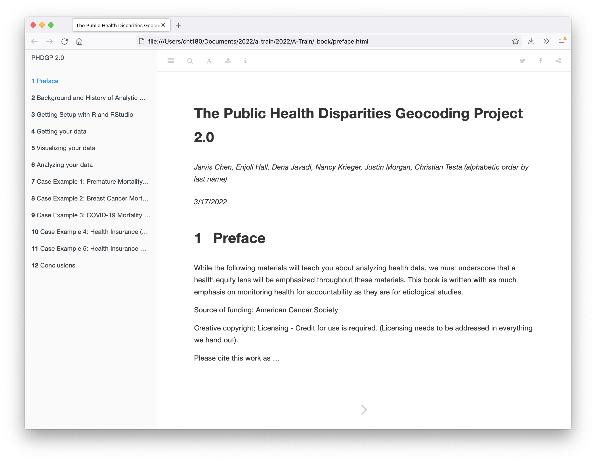

# The Public Health Disparities Geocoding Project 2.0 

This repository is home to the code behind the free, open-access, online book (PHDGP 2.0) 
that teaches readers how to analyze geo-referenced health data.

This project is currently under development.

## Organization and Development 

### Multi-Author Development  

Because this is a multi-author book, we should use workflows that help us avoid
confusing merge conflicts. 

Commits should be made on feature branches that are merged into the `main`
branch through pull requests once the feature is ready. "Features" or "feature
branches" refer to updates to the text and bookdown code that are ready for
sharing with others.  They don't necessarily need to be the final version of
the text, but they should be ready to share with others before submitting a
pull request for merging into `main`.  

Feature branches should be named `first-name-date` where `first-name` is the
author's first name and `date` is formatted MM-DD-YY.  Feature branches should
be deleted after they are either merged in or if it is decided they won't be
merged in, in favor of an alternative approach. You should avoid starting multiple
feature branches at the same time, but if you need to, you can append topic names
to the branch names to make them more specific.

Make sure to pull all the changes from `main` before submitting a pull request. 

### Software Considerations

Because this book is intended to grow to a large size, we should be very
careful that the R code included is not highly computationally intensive
(resulting in slower speeds for rendering the book). I (Christian) would
suggest that we write our R code in primarily `eval = FALSE` code chunks and
include pre-rendered static figures so that our R example code is not being run
each time we go to compile the book.  This may mean we write our code first
outside of the .Rmd documents contained in this project to test that the code
works properly and render any output figures and tables, and then to copy the
code, figures, and tables into this book. 

### Rendering the Book

Once you open this project in RStudio or open an R console in this project's 
top level directory, run the following: 

```r
# if you haven't already installed bookdown
install.packages("bookdown") 

bookdown::render_book('.')
```

The result will be a website rendered in the `_book/` directory which you can 
open in a web browser. Right now the book starts with the file `_book/preface.html`.



### Data and Images for Figures and Tables

In the `images/` and `data/` there are directories for each of the chapters
(besides the preface, which will likely have no figures or tables) to store 
image or data files that are needed to render figures and tables in each of the 
chapters. For directories that don't have anything in them yet, I've added a 
`placeholder.txt` file that can be removed once the directory has other contents 
— this is simply to ensure that GitHub doesn't ignore the directory.

I (Christian) suggest that we avoid storing large data files in the `data/`
directory and where possible, store just what is needed to provide an example
illustrating out point.  E.g. if we were just going to show `head(df)` then we
only need to store the first few lines of the data in the `data/` directory.  I
will say, we definitely can include _some_ data processing as long as it's
fast, but as we add more code examples, we need to be cognizant that rendering
the book doesn't become onerous.

Similarly, be mindful that the image file sizes don't get particularly large
either.  We (authors) might all have pretty fast internet connections, but
someone trying to read the text on a slower connection might experience long
wait times if we try to render & display several multi-megabyte image files all
on one page in our book.

